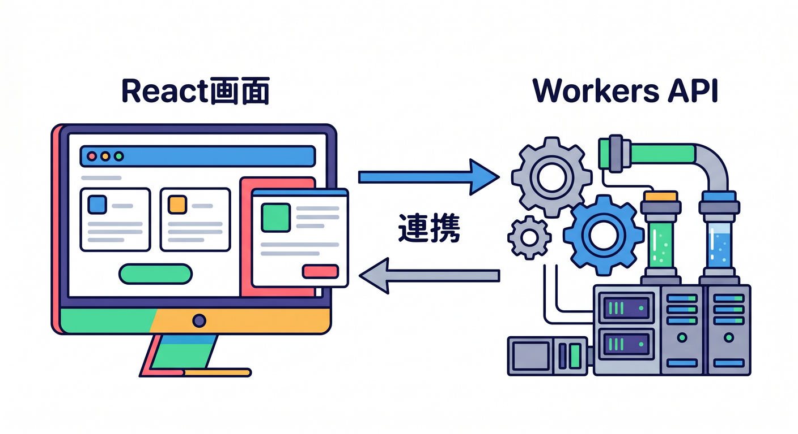
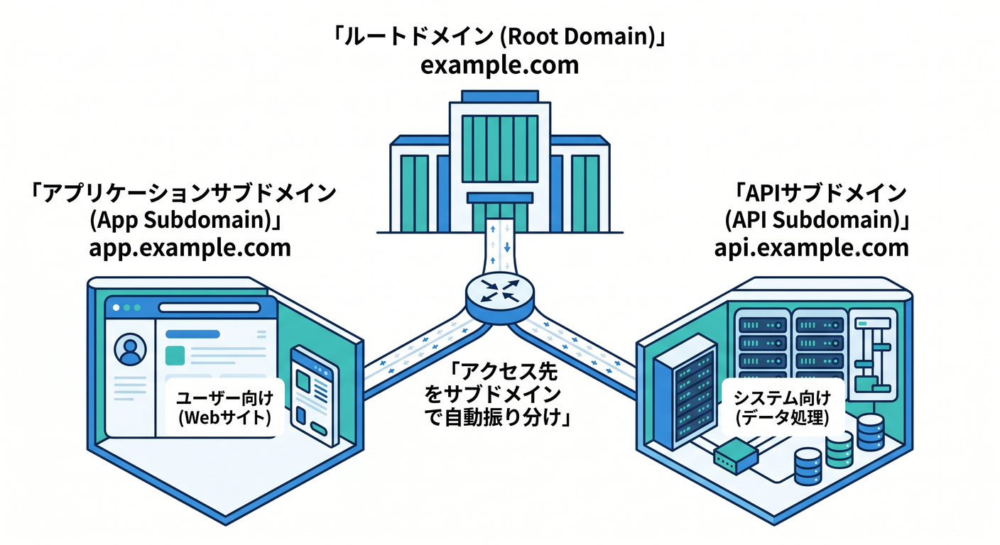
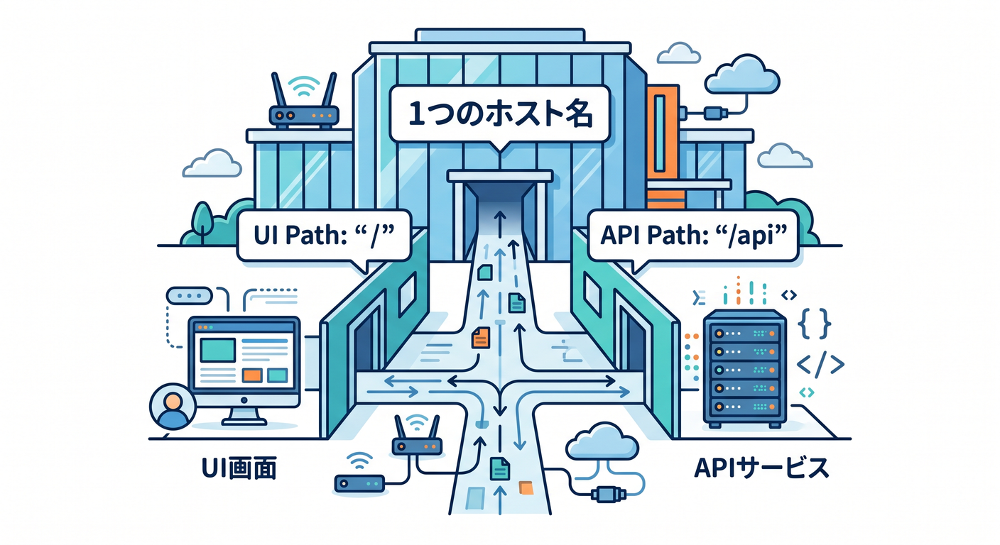
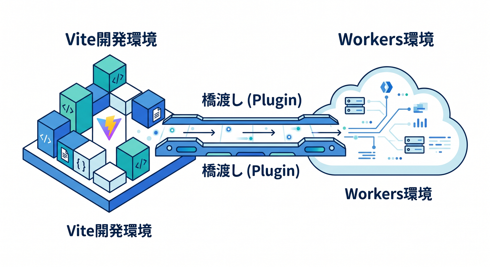
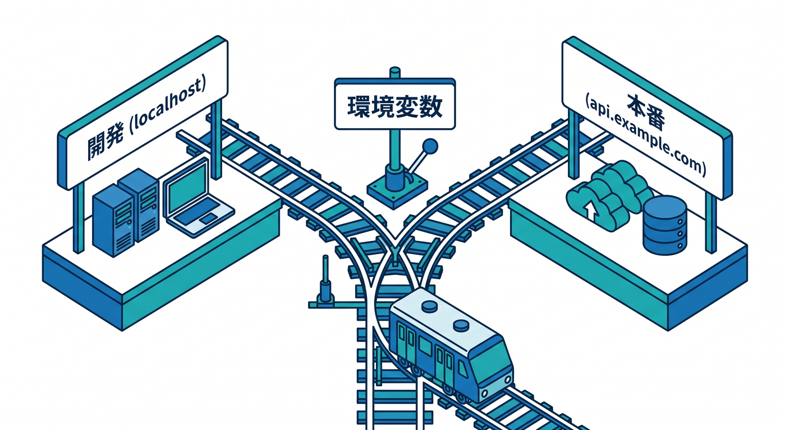
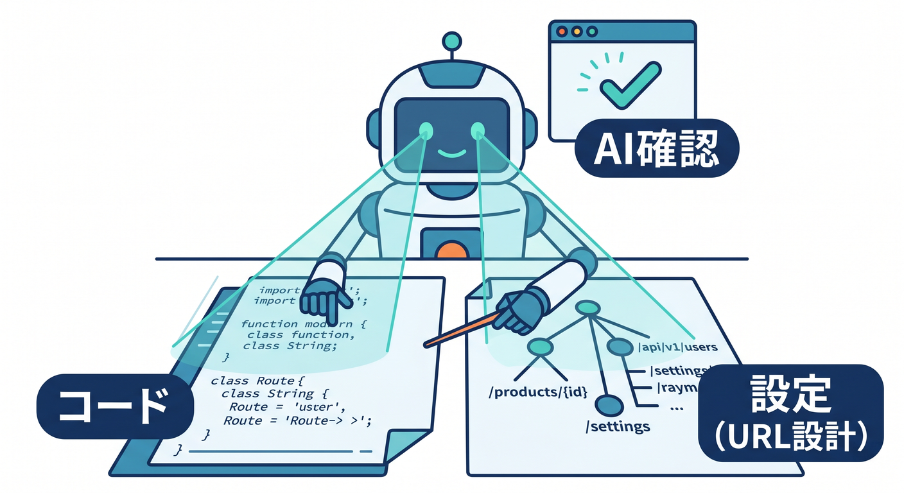

# 第09章：ReactアプリとAPIを本番っぽいURLにしよう ⚛️🔗

ここでは、Reactの画面とWorkers APIをつなげた小さなアプリを、本番っぽいURL構成で考えます。  
React自体を深く学ぶ章ではありません。  
Cloudflare上で「画面」と「API」をどう公開するかに集中します 😊

---

## 1. 画面とAPIは役割が違う 🧩

Reactアプリは、ユーザーが見る画面です。  
Workers APIは、ボタンを押したときにデータを返したり、AI処理をしたりする裏側です。

たとえば、要約アプリならこうです。

```text
React画面: 入力欄とボタンを表示する
Workers API: 入力された文章を受け取り、要約結果を返す
```

この2つは同じアプリの一部ですが、公開URLでは分けて考えると整理しやすいです。



---

## 2. サブドメインを分ける構成 🌐

分かりやすい構成は、画面とAPIをサブドメインで分ける形です。

```text
app.example.com → React画面
api.example.com → Workers API
```

この形のメリットは、役割がURLから見えることです。  
`app` は画面、`api` は処理、と直感的に分かります。

一方で、別サブドメインになるため、ブラウザからAPIを呼ぶときにCORSを考える必要があります。  
CORSは難しく見えますが、まずは「別の入口へfetchするときの許可設定」と考えればOKです 🪪



---

## 3. 1つのホスト名にまとめる構成 🏡

小さなアプリなら、1つのホスト名にまとめる方法もあります。

```text
summary.example.com/      → React画面
summary.example.com/api   → Workers API
```

この構成では、同じホスト名の中で画面とAPIを分けます。  
CORSで悩みにくいのがメリットです。

ただし、Workerやフレームワーク側でパスの処理をきちんと分ける必要があります。  
小さな学習アプリなら、この構成から始めるのもかなり良いです ✨



---

## 4. Cloudflare Vite Pluginの位置づけ 🛠️

React + ViteでCloudflare Workersへ寄せていく場合、Cloudflare Vite Pluginが便利です。  
フロントエンド中心の開発では、ViteのHMRで画面をすばやく確認できます。

公式ドキュメントでも、React SPAとAPI Workerを組み合わせるチュートリアルが案内されています。  
Cloudflare Vite Pluginは、Viteの開発体験とWorkersの実行環境を近づける役割があります。

初心者は、まず次のように考えましょう。

- Reactを書くときはViteで快適に開発する
- Cloudflareに出すときはWorkersのruntimeを意識する
- 本番前にはpreviewで本番に近い動きを見る



---

## 5. APIのfetch先を環境で分ける 🌱

開発中と本番では、APIのURLが変わることがあります。

```ts
const apiBaseUrl = import.meta.env.VITE_API_BASE_URL;
```

このように環境変数でAPIの入口を切り替えると、開発と本番を分けやすくなります。

例です。

```text
開発中: http://localhost:8787
本番: https://api.example.com
```

ただし、ブラウザに渡る環境変数には秘密情報を入れてはいけません。  
APIキーやトークンはWorker側で扱います 🔐



---

## 6. CORSを怖がりすぎない 🔁

`app.example.com` から `api.example.com` を呼ぶと、ブラウザは「別の場所に通信している」と判断します。  
そのとき、API側が許可していないとCORSエラーになります。

API側では、必要に応じてレスポンスヘッダーを返します。

```ts
return new Response(JSON.stringify({ ok: true }), {
  headers: {
    "Content-Type": "application/json",
    "Access-Control-Allow-Origin": "https://app.example.com",
  },
});
```

学習中は `*` を使いたくなりますが、本番では許可するoriginを絞るほうが安全です 🛡️


---

## 7. Copilotに確認してもらうポイント 🤖

ReactとAPIをつなぐときは、Copilotに次を見てもらうと便利です。

```text
ReactアプリからCloudflare Workers APIを呼び出しています。
以下の fetch 実装、環境変数、wrangler.jsonc を見て、
本番URL、CORS、秘密情報の扱いに問題がないか確認してください。
```

コードだけでなく、公開URLの設計も一緒に渡すのがポイントです。



---

## 8. 章末チェック ✅

- React画面とWorkers APIの役割を分けて説明できる
- `app.example.com` と `api.example.com` の構成を理解できる
- 1つのホスト名にまとめる構成も分かる
- Cloudflare Vite Pluginの位置づけが分かる
- CORSが「別入口への許可」だと分かる

この章で覚える一言はこれです。  
**本番URLを考えると、画面とAPIの役割分担が一気に見えるようになります ⚛️🔗**

