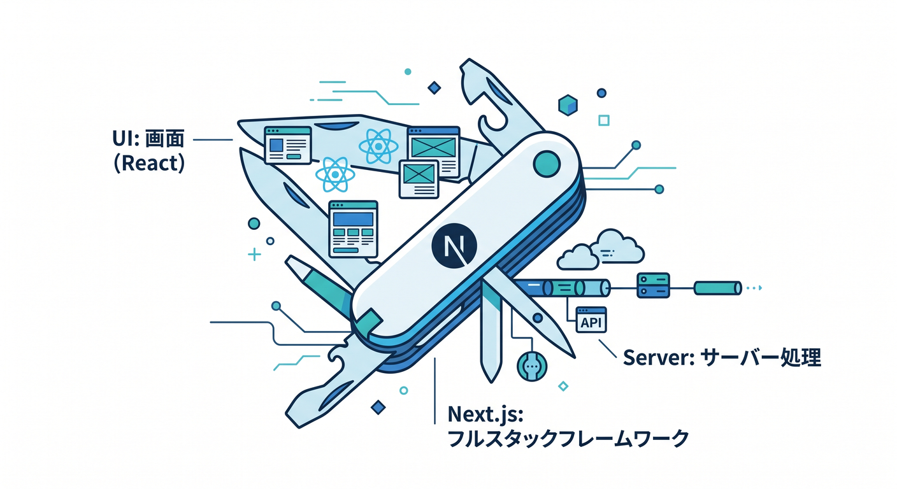
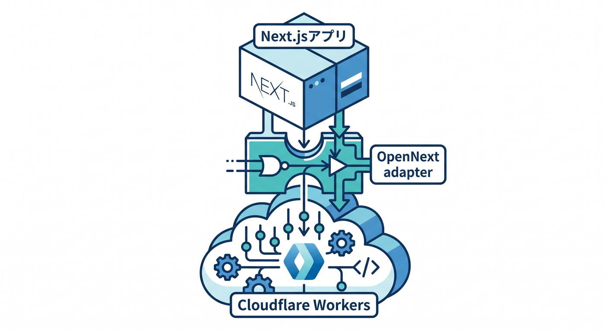
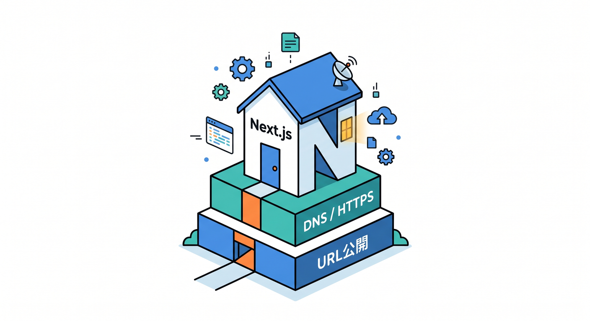
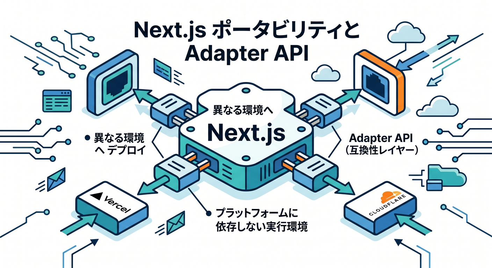
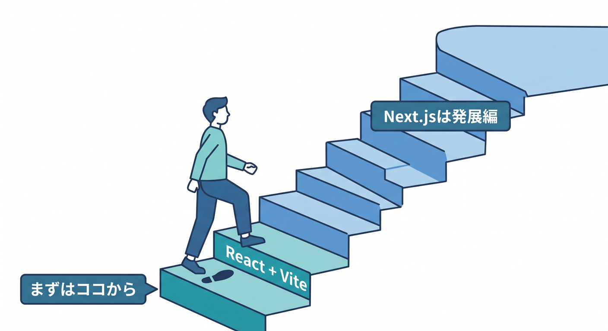
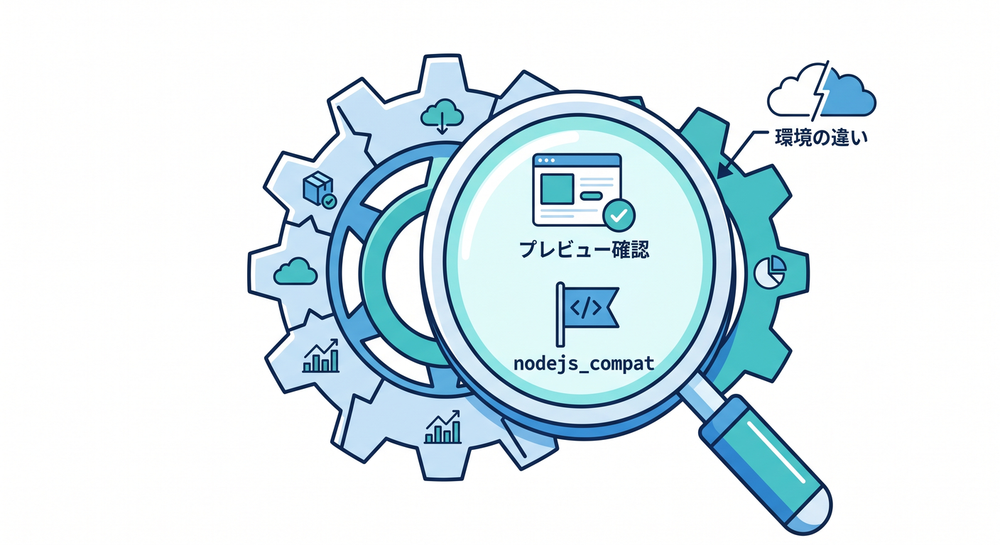
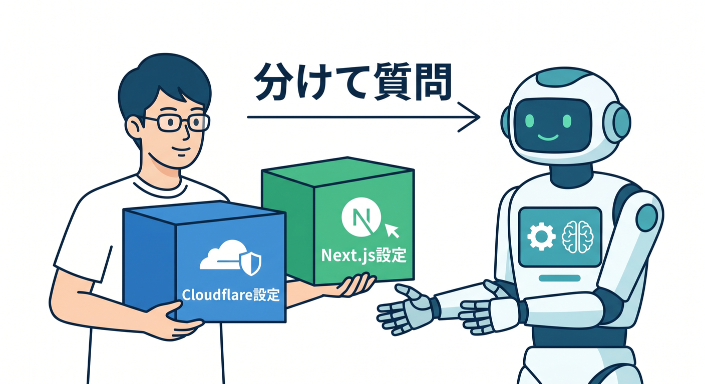

# 第10章：Next.jsは紹介だけ、Cloudflare中心で見よう ▲☁️

Next.jsはReactアプリを作る強力なフレームワークです。  
ただし、この教材の主役はCloudflareの公開設計です。  
この章では、Next.jsを深掘りしすぎず、「Cloudflareで公開するときにどう見ればよいか」だけを整理します 😊

---

## 1. Next.jsはReactのフルスタックフレームワーク 🧰

Next.jsは、Reactで画面を作るだけでなく、サーバー側の処理やルーティングも扱えるフレームワークです。  
App Router、Server Components、Route Handlers、SSR、SSGなど、機能がたくさんあります。

ただ、初心者が独自ドメインやRoutesを学ぶ段階で、全部を一気に理解する必要はありません。  
ここでは、Next.jsを「Cloudflareに載せることもあるReact系アプリ」として見ます。

つまり、覚える順番はこうです。

1. URLをどう公開するか
2. Cloudflareでどう受けるか
3. 必要になったらNext.js固有機能を見る



---

## 2. Cloudflare WorkersでNext.jsを動かす道がある 🚄

Cloudflare Workersでは、OpenNext adapterを使ってNext.jsアプリを動かす道があります。  
Cloudflare公式のNext.jsガイドでも、Next.jsアプリをWorkersへデプロイする流れが案内されています。

新規作成なら、CloudflareのCLIからNext.jsプロジェクトを作る導線があります。  
既存プロジェクトなら、`@opennextjs/cloudflare` や `wrangler` を入れて変換する流れがあります。

ただし、これは発展編です。  
この章では「Next.jsでも公開の基本はURL、DNS、HTTPS、経路」と見ることが大事です 🧭



---

## 3. Next.jsでも独自ドメインの考え方は同じ 🌐

Next.jsアプリを公開するときも、ユーザーが開くのはURLです。

たとえば次のように考えます。

```text
www.example.com → Next.jsアプリ
api.example.com → Workers API
```

または、Next.jsのRoute HandlerでAPIまで扱うなら、1つのホスト名にまとめることもあります。

```text
app.example.com → Next.jsアプリ全体
```

Cloudflare側から見ると、どのホスト名をどのWorkerやアプリに向けるかが重要です。  
Next.jsだからといって、DNSやSSL/TLSの考え方が消えるわけではありません。



---

## 4. Adapter APIとOpenNextの流れ 🧩

2026年時点では、Next.js側でもAdapter APIの整備が進んでいます。  
これは、Next.jsアプリをさまざまなプラットフォームで動かしやすくするための仕組みです。

Cloudflare、OpenNext、他のホスティング環境が連携しやすくなる方向です。  
つまり、Next.jsはVercelだけでなく、Cloudflare Workersのような環境でも動かす選択肢が強くなっています。

ただし、AdapterやOpenNextは初心者には少し重い話です。  
この教材では「CloudflareでもNext.jsを動かす道がある」と知る程度で十分です 🌱



---

## 5. 初学者はReact + ViteからでOK ⚛️

独自ドメイン、Routes、SSL/TLSを学ぶなら、最初の題材はReact + Viteで十分です。  
Next.jsは便利ですが、機能が多いため、公開設定の学習がぼやけることがあります。

React + Viteなら、画面とAPIのつながりが見えやすいです。  
Cloudflare Vite Pluginとも相性がよく、Workersの学習にもつなげやすいです。

Next.jsは、次のような段階で触ると自然です。

- React + Workers APIに慣れた
- 独自ドメイン公開を理解した
- SSRやSSGが必要になった
- ルーティングやページ構成が増えた



---

## 6. Next.js公開時の確認ポイント ✅

Next.jsをCloudflare Workersへ出す場合は、次を確認します。

- Cloudflare公式ガイドに沿っているか
- OpenNext adapterの設定が入っているか
- `nodejs_compat` が必要な場面か
- `npm run preview` でWorkers runtimeに近い確認をしているか
- 独自ドメインがどのWorkerへ向いているか

特に、開発中のNext.js dev serverと、本番のWorkers runtimeは同じではありません。  
本番に近いpreview確認を入れることが大事です 🔎



---

## 7. Copilotへの聞き方 🤖

```text
このNext.jsアプリをCloudflare Workersに公開したいです。
ただし、独自ドメイン、Routes、SSL/TLSの理解を優先したいです。
Cloudflare側で見るべき設定と、Next.js側で見るべき設定を分けて説明してください。
```

Next.jsの質問では、Cloudflare側とNext.js側を分けて聞くと整理されます。



---

## 8. 章末チェック ✅

- Next.jsはReactのフルスタックフレームワークだと分かる
- Cloudflare WorkersでNext.jsを動かす道があると分かる
- それでも公開の基本はURL、DNS、HTTPS、経路だと分かる
- 初学者はReact + Viteからで十分だと分かる
- Next.jsは発展編として扱える

この章で覚える一言はこれです。  
**Next.jsを使っても、公開の入口を整える主役はCloudflareのURL設計です ▲☁️**

