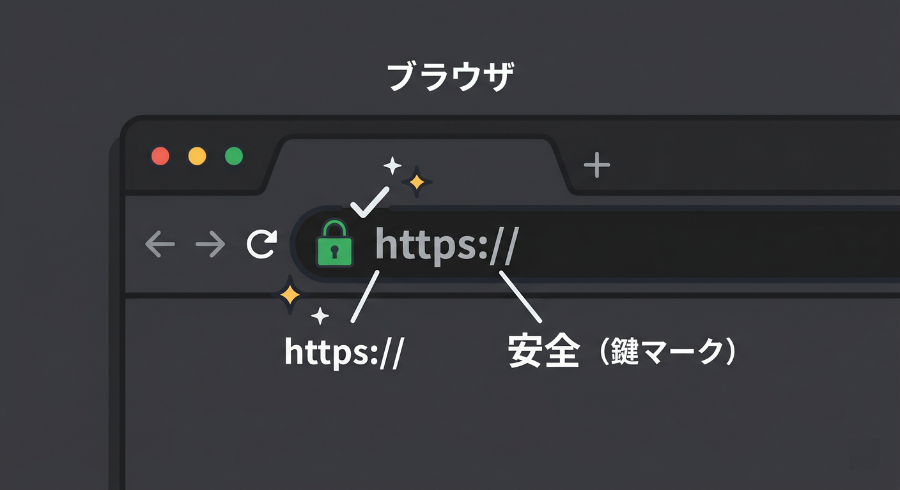
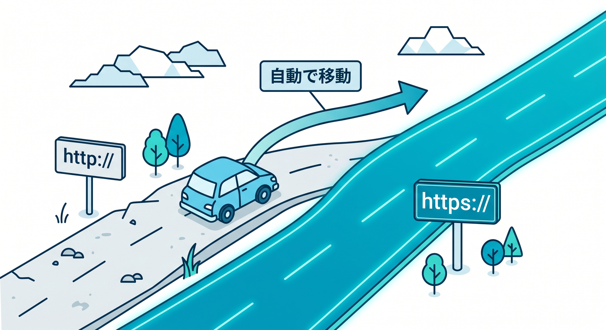
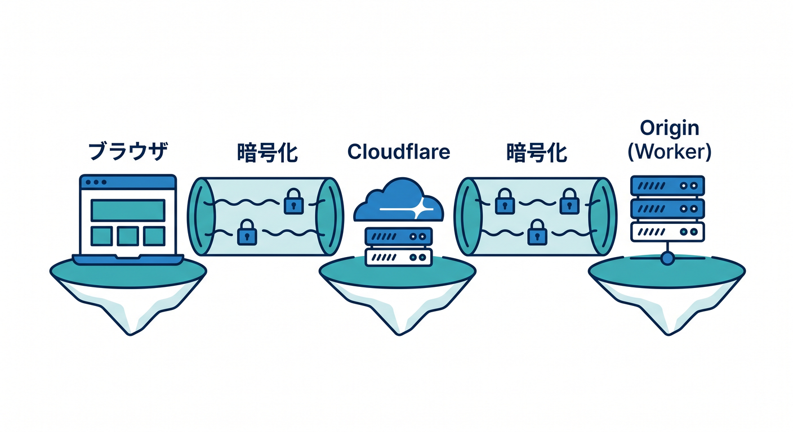
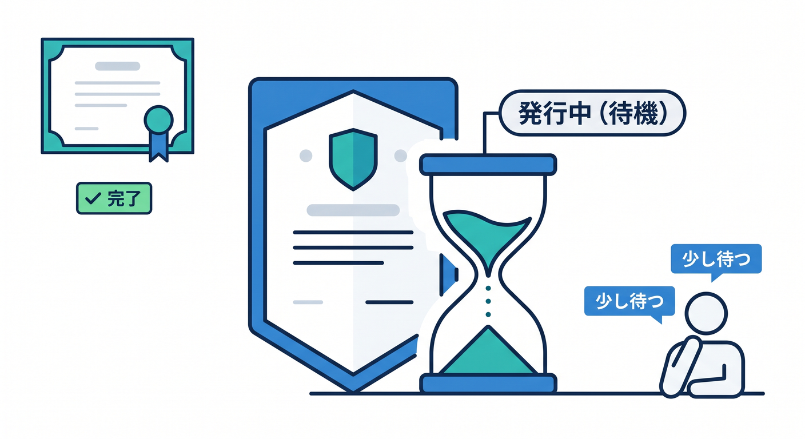
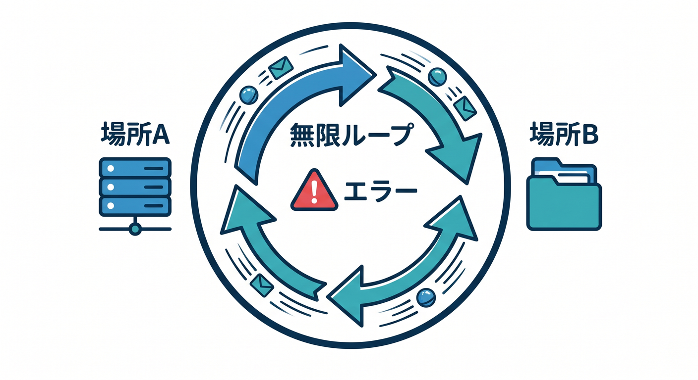
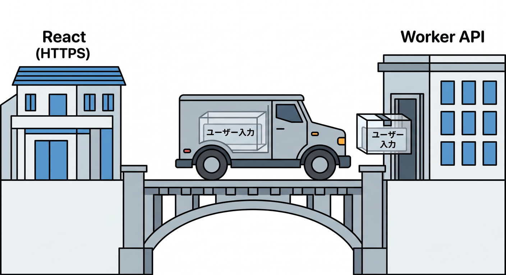
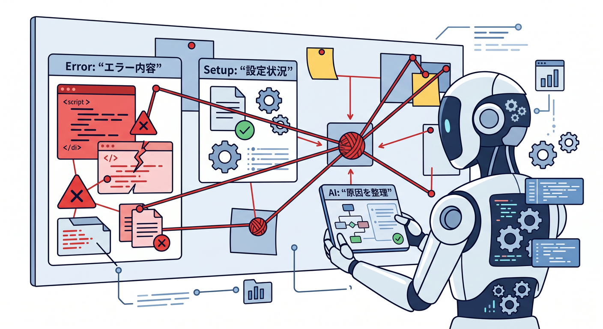

# 第11章：SSL/TLS設定とリダイレクトを確認しよう 🔁🔐

独自ドメインをつないだら、次はHTTPSで安全に開けるか確認します。  
この章では、CloudflareのSSL/TLS設定と、HTTPからHTTPSへのリダイレクトをやさしく見ます。  
難しい暗号の理論ではなく、公開後に何を確認すればよいかに集中します 😊

---

## 1. まずブラウザでHTTPS確認する 👀

最初にやることはシンプルです。  
ブラウザで公開URLを開きます。

```text
https://api.example.com
```

確認するポイントは次です。

- ページやAPIレスポンスが表示される
- ブラウザに警告が出ない
- アドレスバーに鍵マークが出る
- 証明書の名前が開いているホスト名と合っている

まずはCloudflareの設定画面に飛び込む前に、ユーザー目線で見える状態を確認しましょう 🌐



---

## 2. `http://` で開いたらどうなる？ 🔁

次に、あえて `http://` で開いてみます。

```text
http://api.example.com
```

多くの場合、`https://api.example.com` へ移動してほしいです。  
HTTPのまま使える状態は、今のWebではあまり好ましくありません。

Cloudflareでは、HTTPSへリダイレクトする設定を使えます。  
ただし、リダイレクト設定を複数の場所で重ねると、ループすることがあります。

`ERR_TOO_MANY_REDIRECTS` のようなエラーが出たら、HTTP/HTTPSの移動設定を疑いましょう 🌀



---

## 3. SSL/TLS画面で見る基本 🛠️

CloudflareのZoneにはSSL/TLS関連の設定があります。  
ここでは、ブラウザとCloudflare、Cloudflareとoriginの間の暗号化方針を扱います。

WorkersのCustom Domainsでは、Workerがoriginのように扱われ、証明書もCloudflare側で用意される流れがあります。  
そのため、一般的なサーバー運用より設定がシンプルになる場面が多いです。

初心者がまず見るべきことは、次の3つです。

- 証明書が発行済みか
- 対象ホスト名が合っているか
- HTTPSで警告なく開けるか



---

## 4. 証明書の発行には少し時間がかかることがある ⏳

Custom Domainを追加した直後は、証明書がまだ準備中のことがあります。  
この場合、数分待ってから再確認すると解決することがあります。

焦って設定を何度も変えると、逆に状況が分かりにくくなります。  
まず状態表示を見て、発行中なのか、失敗なのか、DNSが違うのかを分けましょう。

チェックメモを作ると便利です。

```text
設定したホスト名:
証明書の状態:
ブラウザで開いたURL:
表示されたエラー:
最後に変更した時刻:
```



---

## 5. リダイレクトループの考え方 🌀

リダイレクトループは、URLが同じ場所をぐるぐる回る状態です。  
たとえば、AがBへ移動させ、BがAへ戻すような設定です。

Cloudflare側でHTTPSへ移動させ、アプリ側でも別の移動をしていると、意図せずループすることがあります。  
また、既存originがあるRoutes構成では、origin側の設定も関わることがあります。

対策としては、リダイレクトをどこで行っているかを1つずつ確認します。

- Cloudflare設定
- Workerコード
- フレームワーク設定
- 既存originの設定



---

## 6. API公開ではHTTPSが特に大事 🤖

AI機能つきAPIやフォームAPIでは、ユーザーの入力を扱うことがあります。  
たとえば、文章要約APIでは、ユーザーの文章がAPIへ送られます。

この通信がHTTPSで守られていることはとても大事です。  
また、ブラウザがHTTPSページからHTTP APIを呼ぶと、Mixed Contentとしてブロックされることがあります。

React画面が `https://app.example.com` なら、APIも `https://api.example.com` にしましょう 🔐



---

## 7. Copilotに原因候補を整理させる 🤖

```text
Cloudflareで独自ドメインを設定しました。
HTTPSで開くと次のエラーが出ます。

URL:
エラー:
Custom DomainかRouteか:
DNSの状態:

DNS、証明書、リダイレクト、Workerコードの順に確認ポイントを整理してください。
```

エラーだけでなく、Custom DomainかRouteかも伝えるのが大切です。



---

## 8. 章末チェック ✅

- HTTPSで公開URLを確認できる
- 鍵マークと証明書の名前を確認できる
- HTTPからHTTPSへのリダイレクトを確認できる
- リダイレクトループの原因候補を分けられる
- AI APIでもHTTPSが重要だと分かる

この章で覚える一言はこれです。  
**独自ドメインをつないだら、最後はユーザー目線でHTTPS確認です 🔐✅**

