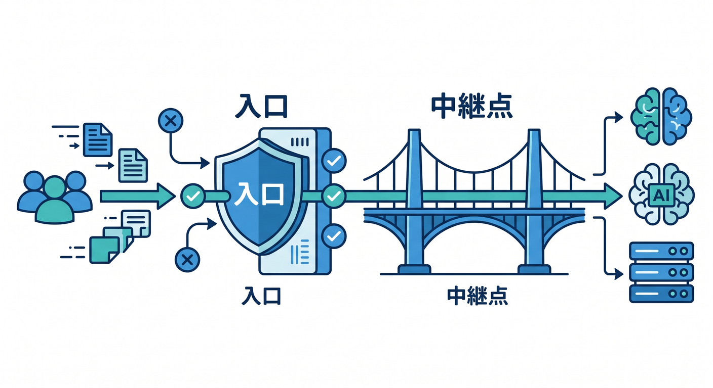
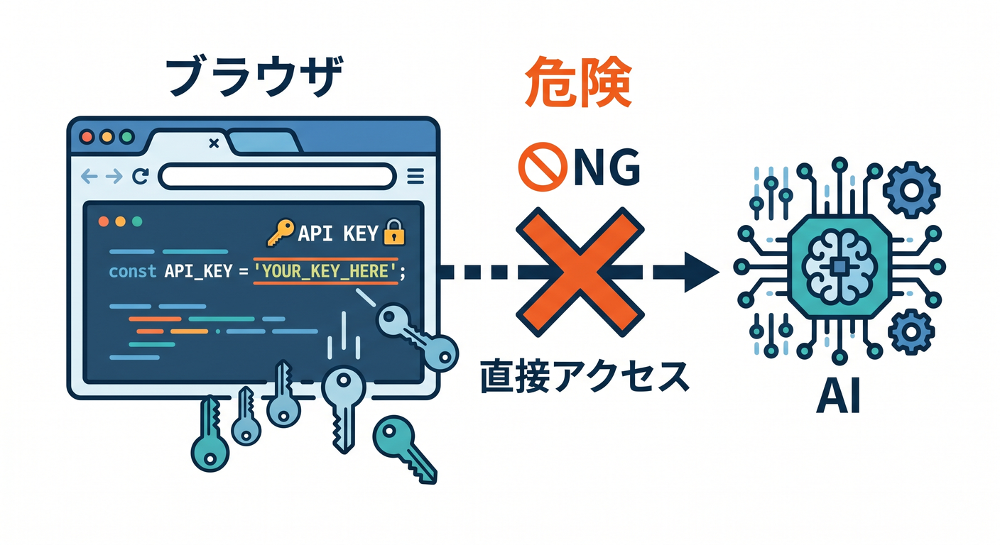
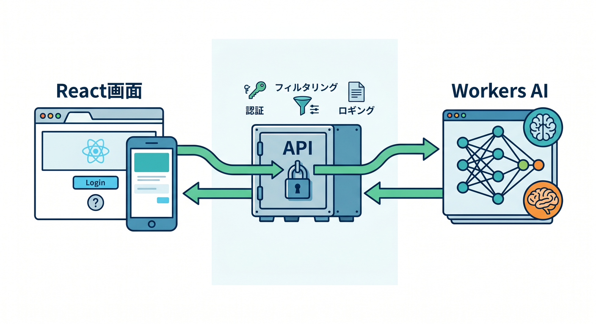
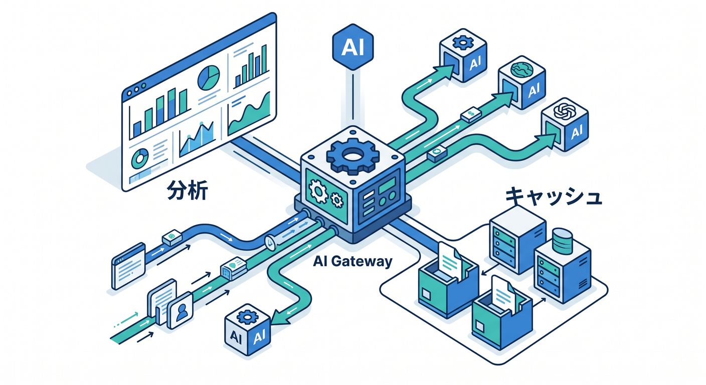
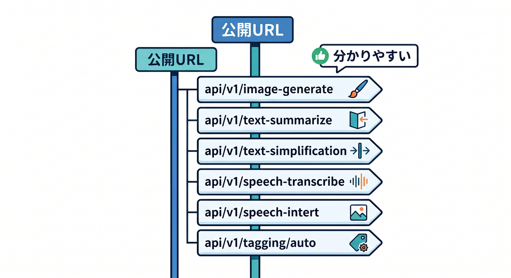
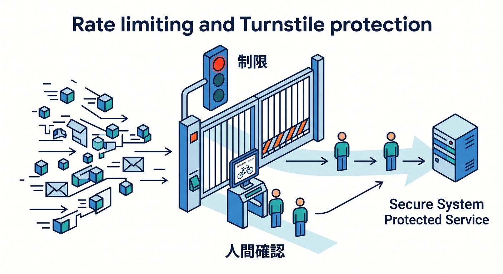

# 第12章：AI GatewayとWorkers AIの公開URLを安全に扱おう 🤖🔐



Cloudflareでは、Workers AIを使ってAI機能をアプリに入れられます。  
でもAI APIを公開するときは、URL設計と秘密情報の扱いがとても大事です。  
この章では、AI機能を安全に公開するための入口設計を学びます 🧠

---

## 1. AI機能はブラウザから直接呼ばない 🔒



ReactアプリからAI機能を使いたいとき、ブラウザから直接AIサービスへリクエストしたくなるかもしれません。  
でも、APIキーやトークンをブラウザ側に置くのは危険です。

ブラウザに渡した情報は、ユーザーから見える可能性があります。  
そのため、秘密情報はWorker側で扱います。

基本の流れはこうです。

```text
React画面
  ↓
Workers API
  ↓
Workers AI / AI Gateway
```

Workerが安全な中継点になります 🛡️

---

## 2. Workers AIはWorkerから呼ぶのが自然 🤖



Workers AIは、Cloudflare上でAIモデルをサーバーレスに実行できるサービスです。  
Workerのbindingから呼び出せるため、Cloudflareアプリの一部として扱いやすいです。

たとえば、要約APIなら次のようなURLを考えられます。

```text
https://api.example.com/ai/summarize
```

React画面はこのAPIへ文章を送ります。  
Workerは受け取った文章をWorkers AIへ渡し、結果をReactへ返します。

この構成なら、ブラウザ側にAI用の秘密情報を出さずに済みます 🔐

---

## 3. AI GatewayはAIリクエストの管理レイヤー 🧭



AI Gatewayは、AIリクエストを見守るための入口です。  
公式ドキュメントでは、Workers AIへのリクエストについて、分析、キャッシュ、セキュリティなどに使えると案内されています。

AI Gatewayを使うと、次のようなことを考えやすくなります。

- どれくらいAI APIが呼ばれているか
- 失敗が増えていないか
- キャッシュできるリクエストがあるか
- コストや乱用をどう抑えるか

AI機能を公開するなら、「動く」だけでなく「見える」ことも大切です 👀

---

## 4. 公開URLは用途が分かる名前にする 🏷️



AI APIのURLは、あとで見ても用途が分かる名前にします。

例です。

```text
POST https://api.example.com/ai/summarize
POST https://api.example.com/ai/classify
POST https://api.example.com/ai/embed
```

`/ai/` を入れると、AI機能のAPIだと分かりやすくなります。  
小さなアプリなら `summary.example.com/api/summarize` のようにまとめてもOKです。

URLは、コードを書く人だけでなく、将来の自分にも読みやすい形にしましょう 😊

---

## 5. 入力チェックを必ず入れる 🧪


AI APIは、ユーザーの入力を受け取ります。  
そのため、何でも受け取ってAIに投げるのは危険です。

最低限、次のようなチェックを入れます。

- 空文字ではないか
- 文字数が長すぎないか
- JSONの形式が正しいか
- 許可したメソッドだけ受けるか

例です。

```ts
if (request.method !== "POST") {
  return new Response("Method Not Allowed", { status: 405 });
}
```

AI機能は楽しいですが、公開APIとしての基本チェックは忘れないようにしましょう 🛡️

---

## 6. Rate LimitingやTurnstileも考える 🚦



AI APIはコストや負荷がかかることがあります。  
公開すると、想定以上に呼ばれる可能性もあります。

そこで、CloudflareのRate LimitingやTurnstileと組み合わせる考え方が出てきます。  
特にフォームからAI APIを呼ぶ場合、Turnstileで人間かどうかを確認する構成もあります。

最初の学習では、仕組みを深く作り込まなくてもよいです。  
ただし「AI APIは守る対象なんだ」と意識しておくことが大切です 🔐

---

## 7. Copilotに秘密情報レビューを頼む 🤖

```text
このReact + Workers AIアプリで、秘密情報がブラウザ側に漏れていないか確認してください。
fetch先URL、環境変数、wrangler.jsonc、Workerコードの観点でレビューしてください。
```

Copilotには、セキュリティの観点を明示して聞きます。  
特に `VITE_` から始まる環境変数はブラウザに出る可能性があるので注意しましょう。

---

## 8. 章末チェック ✅

- AI機能をブラウザから直接呼ばない理由が分かる
- Workerを安全な中継点にする構成が分かる
- AI Gatewayの役割が分かる
- AI APIのURL設計ができる
- 入力チェックと乱用対策が必要だと分かる

この章で覚える一言はこれです。  
**AI APIは、Workerを入口にして安全に公開しよう 🤖🔐**

