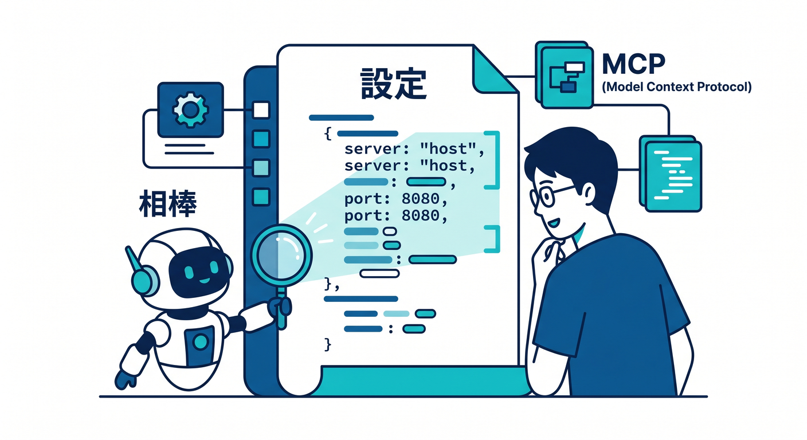
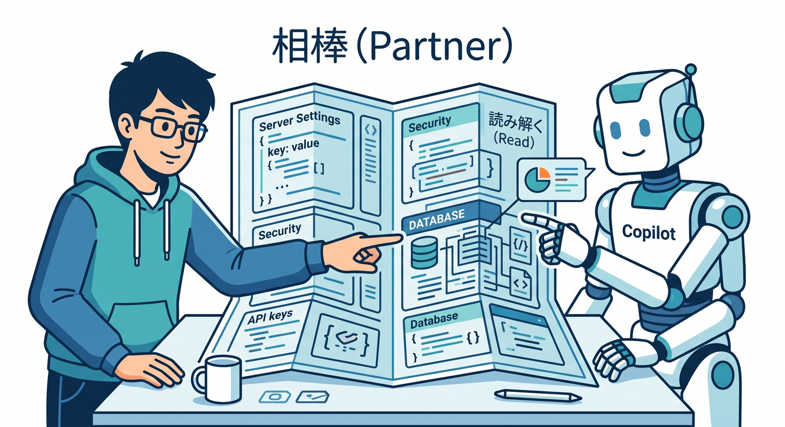
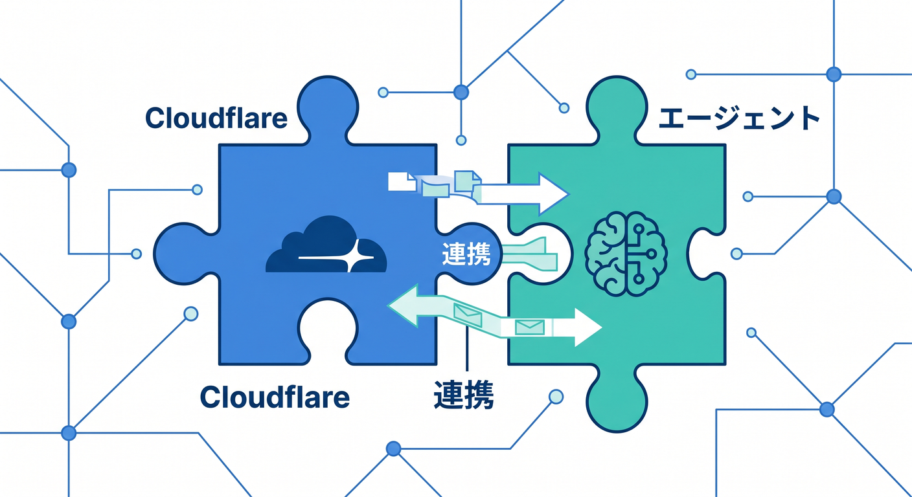
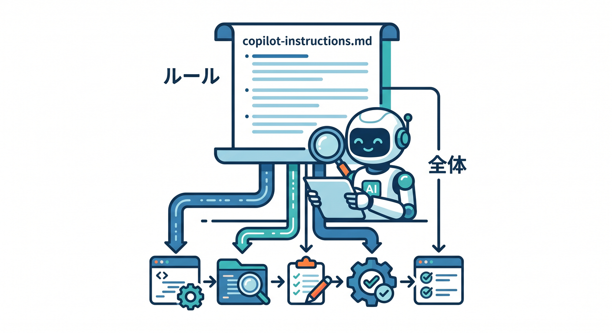
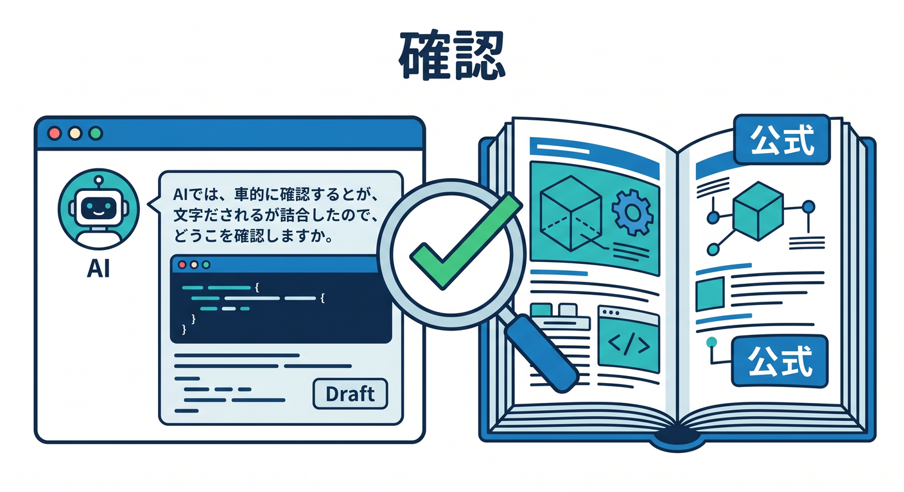

# 第13章：CopilotとCloudflare MCPで設定を読めるようにしよう 🧑‍💻🤖



Cloudflareの公開設定では、`wrangler.jsonc`、DNS、Routes、Custom Domains、SSL/TLSなど、見る場所が多くなります。  
ここでGitHub Copilotをうまく使うと、設定の意味を読み解きやすくなります。  
この章では、AIに丸投げせず、一緒に確認する使い方を学びます 😊

---

## 1. Copilotは「設定を読む相棒」として使う 🧭



Copilotはコード生成だけでなく、設定ファイルの説明にも役立ちます。  
特にCloudflareでは、`wrangler.jsonc` の設定を読む場面が多いです。

たとえば、次のように聞けます。

```text
この wrangler.jsonc を初心者向けに説明してください。
Custom Domain、Route、compatibility_date の意味を分けて説明してください。
```

これにより、設定ファイルがただの記号の集まりではなく、意図のある文章として読めるようになります。

---

## 2. Cloudflare公式はCopilot連携情報も案内している ☁️



Cloudflare公式ドキュメントでは、GitHub Copilot向けのCloudflare連携や、MCP server、Skillsの活用が案内されています。  
Cloudflare API MCP Serverは、Cloudflare APIをAIエージェントから扱いやすくする流れの一部です。

ただし、初心者が最初から全部設定する必要はありません。  
まずはVS CodeでCopilot Chatを使い、今見ているファイルを説明してもらうところからで十分です。

慣れてきたら、Cloudflare SkillsやMCPを使って、Cloudflareの文脈をより強く持たせる方向に進めます 🧰

---

## 3. `.github/copilot-instructions.md` を使う発想 📝



プロジェクト全体でCopilotに守ってほしいルールがある場合、`.github/copilot-instructions.md` を使う考え方があります。  
Cloudflare公式のCopilot向け案内でも、リポジトリ全体の規約を置く場所として触れられています。

たとえば、次のような内容を書けます。

```md
このプロジェクトはCloudflare Workers + TypeScriptです。
設定は wrangler.jsonc を優先して確認してください。
秘密情報はブラウザ側に出さないでください。
Custom DomainsとRoutesの違いを説明してから提案してください。
```

こうしておくと、Copilotに毎回同じ前提を説明する手間が減ります。

---

## 4. 設定確認では「ファイル名」を指定する 📂


Copilotに質問するときは、漠然と聞くより、対象ファイルを指定したほうが安定します。

良い聞き方です。

```text
@workspace
wrangler.jsonc と src/index.ts を見て、
このWorkerがどのURLで公開される想定か説明してください。
Custom DomainかRouteかも判断してください。
```

公開まわりでは、次のファイルを一緒に見ることが多いです。

- `wrangler.jsonc`
- `src/index.ts`
- `vite.config.ts`
- `.env.example`
- `package.json`

---

## 5. AIの答えは公式ドキュメントで確認する 🔎



AIは便利ですが、古い情報や文脈違いの提案をすることがあります。  
Cloudflareの仕様は更新されるので、重要な判断は公式ドキュメントで確認します。

特に確認したいのは次です。

- Custom Domainsの最新仕様
- Routes設定
- Wranglerの設定形式
- Workers AIやAI Gatewayの呼び出し方
- Next.js on Workersの対応状況

AIの答えをそのまま信じるのではなく、「説明係」として使い、最後は公式情報で確認する流れが安全です 🛡️

---

## 6. トラブル相談のテンプレート 🚑


公開エラーをCopilotに相談するときは、次の形で渡すと整理されます。

```text
Cloudflare Workersの独自ドメイン公開で困っています。

期待するURL:
実際のエラー:
Custom DomainかRouteか:
wrangler.jsonc:
DNSの状態:
Workerログ:

DNS、Route、SSL/TLS、Workerコードの順に切り分けてください。
```

「動きません」だけでは、AIも人間も判断しづらいです。  
状況を分けて渡すのがコツです。

---

## 7. Copilotに作業させる範囲を決める 🎯

AIに任せてよいことと、自分で確認すべきことを分けます。

**任せやすいこと**
- 設定ファイルの説明
- エラー文の整理
- チェックリスト作成
- コードのレビュー

**自分で確認すべきこと**
- 本番ドメインの変更
- DNSレコードの削除
- 秘密情報の取り扱い
- 課金や公開範囲に関わる判断

AIを使うほど、自分の判断基準も大切になります 🧠

---

## 8. 章末チェック ✅

- Copilotを設定理解の補助に使える
- Cloudflare MCPやSkillsの位置づけが分かる
- `.github/copilot-instructions.md` の考え方が分かる
- AIの答えを公式ドキュメントで確認する習慣が持てる
- トラブル相談の情報を整理できる

この章で覚える一言はこれです。  
**Copilotは答えを丸投げする相手ではなく、Cloudflare設定を一緒に読む相棒です 🤖🧭**

