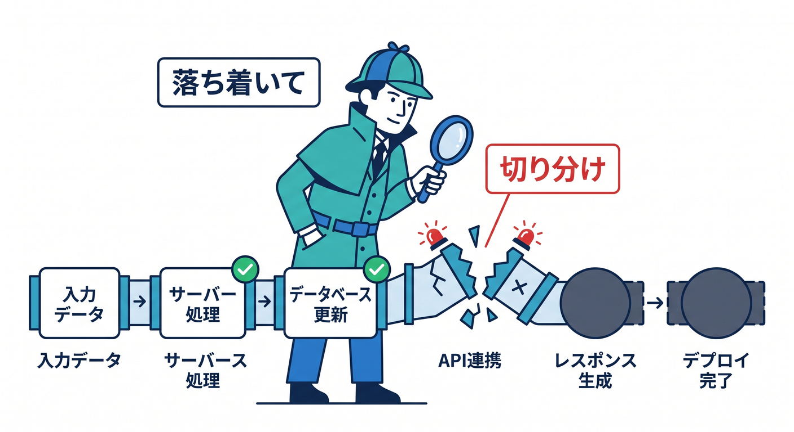
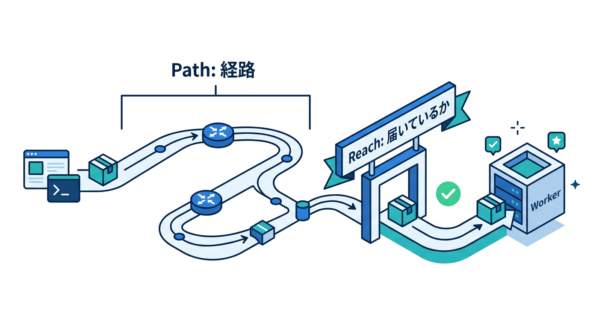
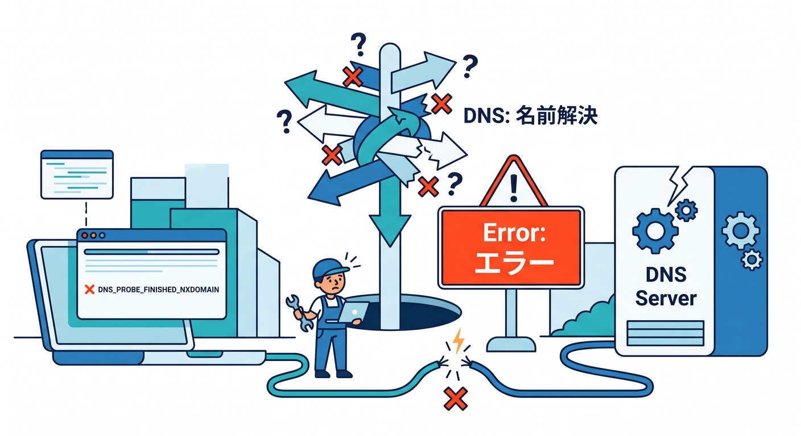
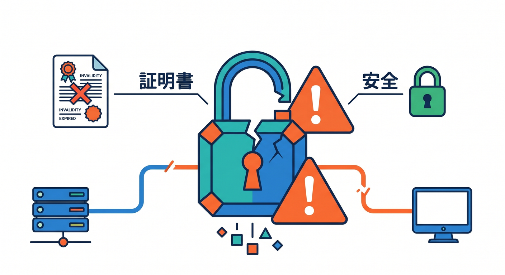
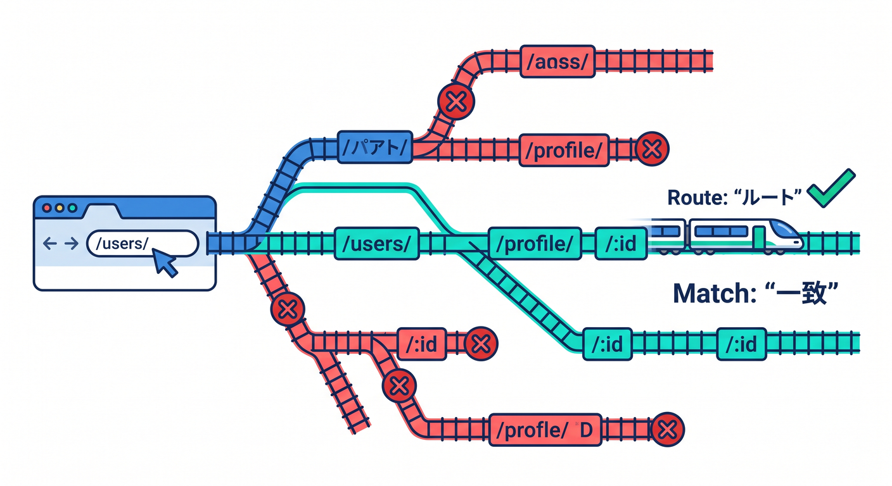
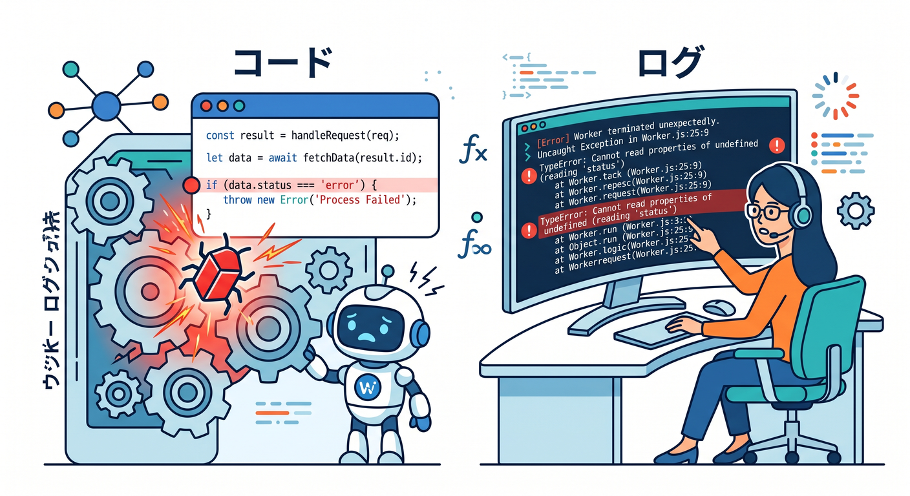

# 第14章：公開後のトラブルを落ち着いて切り分けよう 🚑🔎



公開設定は、最初から一発でうまくいかないこともあります。  
でも、焦る必要はありません。  
この章では、DNS、証明書、Route、Workerコードを順番に確認する考え方を学びます 🧯

---

## 1. まず「リクエストがWorkerまで届いているか」を考える 🧭



トラブル切り分けで最初に考えるのは、リクエストがWorkerまで届いているかです。

届いていないなら、DNS、Custom Domain、Routeの問題かもしれません。  
届いているなら、Workerコードやレスポンスの問題かもしれません。

この分け方だけで、調べる範囲がかなり狭くなります。

```text
ブラウザ → Cloudflare → Worker → Response
```

どこで止まっているかを探すのが、公開後トラブルの基本です 🔎

---

## 2. DNS系のエラー 🌐



`ERR_NAME_NOT_RESOLVED` のようなエラーは、名前解決の問題であることが多いです。  
つまり、ブラウザがそのドメイン名の行き先を見つけられていません。

確認することは次です。

- ドメインがCloudflareのZoneにあるか
- ネームサーバーがCloudflareへ向いているか
- DNSレコードが存在するか
- 反映待ちではないか
- 入力したホスト名が正しいか

PowerShellでは次のように確認できます。

```powershell
Resolve-DnsName api.example.com
```

DNSで止まっている場合、Workerコードを直しても解決しません。

---

## 3. SSL/TLS系のエラー 🔐



証明書エラーが出る場合は、HTTPSまわりを疑います。

確認することは次です。

- 証明書が発行済みか
- 証明書の名前がホスト名と合っているか
- Custom Domain設定が正しいか
- HTTPからHTTPSへのリダイレクトがループしていないか

設定直後なら、証明書の発行待ちの可能性もあります。  
何度も設定を変える前に、状態表示とエラー文を落ち着いて見ましょう 🕰️

---

## 4. Routes系のエラー 🛣️



Routesを使っている場合は、RouteパターンとDNSの両方を見ます。

確認することは次です。

- `pattern` が期待するURLに合っているか
- `example.com/api/*` と `api.example.com/*` を混同していないか
- 対象ホスト名がCloudflareを通っているか
- proxied DNSレコードがあるか
- 別のRouteと競合していないか

Routesは便利ですが、パターン指定を間違えるとリクエストがWorkerに届きません。  
URLを1文字ずつ確認するくらいの気持ちで見ましょう 👀

---

## 5. Workerコード系のエラー 🧑‍💻



Workerまで届いているのにエラーになる場合は、コードを見ます。

よくある原因です。

- JSONの読み取りに失敗している
- `request.method` の分岐が足りない
- CORSヘッダーがない
- AI bindingや環境変数の名前が違う
- 例外が発生して500になっている

ログを出して、どこまで処理が進んでいるか確認します。

```ts
console.log("request url", request.url);
```

公開後のログ確認には、Workers Logsや `wrangler tail` が役立ちます。

---

## 6. AI API系のエラー 🤖


Workers AIやAI Gatewayを使っている場合は、AIリクエスト側も確認します。

確認することは次です。

- binding名が正しいか
- AI GatewayのURLや設定が正しいか
- 入力データが大きすぎないか
- レート制限や権限で止まっていないか
- AI側のレスポンスをWorkerが正しく返しているか

AI APIは、通常のAPIより原因の層が1つ増えます。  
React、Worker、AI Gateway、Workers AIを分けて見ましょう 🧩

---

## 7. トラブル切り分け表 ✅

| 症状 | まず見る場所 |
|---|---|
| ドメインが見つからない | DNS |
| 証明書警告が出る | SSL/TLS |
| 特定パスだけ動かない | Routes |
| 500エラーになる | Workerコード |
| ブラウザからAPIだけ失敗 | CORS |
| AI処理だけ失敗 | Workers AI / AI Gateway |

この表を見ながら、上から順に原因を減らします。  
一度に全部触らないのが大事です。

---

## 8. 章末チェック ✅

- リクエストがWorkerまで届いているかを考えられる
- DNS、SSL/TLS、Routes、Workerコードを分けて確認できる
- `Resolve-DnsName` やログ確認の使いどころが分かる
- AI APIのトラブル層を分けられる
- Copilotに渡す情報を整理できる

この章で覚える一言はこれです。  
**公開後のトラブルは、上から順に流れを追えば必ず狭められます 🚑🔎**

