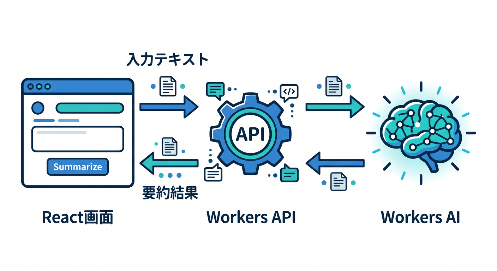
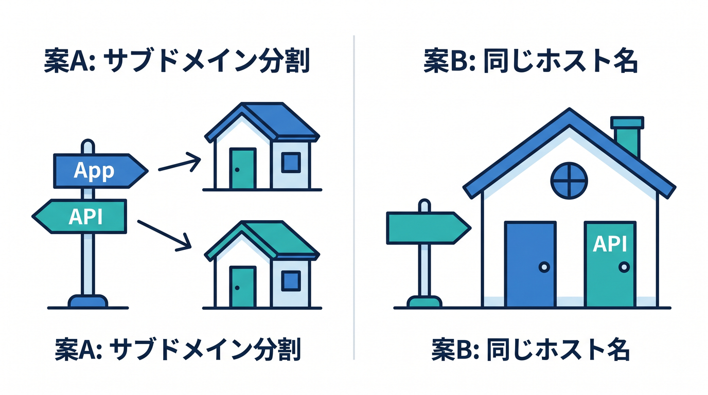
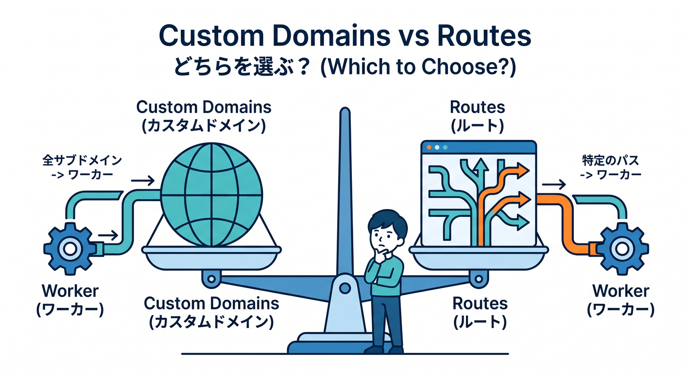
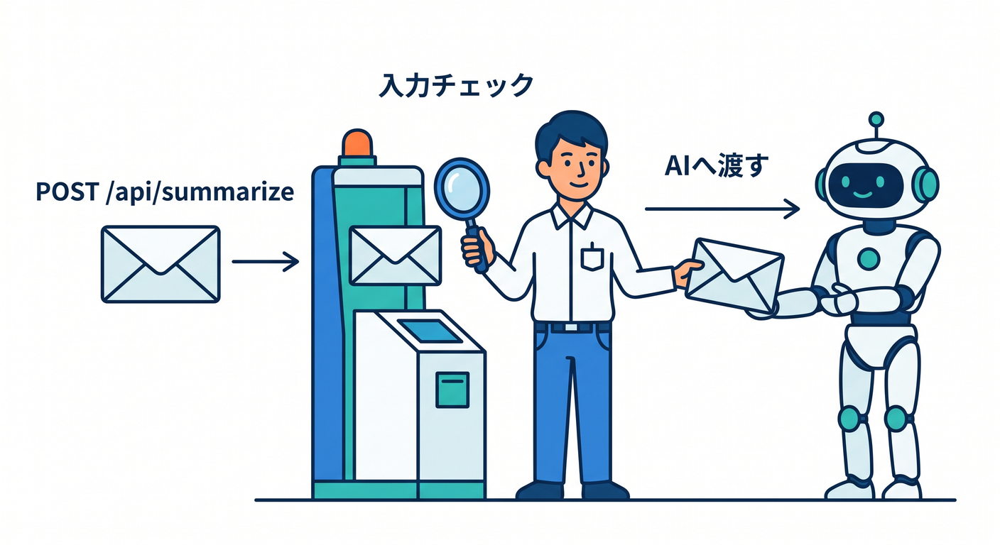
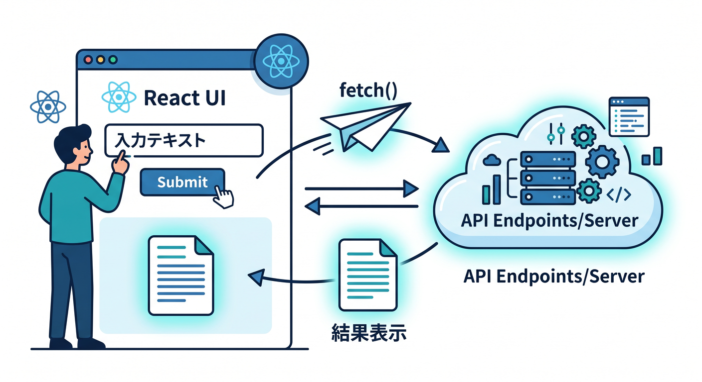
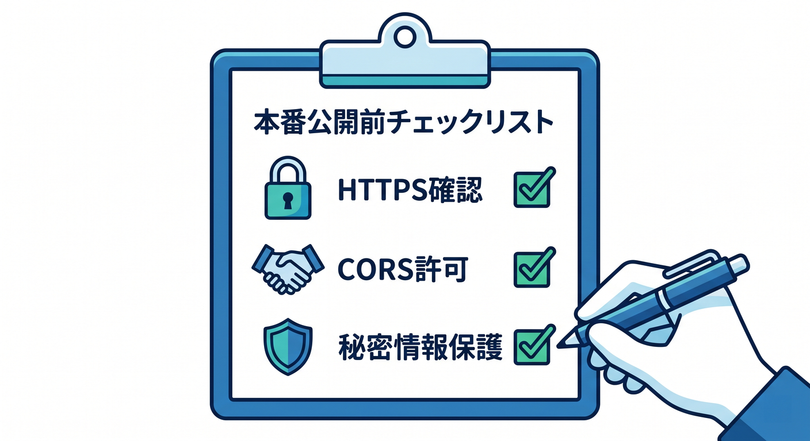
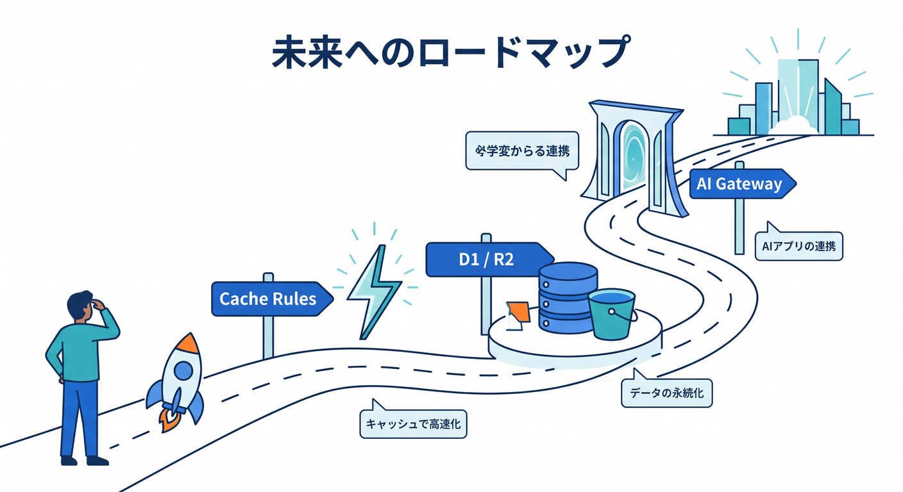

# 第15章：総仕上げ：独自ドメインで小さな本番アプリを公開しよう 🏁🌐

最後は、ここまで学んだことを1つの小さな作品にまとめます。  
React画面、Workers API、Workers AI、独自ドメイン、HTTPS確認までを通して、「Cloudflareで本番らしく公開できた」という状態を目指します 🎉

---

## 1. 作るもの：AI要約ミニアプリ ✨



題材は、文章を入力するとAIが短く要約してくれるアプリです。

構成はシンプルです。

```text
React画面
  ↓
Workers API
  ↓
Workers AI
```

ユーザーは画面に文章を入力します。  
ReactがWorkers APIへ送信します。  
WorkerがWorkers AIを呼び、要約結果を返します。

この小さなアプリだけでも、公開に必要な要素がかなり詰まっています 🧩

---

## 2. URL構成を決める 🌐



まず、公開URLを決めます。  
学習用には2つの案があります。

**案A: サブドメインを分ける**

```text
app.example.com → React画面
api.example.com → Workers API
```

役割が分かりやすい構成です。  
ただし、CORSの確認が必要です。

**案B: 1つのホスト名にまとめる**

```text
summary.example.com/      → React画面
summary.example.com/api/* → API
```

小さな作品にはこちらも分かりやすいです。  
同じホスト名なので、CORSで悩みにくいです。

---

## 3. Custom DomainsかRoutesかを選ぶ ⚖️



新しいサブドメインをWorkerに任せるなら、Custom Domainsが自然です。

```text
api.example.com
summary.example.com
```

一方、既存サイトの一部だけ使うならRoutesです。

```text
example.com/ai-summary/*
```

この章では、まずCustom Domainsを基本案にします。  
理由は、Workerを公開URLの本体として扱いやすく、DNSや証明書の流れも学びやすいからです 🏡

---

## 4. APIの入口を作る 🔗



Workers APIでは、要約用のエンドポイントを用意します。

```text
POST /api/summarize
```

処理の流れは次の通りです。

1. POSTだけ受け付ける
2. JSONを読む
3. 文字数や空文字をチェックする
4. Workers AIへ渡す
5. 結果をJSONで返す

APIを公開するなら、入力チェックは必ず入れます。  
AIへ投げる前に、Worker側で守るのが基本です 🛡️

---

## 5. React画面から呼び出す ⚛️



React側では、入力欄、送信ボタン、結果表示を作ります。

必要な状態はシンプルです。

- 入力中の文章
- 読み込み中かどうか
- 要約結果
- エラーメッセージ

fetch先は、本番では公開APIのURLにします。

```ts
await fetch("https://api.example.com/api/summarize", {
  method: "POST",
  headers: { "Content-Type": "application/json" },
  body: JSON.stringify({ text }),
});
```

本番URLをハードコードするか、環境変数にするかはプロジェクト方針で決めます。  
ただし、秘密情報はReact側に置きません 🔐

---

## 6. 公開前チェックリスト ✅



デプロイ前に、次を確認します。

- `workers.dev` でWorker単体が動く
- 独自ドメインのCustom Domain設定がある
- HTTPSで開ける
- React画面からAPIへ通信できる
- CORSが必要なら許可している
- AI bindingやAI Gateway設定が正しい
- APIキーや秘密情報がブラウザ側に出ていない
- Workers Logsでリクエストを確認できる

このチェックリストを埋めるだけで、本番公開の不安がかなり減ります 🌱

---

## 7. Copilotに最終レビューを頼む 🤖

公開前に、Copilotへ次のように依頼します。

```text
このCloudflare Workers + React + Workers AIアプリを独自ドメインで公開します。
wrangler.jsonc、Workerコード、Reactのfetch処理を見て、
Custom Domain、HTTPS、CORS、秘密情報、AI APIの入力チェックに問題がないかレビューしてください。
初心者向けに、修正すべき点を優先度順に出してください。
```

「優先度順に」と頼むと、重要な問題から見やすくなります。

---

## 8. 完成後に確認すること 🎉

最後に、実際の公開URLをブラウザで開きます。

確認することは次です。

1. 画面が表示される
2. HTTPSの鍵マークが出る
3. 文章を入力して要約できる
4. 空文字や長すぎる文章で変な壊れ方をしない
5. Workers Logsにアクセスが出る
6. AI Gatewayを使う場合はリクエストが見える

ここまでできれば、ただのローカル学習ではなく、本番らしいCloudflare公開を一通り経験できています 🚀

---

## 9. この先の発展ロードマップ 🗺️



この教材の次に進むなら、次のテーマが自然です。

- 独自ドメインにCache Rulesを組み合わせる
- Turnstileでフォーム保護を入れる
- Rate LimitingでAI APIの乱用対策をする
- D1に履歴を保存する
- R2にアップロードファイルを保存する
- AI Gatewayでログやキャッシュを管理する
- Next.js on Workersを試す

公開の基礎ができると、Cloudflareの他の機能もつながって見えるようになります 🌐

---

## 10. 章末チェック ✅

- AI要約ミニアプリの全体構成を説明できる
- URL構成を自分で選べる
- Custom DomainsとRoutesを理由つきで選べる
- React画面からWorkers APIを呼べる
- HTTPS、CORS、秘密情報、ログを確認できる

この章で覚える一言はこれです。  
**独自ドメインで公開できると、Cloudflare学習は一気に「作品を世界へ出す力」になります 🏁✨**

