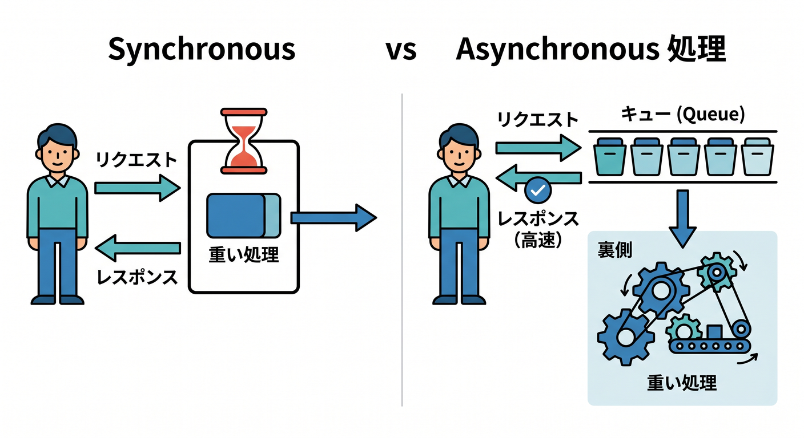
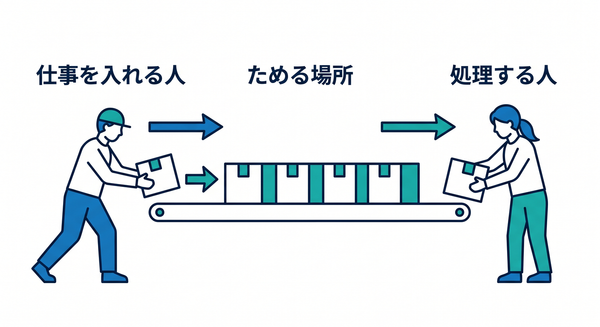
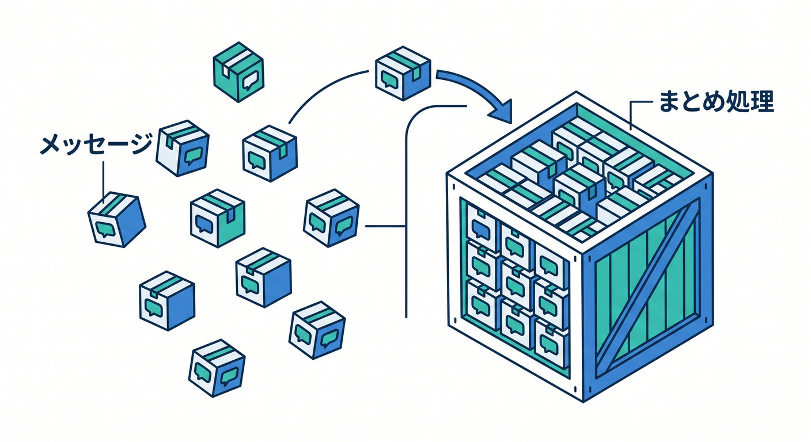
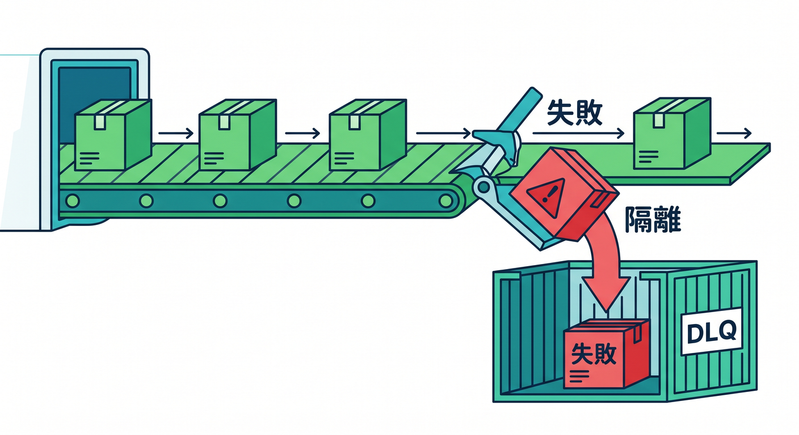
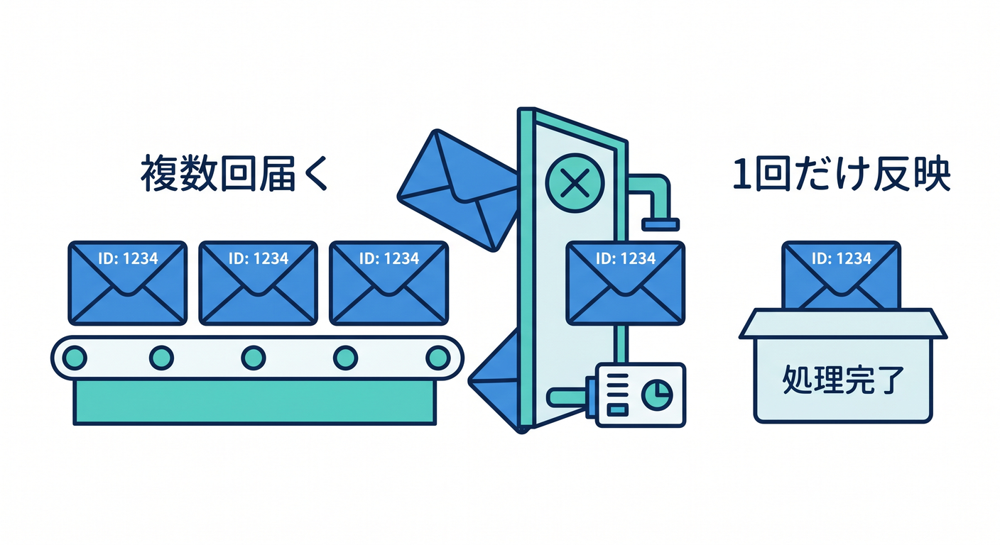
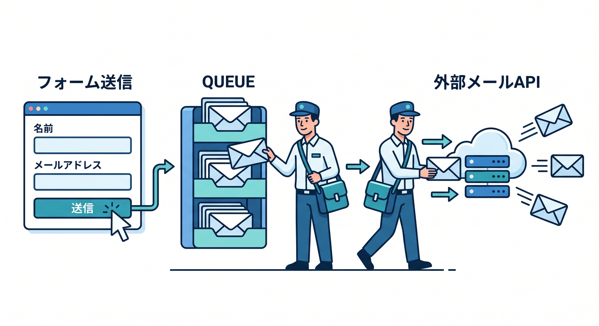
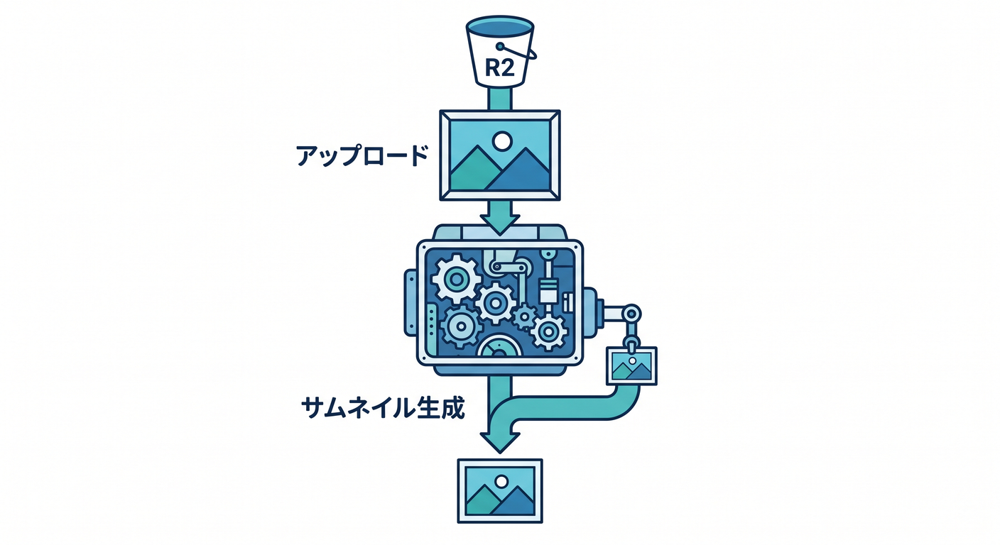

# Cloudflare Queuesで“あとでやる処理”を学ぶ 15章アウトライン ⏳📬✨

確認日: 2026-04-24  
主な確認先: Cloudflare Queues Overview / Getting started / How Queues works / Configuration / Batching, Retries and Delays / Dead Letter Queues / Delivery guarantees / Pull consumers / Limits / Pricing 公式ドキュメント

## 第1章　“あとでやる処理”って何だろう ⏳

Webアプリでは、ユーザーへすぐ返したい処理と、裏でゆっくり進めたい処理があります。  
メール送信、画像処理、通知、集計、AI処理などは、リクエスト中に全部やると遅くなりがちです。  
Cloudflare Queuesは、Workersからメッセージをqueueへ入れ、consumer Workerがあとで処理する仕組みです 📬  
この章では、同期処理と非同期処理の違いを身近な例でつかみます。  
この章のゴールは、Queuesが必要になる場面を説明できることです ✅

## 第2章　Producer・Queue・Consumerを理解しよう 📮

Queuesでは、Producer、Queue、Consumerの3つをまず覚えます。  
Producerは仕事を依頼するWorker、Queueは仕事をためる場所、Consumerは仕事を実行するWorkerです。  
`send()` でメッセージを入れ、`queue()` handlerでまとめて受け取ります。  
React画面から直接Queueを触るのではなく、Worker APIを入口にします 🔐  
この章のゴールは、Queuesの基本構成を図で説明できることです。

## 第3章　最初のQueueを作ろう 🛠️

WranglerでQueueを作成し、Workerへbindingします。  
`npx wrangler queues create <QUEUE_NAME>` でqueueを作り、`wrangler.jsonc` にproducer bindingを書きます。  
TypeScriptでは `Queue` 型をEnvへ追加します。  
まずは「お問い合わせを受け取って、あとでログ処理する」小さな例で進めます。  
この章のゴールは、WorkerからQueueへメッセージを送れる準備をすることです 🚀

## 第4章　Producer Workerからsendしよう 📤

Producer Workerは、リクエストを受けてQueueへメッセージを送ります。  
ユーザーにはすぐ `202 Accepted` を返し、重い処理はconsumerへ任せます。  
メッセージには、必要な情報だけをJSONで入れます。  
個人情報やsecretを詰め込みすぎない設計も学びます 🔐  
この章のゴールは、Worker APIから安全にメッセージをenqueueできることです。

## 第5章　Consumer Workerで処理しよう 📥

Consumer Workerは、queueから届いたメッセージを `queue()` handlerで処理します。  
Cloudflare Queuesはbatchでメッセージを渡せるため、1件ずつ処理するだけでなく、まとめて扱う発想も必要です。  
失敗したときのretryやackの考え方にも軽く触れます。  
最初はログ出力、次にD1保存や通知送信へ広げます。  
この章のゴールは、consumer側の基本形を書けることです ✅

## 第6章　Batchingでまとめて処理しよう 📦

Queuesでは、consumerに届くメッセージをbatchとして扱えます。  
batch sizeやbatch timeoutを設定し、効率よく処理します。  
ログ保存、分析イベント、通知のまとめ処理などに向いています。  
ただし、1件失敗したときにbatch全体へ影響することも理解します 🧯  
この章のゴールは、batch処理の便利さと注意点を説明できることです。

## 第7章　Retryと失敗処理を学ぼう 🔁

非同期処理では、外部APIエラー、ネットワーク失敗、D1書き込み失敗などが起きます。  
Cloudflare Queuesは、consumerで失敗したメッセージをretryできます。  
公式ドキュメントでは、delivery failure時のretryや `max_retries` が案内されています。  
ただしretryすれば全部解決ではないので、同じ処理が複数回走っても壊れない設計を学びます。  
この章のゴールは、失敗前提でQueue処理を考えられることです。

## 第8章　Dead Letter Queueで失敗を隔離しよう 🧯

何度retryしても失敗するメッセージは、Dead Letter Queueへ送る設計があります。  
Cloudflare Queuesではconsumer設定でDLQを指定できます。  
DLQに入ったメッセージは、あとで調査・再処理・破棄を判断します。  
失敗を静かに消さず、見える場所へ逃がすのが大切です 👀  
この章のゴールは、DLQの役割と設定イメージを理解することです。

## 第9章　At-least-once deliveryと冪等性 🧠

Cloudflare Queuesは、信頼性のためにat-least-once deliveryを基本とします。  
つまり、同じメッセージが複数回処理される可能性があります。  
メール二重送信、ポイント二重付与、D1二重insertを避けるため、idempotency keyを使います。  
「同じjobIdなら1回だけ反映する」設計を学びます 🔐  
この章のゴールは、Queue処理で冪等性が必要な理由を説明できることです。

## 第10章　メール送信Queueを作ろう ✉️

実務でよくある例として、メール送信をQueueへ逃がします。  
フォーム送信時にはQueueへ `email.send.requested` を入れ、consumerが外部メールAPIを呼びます。  
Rate limit、retry、DLQ、送信済み管理を組み合わせます。  
Resendなどの外部APIを使う場合も、APIキーはSecretsへ置きます 🔐  
この章のゴールは、メール送信を非同期化する流れを理解することです。

## 第11章　R2画像処理Queueを作ろう 🖼️

画像アップロード後のサムネイル生成、メタデータ抽出、AI解析は重くなりがちです。  
アップロード完了後にQueueへjobを入れ、consumerがR2やImagesと連携して後処理します。  
R2 Bucket Event NotificationsからQueueへつなぐ構成にも触れます。  
処理結果はD1へ保存し、失敗はDLQへ送る設計にします。  
この章のゴールは、ファイル後処理をQueueで分けられることです。

## 第12章　AI処理をQueueで安定させよう 🤖

AI API呼び出しや埋め込み生成は、時間がかかったりrate limitに当たったりします。  
Queuesを使うと、ユーザーへの応答とAI処理を分けられます。  
AI Gateway、Workers AI、Vectorize、R2、D1と組み合わせた構成を考えます。  
進行状況をDurable ObjectsやD1へ保存し、Reactへ表示する設計も扱います ⚡  
この章のゴールは、AI処理を安定して裏側へ逃がす発想を持つことです。

## 第13章　Pull-based Consumerと外部処理を知ろう 🧲

QueuesはWorkers consumerだけでなく、pull-based consumersもサポートしています。  
外部のHTTPクライアントがqueueからbatchを取得して処理する形です。  
Cloudflare外のバッチ処理や専用ワーカーと連携したい場面で候補になります。  
初心者はまずWorkers consumerから始め、発展としてpull型を知ります 🧭  
この章のゴールは、push型とpull型の違いをざっくり理解することです。

## 第14章　監視・ログ・運用を考えよう 📈

Queueは裏側で動くため、見えない失敗に注意が必要です。  
consumerのログ、DLQ件数、処理時間、queue backlog、retry増加などを見ます。  
`wrangler tail` やCloudflare dashboard、Workers Logsと組み合わせます。  
メッセージにtrace IDやjob IDを入れると調査しやすくなります 🔎  
この章のゴールは、Queueを運用するための観測ポイントを理解することです。

## 第15章　React + Workers + Queuesで通知アプリを完成させよう 🔔

最後は、Reactフォームから通知リクエストを送り、WorkerがQueueへ入れ、consumerが処理する小さなアプリを作ります。  
ユーザーにはすぐ受付完了を返し、処理状況はD1やDurable Objectsで確認できるようにします。  
retry、DLQ、冪等性、Secrets、Rate Limiting、Copilotレビューまでまとめます。  
本番前にはlimits、pricing、外部APIの制限を確認します ✅  
この章のゴールは、非同期処理を使った実務寄りの設計を説明できることです。

---

## 参照URL

- https://developers.cloudflare.com/queues/
- https://developers.cloudflare.com/queues/get-started/
- https://developers.cloudflare.com/queues/reference/how-queues-works/
- https://developers.cloudflare.com/queues/configuration/
- https://developers.cloudflare.com/queues/configuration/batching-retries/
- https://developers.cloudflare.com/queues/configuration/dead-letter-queues/
- https://developers.cloudflare.com/queues/reference/delivery-guarantees/
- https://developers.cloudflare.com/queues/reference/pull-consumers/
- https://developers.cloudflare.com/queues/reference/javascript-apis/
- https://developers.cloudflare.com/queues/platform/limits/
- https://developers.cloudflare.com/queues/platform/pricing/
- https://developers.cloudflare.com/queues/tutorials/handle-rate-limits/
