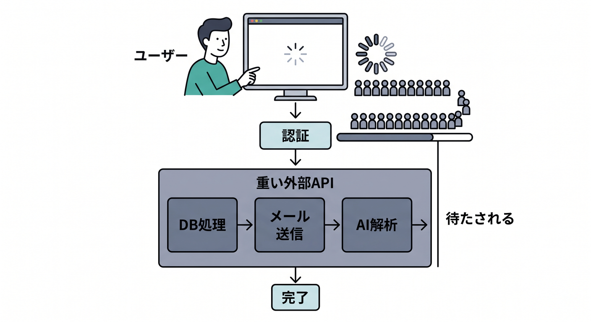
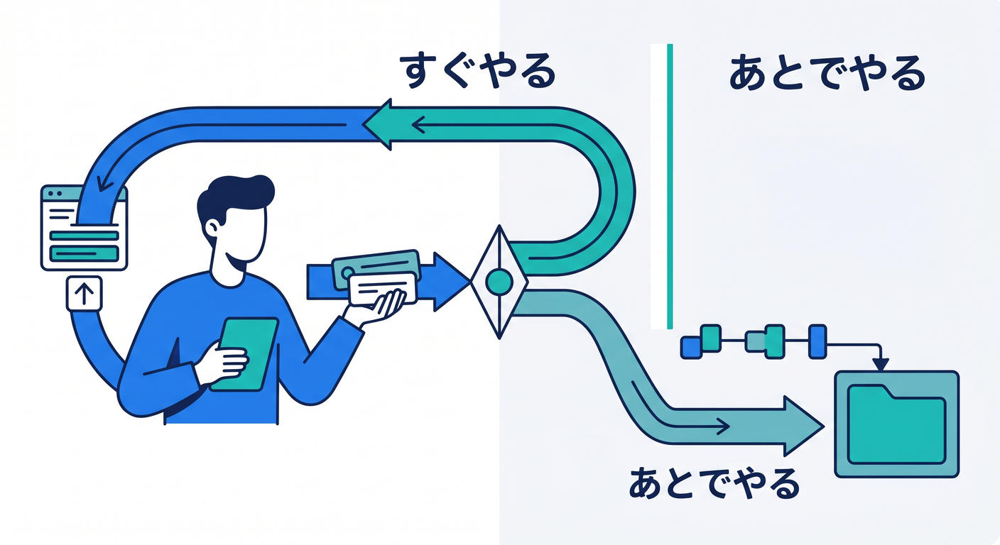
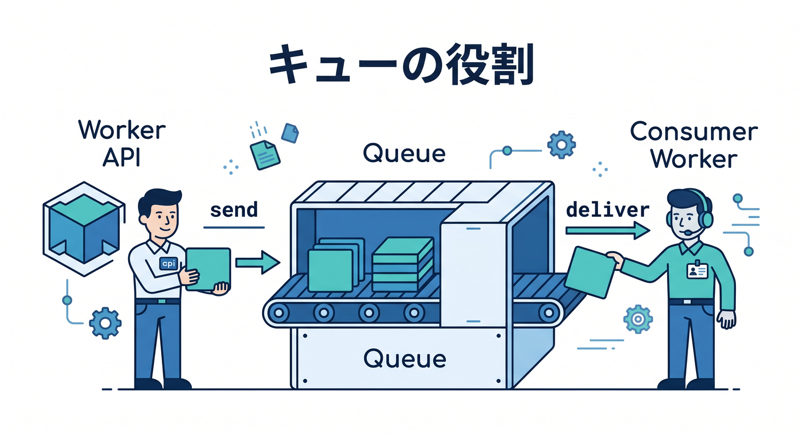
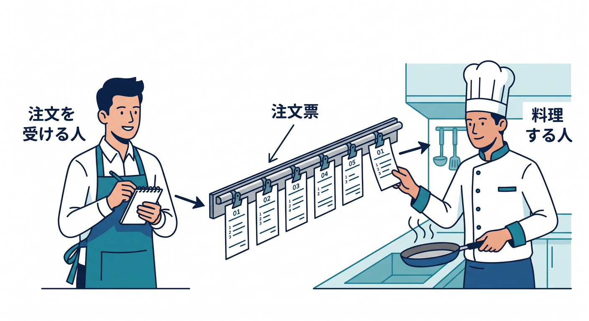
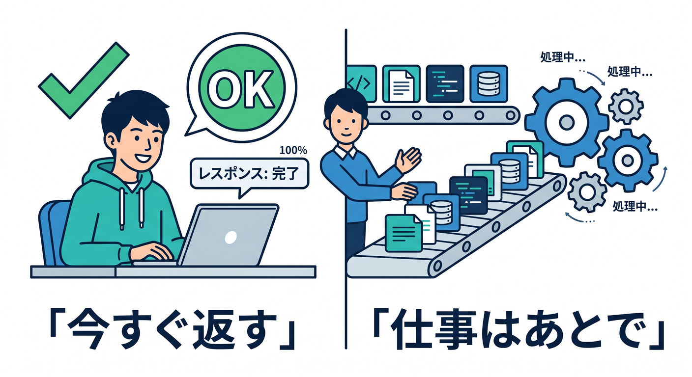

# 第01章：“あとでやる処理”って何だろう ⏳

Webアプリでは、ユーザーを待たせないことがとても大切です。  
でも、メール送信や画像処理のように、少し時間がかかる処理もあります。  
この章では、Cloudflare Queuesに入る前に「あとでやる処理」の考え方をつかみます 😊

---

## 1. その場で全部やると遅くなる 🐢



たとえば、お問い合わせフォームで次の処理を全部その場でやるとします。

```text
フォーム送信
  ↓
D1へ保存
  ↓
メール送信
  ↓
通知送信
  ↓
AIで分類
  ↓
画面へ完了表示
```

途中でメールAPIが遅いと、ユーザーの画面も待たされます。  
外部APIが失敗すると、フォーム送信そのものが失敗したように見えることもあります。

---

## 2. すぐ返す処理と、あとでやる処理 🧭



分けて考えると楽になります。

```text
すぐやる:
- 入力チェック
- 受付IDを作る
- 最低限の保存
- ユーザーへ受付完了を返す

あとでやる:
- メール送信
- 通知
- 画像処理
- AI分類
- 集計
```

ユーザーには早く返し、重い処理は裏側で進めます。

---

## 3. Queuesの役割 📬



Cloudflare Queuesは、Workerからメッセージをqueueへ入れ、consumer Workerがあとで処理する仕組みです。

```text
Worker API
  ↓ send
Queue
  ↓ deliver
Consumer Worker
```

公式ドキュメントでは、Cloudflare Queuesは非同期処理のためにメッセージをqueueへ入れられるサービスとして案内されています。

---

## 4. 初心者向けのたとえ 🍱



レストランで考えると分かりやすいです。

```text
注文を受ける人 → Producer Worker
注文票を置く場所 → Queue
料理する人 → Consumer Worker
```

注文を受けた人が全部料理までやると大変です。  
役割を分けると、受付は早く、料理は順番に進められます。

---

## 5. 章末チェック ✅



- その場で全部やると遅くなる理由が分かる
- すぐやる処理とあとでやる処理を分けられる
- Queuesは非同期処理のための仕組みだと分かる
- Producer、Queue、Consumerの雰囲気が分かる
- ユーザーへ早く返す設計の大切さが分かる

この章で覚える一言はこれです。  
**Queuesは、“今すぐ返して、仕事はあとで進める”ための仕組みです ⏳**
