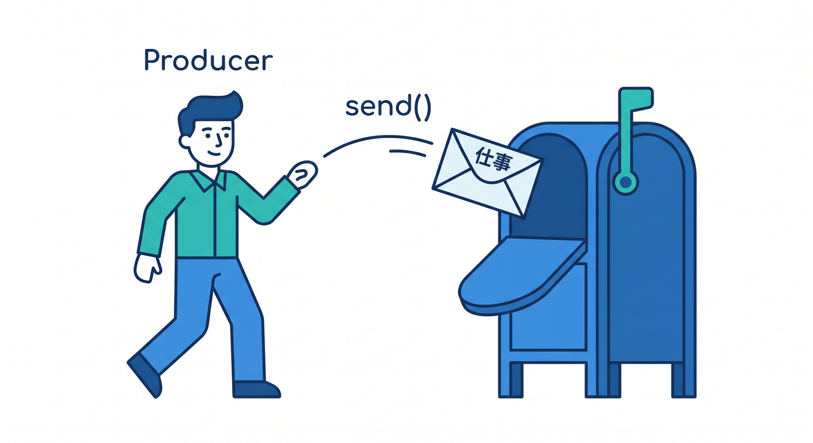
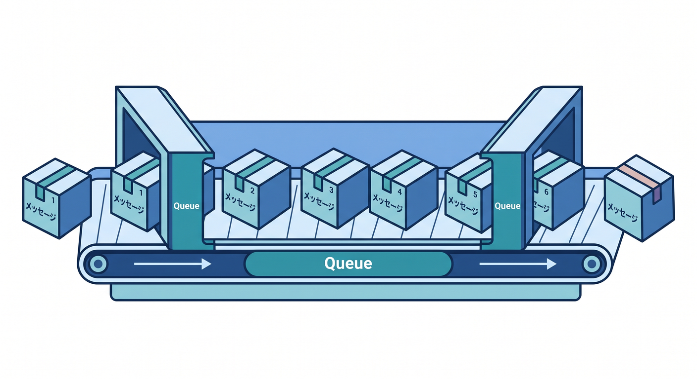
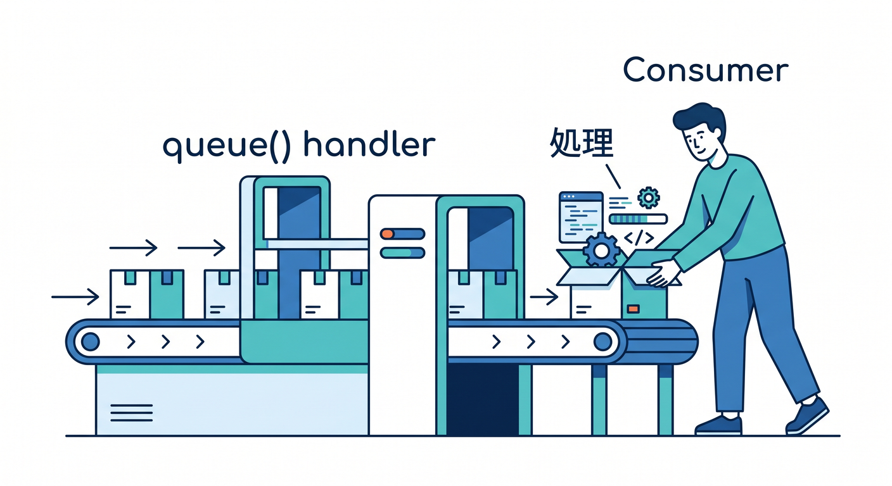
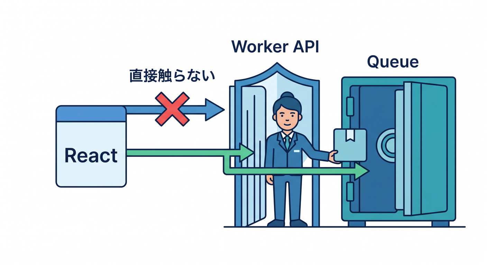
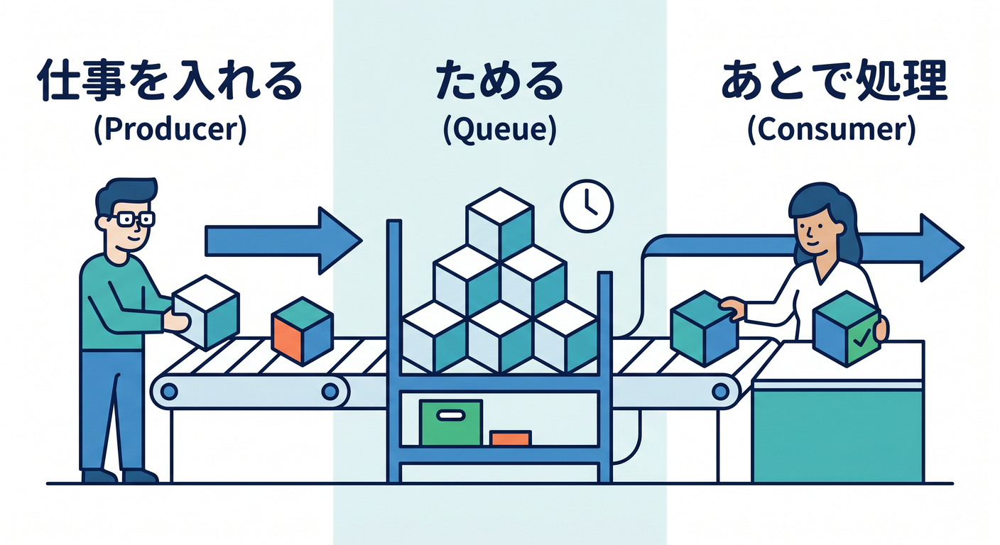

# 第02章：Producer・Queue・Consumerを理解しよう 📮

Queuesでは、まず3つの登場人物を覚えます。  
Producer、Queue、Consumerです。名前は英語ですが、役割はシンプルです 😊

---

## 1. Producerは仕事を入れる人 📤



Producerは、queueへメッセージを入れるWorkerです。

```ts
await env.TASK_QUEUE.send({
  type: "email.send",
  to: "student@example.com",
  jobId: crypto.randomUUID(),
});
```

フォーム送信APIやアップロードAPIがProducerになることが多いです。

---

## 2. Queueは仕事をためる場所 📬



Queueは、あとで処理する仕事をためる場所です。

```text
message 1: メール送信
message 2: 画像処理
message 3: 通知送信
```

Producerはqueueへ入れたら、ユーザーへ早めに返せます。

---

## 3. Consumerは仕事を処理する人 📥



Consumerは、queueから届いたメッセージを処理するWorkerです。

```ts
export default {
  async queue(batch, env): Promise<void> {
    for (const message of batch.messages) {
      console.log(message.body);
    }
  },
} satisfies ExportedHandler<Env>;
```

`queue()` handlerが、Queue処理の入口です。

---

## 4. ReactはQueueを直接触らない 🔐



React画面から直接Queueへ送るのではなく、Worker APIを通します。

```text
React
  ↓ fetch
Worker API
  ↓ env.TASK_QUEUE.send()
Queue
```

Workerで認証、入力チェック、Rate Limitingを入れやすくなります。

---

## 5. 章末チェック ✅



- Producerはメッセージを入れるWorkerだと分かる
- Queueは仕事をためる場所だと分かる
- Consumerはあとで処理するWorkerだと分かる
- `send()` と `queue()` handlerの役割が分かる
- Reactから直接Queueを触らせない理由が分かる

この章で覚える一言はこれです。  
**Producerが仕事を入れ、Queueがため、Consumerがあとで処理します 📮**
