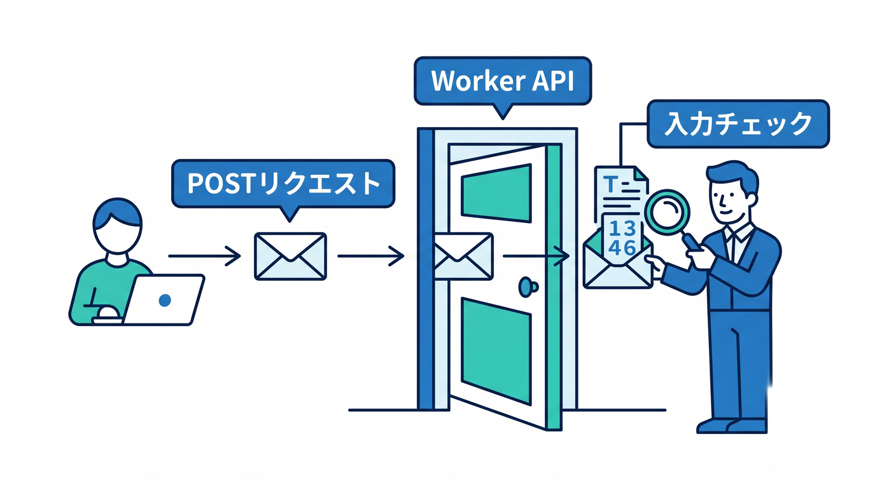
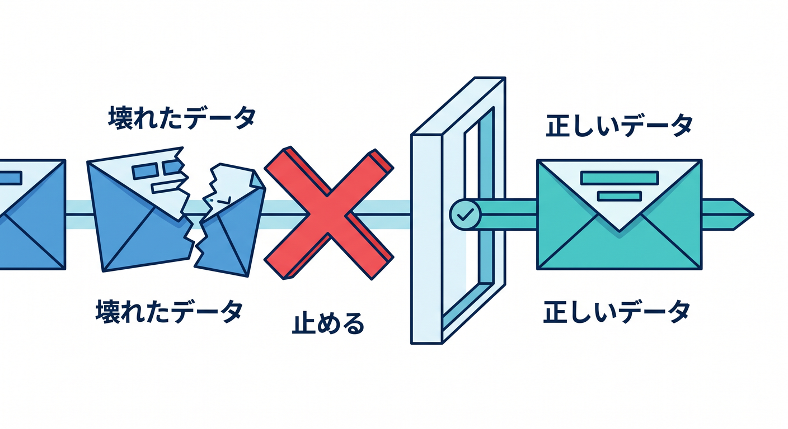
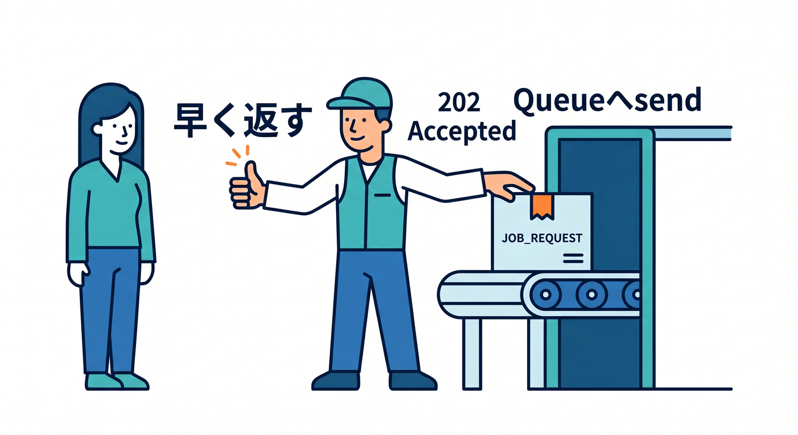
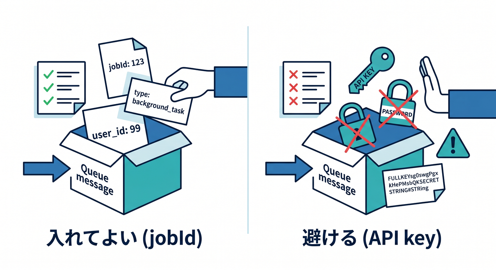
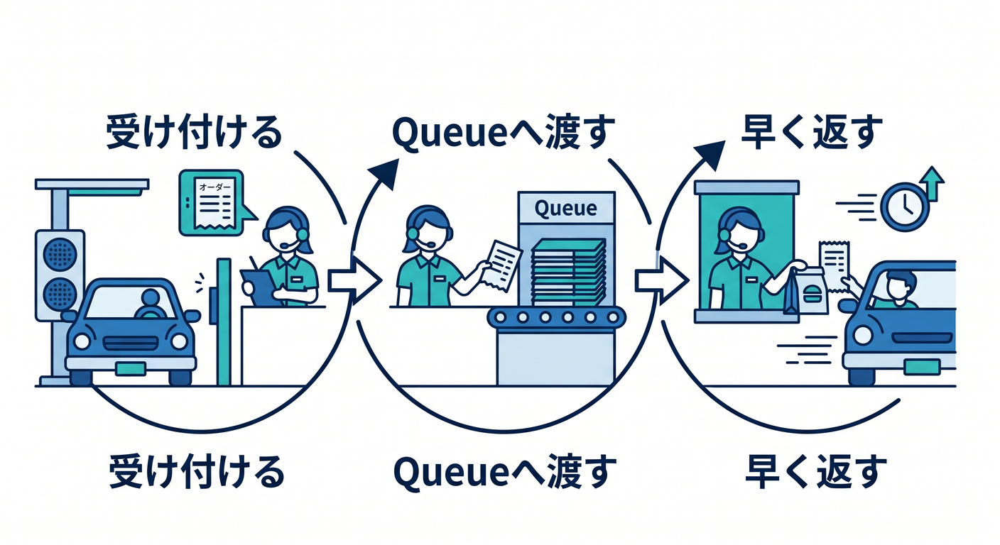

# 第04章：Producer Workerからsendしよう 📤

Queueの準備ができたら、Producer Workerからメッセージを送ります。  
ここでは、お問い合わせフォームを例にします。

---

## 1. APIで入力を受ける 🚪

WorkerでPOSTリクエストを受けます。

```ts
type ContactRequest = {
  name?: string;
  email?: string;
  message?: string;
};

export default {
  async fetch(request, env): Promise<Response> {
    if (request.method !== "POST") {
      return new Response("Method Not Allowed", { status: 405 });
    }

    const body = await request.json<ContactRequest>();
    // 入力チェックは次で行います。
    return Response.json({ ok: true });
  },
} satisfies ExportedHandler<Env>;
```



外から来る値は、必ず疑って確認します 🔐

---

## 2. 入力チェックをする ✅

最低限のチェックを入れます。

```ts
if (!body.name || !body.email || !body.message) {
  return Response.json({ error: "Missing fields" }, { status: 400 });
}

if (body.message.length > 2000) {
  return Response.json({ error: "Message too long" }, { status: 400 });
}
```



Queueへ入れる前に、変なデータを止めます。

---

## 3. Queueへsendする 📬

メッセージを作って送ります。

```ts
const jobId = crypto.randomUUID();

await env.CONTACT_QUEUE.send({
  jobId,
  type: "contact.received",
  name: body.name,
  email: body.email,
  message: body.message,
  createdAt: new Date().toISOString(),
});

return Response.json({ accepted: true, jobId }, { status: 202 });
```



`202 Accepted` は「受け付けたけれど、処理完了はまだ」という意味で使いやすいです。

---

## 4. secretを入れない 🔐

QueueのmessageへAPIキーやtokenを入れないようにします。

```text
入れてよい: jobId, userId, fileKey, createdAt
避ける: API key, password, secret token
```



必要なsecretは、consumer側の `env` からSecretsとして読む形にします。

---

## 5. 章末チェック ✅

- WorkerでPOSTを受けられる
- Queueへ入れる前に入力チェックすると分かる
- `env.CONTACT_QUEUE.send()` を使える
- `202 Accepted` の使いどころが分かる
- messageへsecretを入れないと分かる

この章で覚える一言はこれです。  
**Producerは、仕事を受け付けてQueueへ渡し、ユーザーには早く返します 📤**


