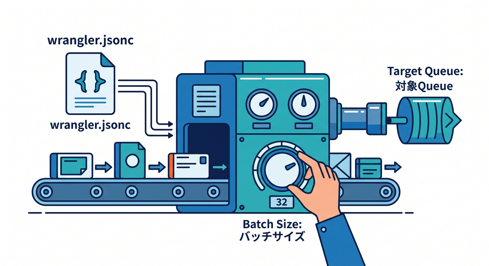
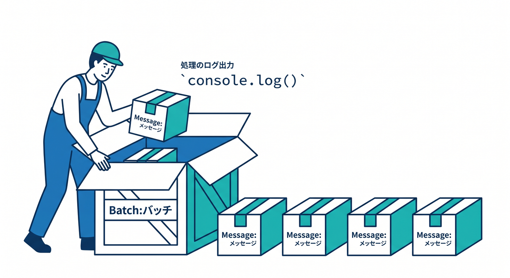
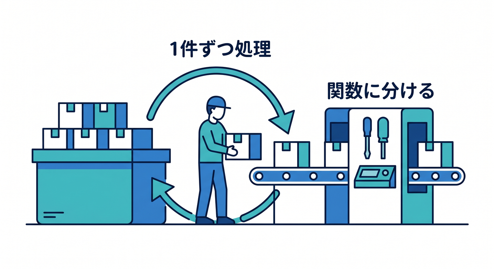
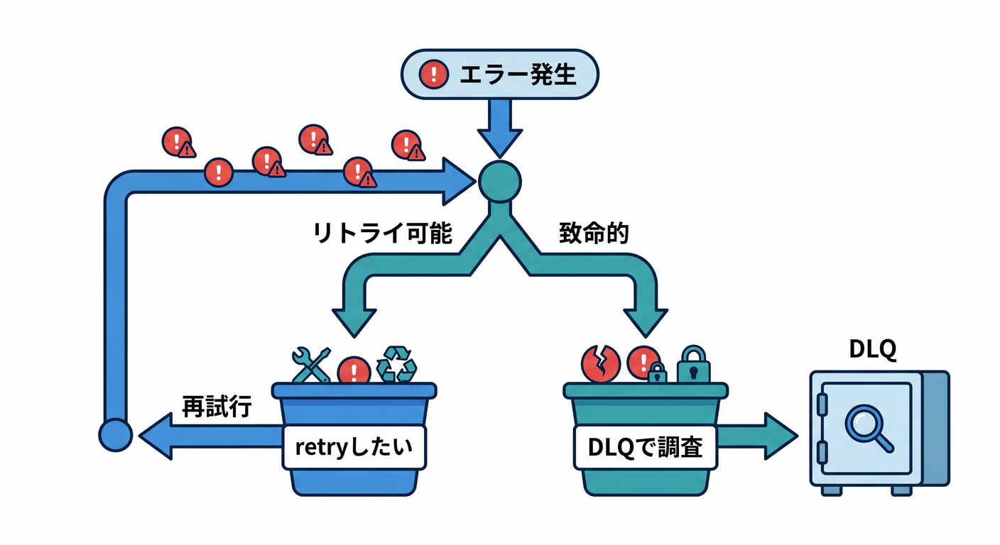
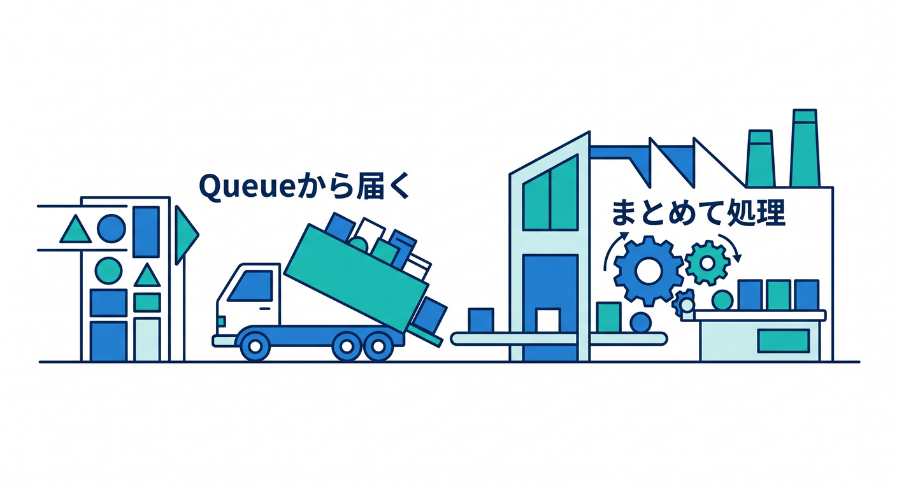

# 第05章：Consumer Workerで処理しよう 📥

ProducerがQueueへ入れたメッセージは、Consumer Workerが処理します。  
この章では `queue()` handlerの基本形を学びます。

---

## 1. consumer設定を書く ⚙️

`wrangler.jsonc` にconsumer設定を書きます。

```jsonc
{
  "queues": {
    "consumers": [
      {
        "queue": "contact-jobs",
        "max_batch_size": 10,
        "max_batch_timeout": 10
      }
    ]
  }
}
```



このWorkerが `contact-jobs` のメッセージを受け取ります。

---

## 2. queue handlerを書く 🧩

Workerに `queue()` handlerを追加します。

```ts
export default {
  async queue(batch, env): Promise<void> {
    for (const message of batch.messages) {
      console.log("received", message.body);
    }
  },
} satisfies ExportedHandler<Env>;
```



最初はログ出力だけで、流れを確認します。

---

## 3. 1件ずつ処理する 🔁

メッセージを1件ずつ処理します。

```ts
for (const message of batch.messages) {
  const job = message.body;
  await processContactJob(job, env);
}
```



処理内容を関数に分けると、テストやレビューがしやすくなります。

---

## 4. エラーはretryにつながる 🧯

consumerでエラーが起きると、メッセージはretry対象になります。  
そのため、失敗してよいエラーと、握りつぶしてはいけないエラーを分けます。

```text
外部APIが一時的に失敗 → retryしたい
入力データが壊れている → DLQやログで調査したい
```



非同期処理は「失敗する前提」で作ります。

---

## 5. 章末チェック ✅

- consumer設定を書ける
- `queue()` handlerの基本形が分かる
- batch内のmessagesを処理できる
- 処理関数を分けると見通しがよいと分かる
- エラーがretryに関係すると分かる

この章で覚える一言はこれです。  
**Consumerは、Queueから届いた仕事をあとでまとめて処理します 📥**


