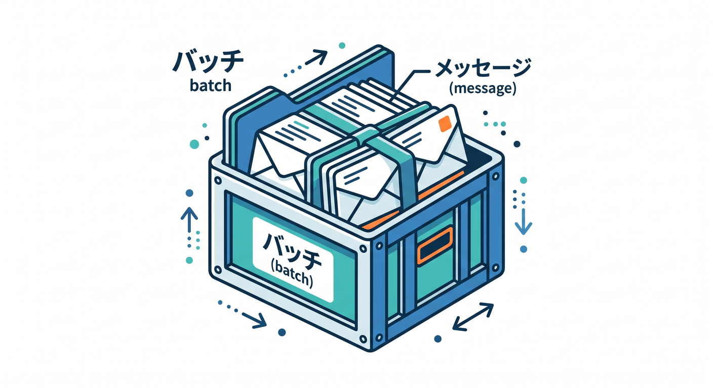
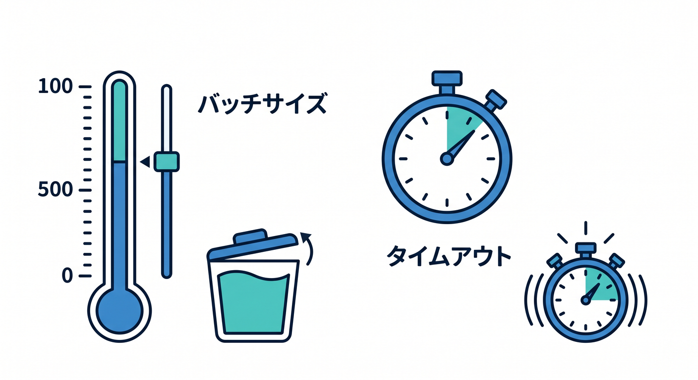
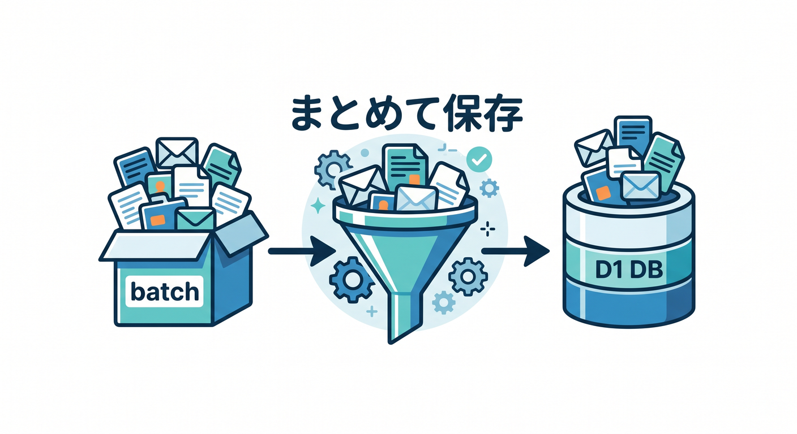
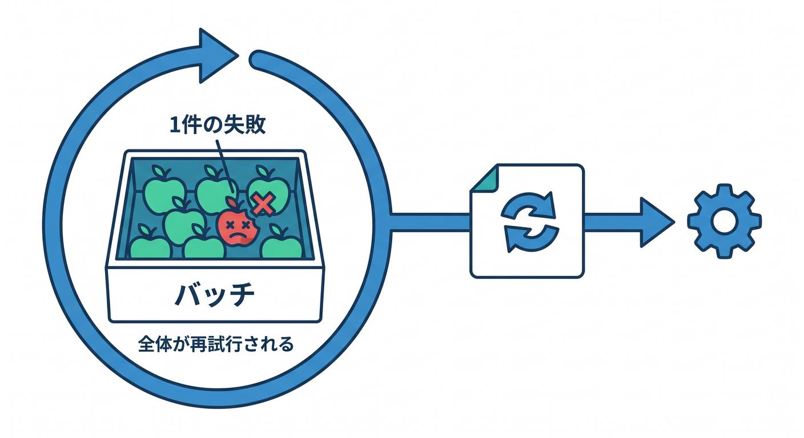
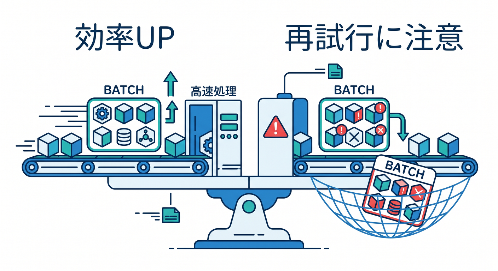

# 第06章：Batchingでまとめて処理しよう 📦

Cloudflare Queuesでは、メッセージがbatchでconsumerへ届きます。  
batchを理解すると、効率よく処理できるようになります。

---

## 1. batchとは何か 📦

batchは、複数のメッセージのまとまりです。

```text
batch
  ├─ message 1
  ├─ message 2
  └─ message 3
```



1件ずつではなく、まとめて届くことがあります。

---

## 2. batch sizeとtimeout ⚙️

consumer設定では、batch sizeやtimeoutを設定できます。

```jsonc
{
  "queues": {
    "consumers": [
      {
        "queue": "analytics-events",
        "max_batch_size": 25,
        "max_batch_timeout": 5
      }
    ]
  }
}
```



たくさん来るイベントは、大きめのbatchにすると効率がよい場合があります。

---

## 3. まとめてD1へ保存する 🗄️

分析イベントなら、batchでまとめてD1へ入れる発想があります。

```ts
for (const message of batch.messages) {
  const event = message.body;
  await env.DB.prepare(
    "INSERT INTO events (id, type, created_at) VALUES (?, ?, ?)"
  )
    .bind(event.id, event.type, event.createdAt)
    .run();
}
```



最初は分かりやすさ優先で1件ずつでも大丈夫です。

---

## 4. 失敗時の注意 🧯

batch内の1件で失敗すると、batch全体がretryされることがあります。  
公式ドキュメントでも、ackを明示しない場合のbatch retryに注意が必要です。

大切なのは、同じメッセージがもう一度来ても壊れない設計です。



---

## 5. 章末チェック ✅

- batchは複数メッセージのまとまりだと分かる
- batch sizeとtimeoutを設定できる
- まとめて処理すると効率がよい場面がある
- 1件失敗がbatch全体へ影響する可能性が分かる
- 冪等性が必要だと分かる

この章で覚える一言はこれです。  
**Batchingは効率を上げますが、失敗時の再処理もセットで考えます 📦**


