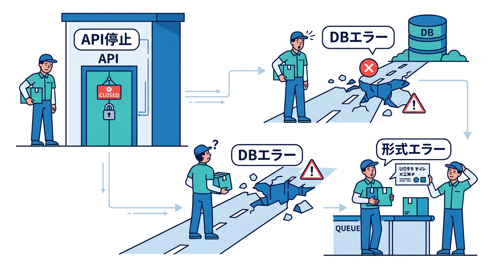
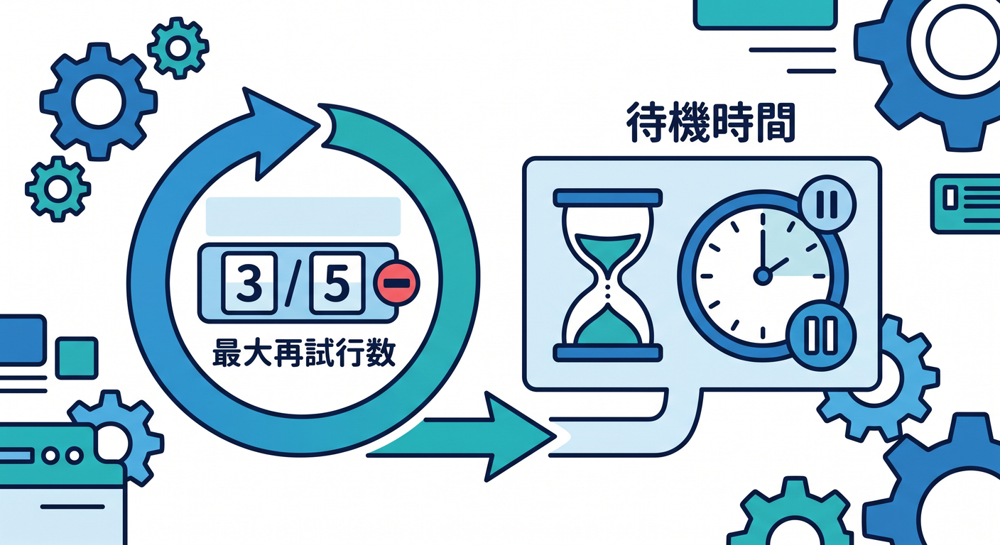
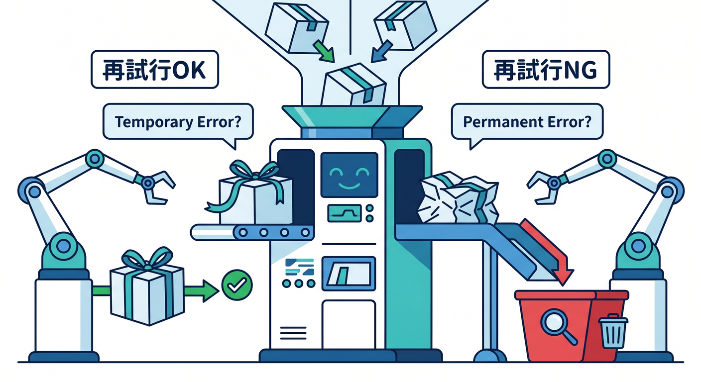
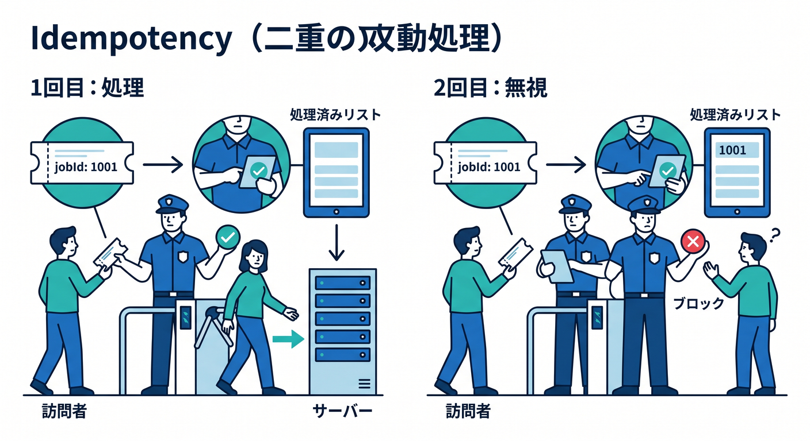
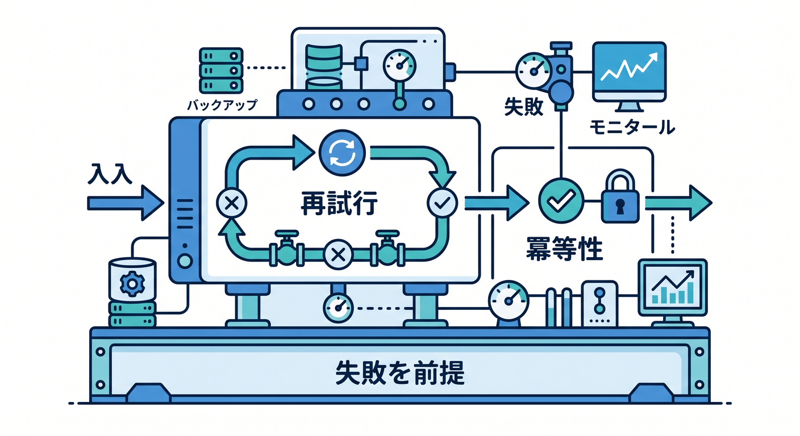

# 第07章：Retryと失敗処理を学ぼう 🔁

非同期処理では、失敗が必ず起きます。  
だからこそ、retryを前提に設計することが大切です。

---

## 1. よくある失敗 🧯

Queue処理では、こんな失敗が起きます。

- 外部メールAPIが一時的に落ちる
- 画像処理APIが429を返す
- D1書き込みが失敗する
- R2のobject keyが見つからない
- メッセージの形式が古い



外部サービスを呼ぶほど、失敗の種類は増えます。

---

## 2. retryの考え方 🔁

Cloudflare Queuesでは、consumerのdelivery failureに対してretryできます。  
設定では `max_retries` やretry delayを扱えます。

```jsonc
{
  "queues": {
    "consumers": [
      {
        "queue": "email-jobs",
        "max_retries": 3,
        "retry_delay": 60
      }
    ]
  }
}
```



一時的な失敗なら、少し待って再試行すると成功することがあります。

---

## 3. retryしてはいけないものもある 🛑

何でもretryすればよいわけではありません。

```text
retry向き:
- 一時的なネットワークエラー
- 外部APIの一時障害
- 429 rate limit

retryしても直りにくい:
- 必須項目がない
- JSON形式が壊れている
- 権限がない
```



retryしても直らないものは、DLQやログで調査します。

---

## 4. 同じ処理が複数回走る前提 🧠

retryがあるということは、同じメッセージが複数回処理される可能性があります。  
メール送信やポイント付与では、二重実行が問題になります。

そこで `jobId` を使います。

```text
jobIdが処理済みなら何もしない
jobIdが未処理なら処理して記録する
```



この考え方を冪等性と呼びます。

---

## 5. 章末チェック ✅

- Queue処理では失敗が起きると分かる
- retryは一時的な失敗に向くと分かる
- retryしても直らない失敗があると分かる
- `max_retries` やretry delayの存在を知っている
- 同じ処理が複数回走る前提で設計できる

この章で覚える一言はこれです。  
**Queueでは、失敗とretryを最初から設計に入れます 🔁**


