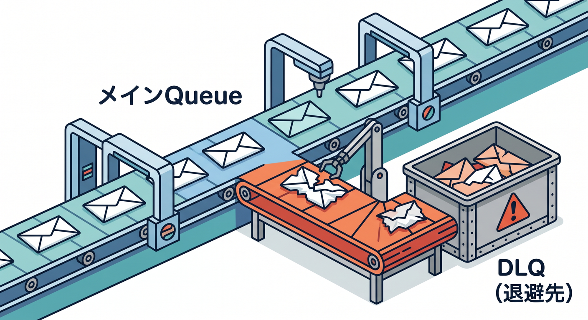
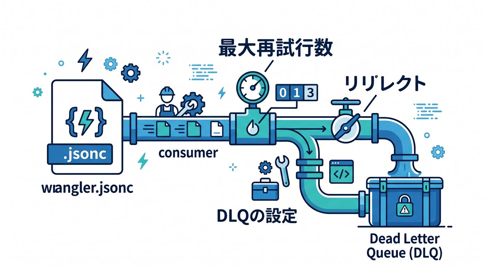
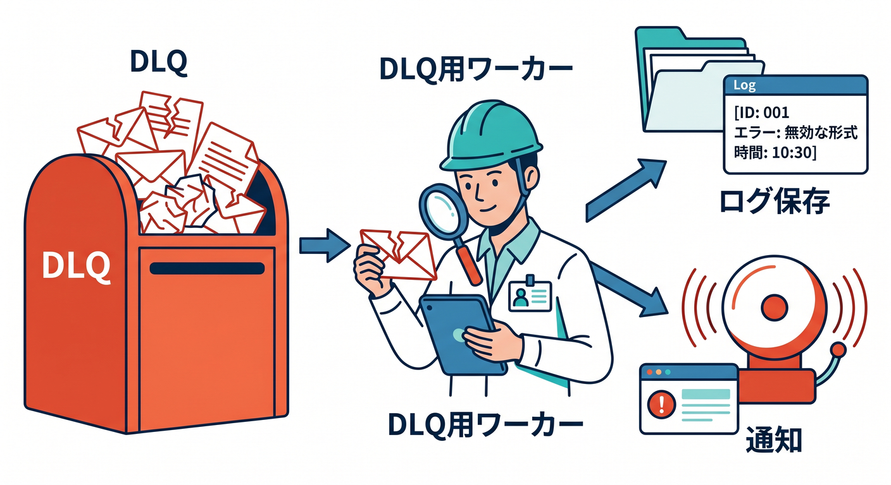
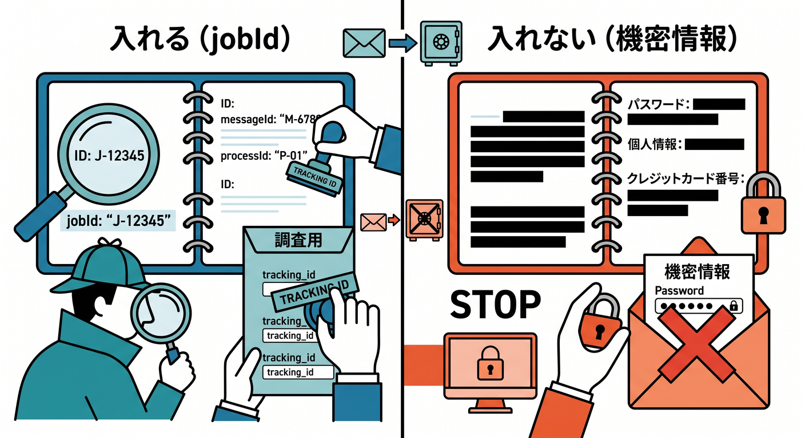
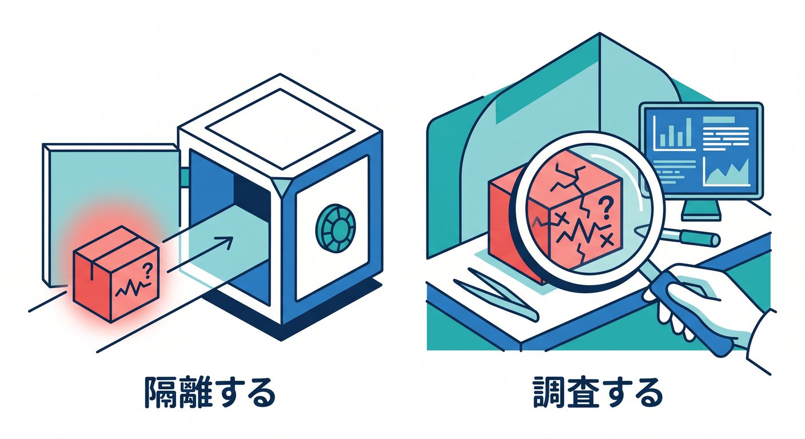

# 第08章：Dead Letter Queueで失敗を隔離しよう 🧯

retryしても失敗するメッセージがあります。  
そのときに使うのがDead Letter Queue、略してDLQです。

---

## 1. DLQとは何か 📮

DLQは、処理できなかったメッセージを逃がすための別queueです。

```text
main queue
  ↓ retryしても失敗
dead letter queue
  ↓
あとで調査
```



失敗を静かに消すのではなく、見える場所へ移します。

---

## 2. consumer設定で指定する ⚙️

Cloudflare Queuesでは、consumer設定にDLQを書けます。

```jsonc
{
  "queues": {
    "consumers": [
      {
        "queue": "email-jobs",
        "max_retries": 3,
        "dead_letter_queue": "email-jobs-dlq"
      }
    ]
  }
}
```



`max_retries` に到達したあと、DLQへ送られます。

---

## 3. DLQも処理できる 🔎

DLQも普通のqueueなので、consumerを付けられます。

```text
DLQ consumer
  ↓
ログ保存
管理者通知
再処理候補へ登録
```



すぐ自動再処理するより、まずは原因が分かる形にするのがおすすめです。

---

## 4. DLQに残す情報 🧾

調査しやすいように、messageにはjobIdや種類を入れます。

```ts
await env.EMAIL_QUEUE.send({
  jobId,
  type: "email.send",
  userId,
  templateId,
  createdAt: new Date().toISOString(),
});
```



秘密情報は入れず、追跡に必要なIDを入れます 🔐

---

## 5. 章末チェック ✅

- DLQは失敗メッセージの避難場所だと分かる
- `dead_letter_queue` の設定イメージが分かる
- retry上限後にDLQへ送ると分かる
- DLQにもconsumerを付けられると分かる
- 調査用にjobIdを入れると分かる

この章で覚える一言はこれです。  
**DLQは、“失敗を消さずに調べられる場所へ移す”ためのqueueです 🧯**


