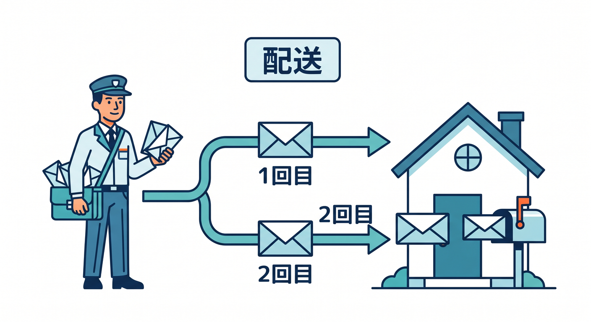
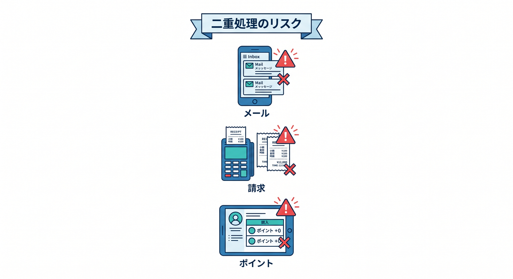
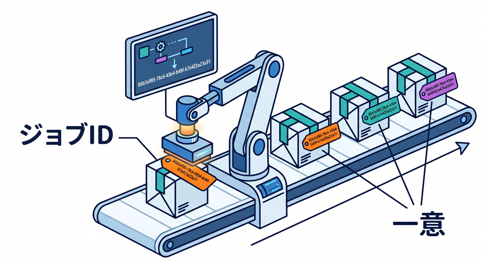
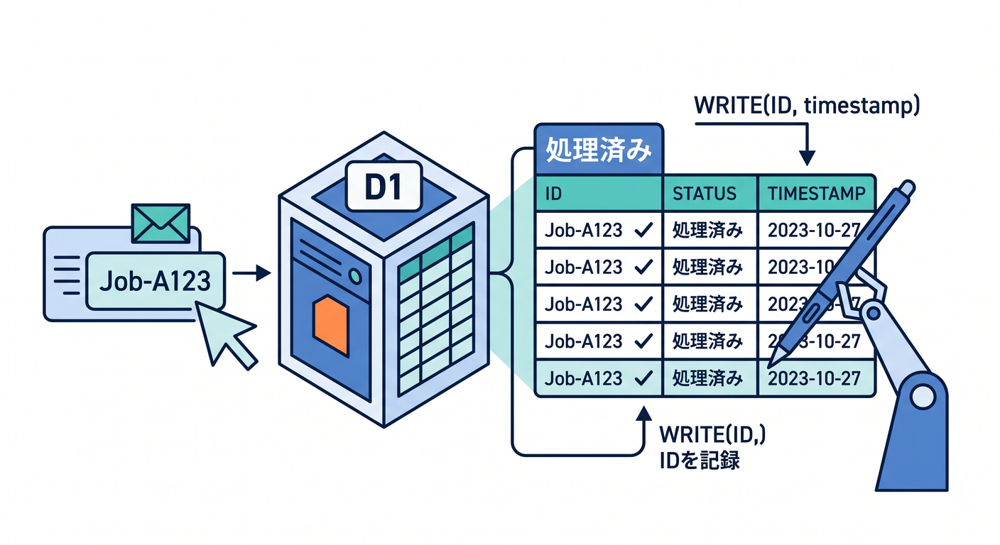
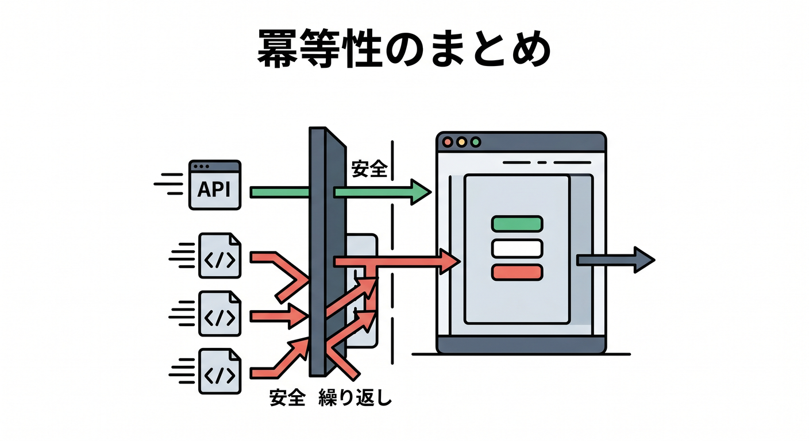

# 第09章：At-least-once deliveryと冪等性 🧠

Queuesを使うなら、at-least-once deliveryと冪等性はとても大切です。  
少し難しい言葉ですが、実務ではかなり重要です。

---

## 1. At-least-once deliveryとは 📬

Cloudflare Queuesは、信頼性のためにat-least-once deliveryを基本とします。  
これは「少なくとも1回は届ける」という考え方です。

ただし、裏返すとこうです。

```text
同じメッセージが2回以上届く可能性がある
```

「必ず1回だけ」とは考えません。



---

## 2. 二重処理の例 😵

同じメッセージが2回処理されると困るものがあります。

- メールが2通届く
- ポイントが2回付く
- 請求が2回作られる
- D1に同じ行が2つ入る
- AI生成ジョブが2回走る

Queue処理では、こうした二重実行を防ぐ設計が必要です。



---

## 3. jobIdを使う 🪪

Producerで一意なjobIdを作ります。

```ts
const jobId = crypto.randomUUID();

await env.EMAIL_QUEUE.send({
  jobId,
  type: "email.send",
  userId,
});
```

consumerでは、処理済みjobIdかどうかを確認します。



---

## 4. D1で処理済みを記録する 🗄️

D1に処理済みテーブルを作る例です。

```sql
CREATE TABLE processed_jobs (
  job_id TEXT PRIMARY KEY,
  processed_at TEXT NOT NULL
);
```

`job_id` をPRIMARY KEYにすると、同じjobIdを二重登録しにくくなります。



---

## 5. 章末チェック ✅

- at-least-once deliveryの意味が分かる
- 同じメッセージが複数回届く可能性があると分かる
- 二重処理が危険な場面を説明できる
- jobIdをidempotency keyとして使える
- D1などで処理済みを記録する発想が分かる

この章で覚える一言はこれです。  
**Queue処理は、“同じ仕事がもう一度来ても壊れない”ように作ります 🧠**


