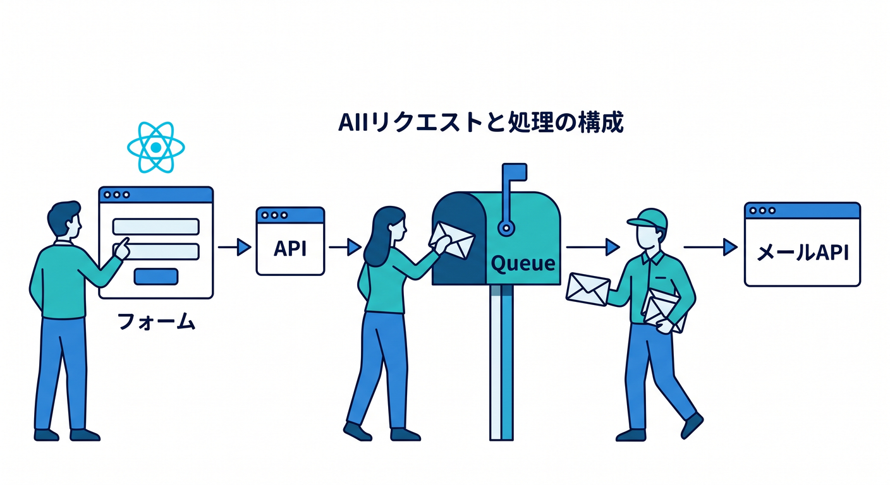
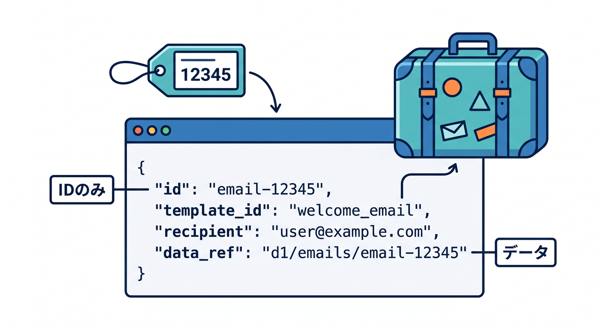
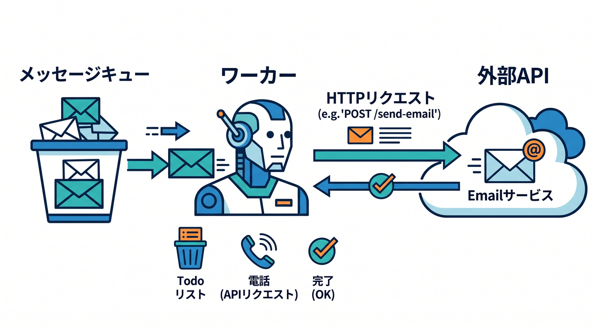
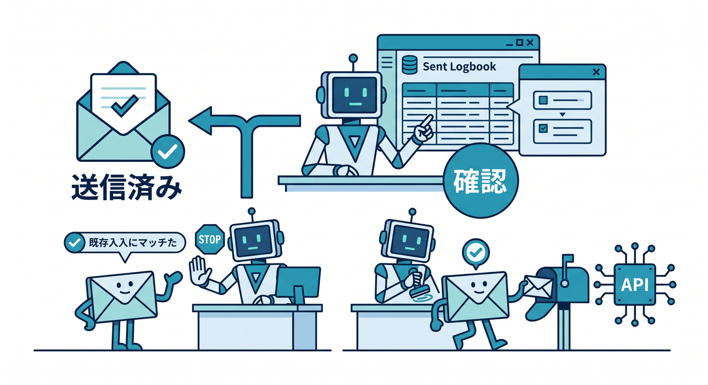
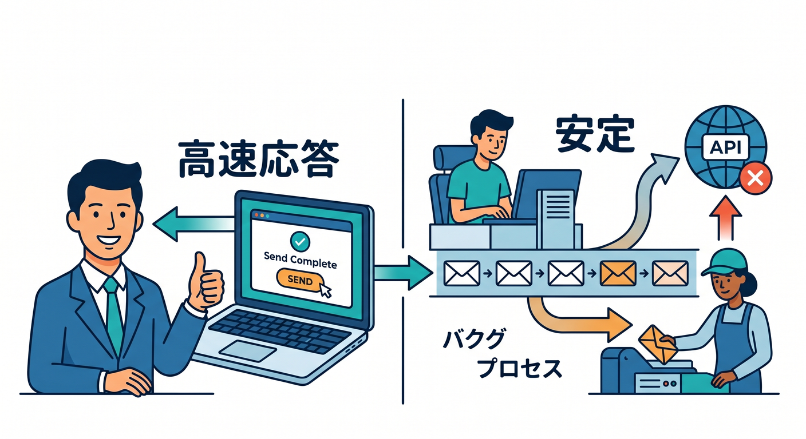

# 第10章：メール送信Queueを作ろう ✉️

メール送信は、Queuesの分かりやすい活用例です。  
外部メールAPIは遅くなったり失敗したりするので、リクエスト本体から分けると安定します。

---

## 1. 全体構成 🧭

お問い合わせフォームを例にします。

```text
React form
  ↓ POST /api/contact
Worker API
  ↓ EMAIL_QUEUE.send()
Queue
  ↓
Consumer Worker
  ↓
Email API
```

ユーザーには「受け付けました」をすぐ返します。



---

## 2. Producerのmessage ✍️

メール本文を全部入れるより、必要な情報を整理して入れます。

```ts
await env.EMAIL_QUEUE.send({
  jobId,
  type: "contact.email",
  to: "admin@example.com",
  templateId: "contact_received",
  contactId,
  createdAt: new Date().toISOString(),
});
```

詳細本文はD1へ保存し、QueueにはIDだけ入れる設計もよくあります。



---

## 3. Consumerで送信する 📤

consumerが外部メールAPIを呼びます。

```ts
async function sendEmail(job: EmailJob, env: Env): Promise<void> {
  const response = await fetch("https://api.example-mail.com/send", {
    method: "POST",
    headers: {
      Authorization: `Bearer ${env.EMAIL_API_KEY}`,
      "Content-Type": "application/json",
    },
    body: JSON.stringify({
      to: job.to,
      templateId: job.templateId,
    }),
  });

  if (!response.ok) {
    throw new Error(`Email API failed: ${response.status}`);
  }
}
```

APIキーはSecretsに置きます 🔐



---

## 4. 送信済み管理 ✅

メールは二重送信を避けたい処理です。  
jobIdやcontactIdを使って、送信済みか確認します。

```text
未送信なら送る
送信済みなら何もしない
```

retryがあっても壊れないようにします。



---

## 5. 章末チェック ✅

- メール送信はQueue向きだと分かる
- ユーザーへ早く返す構成が分かる
- Queue messageへ必要なIDを入れられる
- APIキーはSecretsに置くと分かる
- 二重送信を避ける設計が必要だと分かる

この章で覚える一言はこれです。  
**メール送信は、Queueへ逃がすと画面の応答を速くしやすい処理です ✉️**


