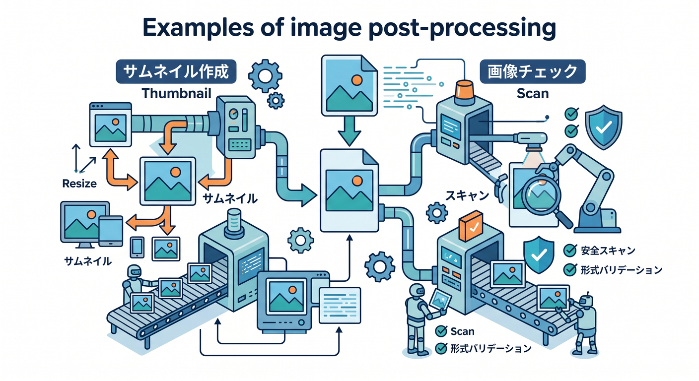
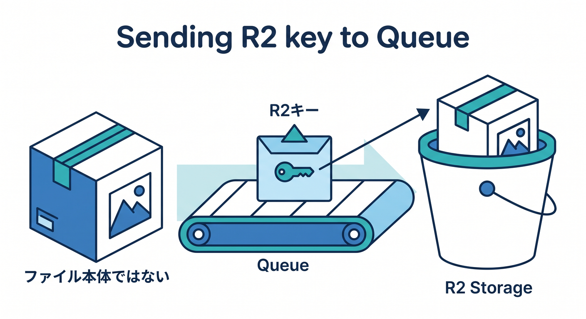
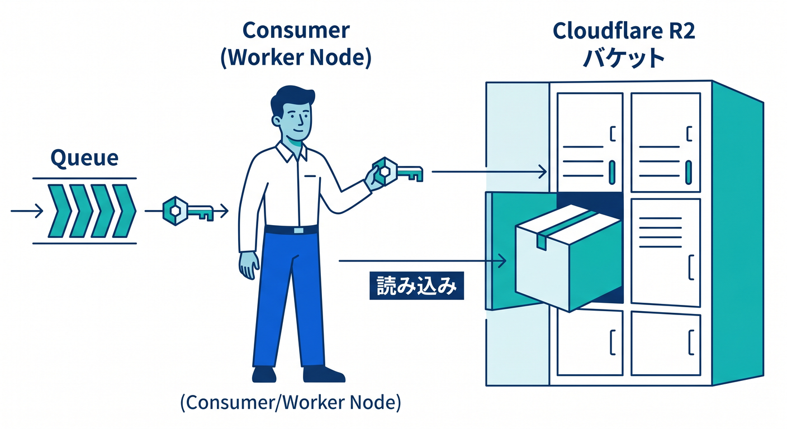
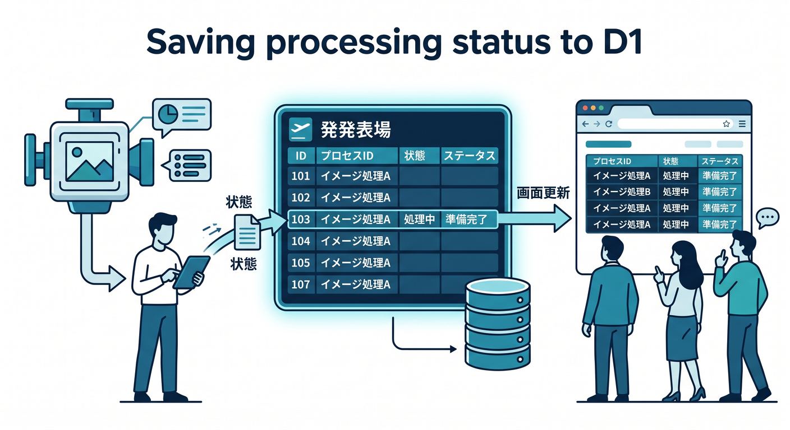
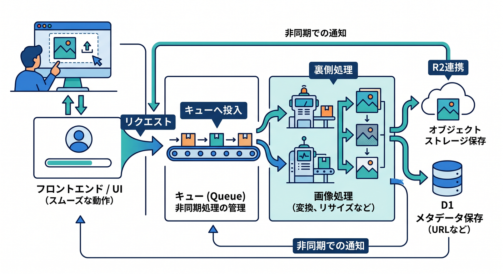

# 第11章：R2画像処理Queueを作ろう 🖼️

画像アップロード後には、いろいろな後処理をしたくなります。  
その場で全部やると重いので、Queuesへ分けると扱いやすくなります。

---

## 1. 画像後処理の例 🧰

アップロード後には、こんな処理があります。

- サムネイル生成
- Content-Type確認
- メタデータ抽出
- ウイルスチェック連携
- AI画像分類
- D1へ状態保存

どれも、ユーザーのアップロード完了を待たせすぎたくない処理です。



---

## 2. R2 keyをQueueへ入れる 🪣

R2に保存したあと、Queueへobject keyを送ります。

```ts
await env.IMAGE_QUEUE.send({
  jobId: crypto.randomUUID(),
  type: "image.uploaded",
  bucket: "user-uploads",
  key: objectKey,
  userId,
  createdAt: new Date().toISOString(),
});
```

ファイル本体をQueueへ入れるのではなく、R2のkeyを渡します。



---

## 3. ConsumerでR2を読む 📥

consumer側でR2からobjectを読みます。

```ts
const object = await env.UPLOADS_BUCKET.get(job.key);

if (!object) {
  throw new Error(`Object not found: ${job.key}`);
}
```

見つからない場合は、一時的な遅延なのか、データ不整合なのかをログで追えるようにします。



---

## 4. 処理結果をD1へ保存する 🗄️

処理が終わったら、D1へ状態を保存します。

```text
status: uploaded
status: processing
status: ready
status: failed
```

React画面は、この状態を見て「処理中」「完了」を表示できます。



---

## 5. 章末チェック ✅

- 画像後処理はQueue向きだと分かる
- Queueにはファイル本体ではなくR2 keyを入れると分かる
- ConsumerでR2 objectを読める
- 処理結果をD1へ保存する発想が分かる
- Reactで処理状態を表示できると分かる

この章で覚える一言はこれです。  
**画像アップロード後の重い処理は、R2 keyをQueueへ渡して裏側で進めます 🖼️**


