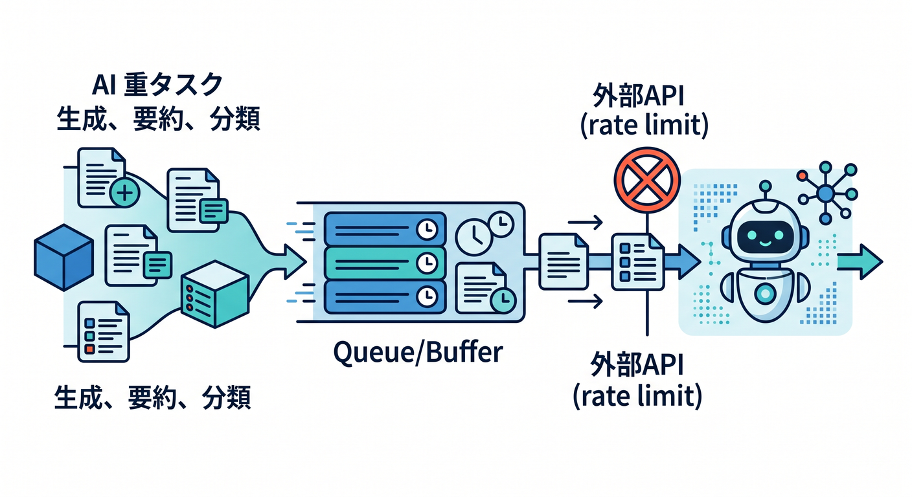
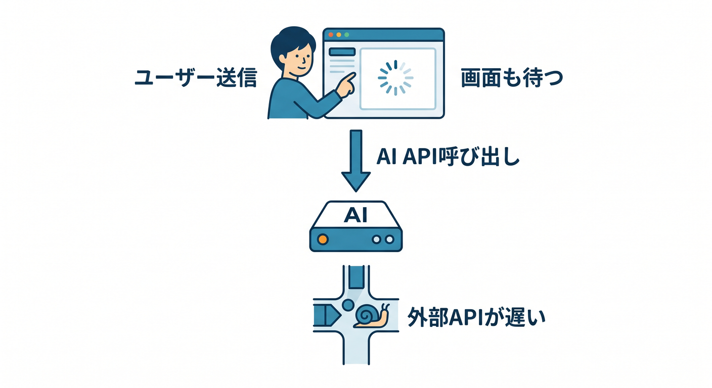
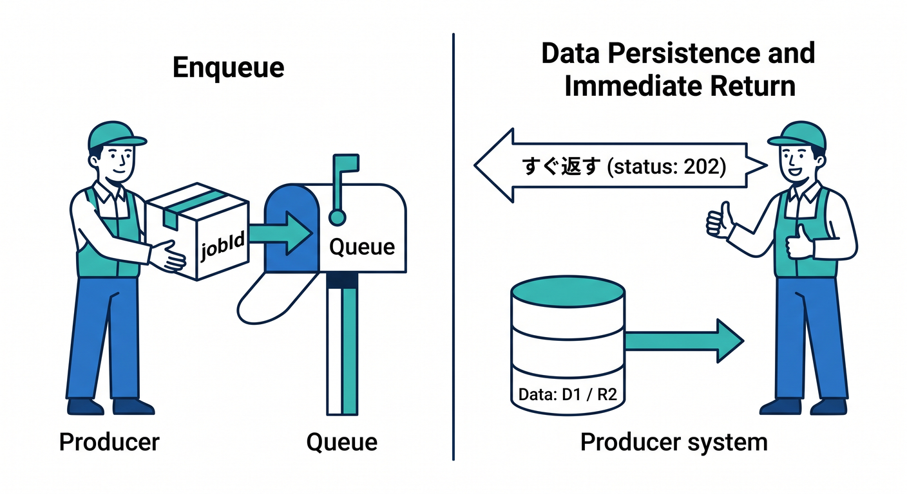
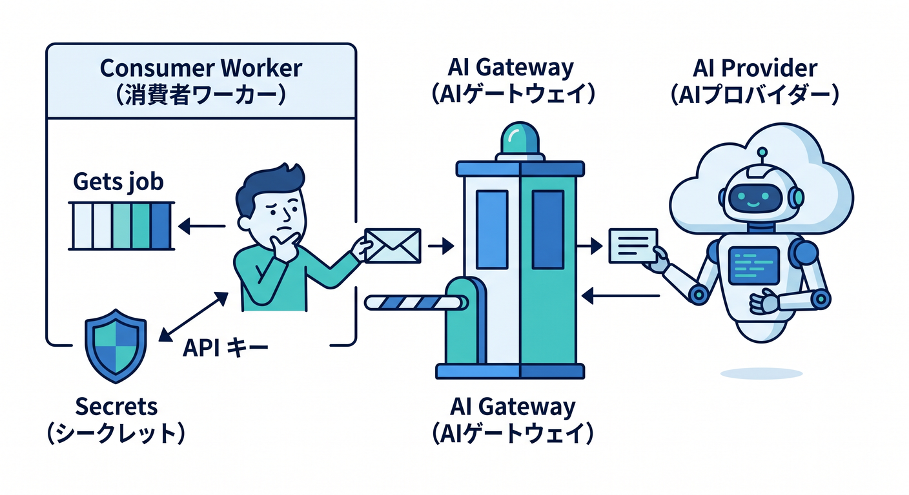
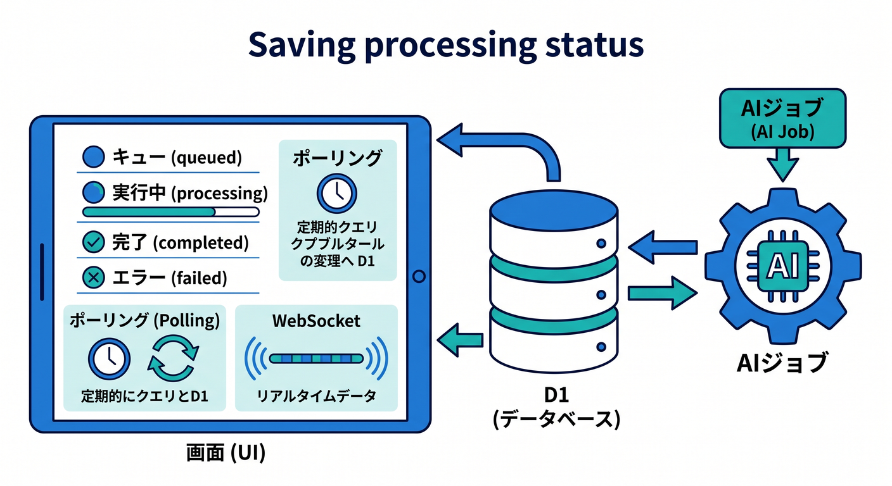
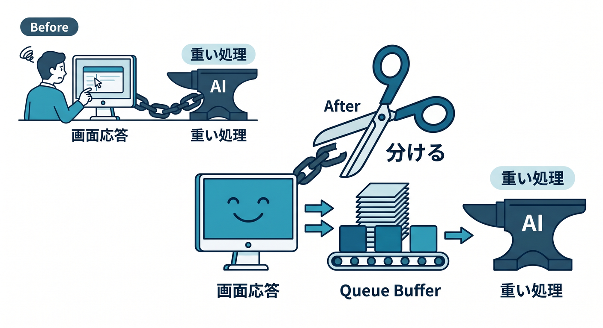

# 第12章：AI処理をQueueで安定させよう 🤖

AI処理は、Queuesと相性がよい分野です。  
生成、要約、分類、埋め込み作成は時間がかかることがあり、外部APIのrate limitにも注意が必要です。



---

## 1. AI処理をその場でやる問題 🐢

ユーザーのリクエスト中に全部やると、こうなりがちです。

```text
ユーザー送信
  ↓
AI API呼び出し
  ↓
外部APIが遅い
  ↓
画面も待つ
```



長い処理では、タイムアウトや再試行の設計も難しくなります。

---

## 2. QueueへAI jobを入れる 📬

Producerは、AI jobをQueueへ入れてすぐ返します。

```ts
await env.AI_QUEUE.send({
  jobId,
  type: "summary.create",
  documentId,
  userId,
  createdAt: new Date().toISOString(),
});

return Response.json({ accepted: true, jobId }, { status: 202 });
```

本文はD1やR2に置き、QueueにはIDを入れると扱いやすいです。



---

## 3. ConsumerでAIを呼ぶ 🤖

consumerがWorkers AIや外部AI APIを呼びます。  
外部APIならAI Gatewayを通すと、観測や制御をしやすくなります。

```text
Consumer Worker
  ↓
AI Gateway
  ↓
AI provider
```



APIキーはSecretsに置き、messageへ入れません 🔐

---

## 4. 進行状況を保存する ⚡

AI処理は時間がかかるので、状態を保存します。

```text
queued
processing
completed
failed
```



D1に保存して画面からpollingする、またはDurable Objects + WebSocketでリアルタイム表示する構成があります。

---

## 5. 章末チェック ✅

- AI処理はQueue向きだと分かる
- QueueにはjobIdやdocumentIdを入れると分かる
- AI GatewayやWorkers AIと組み合わせられる
- APIキーはSecretsに置くと分かる
- 進行状況を保存して画面に出せると分かる

この章で覚える一言はこれです。  
**AI処理はQueueへ逃がすと、画面応答と重い処理を分けられます 🤖**


