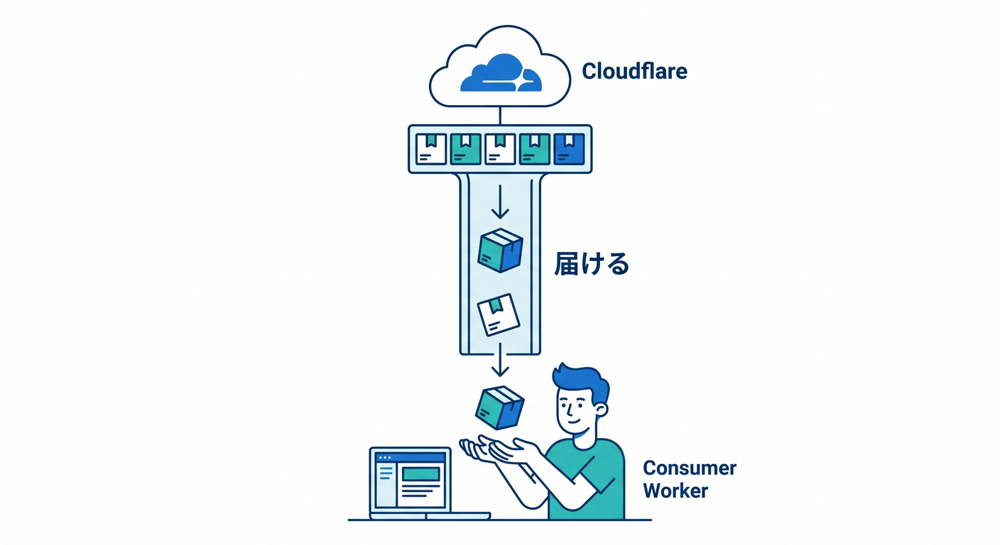
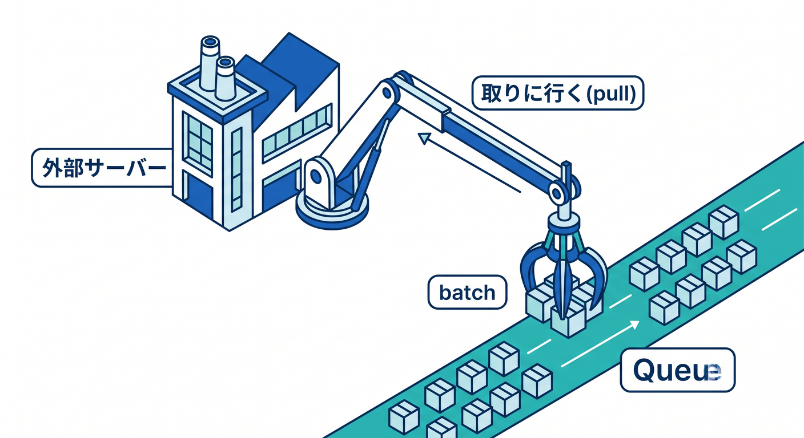
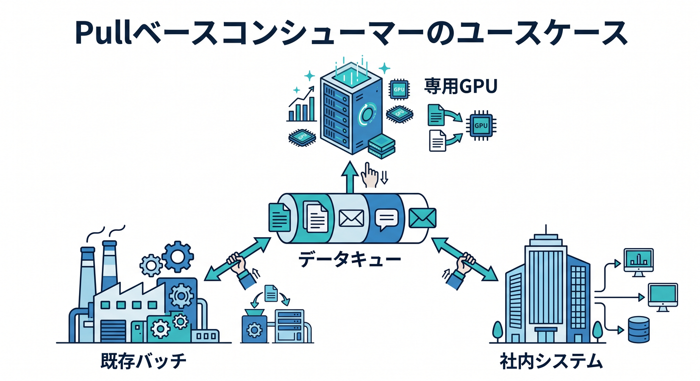
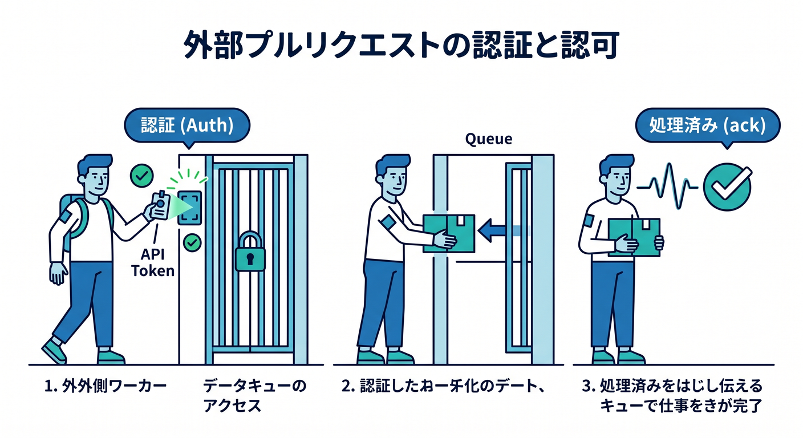
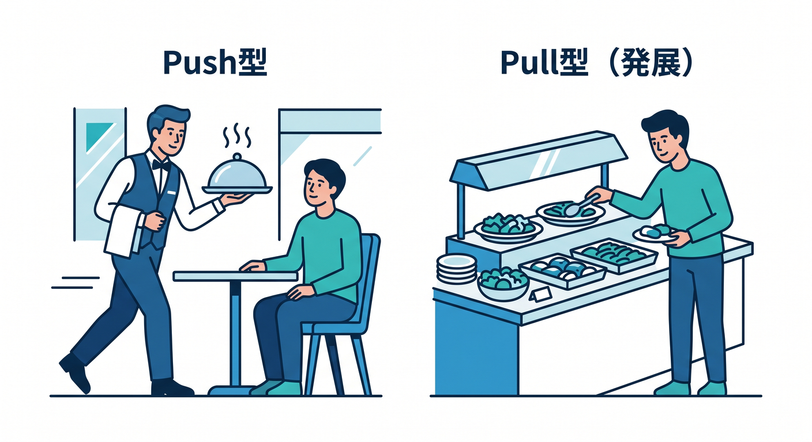

# 第13章：Pull-based Consumerと外部処理を知ろう 🧲

Queuesは、Workers consumerで使うのが最初は分かりやすいです。  
ただし発展として、pull-based consumersという使い方もあります。

---

## 1. push型consumer 📥

これまで見てきたのはpush型です。

```text
Queue
  ↓ Cloudflareが届ける
Consumer Worker
```

Workerの `queue()` handlerへ、Cloudflare側からメッセージが届きます。



---

## 2. pull型consumer 🧲

pull型では、外部のHTTPクライアントがqueueからbatchを取りに行きます。

```text
外部worker / batch server
  ↓ pull
Queue
```



Cloudflare外の処理基盤で重い処理をしたい場合に候補になります。

---

## 3. どんな場面で使う？ 🧭

pull型は、次のような場面で考えます。

- 専用GPUサーバーでAI処理したい
- Cloudflare外の既存バッチ基盤とつなぎたい
- 大きな社内システムへ段階的に連携したい
- Workersだけでは扱いにくいライブラリを使いたい

初心者はまずWorkers consumerから始めれば大丈夫です。



---

## 4. 認証と権限に注意 🔐

外部からqueueをpullする場合、認証や権限管理が重要です。

- API tokenの権限を絞る
- secretを安全に管理する
- 処理済みackを正しく扱う
- 失敗時のretry方針を決める



外へ広げるほど、運用の責任も増えます。

---

## 5. 章末チェック ✅

- push型consumerの基本が分かる
- pull-based consumerの存在を知っている
- 外部処理基盤と連携できる可能性が分かる
- 初心者はWorkers consumerから始めると分かる
- pull型では認証とackが大切だと分かる

この章で覚える一言はこれです。  
**QueuesはWorkerで処理するだけでなく、外部から取りに行く発展形もあります 🧲**


