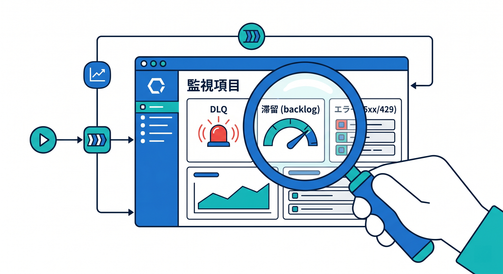
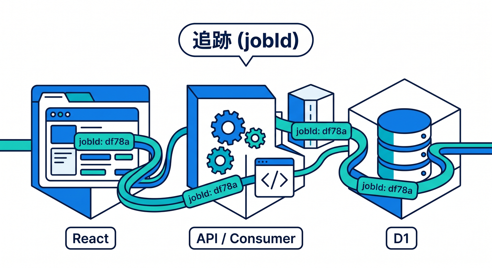
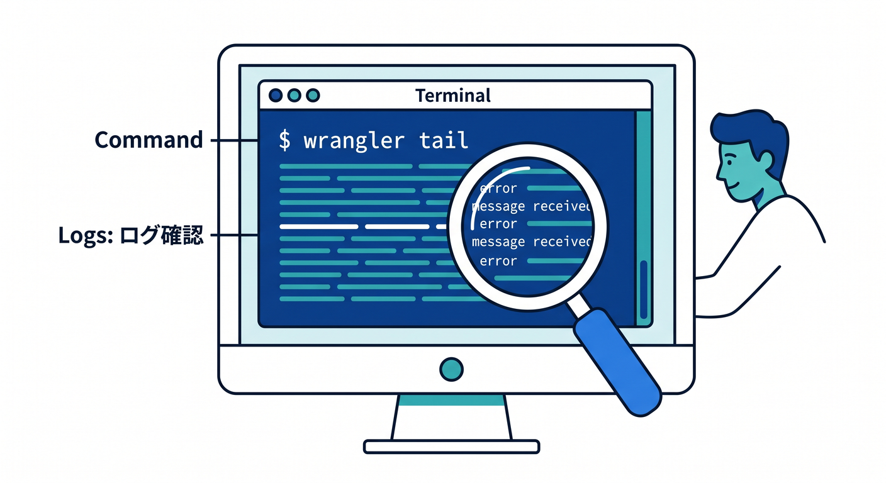
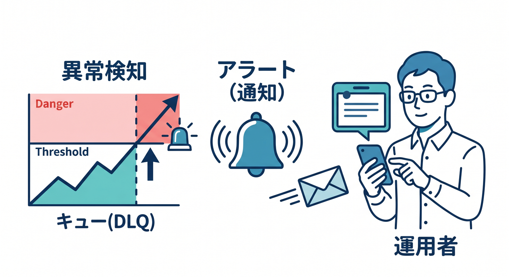
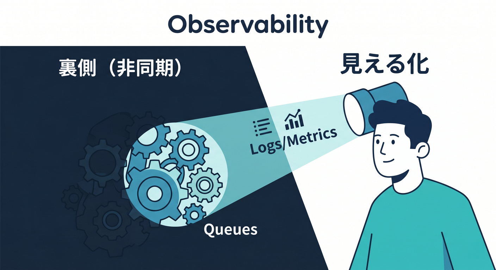

# 第14章：監視・ログ・運用を考えよう 📈

Queuesは裏側で動くので、動いているか見えるようにすることが大切です。  
非同期処理は、失敗に気づけないとあとで困ります。

---

## 1. 見たいもの 👀

Queue運用では、次のような情報を見ます。

- consumerのエラー
- retryが増えていないか
- DLQに溜まっていないか
- 処理時間が長くなっていないか
- queue backlogが増えていないか
- 外部APIの429や5xxが増えていないか

「裏で失敗していた」を避けます。



---

## 2. jobIdで追跡する 🪪

Producerで作ったjobIdをログにも出します。

```ts
console.log("processing job", {
  jobId: job.jobId,
  type: job.type,
});
```



React画面、Worker API、Queue consumer、D1状態をjobIdでつなげると調査しやすいです。

---

## 3. wrangler tailで見る 🧰

開発中は `wrangler tail` が役に立ちます。

```powershell
npx wrangler tail
```

consumerが受け取ったmessageやエラーを確認します。  
本番ではCloudflare dashboardやWorkers Logsも見ます。



---

## 4. アラートの考え方 🚨

本番では、次のような状態を検知したくなります。

```text
DLQが1件以上ある
retryが急に増えた
処理待ちが増え続ける
外部API失敗が多い
```



最初はログを見るだけでもよいですが、運用では通知が必要になります。

---

## 5. 章末チェック ✅

- Queueは見える化が大切だと分かる
- retry、DLQ、backlogを見ると分かる
- jobIdで追跡できると分かる
- `wrangler tail` で開発中のログを見られる
- 本番ではアラートも考えると分かる

この章で覚える一言はこれです。  
**Queueは裏で動くからこそ、ログ・jobId・DLQで見えるようにします 📈**


