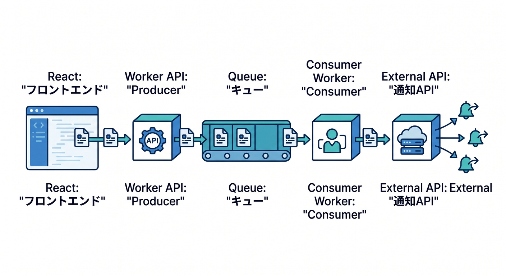
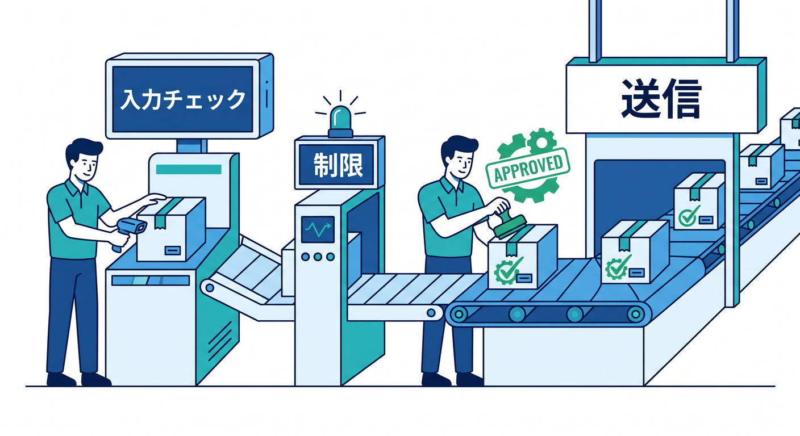
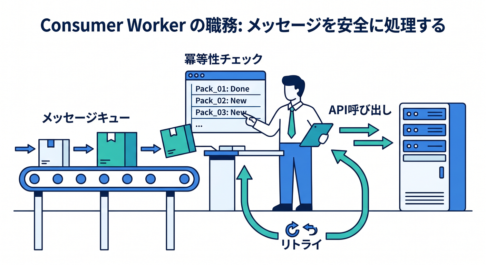
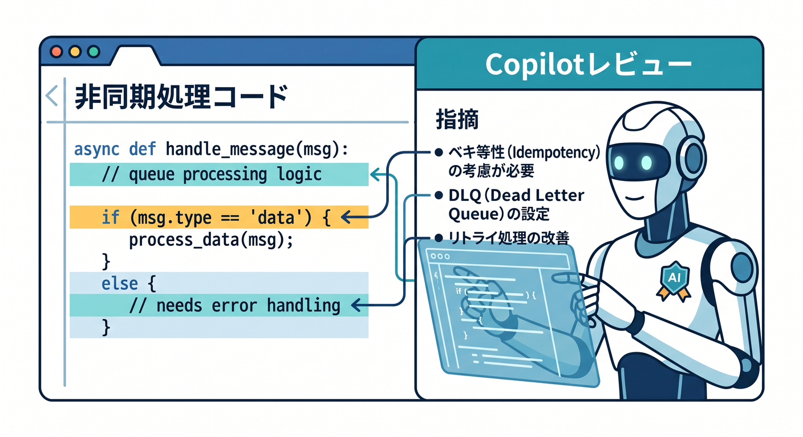
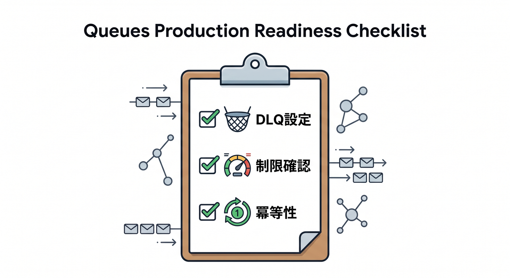
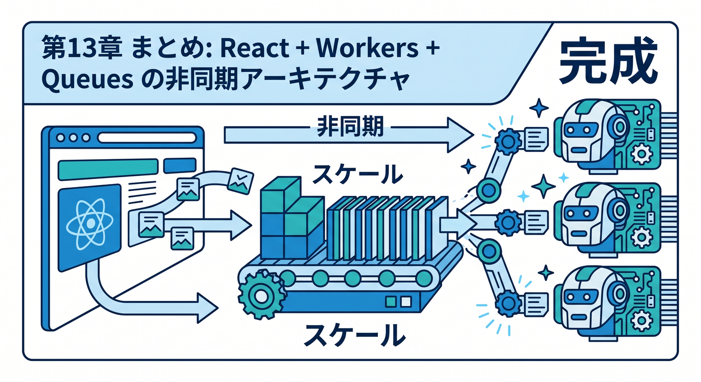

# 第15章：React + Workers + Queuesで通知アプリを完成させよう 🔔

最後は、ここまで学んだ内容を小さな通知アプリにまとめます。  
Reactから通知リクエストを送り、WorkerがQueueへ入れ、consumerがあとで処理する構成です。

---

## 1. 完成イメージ 🧭



全体像はこうです。

```text
React
  ↓ POST /api/notifications
Worker API
  ↓ NOTIFICATION_QUEUE.send()
Queue
  ↓
Consumer Worker
  ↓
通知API / D1 / Logs
```

ユーザーにはすぐ受付完了を返します。

---

## 2. Producerの責任 🚪



Producer Workerでは、次を担当します。

- 認証
- 入力チェック
- Rate Limiting
- jobId作成
- D1へ受付状態保存
- Queueへsend
- `202 Accepted` を返す

外から来るデータは、Producerで必ず整えます。

---

## 3. Consumerの責任 📥



Consumer Workerでは、次を担当します。

- jobIdの冪等性チェック
- 通知API呼び出し
- 成功状態をD1へ保存
- 失敗時はthrowしてretry
- retry上限後はDLQで調査

同じjobが複数回届いても壊れないようにします。

---

## 4. Copilotレビュー例 🤖



実装後、Copilotにこう聞いてレビューできます。

```text
Cloudflare Workers + Queuesで通知処理を非同期化しました。
Producerの入力チェック、Queue messageの内容、consumerのretry、DLQ、冪等性、Secretsの扱いをレビューしてください。
```

Copilotの指摘は参考にしつつ、公式ドキュメントと実際の挙動で確認します。

---

## 5. 本番前チェック ✅



- Queueのlimitsとpricingを確認した
- 外部APIのrate limitを確認した
- DLQを設定した
- jobIdで追跡できる
- secretをmessageへ入れていない
- retryしても二重処理にならない
- ログに個人情報を出しすぎていない

非同期処理は、動くだけでなく失敗時の見え方が大切です。

---

## 6. 章末チェック ✅



- React + Worker + Queue + Consumerの流れを説明できる
- ProducerとConsumerの責任を分けられる
- retry、DLQ、冪等性をセットで考えられる
- Copilotにレビュー依頼できる
- 実務寄りの非同期処理設計をイメージできる

この章で覚える一言はこれです。  
**Queuesを使うと、ユーザーを待たせずに裏側で仕事を進めるアプリを作れます 🔔**
