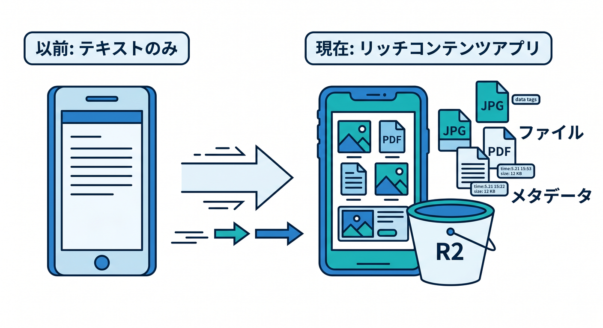
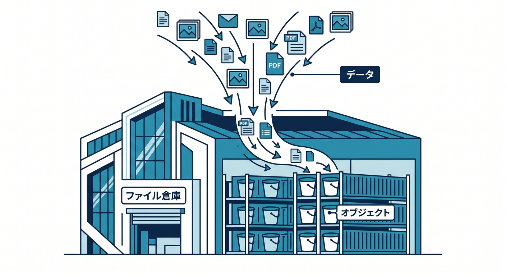
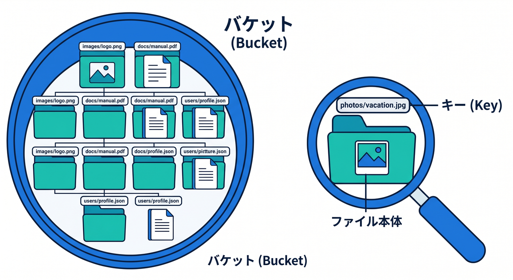
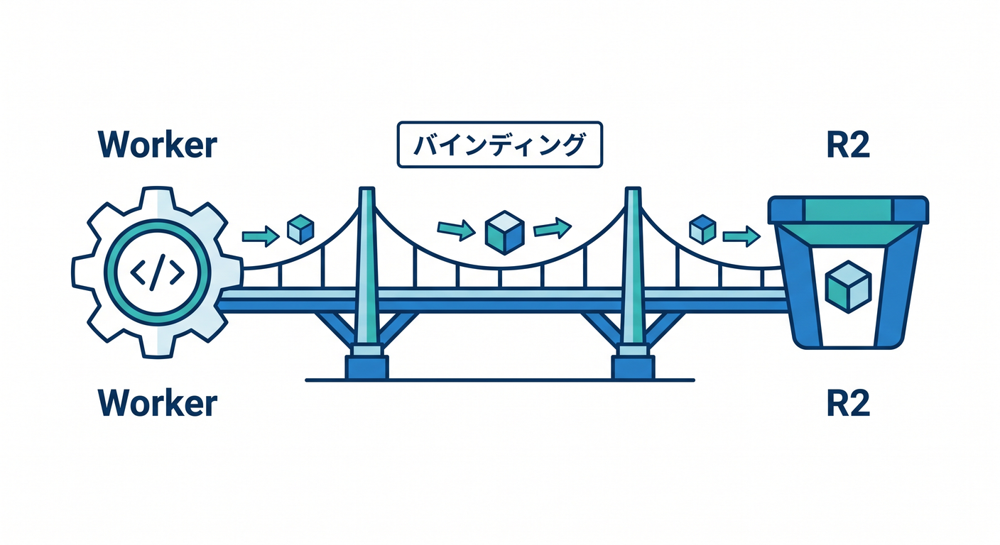
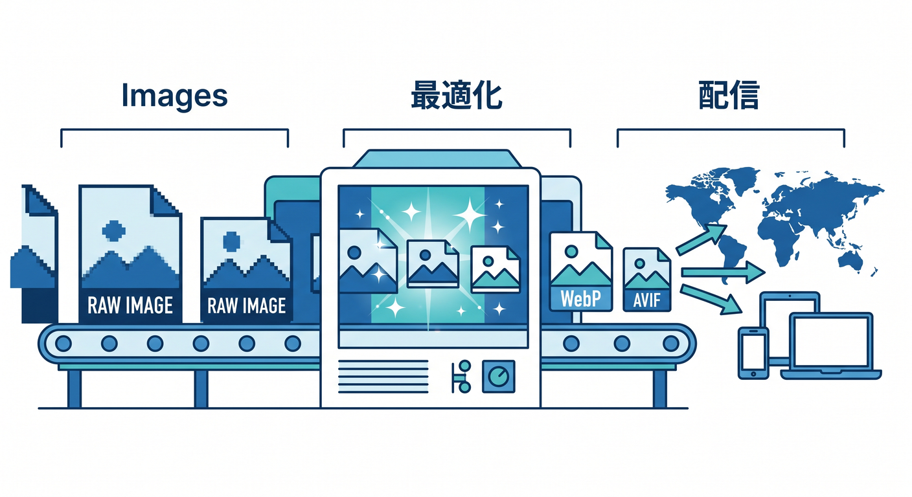
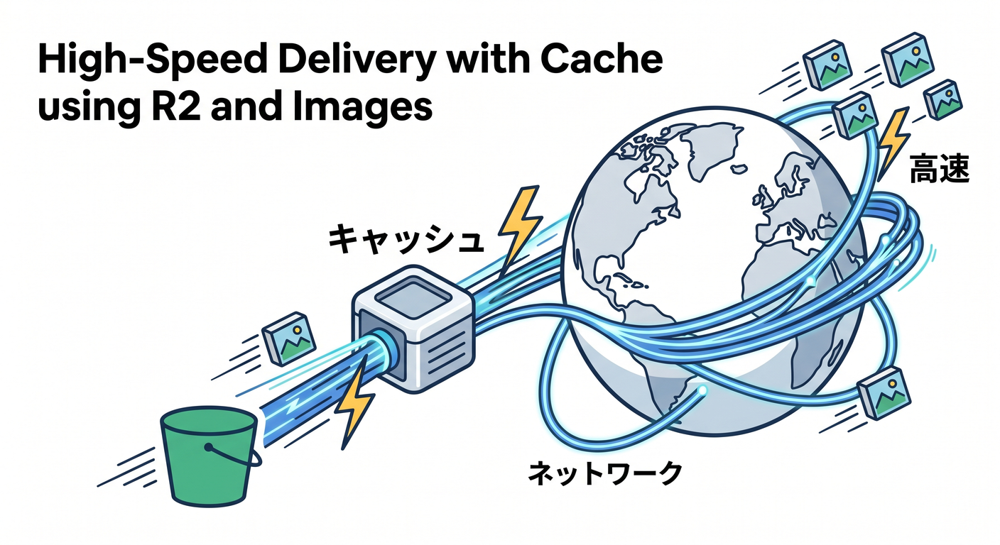

# Cloudflare R2・Imagesでファイルと画像を扱う 15章アウトライン 🖼️🪣✨

確認日: 2026-04-24  
主な確認先: Cloudflare R2 Overview / How R2 works / Public buckets / Upload objects / Workers R2 tutorial / Cloudflare Images Overview / Transform Images / Variants 公式ドキュメント

## 第1章　ファイルを扱えるとアプリの世界が広がる 🖼️

テキストだけのアプリから、画像やPDFを扱えるアプリへ広げます。  
R2は画像、PDF、動画、ログ、AI用データなどを置けるオブジェクトストレージです 🪣  
Cloudflare Imagesは、画像の保存・変換・最適化・配信を扱うサービスです。  
まずは「ファイル本体」と「ファイル情報」を分けて考えます。  
ファイル本体はR2、タイトルや所有者などのメタデータはD1に置く設計も学びます。  
Reactから直接何でもアップロードするのではなく、Workerを入口にします 🔐  
Web制作寄りの人にも実感しやすい、画像ギャラリーを題材にします。  
この章のゴールは、R2とImagesの役割をざっくり説明できることです 🧭

## 第2章　R2はS3互換のオブジェクトストレージ 🪣

R2は、大量の非構造データを保存するためのCloudflareのオブジェクトストレージです。  
公式では、S3-compatibleでegress feesなしのストレージとして案内されています ☁️  
オブジェクトは、キーとファイル本体とメタデータを持つ保存単位です。  
画像やPDF、ユーザーアップロード、AIデータセット、ログなどが候補です。  
R2はSQL検索のための場所ではないので、一覧や検索用メタデータはD1も検討します。  
Workers binding、S3互換API、REST API、Dashboard/Wranglerから扱えます。  
この章では、R2を“ファイル倉庫”として理解します。  
この章のゴールは、R2に置くべきデータの種類を判断できることです ✅

## 第3章　BucketとObject Keyを理解しよう 🗂️

R2では、bucketがファイルを入れる大きな箱です。  
object keyは、bucket内でファイルを識別する名前です 🏷️  
`uploads/2026/04/photo.webp` のように、フォルダ風のkeyを設計できます。  
実際には階層フォルダではなく、key名のprefixとして考えると分かりやすいです。  
ユーザーIDや日付を含めると整理しやすくなります。  
ただし個人情報そのものをkeyへ入れるのは避けます 🔐  
あとで一覧・削除・移行しやすいkey設計を学びます。  
この章のゴールは、安全で管理しやすいR2 object keyを設計できることです 🧭

## 第4章　R2 Bucketを作り、WorkerにBindingしよう 🌉

R2をWorkersから使うには、bucketを作ってbindingします。  
WranglerやCloudflare dashboardでbucketを作成できます 🛠️  
`wrangler.jsonc` の `r2_buckets` にbindingを追加し、Workerでは `env.BUCKET` として使います。  
TypeScriptでは `Env` 型に `BUCKET: R2Bucket` を書きます。  
Reactから直接R2へ自由に触らせるのではなく、Worker APIを通すのが基本です。  
アップロード前にContent-Type、サイズ、拡張子などを確認します 🧪  
この章では、R2へつながる最初の橋を作ります。  
この章のゴールは、WorkerからR2 bucketへアクセスできる準備をすることです ✅

## 第5章　最初のアップロード：putで保存しよう 📤

WorkerからR2へファイルを保存するには、`env.BUCKET.put(key, body)` を使います。  
まずは小さなテキストファイルや画像を保存するところから始めます 📝  
ブラウザから送られたFileやFormDataをWorkerで受け取ります。  
保存時には、Content-TypeなどのHTTP metadataも意識します。  
ファイルサイズ制限、許可する拡張子、画像だけ許可するなどの入力チェックを入れます 🔐  
同じkeyへ保存すると上書きになるため、key生成に注意します。  
保存後はkeyやURL情報をJSONで返します。  
この章のゴールは、R2へ1つのファイルを安全に保存できることです 🚀

## 第6章　ファイルを読む・返す：getで配信しよう 📥

R2に保存したファイルは `env.BUCKET.get(key)` で読み取れます。  
取得できなければ `null` になるため、404を返します 👀  
取得できたら、bodyとContent-Typeを使ってResponseを作ります。  
画像ならブラウザに表示できるように正しいContent-Typeを返します。  
Cache-Controlを付けると、Cloudflare Cacheやブラウザキャッシュとも関係します ⚡  
公開してよいファイルと、認証が必要なファイルを分けます。  
Worker経由配信とpublic bucket配信の違いにも軽く触れます。  
この章のゴールは、R2のファイルをWorker APIから返せることです ✅

## 第7章　削除・一覧・metadataを扱おう 🧹

R2では、不要なobjectを削除したり、prefixで一覧したりできます。  
`delete()`、`list()`、object metadataの考え方を学びます 📋  
画像ギャラリーでは、R2のkey一覧だけで管理するより、D1にメタデータを持つ設計が便利です。  
R2のcustom metadataやHTTP metadataの使い分けも軽く見ます。  
大量ファイルの一覧ではページングやprefix設計が大事になります。  
削除は取り返しにくいので、D1側のメタデータ削除と順番を考えます 🧯  
この章では、R2運用の基本操作を整理します。  
この章のゴールは、保存後の管理操作を理解することです ✅

## 第8章　Public bucket・custom domain・r2.devを理解しよう 🌐

R2 bucketはデフォルトではpublicではありません。  
明示的に公開する方法として、custom domainやCloudflare-managed `r2.dev` URLがあります 🌍  
公式では、`r2.dev` は非本番用途、custom domainはWAF・Cache・access controlsなどを使える導線として案内されています。  
public bucketではrootでbucket一覧を表示できない点も押さえます。  
本番ではcustom domainでCloudflare Cacheを活用する構成が自然です。  
ただし、公開してよいファイルだけを公開します 🔐  
認証が必要なファイルはWorker経由やsigned/presigned URLを検討します。  
この章のゴールは、R2公開方法の違いを説明できることです 🧭

## 第9章　Presigned URLと直接アップロードの考え方 🔑

大きなファイルをアップロードするとき、ブラウザからR2へ直接アップロードしたい場面があります。  
その場合、Workerが一時的なpresigned URLを生成し、ブラウザへ渡す設計があります 🔑  
secretやR2の認証情報をブラウザへ出さず、短時間だけ使えるURLにします。  
公式Upload objectsでも、server-sideでpresigned URLを生成してclientへ渡す流れが案内されています。  
Worker経由アップロードと直接アップロードの違いを整理します。  
サイズ制限、Content-Type、期限、権限を慎重に考えます。  
最初の学習ではWorker経由、発展でpresigned URLと位置づけます。  
この章のゴールは、安全な直接アップロードの発想を理解することです ✅

## 第10章　Cloudflare Imagesの全体像を知ろう 🖼️

Cloudflare Imagesは、画像の保存・変換・最適化・配信を扱うサービスです。  
公式では、Imagesへ画像をアップロードして複数variantを動的配信する方法と、外部画像をtransformする方法が案内されています ✨  
R2は汎用ファイル倉庫、Imagesは画像特化の配信・変換サービスとして分けます。  
画像のリサイズ、WebP/AVIF変換、variant、signed URLなどの考え方を学びます。  
すべてのファイルをImagesに入れるのではなく、画像用途に絞って考えます。  
PDFや任意ファイルはR2、画像最適化はImagesという分担です。  
この章では、R2とImagesの関係を整理します。  
この章のゴールは、Imagesを“画像をいい感じに届ける仕組み”として理解することです 🧠

## 第11章　VariantsとTransformationsで画像を最適化しよう ✂️

Cloudflare Imagesでは、variantやtransformationで画像サイズや形式を調整できます。  
サムネイル、カード画像、ヒーロー画像など、用途ごとに必要なサイズは違います 🖼️  
Imagesでは最大100 variantsを作れる案内があります。  
flexible variantsを有効にすると、URLパラメータで動的変換できる場面があります。  
transformationsは、Images外にある公開画像を最適化する用途にも使えます。  
JPEG、PNG、GIF、WebP、SVG、HEICなどの対応や、SVGはリサイズされない注意点も学びます。  
AVIF/WebPなどの出力形式にも軽く触れます。  
この章のゴールは、画像は“原寸そのまま配る”だけではないと理解することです ⚡

## 第12章　R2 + Images + Cacheで速く見せよう ⚡

画像配信では、保存だけでなく速度も大切です。  
R2のcustom domainではCloudflare Cacheを使ってread requestsを高速化できると公式が案内しています ⚡  
Imagesの変換済み画像もCloudflareのグローバルネットワークで配信されます。  
原本はR2やImagesへ置き、表示用には小さく変換した画像を配る考え方を学びます。  
Cache-Control、public/private、更新反映、Purgeの基本も触れます。  
同じURLで画像を上書きするより、keyやversionを変える方が安全な場面があります。  
Web制作では画像最適化が体感速度に効きやすいです。  
この章のゴールは、保存・変換・キャッシュをセットで考えることです 🚀

## 第13章　画像ギャラリーAPIを作ろう ⚛️

React + Workers + R2で、小さな画像ギャラリーAPIを設計します。  
`POST /images` でアップロード、`GET /images/:key` で表示、`GET /images` で一覧を考えます 🖼️  
R2にファイル本体を置き、D1にタイトル・説明・R2 key・作成日時を保存する構成も紹介します。  
最初はD1なしで簡単に始め、発展でメタデータ管理を足します。  
アップロードサイズ、Content-Type、拡張子、認証、Rate Limitingを確認します 🔐  
React側ではファイル選択、プレビュー、アップロード進捗を扱います。  
CopilotにAPI設計とセキュリティ観点をレビューさせます。  
この章のゴールは、画像付きアプリの基本構成を作れることです 🎉

## 第14章　AIアプリとR2：PDF・画像・データセットを扱う 🤖

AIアプリでは、PDF、画像、CSV、音声などのファイル保存がよく出ます。  
R2は、ユーザーアップロードやAI処理用データ、モデル成果物、ログに向いています 📄  
PDFをR2へ保存し、metadataや処理状態をD1へ置き、Queuesで後処理する構成を学びます。  
Imagesは、画像入力のプレビューやサムネイル最適化に使えます。  
AI処理結果のJSONはD1やR2へ分けて保存します。  
秘密情報はSecrets、ファイルはR2、履歴はD1、後処理はQueuesという地図を再確認します 🗺️  
大きなファイルや個人情報を含むファイルの公開範囲にも注意します。  
この章のゴールは、AIアプリでR2を安全に組み込む判断ができることです ✅

## 第15章　総仕上げ：R2 + Imagesで作品を公開しよう 🏁

最後に、画像アップロードつきミニ作品を設計します。  
React画面、Workers API、R2 bucket、Cloudflare Imagesの変換、必要に応じてD1を組み合わせます 🧩  
アップロード、保存、表示、サムネイル、削除、公開URL確認までを通します。  
public bucketにするか、Worker経由にするか、presigned URLを使うかを理由つきで選びます。  
画像最適化、Cache、Content-Type、key設計、権限、ログをチェックします。  
Copilotに最終レビューを頼み、公式ドキュメントで重要点を確認します 🤖  
R2とImagesを使えると、Cloudflareアプリの表現力が一気に広がります。  
この章のゴールは、ファイルと画像を扱うCloudflareアプリを自分で設計できることです 🎉

## 参照URL 🔗

- Cloudflare R2 Overview: https://developers.cloudflare.com/r2/
- How R2 works: https://developers.cloudflare.com/r2/how-r2-works/
- Create R2 buckets: https://developers.cloudflare.com/r2/buckets/create-buckets/
- Upload objects to R2: https://developers.cloudflare.com/r2/objects/upload-objects/
- Public buckets: https://developers.cloudflare.com/r2/data-access/public-buckets/
- Securely access and upload assets with R2: https://developers.cloudflare.com/workers/tutorials/upload-assets-with-r2
- Cloudflare Images Overview: https://developers.cloudflare.com/images/
- Cloudflare Images get started: https://developers.cloudflare.com/images/get-started/
- Cloudflare Images key concepts: https://developers.cloudflare.com/images/get-started/key-concepts/
- Transform images: https://developers.cloudflare.com/images/transform-images/
- Enable flexible variants: https://developers.cloudflare.com/images/manage-images/enable-flexible-variants/
- Cloudflare Images pricing: https://developers.cloudflare.com/images/pricing/

