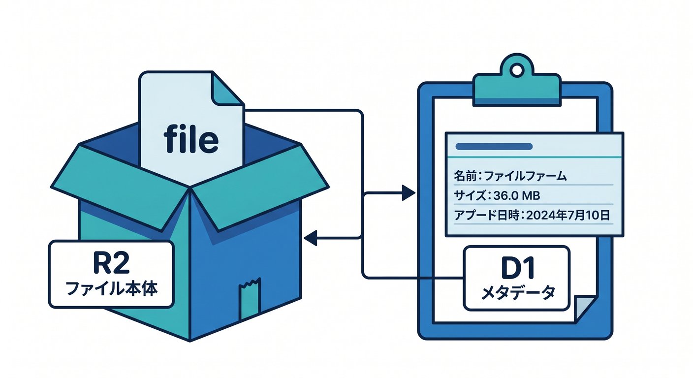
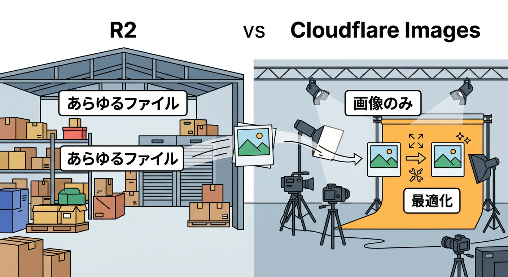
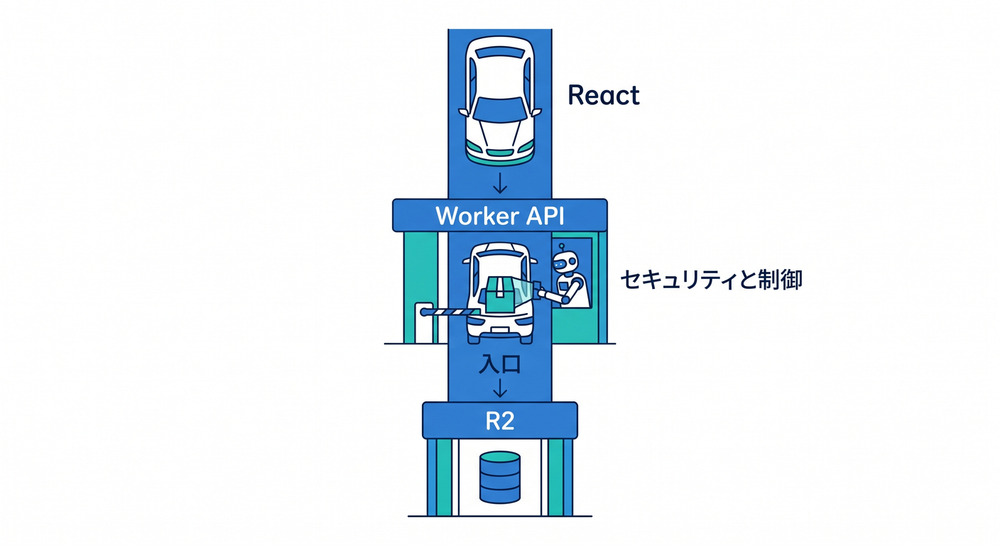

# 第01章：ファイルを扱えるとアプリの世界が広がる 🖼️🪣

これまでのアプリは、文字やJSONを扱うことが多かったかもしれません。  
でも、画像、PDF、音声、CSVなどを扱えるようになると、作れるものが一気に広がります。  
この章では、R2とCloudflare Imagesの役割をざっくり理解します 😊

---

## 1. テキストだけでは足りない場面 📝


実際のアプリでは、ファイルを扱いたいことがよくあります。

- プロフィール画像
- 商品画像
- PDF資料
- ユーザー投稿画像
- AI処理用のファイル
- CSVやログ

こうしたファイル本体を保存する場所として、R2が候補になります。

---

## 2. R2はファイル倉庫 🪣



R2は、画像やPDFなどのファイルを置くオブジェクトストレージです。  
Cloudflare公式では、R2はS3-compatibleでegress feesなしのオブジェクトストレージとして案内されています。

SQLの表データを入れるD1とは役割が違います。

```text
ファイル本体 → R2
ファイル名・説明・所有者 → D1
```

この分け方を覚えると、設計がかなり楽になります。

---

## 3. Cloudflare Imagesは画像特化 🖼️



Cloudflare Imagesは、画像を保存・変換・最適化・配信するためのサービスです。  
画像サイズを変えたり、WebPやAVIFのような形式で届けたりする考え方が出てきます。

R2が汎用ファイル倉庫なら、Imagesは画像をきれいに速く届ける専門サービスです。

PDFや任意ファイルはR2。  
画像の最適化や変換はImages。  
この分担で見ます。

---

## 4. Workerを入口にする 🔐



ReactからR2へ何でも直接触らせるのではなく、まずはWorker APIを入口にします。

```text
React画面
  ↓ upload
Workers API
  ↓ env.BUCKET
R2
```

Workerを通すと、ファイルサイズ、Content-Type、認証、ログ、Rate Limitingを入れやすくなります。

---

## 5. 章末チェック ✅


- R2はファイル本体の置き場だと分かる
- Cloudflare Imagesは画像の保存・変換・配信に向くと分かる
- ファイル本体とメタデータを分けて考えられる
- Reactから直接R2へ何でも触らせないと分かる
- ファイルを扱えるとアプリの幅が広がると分かる

この章で覚える一言はこれです。  
**R2はファイル倉庫、Imagesは画像をいい感じに届ける仕組みです 🖼️🪣**

