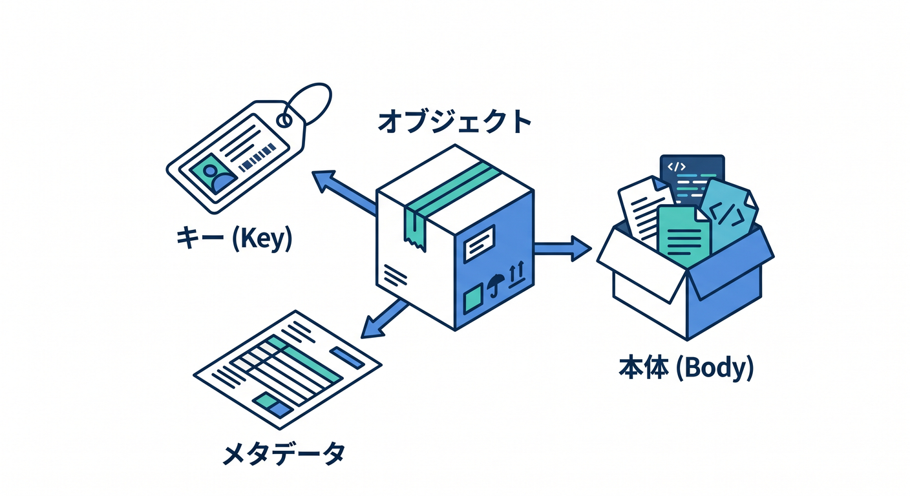
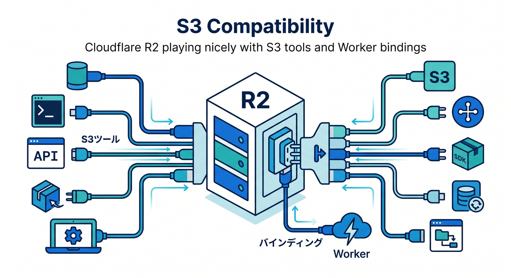
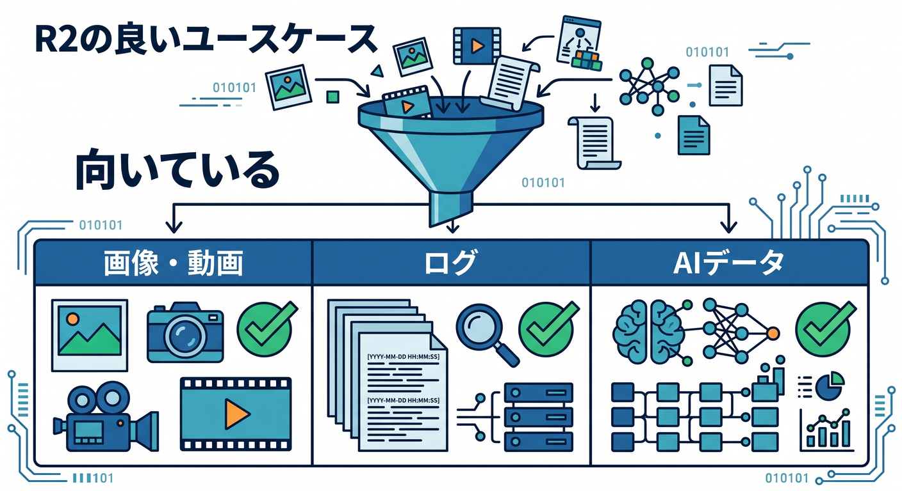
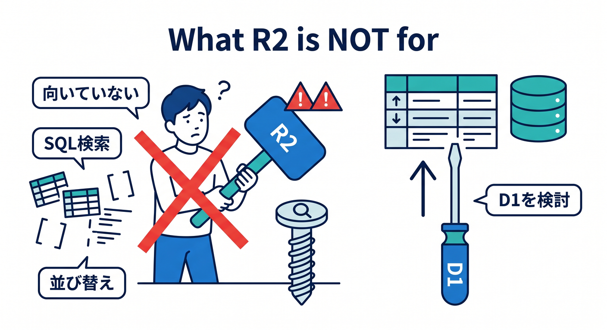
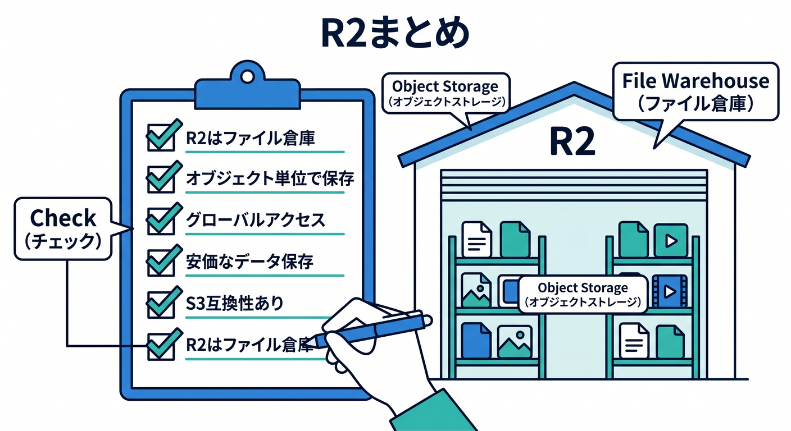

# 第02章：R2はS3互換のオブジェクトストレージ 🪣☁️

R2は、Cloudflareのオブジェクトストレージです。  
画像やPDFなど、表ではなくファイルとして扱いたいものを置く場所です。  
この章では、R2を“ファイル倉庫”として理解します 😊

---

## 1. オブジェクトストレージとは 📦

オブジェクトストレージでは、ファイルのようなデータをobjectとして保存します。

objectには主に次があります。

- key
- body
- metadata
- Content-TypeなどのHTTP metadata

たとえば、`uploads/photo.webp` というkeyで画像を保存できます。

---

## 2. S3互換とは 🧰

R2はS3-compatible APIをサポートしています。  
つまり、S3向けのツールやライブラリとつなげやすい設計です。

初心者のうちは、S3互換APIを深く扱わなくても大丈夫です。  
まずはWorkers bindingでR2を使うところから始めます。

---

## 3. R2が向いているもの ✅

R2が向いているものです。

- 画像
- PDF
- 動画
- 音声
- ユーザーアップロード
- AI用データセット
- ログファイル
- バッチ処理の出力

Cloudflare公式でも、web assets、machine learning datasets、user-generated contentなどが例として案内されています。

---

## 4. R2が向かないもの ⚠️

R2はSQL検索のための場所ではありません。

向かないものです。

- ユーザー一覧を条件検索したい
- 注文履歴を日付順に並べたい
- タグでメモを検索したい
- 件数を集計したい

こうしたものはD1を検討します。

---

## 5. 章末チェック ✅

- R2はオブジェクトストレージだと分かる
- objectにはkeyやbodyがあると分かる
- S3互換という位置づけが分かる
- 画像やPDFはR2に向くと分かる
- SQL検索したいデータはD1を考えると分かる

この章で覚える一言はこれです。  
**R2は、ファイル本体を置くためのCloudflareの倉庫です 🪣**

