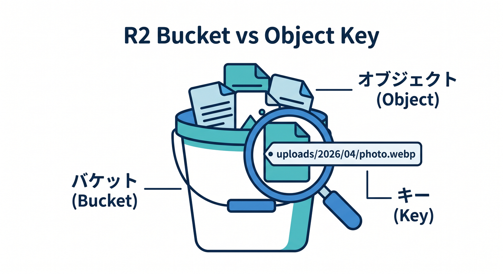
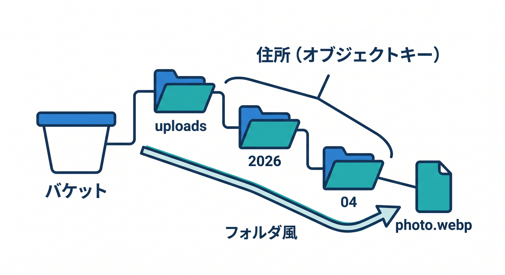
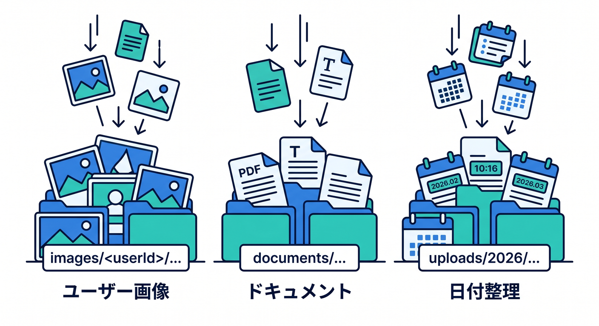
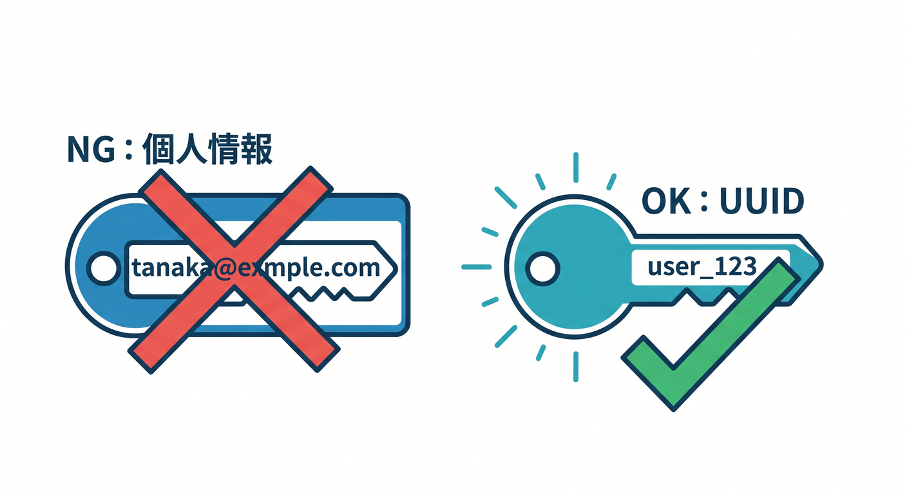
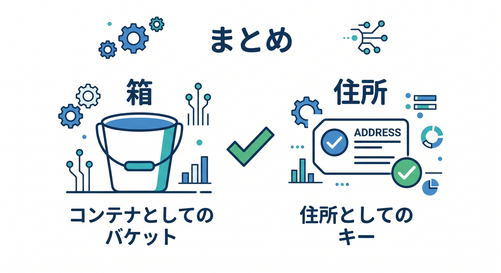

# 第03章：BucketとObject Keyを理解しよう 🗂️🏷️

R2では、bucketとobject keyがよく出てきます。  
bucketはファイルを入れる大きな箱、object keyはその中のファイル名のようなものです。  
この章では、あとで困らないkey設計を学びます 😊

---

## 1. Bucketは大きな箱 🪣



R2 bucketは、objectを入れる箱です。

例です。

```text
profile-images
user-uploads
ai-documents
site-assets
```

用途ごとにbucketを分けると管理しやすいことがあります。

---

## 2. Object keyは住所 🏷️



object keyは、bucketの中でobjectを識別する名前です。

例です。

```text
uploads/2026/04/photo.webp
users/123/avatar.png
documents/report.pdf
```

フォルダのように見えますが、実際にはkeyの文字列です。  
`uploads/` のようなprefixで整理します。

---

## 3. key設計の例 🧭



画像アップロードなら、次のようにできます。

```text
images/<userId>/<uuid>.webp
```

PDFならこうです。

```text
documents/<userId>/<uuid>.pdf
```

日付で分けるならこうです。

```text
uploads/2026/04/<uuid>.jpg
```

後で一覧・削除・移行しやすい形にします。

---

## 4. 個人情報をkeyに入れない 🔐



避けたい例です。

```text
uploads/tanaka@example.com/profile.png
```

メールアドレスのような個人情報をkeyに入れるのは避けます。  
内部IDやUUIDを使いましょう。

```text
uploads/user_123/profile.png
```

keyはログやURLに出る可能性があります。

---

## 5. 章末チェック ✅



- bucketはobjectを入れる箱だと分かる
- object keyはobjectの住所だと分かる
- prefixで整理する考え方が分かる
- keyに個人情報を入れないと分かる
- 管理しやすいkey設計を考えられる

この章で覚える一言はこれです。  
**R2では、bucketは箱、object keyはファイルの住所です 🗂️🏷️**

