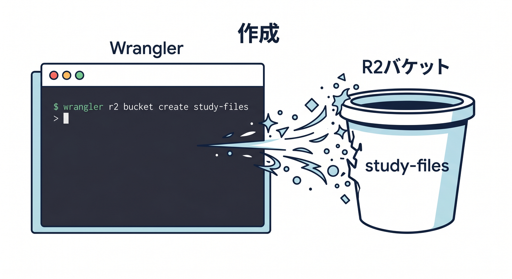
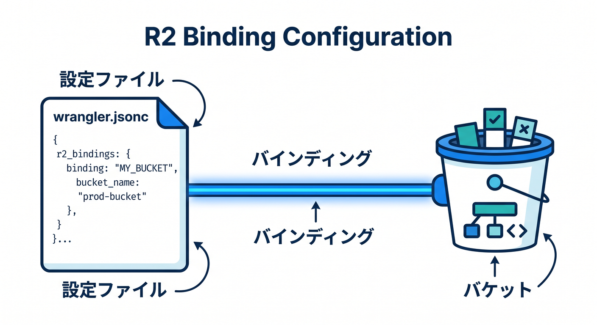
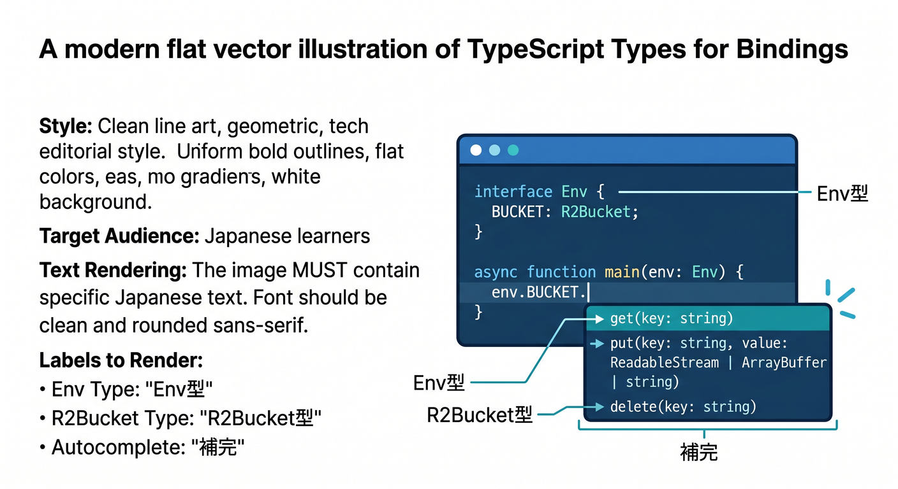
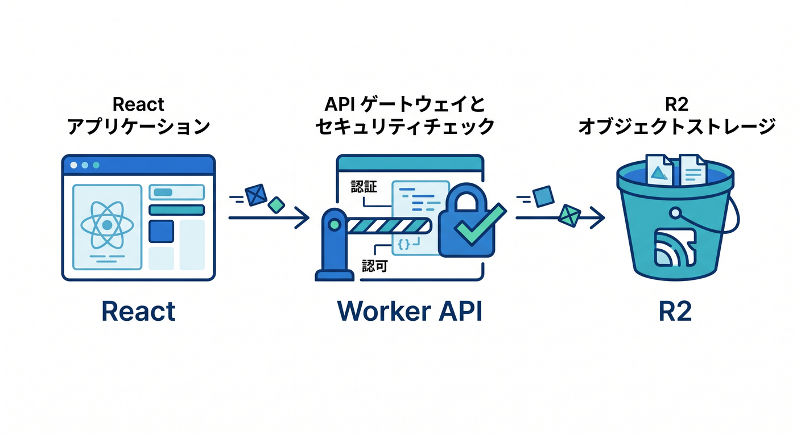
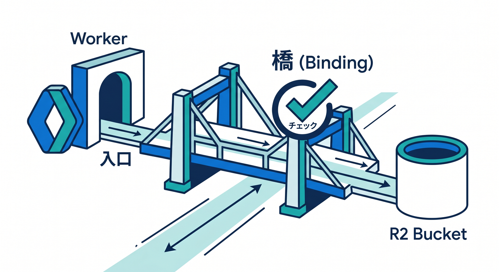

# 第04章：R2 Bucketを作り、WorkerにBindingしよう 🌉🪣

R2をWorkersから使うには、bucketを作ってbindingします。  
bindingは、WorkerからR2 bucketへアクセスするための橋です。  
この章では、`wrangler.jsonc` とTypeScriptの準備を見ます 😊

---

## 1. R2 bucketを作る 🪣



R2 bucketは、Cloudflare dashboardやWranglerで作れます。

Wranglerの例です。

```powershell
npx wrangler r2 bucket create study-files
```

作成したbucketをWorkerにbindingします。

---

## 2. `wrangler.jsonc` にbindingを書く 🧾



```jsonc
{
  "r2_buckets": [
    {
      "binding": "BUCKET",
      "bucket_name": "study-files"
    }
  ]
}
```

ここで `BUCKET` がWorkerコードの `env.BUCKET` になります。

---

## 3. TypeScriptのEnv型を書く ✍️



```ts
export interface Env {
  BUCKET: R2Bucket;
}

export default {
  async fetch(request: Request, env: Env): Promise<Response> {
    return Response.json({ ok: true });
  },
};
```

型を書いておくと、`env.BUCKET.put()` や `get()` の補完が効きやすくなります。

---

## 4. Reactから直接R2へ触らせない 🔐



最初はWorker APIを入口にします。

```text
React
  ↓ fetch
Worker
  ↓ env.BUCKET
R2
```

Workerで、ファイルサイズ、Content-Type、認証、ログを確認できます。

---

## 5. 章末チェック ✅



- R2 bucketを作る流れが分かる
- `r2_buckets` bindingを書ける
- Workerの `env.BUCKET` からR2を使うと分かる
- TypeScriptの `R2Bucket` 型を使える
- Workerを入口にする意味が分かる

この章で覚える一言はこれです。  
**R2はbucketを作り、bindingでWorkerにつないで使います 🌉🪣**

