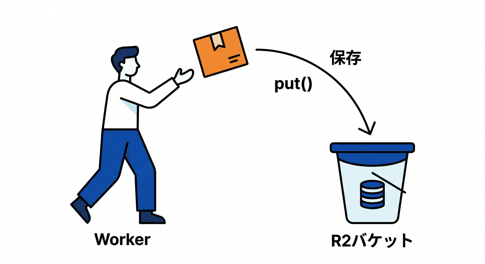

# 第05章：最初のアップロード：putで保存しよう 📤🖼️

R2へファイルを保存するには、Workerから `put()` を使います。  
この章では、ブラウザから送られたファイルをWorkerで受け取り、R2へ保存する流れを学びます 😊

---

## 1. `put()` の基本 📦



```ts
await env.BUCKET.put(key, body);
```

`key` はR2内での名前です。  
`body` は保存するファイル本体です。

画像なら、keyは次のようにできます。

```text
images/user_123/photo.webp
```

---

## 2. FormDataで受け取る 🧑‍💻


ブラウザから `multipart/form-data` で送る場合、Workerでは次のように受け取れます。

```ts
const form = await request.formData();
const file = form.get("file");

if (!(file instanceof File)) {
  return new Response("Missing file", { status: 400 });
}
```

まず、ファイルが本当にあるか確認します。

---

## 3. Content-Typeを確認する 🔍


画像だけ許可したいなら、Content-Typeを確認します。

```ts
if (!file.type.startsWith("image/")) {
  return new Response("Only images are allowed", { status: 400 });
}
```

ファイルサイズも確認します。

```ts
if (file.size > 5 * 1024 * 1024) {
  return new Response("File too large", { status: 400 });
}
```

---

## 4. R2へ保存する 🚀


```ts
const key = `images/${crypto.randomUUID()}`;

await env.BUCKET.put(key, file.stream(), {
  httpMetadata: {
    contentType: file.type,
  },
});

return Response.json({ key });
```

Content-Typeを保存しておくと、あとで配信するときに便利です。

---

## 5. 章末チェック ✅


- `env.BUCKET.put()` で保存できる
- FormDataからFileを取り出せる
- Content-Typeとサイズを確認できる
- keyを生成して保存できる
- 保存後にkeyをJSONで返せる

この章で覚える一言はこれです。  
**R2アップロードでは、保存前にファイルの種類とサイズを必ず確認しよう 📤🔐**

