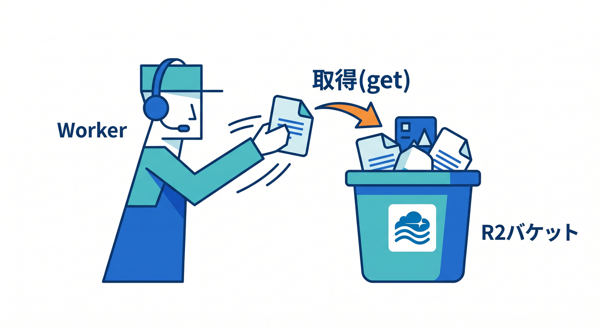
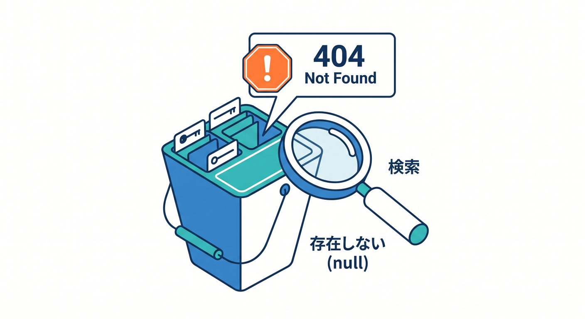
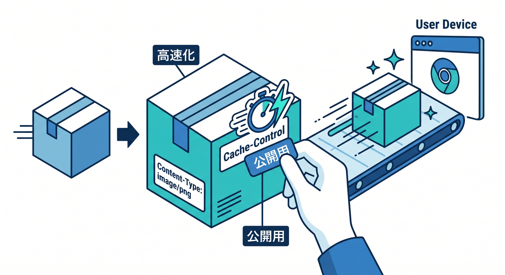
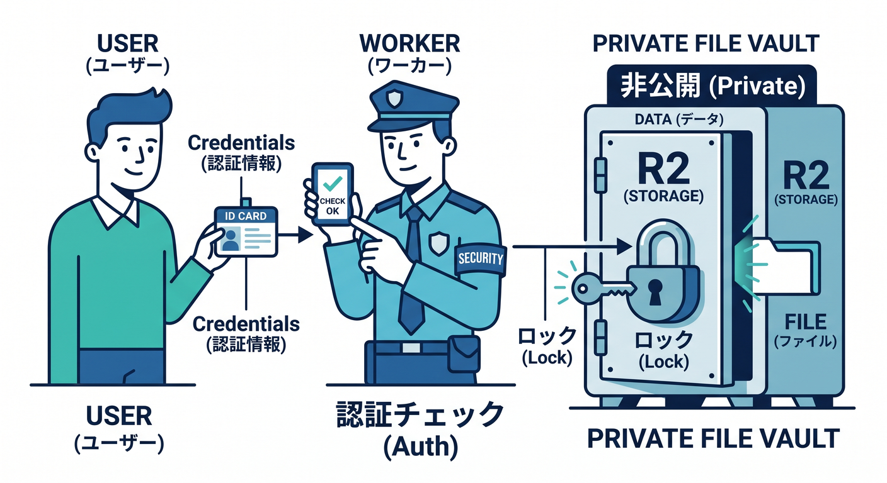
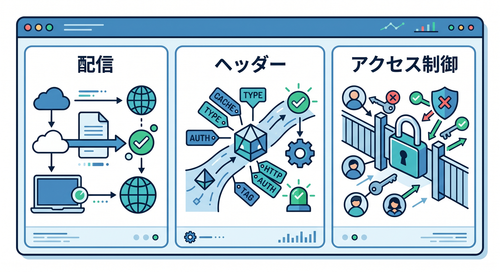

# 第06章：ファイルを読む・返す：getで配信しよう 📥👀

R2へ保存したファイルは、Workerから読み取ってブラウザへ返せます。  
この章では、`get()` を使って画像を返す基本を学びます 😊

---

## 1. `get()` の基本 📥



```ts
const object = await env.BUCKET.get(key);
```

keyに対応するobjectがあれば取得できます。  
存在しない場合は `null` です。

```ts
if (object === null) {
  return new Response("Not found", { status: 404 });
}
```



---

## 2. Responseとして返す 🖼️


```ts
return new Response(object.body, {
  headers: {
    "Content-Type": object.httpMetadata?.contentType ?? "application/octet-stream",
  },
});
```

画像なら正しいContent-Typeを返すことで、ブラウザで表示しやすくなります。

---

## 3. Cache-Controlを付ける ⚡



公開画像なら、キャッシュヘッダーを付けることがあります。

```ts
return new Response(object.body, {
  headers: {
    "Content-Type": object.httpMetadata?.contentType ?? "application/octet-stream",
    "Cache-Control": "public, max-age=3600",
  },
});
```

ただし、非公開ファイルや頻繁に更新するファイルでは慎重に考えます。

---

## 4. 認証が必要なファイル 🔐



すべてのファイルを公開してよいとは限りません。

例です。

- ユーザーの本人確認書類
- 非公開PDF
- 管理者向け資料
- 個人のアップロード画像

こうしたファイルは、Workerで認証や権限チェックをしてから返します。

---

## 5. 章末チェック ✅



- `env.BUCKET.get()` でobjectを取得できる
- 存在しないobjectを404にできる
- Content-Typeを付けて返せる
- Cache-Controlの考え方が分かる
- 公開ファイルと非公開ファイルを分けられる

この章で覚える一言はこれです。  
**R2のファイル配信では、Content-Typeと公開範囲を必ず意識しよう 📥🔐**

