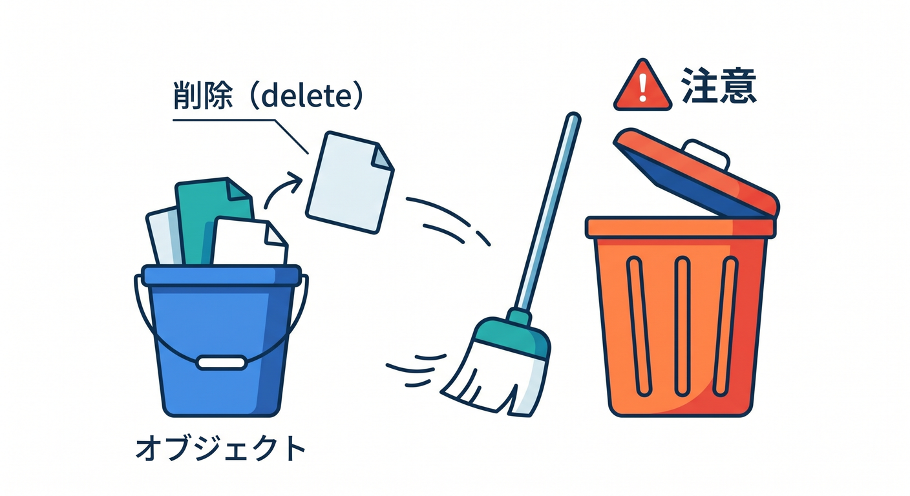
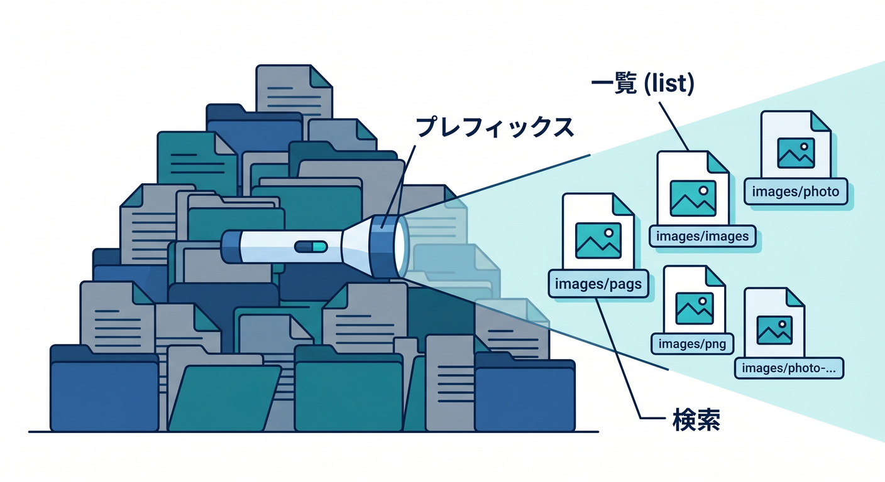
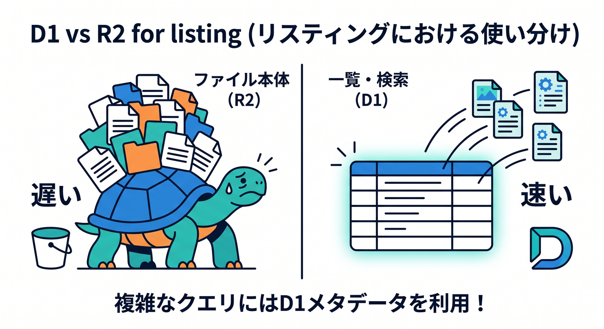
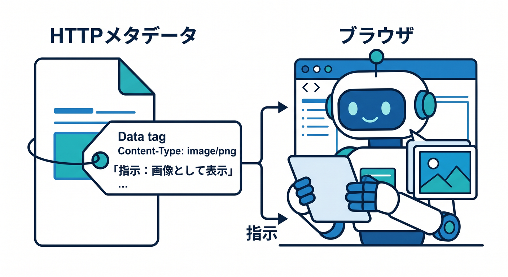
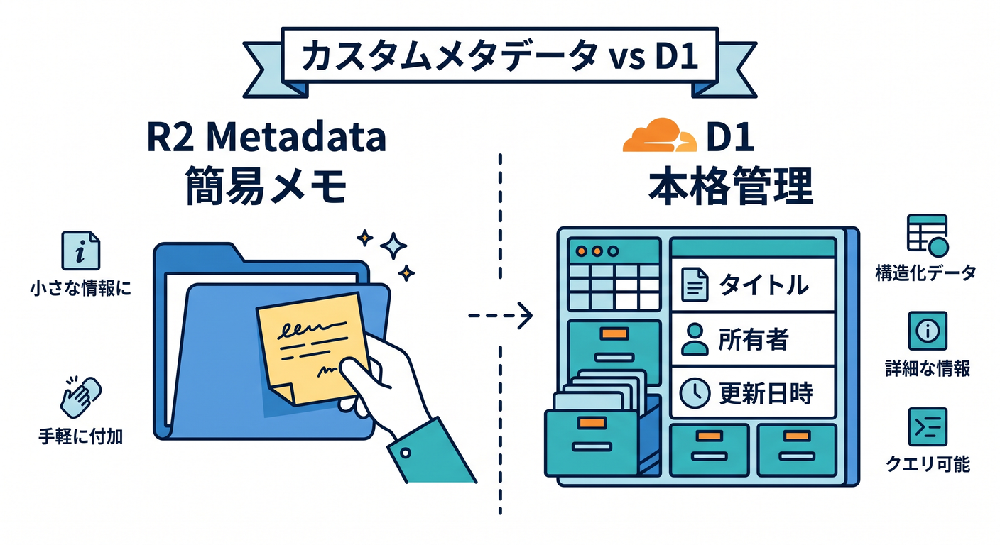
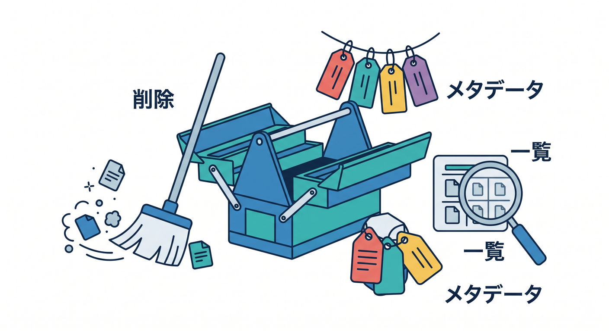

# 第07章：削除・一覧・metadataを扱おう 🧹📋

R2に保存したファイルは、あとで削除したり、一覧したりできます。  
また、Content-Typeなどのmetadataも重要です。  
この章では、保存後の管理操作を見ます 😊

---

## 1. deleteで削除する 🧹



```ts
await env.BUCKET.delete(key);
```

削除は強い操作です。  
本当に消してよいファイルか、権限チェックを入れましょう。

画像ギャラリーなら、D1側のメタデータも一緒にどう扱うか考えます。

---

## 2. listで一覧する 📋



```ts
const list = await env.BUCKET.list({
  prefix: "images/",
});
```

prefixを使うと、特定の種類のobjectを探しやすくなります。

ただし、大量ファイルの一覧や検索をR2だけで全部やるのは大変です。  
一覧UIにはD1のメタデータを使う設計も自然です。



---

## 3. HTTP metadata 🧾



R2 objectにはHTTP metadataを付けられます。

例です。

- Content-Type
- Cache-Control
- Content-Disposition

画像をブラウザで表示したいなら、Content-Typeが大切です。

---

## 4. custom metadata 📎



R2にはcustom metadataも使えます。  
ただし、タイトル、説明、所有者、作成日時などを本格的に管理するならD1に置く方が扱いやすいです。

R2はファイル本体。  
D1はファイル情報。  
この分担を忘れないようにしましょう。

---

## 5. 章末チェック ✅



- `delete()` でobjectを削除できる
- `list()` とprefixの考え方が分かる
- HTTP metadataの役割が分かる
- custom metadataとD1メタデータの違いが分かる
- 削除時に権限やD1側との整合性を考えられる

この章で覚える一言はこれです。  
**R2は保存して終わりではなく、削除・一覧・metadata管理まで考えます 🧹📋**

