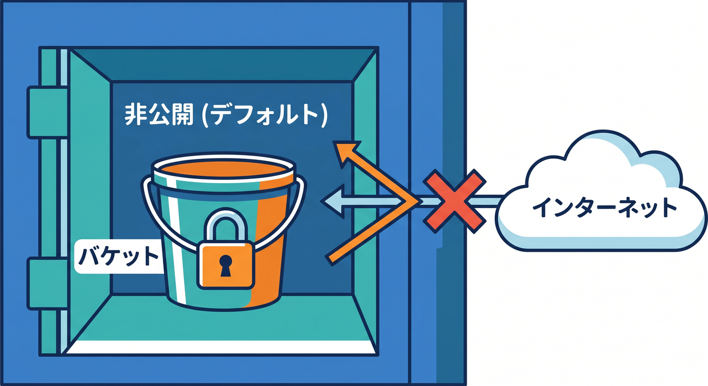
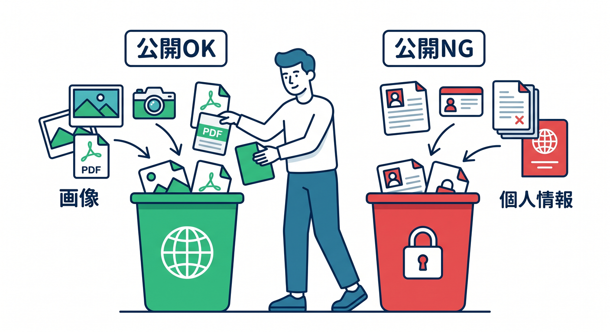
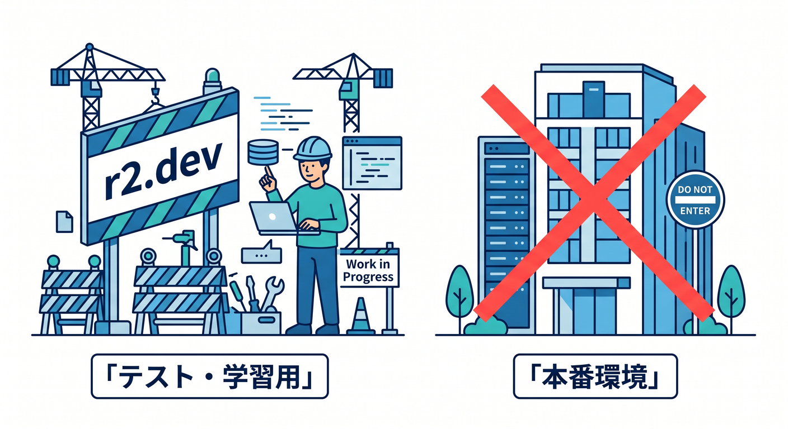
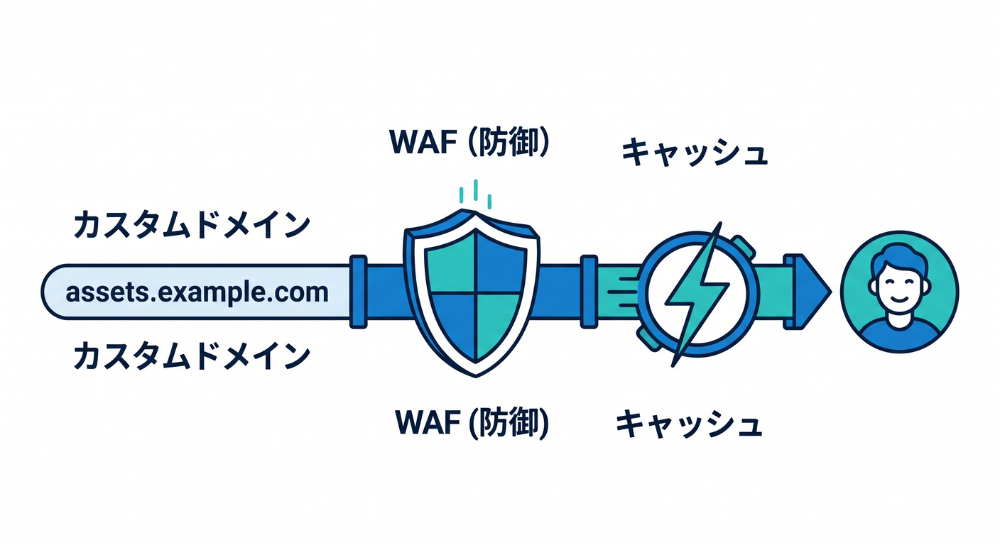
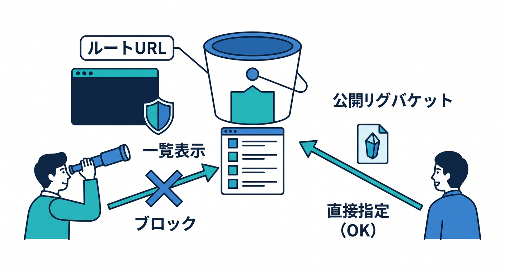
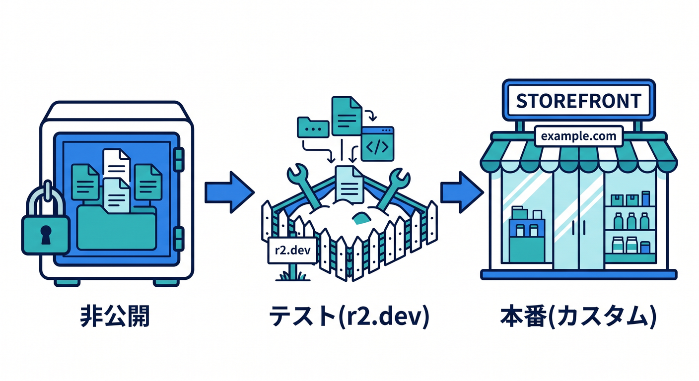

# 第08章：Public bucket・custom domain・r2.devを理解しよう 🌐🪣

R2 bucketは、デフォルトでは公開されません。  
公開したい場合は、明示的に設定します。  
この章では、public bucket、custom domain、`r2.dev` の違いを整理します 😊

---

## 1. R2 bucketは最初は非公開 🔐



R2 bucketの中身は、最初からインターネットへ公開されるわけではありません。  
これは安全のために大事です。

公開してよい画像やPDFだけを公開します。  
個人情報や非公開資料をpublicにしないよう注意します。



---

## 2. `r2.dev` は非本番向け 🌱



Cloudflare-managed `r2.dev` subdomainでbucketを公開できます。  
公式では、`r2.dev` はnon-production use cases向けとして案内されています。

学習や確認には便利ですが、本番ではcustom domainを検討します。

---

## 3. custom domainで公開する 🌍



R2 bucketを自分のドメインに紐づけて公開できます。

例です。

```text
https://assets.example.com/images/photo.webp
```

custom domainを使うと、Cloudflare Cache、WAF custom rules、access controls、bot managementなどを組み合わせやすくなります。

---

## 4. bucket rootで一覧は出ない 📋



公式ドキュメントでは、public bucketsはrootでbucket contentsを一覧表示しないと案内されています。

つまり、`https://assets.example.com/` を開いてbucket内の全部が見える、というものではありません。

公開URLは、object keyを含めて指定します。

---

## 5. 章末チェック ✅



- R2 bucketはデフォルト非公開だと分かる
- `r2.dev` は非本番向けと分かる
- custom domain公開のメリットが分かる
- public bucket rootで一覧が出ないと分かる
- 公開してよいファイルだけを公開すると分かる

この章で覚える一言はこれです。  
**R2公開は明示的に。学習はr2.dev、本番はcustom domainを検討しよう 🌐**

