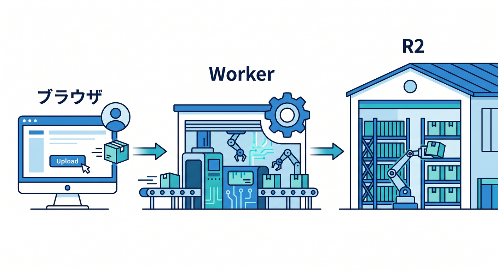
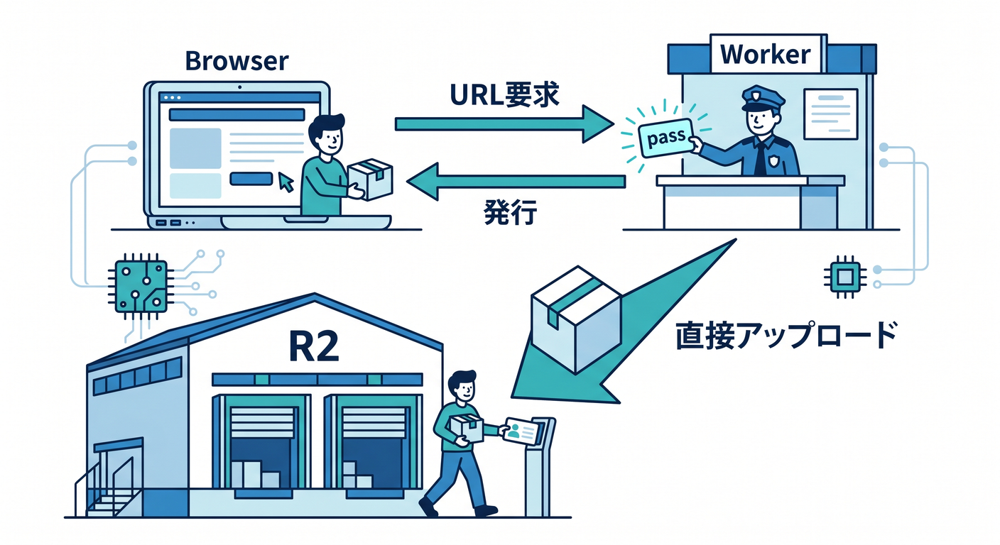
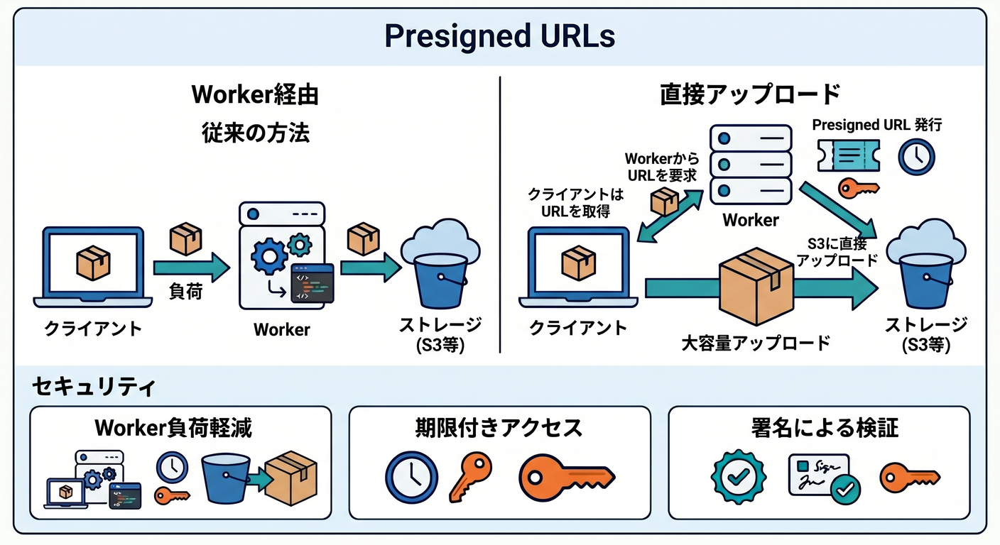

# 第09章：Presigned URLと直接アップロードの考え方 🔑📤

大きなファイルを扱うとき、Worker経由で全部アップロードするより、ブラウザからR2へ直接送る設計が便利なことがあります。  
そのときに出てくるのがpresigned URLです。  
この章では、直接アップロードの考え方だけをやさしく整理します 😊

---

## 1. Worker経由アップロード 📤

最初に学ぶ形はこれです。

```text
React
  ↓ file
Worker
  ↓ put()
R2
```

Workerでファイルを受け取り、チェックしてR2へ保存します。  
学習には分かりやすいです。



ただし、大きなファイルではWorkerを通す負荷や制限を考える必要があります。

---

## 2. 直接アップロードの流れ 🌉

presigned URLを使うと、流れはこうなります。

```text
React
  ↓ presigned URLください
Worker
  ↓ 短時間だけ有効なURLを発行
React
  ↓ そのURLへ直接アップロード
R2
```

Workerは認証とURL発行を担当します。  
ファイル本体はブラウザからR2へ直接送ります。



---

## 3. secretをブラウザに出さない 🔐

重要なのは、R2の認証情報をブラウザへ出さないことです。  
ブラウザには、一時的に使えるpresigned URLだけを渡します。

URLには期限や対象objectの情報が含まれます。  
短時間だけ使えるようにすることで、リスクを小さくします。


---

## 4. 最初はWorker経由でOK 🌱

初心者は、まずWorker経由アップロードで十分です。  
R2のbinding、Content-Type、サイズチェック、key設計を理解してから、presigned URLへ進む方が自然です。

直接アップロードは発展編として扱います。


---

## 5. 章末チェック ✅



- Worker経由アップロードの流れが分かる
- presigned URLの基本的な流れが分かる
- secretをブラウザに出さない理由が分かる
- 大きなファイルでは直接アップロードを検討すると分かる
- 最初はWorker経由で学べばよいと分かる

この章で覚える一言はこれです。  
**presigned URLは、秘密を出さずに一時的な直接アップロードを許可する仕組みです 🔑**

