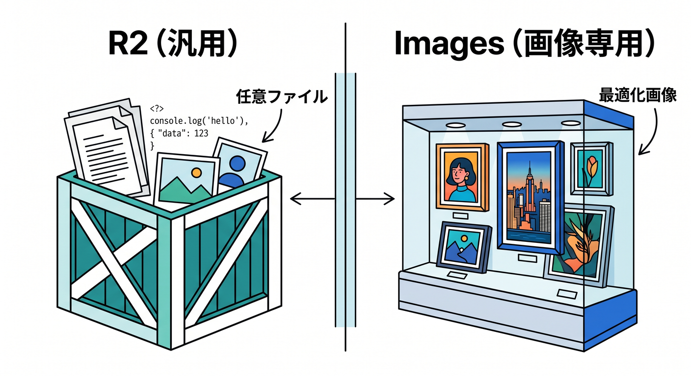
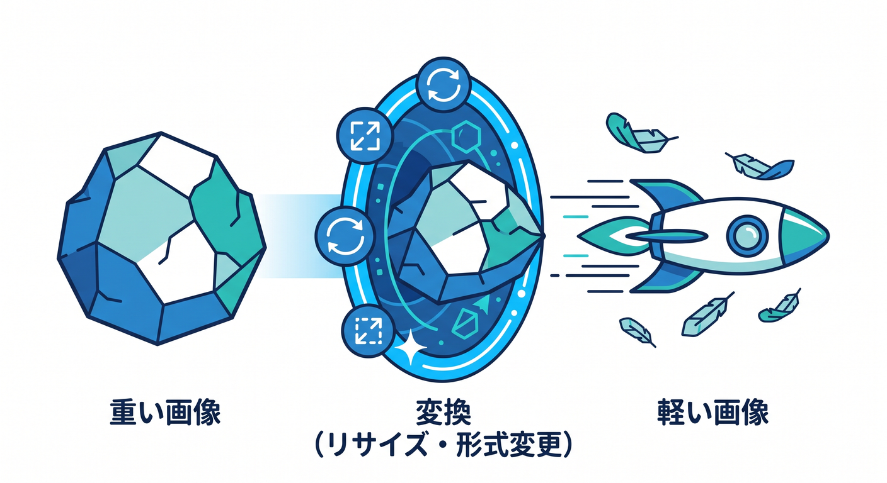
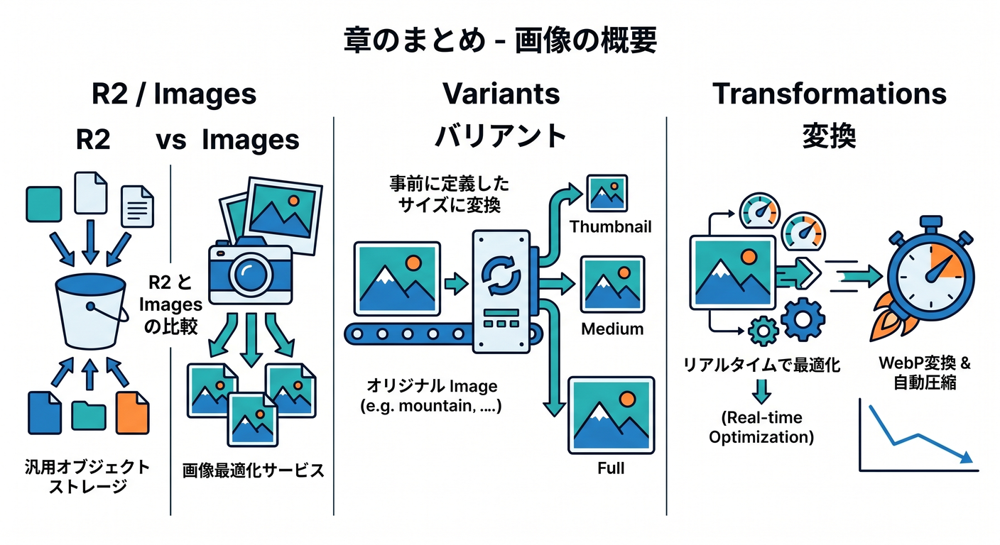

# 第10章：Cloudflare Imagesの全体像を知ろう 🖼️✨

Cloudflare Imagesは、画像を保存・変換・最適化・配信するためのサービスです。  
R2が汎用ファイル倉庫なら、Imagesは画像に特化した仕組みです。  
この章では、R2とImagesの違いを整理します 😊

---

## 1. Imagesでできること 🖼️

Cloudflare Imagesでは、主に次のことができます。

- 画像を保存する
- 複数サイズで配信する
- 画像を最適化する
- variantsを使う
- signed URLでprivate画像を配信する

公式では、Imagesへアップロードした画像を複数variantで配信する方法と、外部画像をtransformする方法が案内されています。


---

## 2. R2との違い ⚖️

R2は画像以外も置ける汎用ストレージです。

```text
R2: 画像、PDF、CSV、ログ、任意ファイル
Images: 画像の保存・変換・最適化・配信
```

PDFやCSVはImagesではなくR2です。  
画像を最適化して届けたいならImagesが候補になります。



---

## 3. variantsとは 🧩

variantは、同じ画像を用途ごとに違うサイズや形で配信する考え方です。

例です。

- thumbnail
- card
- hero
- avatar

元画像を1つ保存し、表示場所に合わせて変換した画像を届けます。


---

## 4. transformationsとは ✂️

transformationsは、画像をリサイズしたり形式変換したりする機能です。  
Imagesに保存した画像だけでなく、外部にある画像を最適化する使い方もあります。

Cloudflareは変換済み画像をグローバルネットワークで配信できます。  
画像が重いサイトでは体感速度に効きやすいです。



---

## 5. 章末チェック ✅



- Cloudflare Imagesは画像特化サービスだと分かる
- R2とImagesの違いが分かる
- variantsの意味が分かる
- transformationsの意味が分かる
- 画像最適化が表示速度に効くと分かる

この章で覚える一言はこれです。  
**Imagesは、画像を保存するだけでなく、表示場所に合う形へ届ける仕組みです 🖼️✨**

