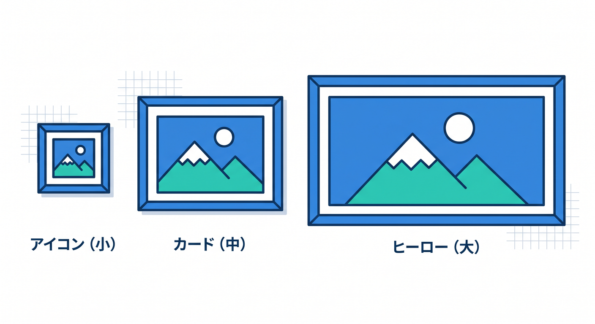
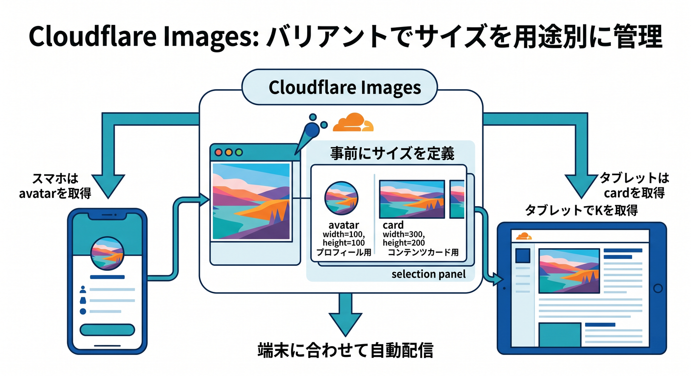
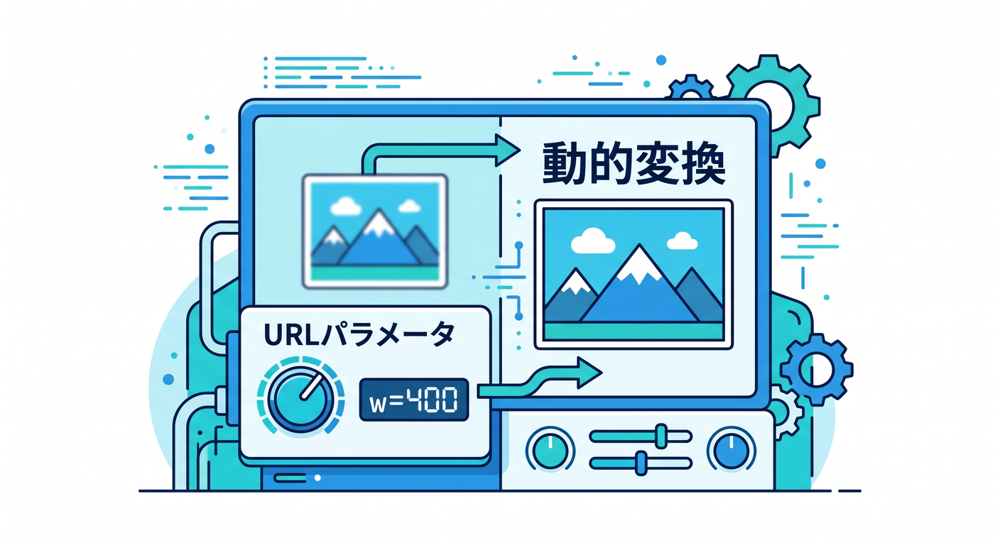
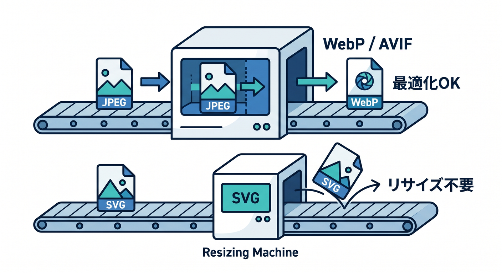
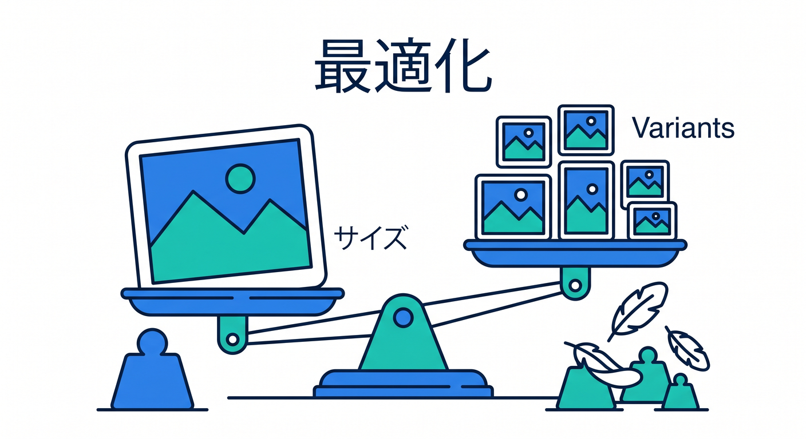

# 第11章：VariantsとTransformationsで画像を最適化しよう ✂️⚡

画像は、そのまま配ると重くなりがちです。  
スマホの小さなサムネイルに、巨大な原寸画像を配るのはもったいないです。  
この章では、variantsとtransformationsで画像を最適化する考え方を学びます 😊

---

## 1. 表示場所ごとに必要サイズは違う 📱

同じ画像でも、使う場所で必要なサイズは違います。

- アイコン: 小さい
- カード画像: 中くらい
- ヒーロー画像: 大きい
- ギャラリー詳細: 高解像度

必要以上に大きい画像を配ると、読み込みが遅くなります。



---

## 2. variantsでサイズを分ける 🧩

Cloudflare Imagesでは、variantを使って用途ごとの画像を配信できます。  
公式では、最大100 variantsを作成できると案内されています。

例です。

```text
avatar
thumbnail
card
public
```

同じ元画像から、用途に合わせた見せ方を作れます。



---

## 3. flexible variants ✨

flexible variantsを有効にすると、URLパラメータで動的に変換できる場面があります。

例です。

```text
w=400,sharpen=3
```

ただし、signed delivery URLが必要な画像では使えないなど注意点があります。  
実際に使う前には公式ドキュメントで確認します。



---

## 4. 対応形式をざっくり知る 🖼️

Cloudflare Images transformationsでは、JPEG、PNG、GIF、WebP、SVG、HEICなどの入力に触れられています。  
出力ではJPEG、PNG、GIF、WebP、SVG、AVIFなどがあります。

ただしSVGはもともと拡大縮小できる形式なので、CloudflareはSVGをリサイズしないと案内しています。  
SVGではvariantの扱いに注意します。



---

## 5. 章末チェック ✅



- 画像は表示場所ごとに必要サイズが違うと分かる
- variantsで用途別サイズを作れると分かる
- flexible variantsの考え方が分かる
- WebPやAVIFなどの最適化形式を知っている
- SVGはリサイズされない注意点が分かる

この章で覚える一言はこれです。  
**画像は原寸そのままではなく、見る場所に合わせて軽く届けよう ✂️⚡**

