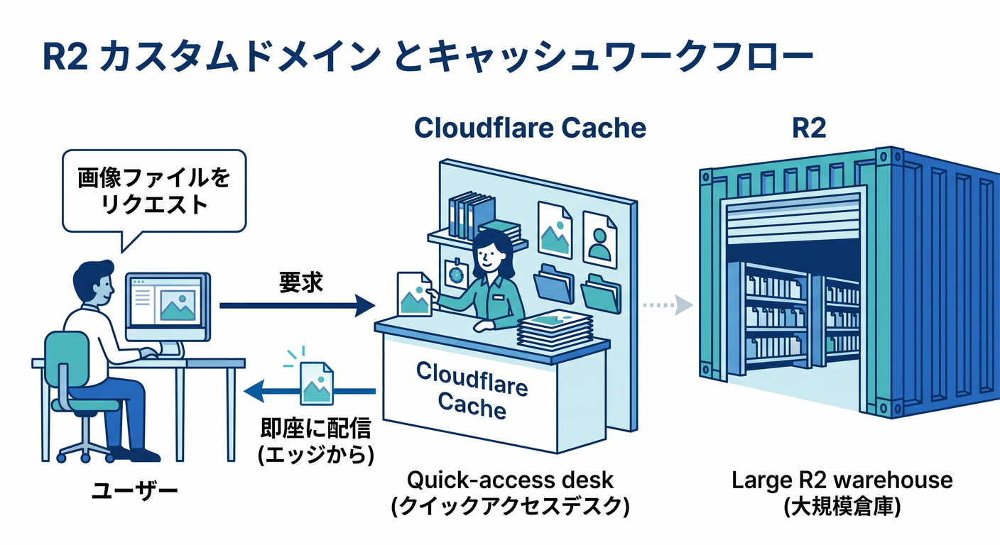
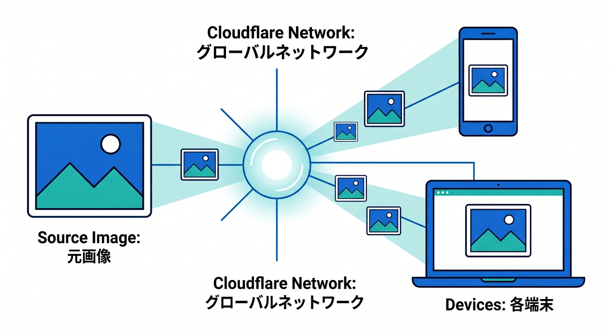
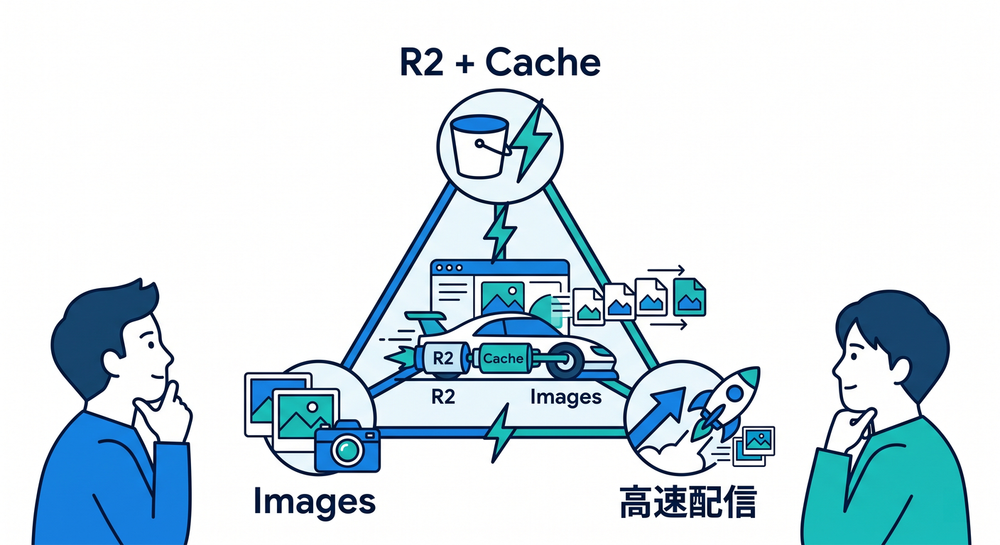

# 第12章：R2 + Images + Cacheで速く見せよう ⚡🖼️

ファイルや画像は、保存するだけではなく速く届けることも大切です。  
R2、Cloudflare Images、Cloudflare Cacheを組み合わせると、画像配信をかなり改善できます。  
この章では、保存・変換・キャッシュをセットで考えます 😊

---

## 1. 画像は体感速度に効く ⚡

Webページが重く見える原因の多くは画像です。  
大きすぎる画像をそのまま配ると、スマホでは特に遅くなります。


対策です。

- 必要サイズにリサイズする
- WebP/AVIFを使う
- Cache-Controlを考える
- Cloudflare Cacheを活用する

---

## 2. R2 custom domainとCache 🌐

公式ドキュメントでは、R2をcustom domainで公開するとCloudflare Cacheを使ってアクセスを高速化できると案内されています。

```text
assets.example.com
  ↓
Cloudflare Cache
  ↓
R2
```



よく読まれる画像は、edge cacheから返せるようになります。

---

## 3. Imagesの変換済み画像 🖼️

Cloudflare Imagesでは、変換済み画像をCloudflareのグローバルネットワークで配信できます。  
元画像は1つでも、表示場所ごとに最適化した画像を届けられます。



サムネイルやカード画像では、元画像より小さい画像を配る方が自然です。

---

## 4. 同じURLで上書きしない 🧠

同じkeyで画像を上書きすると、キャッシュの影響で古い画像が見えることがあります。


対策です。

- keyにUUIDを使う
- versionを付ける
- 必要に応じてPurgeする
- Cache-Controlを慎重に設定する

更新頻度が高い画像ほど、URL設計が大事です。

---

## 5. 章末チェック ✅



- 画像最適化が体感速度に効くと分かる
- R2 custom domainでCloudflare Cacheを使えると分かる
- Imagesで変換済み画像を配信できると分かる
- 同じURL上書きとキャッシュの注意点が分かる
- 保存・変換・キャッシュをセットで考えられる

この章で覚える一言はこれです。  
**画像配信は、R2に保存して終わりではなく、軽く速く届けるところまで設計しよう ⚡**

