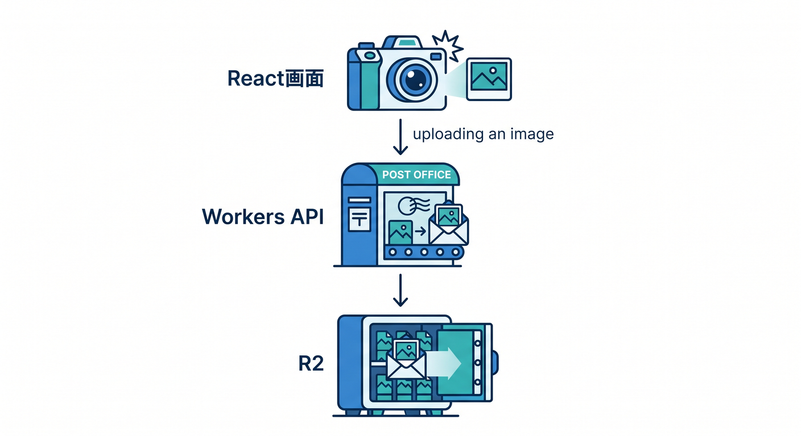
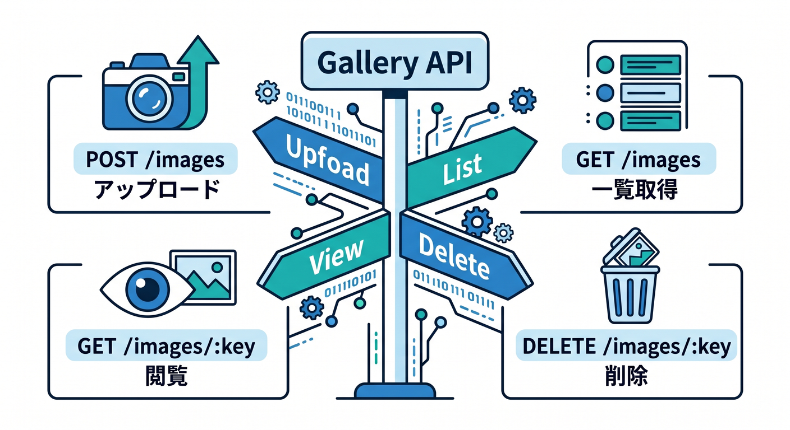
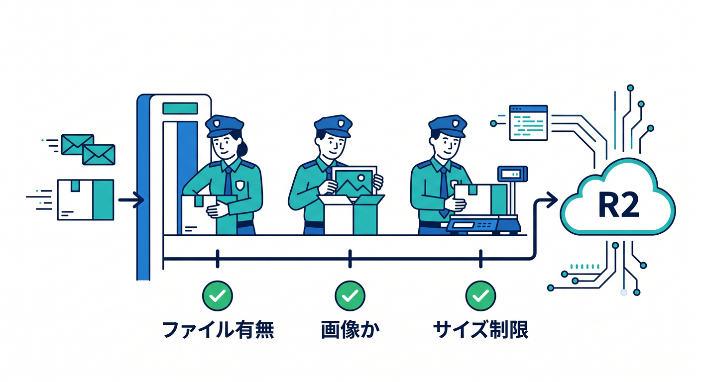
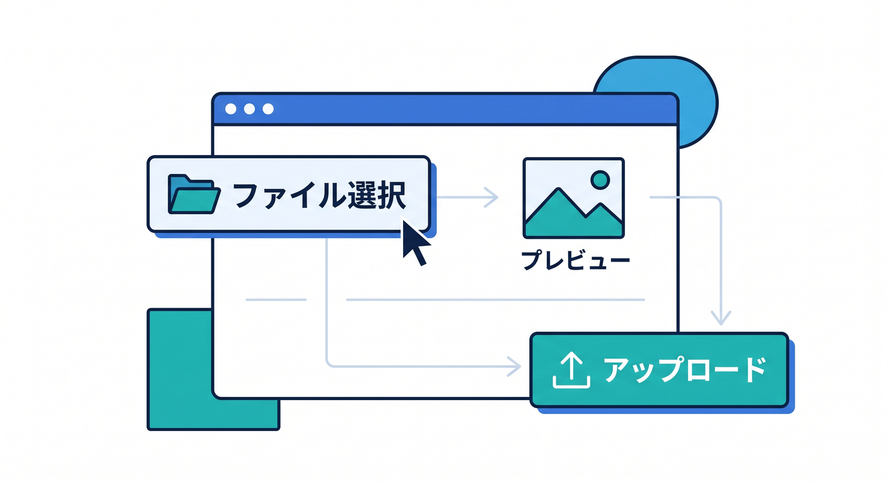
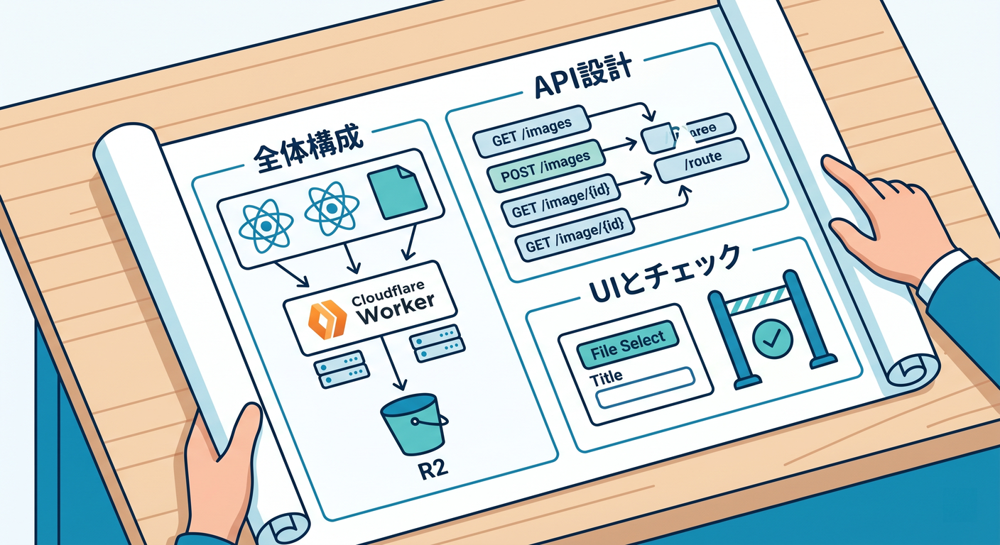

# 第13章：画像ギャラリーAPIを作ろう ⚛️🖼️

ここでは、React + Workers + R2で小さな画像ギャラリーAPIを設計します。  
実装を全部作り込む前に、どんなAPIと保存先が必要かを整理します 😊

---

## 1. 全体構成 🧩

```text
React画面
  ↓ upload
Workers API
  ↓ env.BUCKET
R2
```



発展形では、D1も使います。

```text
R2: 画像本体
D1: タイトル、説明、R2 key、作成日時
```


---

## 2. API設計 🚪

シンプルなAPIです。

```text
POST /images       アップロード
GET  /images/:key  画像表示
GET  /images       一覧
DELETE /images/:key 削除
```



最初はアップロードと表示だけでも十分です。

---

## 3. アップロード時のチェック 🔐

Worker側で確認します。

- Fileがあるか
- Content-Typeが画像か
- サイズが大きすぎないか
- keyに個人情報が入っていないか
- 認証が必要な操作か



画像アップロードは外から叩かれる入口なので、Rate Limitingも検討します。

---

## 4. React側の画面 ⚛️

React側では、次のUIを作ります。

- ファイル選択
- プレビュー
- アップロードボタン
- エラーメッセージ
- アップロード後の画像表示



ユーザーには、何が起きているか分かる状態を見せます。

---

## 5. 章末チェック ✅



- 画像ギャラリーの全体構成が分かる
- R2とD1の役割分担が分かる
- アップロードAPIを設計できる
- Content-Typeやサイズチェックの必要性が分かる
- React側の基本UIを考えられる

この章で覚える一言はこれです。  
**画像ギャラリーは、R2の保存体験を実感しやすい題材です ⚛️🖼️**

