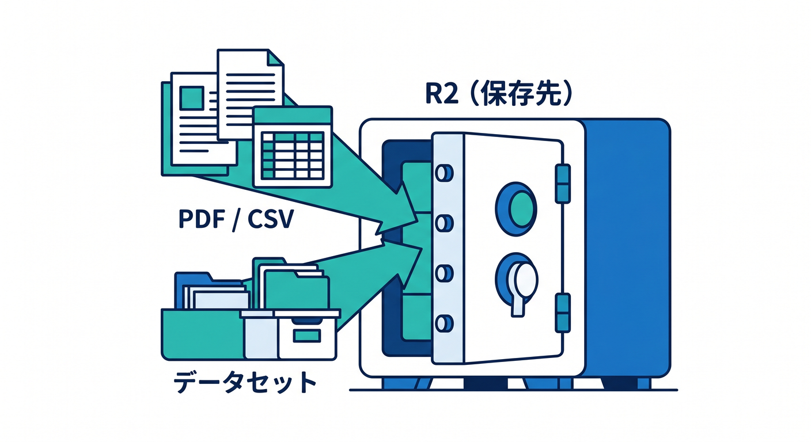
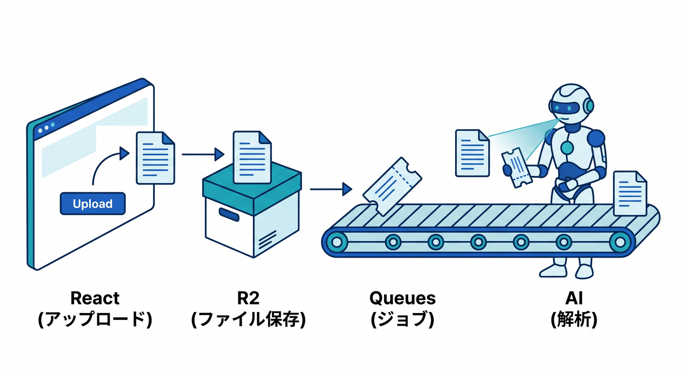

# 第14章：AIアプリとR2：PDF・画像・データセットを扱う 🤖📄

AIアプリでは、文章だけでなくPDFや画像を扱いたくなることがあります。  
R2は、こうしたファイルを保存する場所として役立ちます。  
この章では、AIアプリでR2をどう組み込むかを見ます 😊

---

## 1. AIアプリで出てくるファイル 📦

例です。

- PDF資料
- 画像
- 音声
- CSV
- ログ
- AI処理の中間ファイル
- 学習用データセット



これらのファイル本体はR2が候補になります。

---

## 2. PDF要約アプリの例 📄

流れです。

```text
ReactでPDFをアップロード
  ↓
WorkerがR2へ保存
  ↓
D1にmetadataを保存
  ↓
Queuesへ解析ジョブを送る
  ↓
AI処理
  ↓
D1へ結果保存
```



R2だけでなく、D1やQueuesも組み合わせると実用的になります。

---

## 3. Imagesはプレビューに便利 🖼️

画像AIアプリでは、アップロード画像のサムネイルやプレビューが必要になります。  
Cloudflare Imagesのtransformationsやvariantsを使うと、表示用に軽い画像を配信できます。


元画像はR2、表示用はImagesで最適化、という考え方もあります。

---

## 4. 公開範囲に注意 🔐

AIに使うファイルには、個人情報や業務情報が含まれることがあります。  
何でもpublic bucketに置かないようにします。


必要に応じて、Worker経由で認証して返す、presigned URLを短時間だけ発行する、などを検討します。

---

## 5. 章末チェック ✅


- AIアプリでR2に置くファイル例が分かる
- PDF要約アプリの保存先構成を説明できる
- D1やQueuesと組み合わせる理由が分かる
- Imagesをサムネイルやプレビューに使えると分かる
- AI用ファイルの公開範囲に注意できる

この章で覚える一言はこれです。  
**AIアプリでは、R2はアップロードファイルと処理データの安全な置き場になります 🤖📄**

