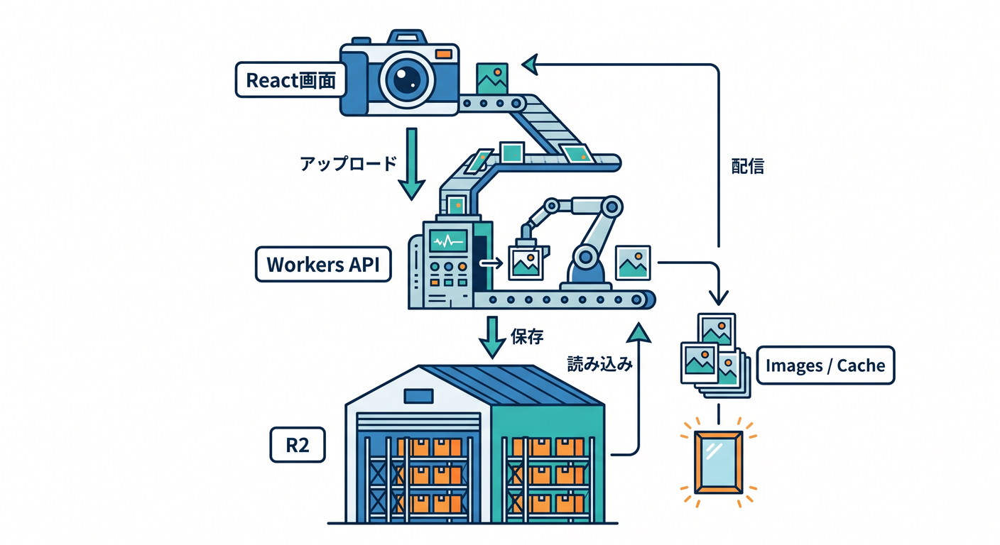
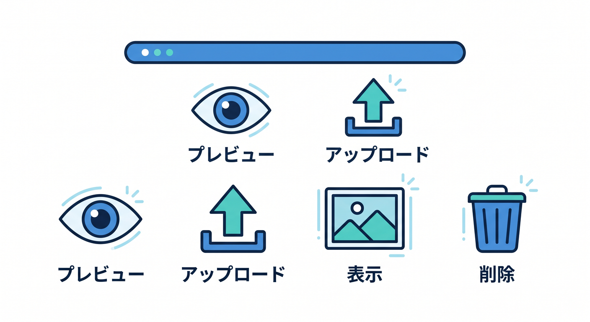
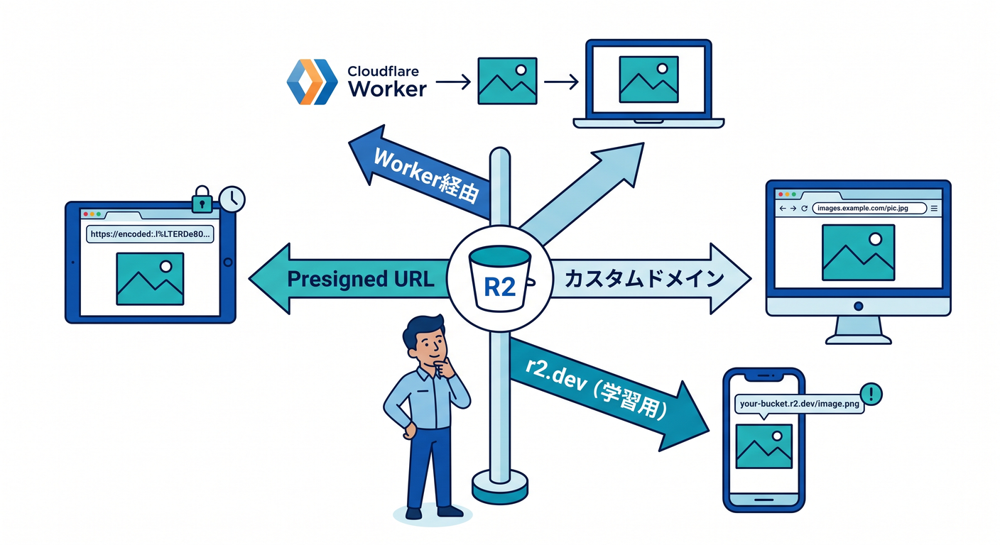
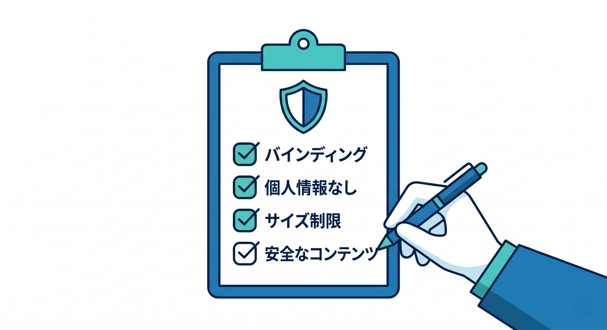
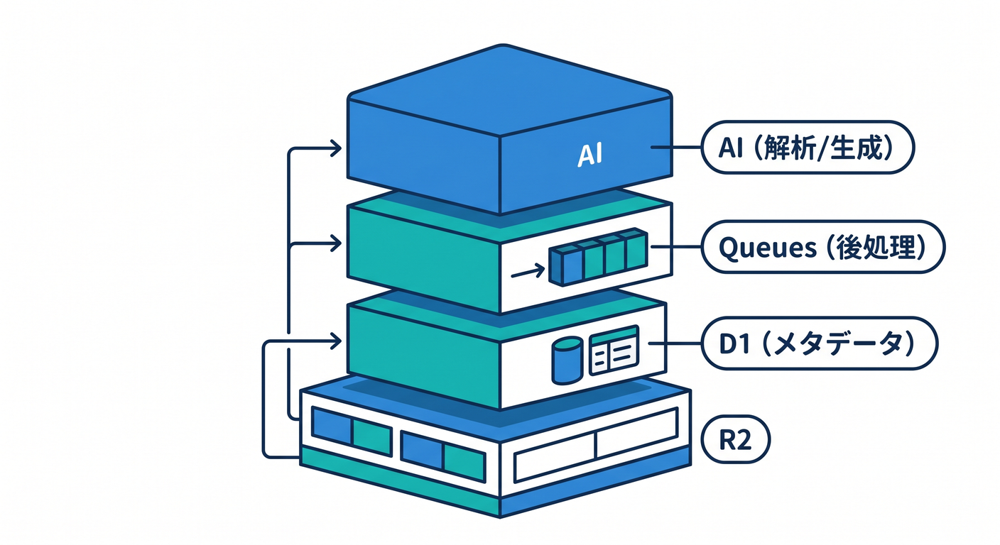

# 第15章：総仕上げ：R2 + Imagesで作品を公開しよう 🏁🖼️

最後は、R2とCloudflare Imagesを使った小さな作品を設計します。  
題材は、画像アップロードつきギャラリーアプリです。  
保存、表示、最適化、公開方法までまとめます 🎉

---

## 1. 作品の構成 🧩

```text
React画面
  ↓ upload
Workers API
  ↓ env.BUCKET
R2
  ↓
Cloudflare Images / Cache
  ↓
ユーザーへ表示
```



必要に応じてD1を加えます。

```text
D1: 画像タイトル、説明、R2 key、作成日時
```

---

## 2. 実装する機能 🛠️

- 画像を選ぶ
- アップロード前にプレビューする
- Workerへアップロードする
- R2へ保存する
- 保存した画像を表示する
- サムネイルを最適化する
- 不要な画像を削除する



この流れで、ファイルアプリらしさが出ます。

---

## 3. 公開方法を選ぶ 🌐

選択肢です。

- Worker経由で配信する
- public bucket + custom domainで配信する
- `r2.dev` で学習用に確認する
- presigned URLで一時アクセスする



本番では、公開範囲とCacheの使い方を考えて選びます。

---

## 4. 最終チェック ✅

- bucket名とbindingが正しい
- object keyに個人情報がない
- Content-Typeを保存している
- サイズ制限がある
- 画像以外を拒否している
- privateファイルをpublicにしていない
- Cache-Controlを考えている
- Imagesのvariantやtransformation方針がある
- Copilotレビュー時にsecretを貼っていない

---



## 5. 次の発展 🗺️

次に進むなら、次のテーマが自然です。

- D1で画像メタデータを管理する
- Queuesで画像変換やAI解析を後処理する
- TurnstileやRate LimitingでアップロードAPIを守る
- Signed URLでprivate画像を配信する
- AIで画像分類や説明文生成を行う



R2とImagesが使えると、Cloudflareアプリの表現力が大きく広がります。

---

## 6. 章末チェック ✅

- R2 + Imagesの作品構成を説明できる
- アップロードから表示までの流れが分かる
- 公開方法を理由つきで選べる
- 画像アップロードの安全チェックができる
- D1やQueuesとの発展構成を考えられる

この章で覚える一言はこれです。  


**R2とImagesを使えると、文字だけのアプリからメディアを扱うアプリへ進めます 🏁🖼️**

