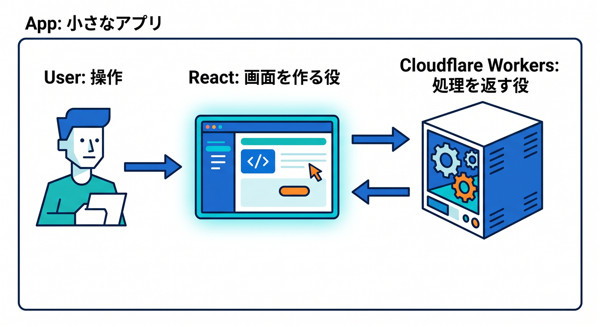
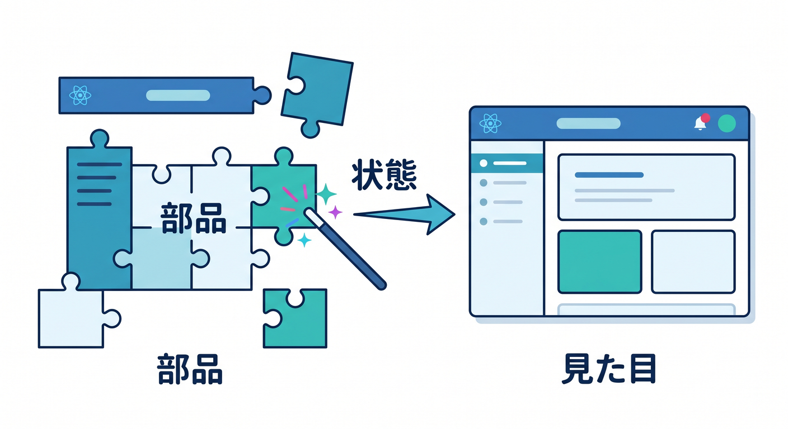
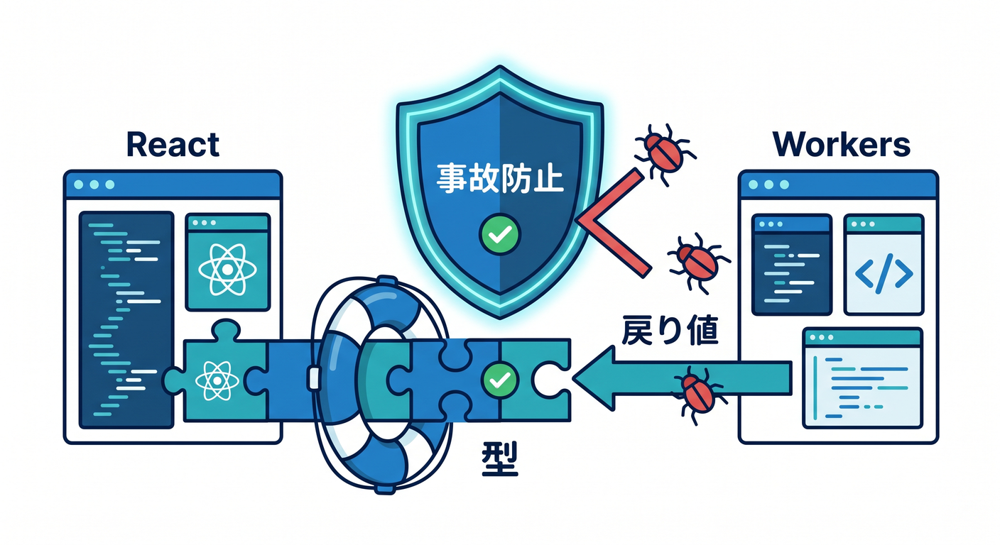
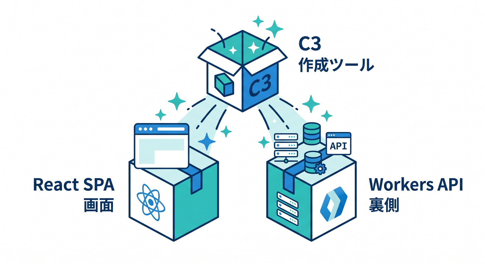
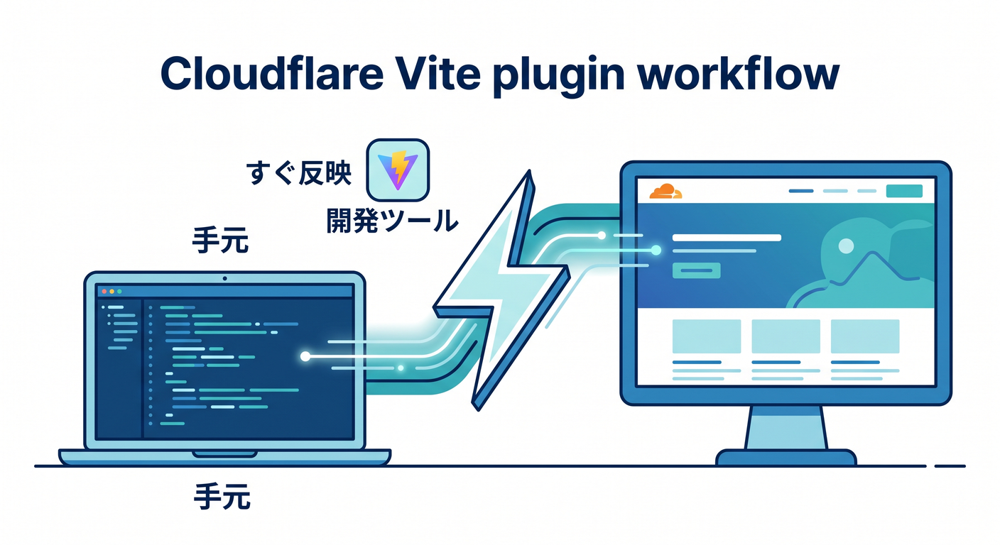
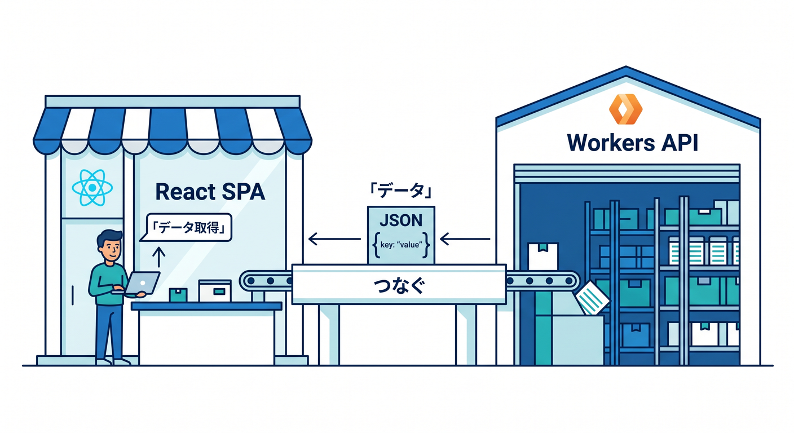
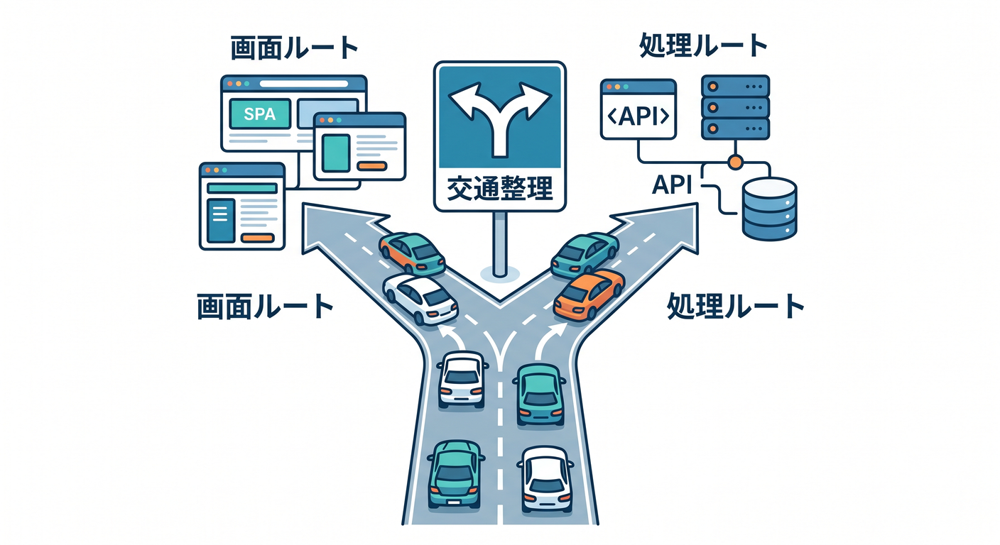

# Reactとつないで“小さなアプリ”にしよう ⚛️☁️✨

## 第01章：ReactとCloudflareで何が作れるの？🌈

最初は、React が「画面を作る役」、Cloudflare Workers が「処理を返す役」だとつかむ章です。
ボタンを押す → APIを呼ぶ → 結果を表示する、という小さな流れを、まずは絵で理解します。
この章では「React は主役というより、Cloudflare を見やすく使うための相棒なんだ」と感じられることを目標にします 😊

## 第02章：Reactの超基本だけを先につかもう 🧩

コンポーネント、props、state、イベント、`map` による表示のような、React の最小限だけを学ぶ章です。
難しい設計思想よりも、「画面の部品を分けると楽になる」「状態が変わると見た目も変わる」を体感することを優先します。
文系寄りの初学者でも、ここで「Reactって思ったより読めるかも」と思えるようにします 🌷

## 第03章：TypeScriptは“怖くない道具”として覚えよう ✍️

型、引数、返り値、オブジェクト、配列、非同期関数など、React と Workers をつなぐのに必要なぶんだけを扱います。
型パズルには踏み込まず、「APIの戻り値がわかると安心」「補完が効いてうれしい」くらいの実感を大事にします。
ここで TypeScript を“試験科目”ではなく“事故防止グッズ”として見られるようにします 🛟

## 第04章：create-cloudflareで最初のReactアプリを作ろう 🚀

ここから実際に手を動かします。
Cloudflare 公式の React 導線では、**C3 で React SPA と Workers API をまとめて始める**流れが用意されているので、まずはそれに沿って最小構成を立ち上げます。
最初の目標は「React の画面が出た！」「Cloudflare の土台で始まった！」という成功体験です。([Cloudflare Docs][1])

## 第05章：Cloudflare Vite pluginで“開発しやすさ”を体験しよう ⚡

この章では、Cloudflare Vite plugin の役割をやさしく理解します。
Vite plugin は **Workers runtime にかなり近い開発体験** を作ってくれるので、ローカルでの確認と本番との差を減らしやすいのが魅力です。
「保存したらすぐ反映される」「React も Worker も近い感覚で触れる」という気持ちよさをここで覚えます。([Cloudflare Docs][3])

## 第06章：画面を作ろう：ボタン・入力欄・表示エリア 🎨

ここでは React 側の見た目を少しずつ作ります。
ボタン、テキスト入力、カード表示、読み込み中メッセージなどを並べながら、「アプリっぽさ」が出てくる楽しさを味わいます。
Cloudflare の章ですが、ここではあえて画面づくりに集中して、「見た目」と「処理」をあとでつなげる準備をします 🎀

## 第07章：Workers APIとつないでみよう 🔗

いよいよ React から Cloudflare 側の API を呼ぶ章です。
Cloudflare 公式でも、**React SPA と API Worker をつないだ小さなフルスタック構成** が基本導線として示されています。
GET でデータを取り、JSON を受け取り、画面に表示するところまでを、難しいバックエンド理論なしで進めます。([Cloudflare Docs][4])

## 第08章：送信して返す：フォームとPOSTの基本を覚えよう 📮

この章では、お問い合わせ風フォームやメモ投稿風のUIを題材にして、POST でデータを送る流れを学びます。
React 側では `useState` で入力を持ち、Workers 側では受け取って返す、という往復を体験します。
「画面を見せるだけ」から「ユーザーの操作を受け止める」へ進む、大事な一歩です 🌟

## 第09章：読み込み中・エラー・再試行をやさしく扱おう 🧯

実際のアプリでは、毎回うまく通信できるとは限りません。
そこでこの章では、ローディング表示、エラーメッセージ、再読み込みボタンなどを作りながら、「親切な画面」の感覚を育てます。
React 19 系の現在の流れも意識しつつ、まずは難しすぎない非同期UIの基本に絞ります。([React][5])

## 第10章：SPAとしてCloudflareにちゃんと載せよう 🏠

React アプリは SPA になりやすいので、Cloudflare 側のルーティング理解が大切です。
Workers Static Assets では **SPA 向けの `not_found_handling = "single-page-application"`** が案内されていて、さらに **`run_worker_first`** の考え方で「どのルートで Worker を先に動かすか」も調整できます。
この章では「React の画面ルート」と「API ルート」がぶつからないようにする考え方を、すごくやさしく整理します。([Cloudflare Docs][6])

## 第11章：Bindingsって何？をアプリ目線で理解しよう 🧰

Cloudflare では、AI や D1 や KV などを Worker に“つなぐ”ために bindings を使います。
この章ではまず概念だけをやさしく整理し、「環境変数みたいなもの」から少し進んだ感覚で理解します。
React からは直接触らず、Worker を通して安全に使う、という考え方をここで身につけます。([Cloudflare Docs][7])

## 第12章：データを少し保存して“小さなアプリ感”を出そう 🗂️

この章では、フォームの内容を一時的に保存したり、一覧にして表示したりして、アプリらしさを一段上げます。
保存先そのものは重くしすぎず、まずは「入力 → 保存 → 一覧表示」の流れを理解することを優先します。
この段階で、React は画面、Workers は処理、保存先はその奥、という三層のイメージが自然にできてきます 😊

## 第13章：Workers AIで“AI付きミニアプリ”にしよう 🤖✨

ここから AI を積極的に入れます。
Cloudflare では **Workers AI を binding として Worker に接続** できるので、React の画面から「要約する」「言い換える」「短く説明する」みたいな小さな AI 機能を自然に追加できます。
この章では、AI を別世界の特別機能ではなく、「Cloudflareアプリの中の1部品」として使う感覚を育てます。([Cloudflare Docs][7])

## 第14章：AI SearchとAI Gatewayで“実用っぽさ”を足そう 🧠🔍

もう一歩進んで、Cloudflare の AI サービスを実用寄りに見せる章です。
**AI Search** は Web サイトや R2 などのデータを **継続的にインデックス化して自然言語検索** に使えるので、React 側に「サイト内を質問で探せる検索窓」を置く題材と相性がとても良いです。
必要に応じて AI Gateway にも軽く触れ、「AIを呼ぶだけ」から「AIを運用する」入口まで見せます。([Cloudflare Docs][8])

## 第15章：GitHub連携・Copilot活用・次の道へつなげよう 🛤️

最後は、作った小さなアプリを“続けて育てる”ための章です。
Cloudflare の **Workers Builds** では GitHub / GitLab 連携や preview URL が使えますし、VS Code の GitHub Copilot ではエージェントやチャット、MCP を含む開発支援が広がっています。Cloudflare 側も Prompting や自社MCPサーバーを用意しているので、教材の締めとして「AIに丸投げする」のではなく「AIと一緒に直す・調べる・整える」開発の形まで見せられます。最後に Next.js は **Cloudflare Workers へ OpenNext adapter で載せられる** ことだけ紹介して、次の学習先として軽く案内します 🚪✨ ([Cloudflare Docs][9])

## この15章構成のねらい 💡🌼

この並びだと、前半で **React の画面づくり**、中盤で **Workers API と SPA 公開**、後半で **bindings・AI・運用導線** へ進めます。
つまり「React を勉強する教材」ではなく、**Cloudflare を中軸にして React を気持ちよく使う教材** になります。しかも今の公式導線である C3、Cloudflare Vite plugin、Workers API、Workers Builds、Workers AI、AI Search と素直につながるので、2026年時点の設計としてかなり筋がいいです。([Cloudflare Docs][1])

[1]: https://developers.cloudflare.com/workers/framework-guides/web-apps/react/?utm_source=chatgpt.com "React + Vite · Cloudflare Workers docs"
[2]: https://code.visualstudio.com/docs/copilot/overview?utm_source=chatgpt.com "GitHub Copilot in VS Code"
[3]: https://developers.cloudflare.com/workers/vite-plugin/?utm_source=chatgpt.com "Vite plugin · Cloudflare Workers docs"
[4]: https://developers.cloudflare.com/workers/vite-plugin/tutorial/?utm_source=chatgpt.com "Tutorial - React SPA with an API · Cloudflare Workers docs"
[5]: https://react.dev/versions?utm_source=chatgpt.com "React Versions"
[6]: https://developers.cloudflare.com/workers/static-assets/routing/single-page-application/?utm_source=chatgpt.com "Single Page Application (SPA) - Workers"
[7]: https://developers.cloudflare.com/workers-ai/configuration/bindings/?utm_source=chatgpt.com "Workers Bindings · Cloudflare Workers AI docs"
[8]: https://developers.cloudflare.com/ai-search/?utm_source=chatgpt.com "Cloudflare AI Search"
[9]: https://developers.cloudflare.com/workers/ci-cd/builds/?utm_source=chatgpt.com "Builds · Cloudflare Workers docs"
