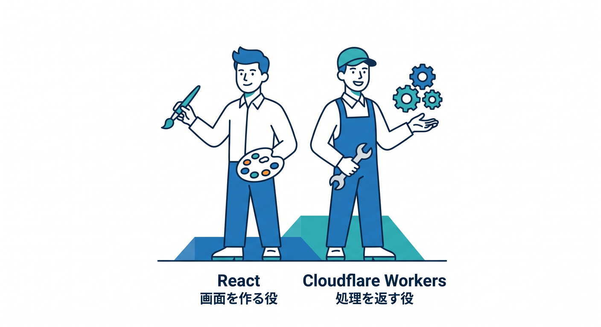
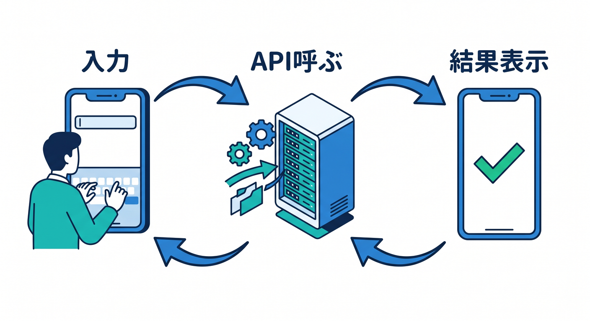
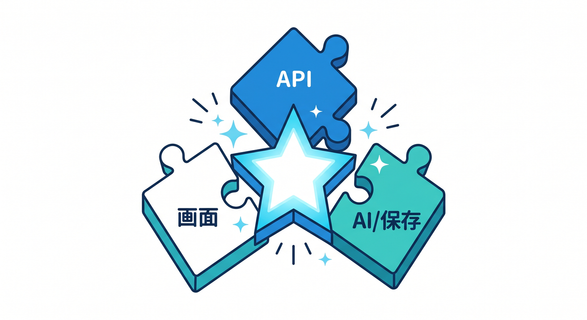
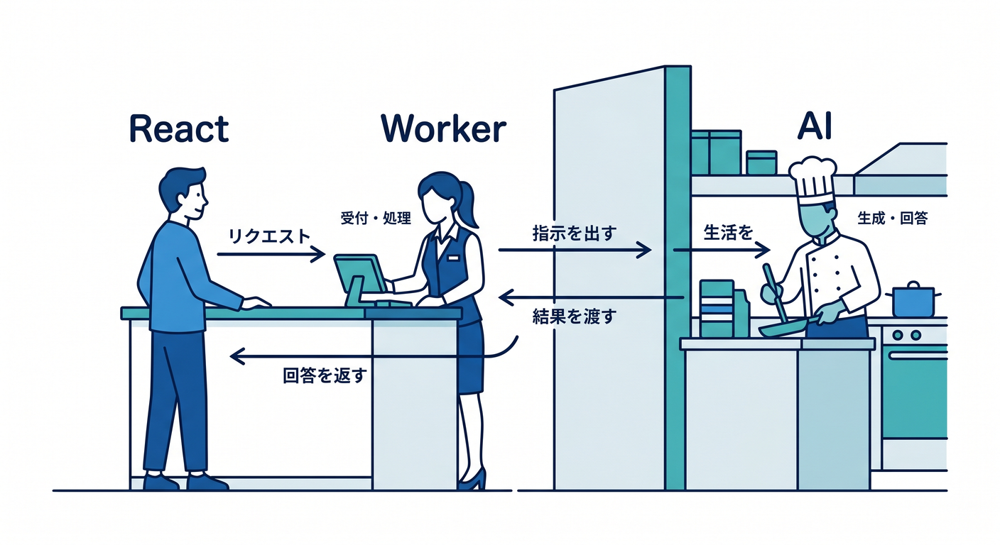
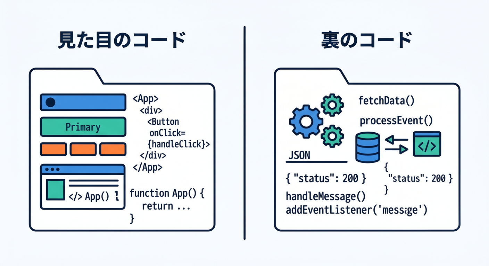
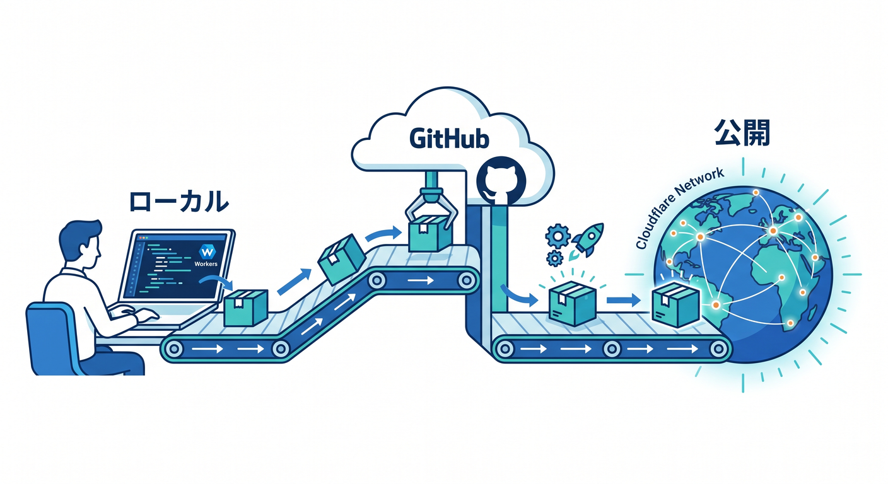

# 第01章：ReactとCloudflareで何が作れるの？🌈

まずこの章では、**React は画面を作る役**、**Cloudflare Workers は処理を返す役**、という全体像をつかみます 😊
今のCloudflare公式のReact導線は、`create-cloudflare` で **React SPA + Workers API + Cloudflare Vite plugin** をまとめて始める形が中心です。ReactのSPAはWorkerとStatic Assetsとして扱えますし、新しいプロジェクトでは **Workers Static Assets の利用が推奨** されています。なお、React公式ドキュメントの現行最新版は **19.2** です。 ([Cloudflare Docs][1])

---

## この章のゴール 🎯

この章のゴールは、難しい実装に入る前に、次の3つを気持ちよく理解することです ✨

1. **React は「見た目」と「操作感」を担当する**
2. **Cloudflare Workers は「API」「保存」「AI連携」などの裏方を担当する**
3. **この2つをつなぐと“小さなアプリ”になる**

ここではまだ「細かいコードを完璧に書く」ことより、
**ボタンを押したら何が起きるのか** を頭の中で絵にできるようになるのが大事です 🖼️💡

---

## 1. まずはひとことで言うとこうです ☁️⚛️

React は、ボタン・入力欄・カード・一覧などを組み立てて、**ユーザーが触る画面**を作るのが得意です。Cloudflare Workers は、その画面の裏で動いて、**データを返したり、保存したり、AIを呼んだり**するのが得意です。Cloudflare公式も、ReactでSPAを作り、Cloudflare Workers のAPIと組み合わせてフルスタックアプリにする流れを案内しています。 ([Cloudflare Docs][1])

つまり、役割をすごくやさしく言うとこうです 🌼

**React**
→ 見た目を出す、入力を受ける、結果を表示する

**Cloudflare Workers**
→ 計算する、JSONを返す、保存先やAIにつなぐ

この分担がわかるだけで、Cloudflare学習がかなり楽になります 😊

---

## 2. 小さなアプリはどう動くの？ 🔁

たとえば、画面に「要約してね」ボタンがあるミニアプリを想像してみましょう 🤖✨

> ① ユーザーがReactの画面で文章を入力する
> ② ボタンを押す
> ③ React が Cloudflare Workers の API を呼ぶ
> ④ Worker が処理する
> ⑤ 必要なら AI や検索や保存先にアクセスする
> ⑥ 結果を React に返す
> ⑦ 画面に表示する

CloudflareのSPA説明でも、ReactのようなSPAはクライアント側で描画され、**必要なデータはクライアントからAPIへリクエストして取得する** 形が基本です。React SPA with an API の公式チュートリアルも、**フロントエンドからアクセスできる API Worker を追加する** 流れで進みます。 ([Cloudflare Docs][2])

この流れを見て、「あ、**画面と処理は別の役目なんだな**」と感じられれば、第1章はもうかなり成功です 🎉

---

## 3. 何が作れるの？ まずは完成形をイメージしよう 🌟

この組み合わせで作れるものは、思っているよりたくさんあります 😊
しかも最初から大きなサービスを目指さなくて大丈夫です。**“1画面 + 1機能”** くらいの小ささで十分アプリになります。

### 例1　ひとことメモアプリ 📝

React で入力欄と一覧を表示して、Workers 側でメモを受け取り、保存して返します。
「書く → 保存する → 一覧に出る」という最小のアプリ体験ができます。

### 例2　おみくじアプリ 🎋

React のボタンを押すと、Workers がランダムな結果を返します。
保存なしでも作れるので、最初の理解にぴったりです。

### 例3　AI要約アプリ 🤖

React で文章を送って、Worker が Workers AI を使って短くまとめた結果を返します。
Cloudflareでは **Workers AI は binding を通して Worker から使う** のが基本です。 ([Cloudflare Docs][3])

### 例4　質問できる検索アプリ 🔎

React の検索窓から質問文を送り、Worker が AI Search に問い合わせて結果を返す形です。
AI Search は Cloudflare のマネージド検索サービスで、**自然言語で検索** でき、WebサイトやR2、アップロード文書をインデックス化できます。 ([Cloudflare Docs][4])

### 例5　ちいさなお問い合わせ画面 📮

React でフォームを作り、Workers 側で受け取って整形し、保存や通知につなぐ形です。
「入力 → 送信 → 結果表示」という、実用アプリの基本パターンを学べます。

---

## 4. どうして React と Cloudflare の相性がいいの？ 💞

今のCloudflareは、**フロントエンド資産の配信** と **Worker の処理** をかなり自然に一体化できるようになっています。Static Assets では HTML / CSS / 画像などを Worker の一部として扱えますし、公式の React 導線も `create-cloudflare` と Cloudflare Vite plugin を使う構成です。 ([Cloudflare Docs][5])

さらに Cloudflare Vite plugin は、Vite と Workers runtime をしっかり統合し、**Workerコードを `workerd` の中で実行** するので、本番にかなり近い感覚で開発しやすいのが強みです。HMR にも対応していて、保存後の反映が速い設計です。 ([Cloudflare Docs][6])

つまり、気持ちとしてはこんな感じです 🌸

**React** で画面をサクサク作る
＋
**Workers** でAPIを返す
＋
**bindings** でAIや検索や保存を足す
＝
**小さいのにちゃんと実用的なアプリ** になる

この「ひとつの流れでつながる感じ」が、Cloudflare を学ぶ楽しさのひとつです ☁️✨

---

## 5. CloudflareのAIを入れると何が変わるの？ 🤖☁️✨

ここがこの教材のワクワクポイントです 😆
Cloudflareでは、AIを「別世界の特別機能」ではなく、**Worker の後ろに置ける部品** として扱いやすいです。

Workers AI は、Worker に **AI binding** を設定して使います。つまり、React から直接AIを触るのではなく、**いったん Worker を通す** 形になります。これにより、秘密情報や内部処理をフロント側に出しすぎずに済みます。 ([Cloudflare Docs][3])

AI Search も同じく Worker から binding 経由で使えます。しかもAI Searchは **Workers binding** を用意していて、自然言語検索をアプリに組み込みやすくなっています。最新のAI Searchは、検索インフラを自前で組まずに始められるマネージド検索として案内されており、**自動インデックス化** や **ハイブリッド検索** も備えています。 ([Cloudflare Docs][4])

なので将来的には、こんなミニアプリも作れます 🌟

* 文章を短くするアプリ ✂️
* やさしい言い換えを返すアプリ 🗣️
* 自分のサイトを質問で検索するアプリ 📚
* FAQを自然文で探せるアプリ 🔍
* アップロード文書を横断して探すアプリ 🗂️

第1章ではまだ実装しませんが、**「Reactの画面から、Cloudflare上のAI機能を使う」** という未来図だけ先に見えていると、その後の章がすごく楽になります 😊

---

## 6. React は主役？ それとも脇役？ 🎭

この教材では、React は「全部を支配する主役」というより、**Cloudflare を見やすく使うための相棒** として考えるとしっくりきます 🌷

たとえば、同じ「今日のひとこと」を返す機能でも、

* Reactなしなら
  → APIだけ返す
* Reactありなら
  → ボタン、入力欄、読み込み中表示、エラー表示、結果カードが作れる

という違いになります。

つまり React の価値は、
**Cloudflare の処理を “人が使いやすい形” にしてくれること** です 💡

この見方を持っておくと、
「Reactを勉強するためにCloudflareを使う」のではなく、
**「Cloudflareで小さなアプリを作るためにReactを使う」**
という軸がぶれにくくなります 😊

---

## 7. ここで覚えるべき用語は4つだけでOK 📚✨

### React

画面を作るための道具です。部品を組み合わせてUIを作り、状態が変わると表示も変わります。Cloudflareの公式Reactガイドでも、ReactはUIコンポーネントと状態管理を扱い、Workers API と組み合わせてフルスタックアプリを作れるものとして説明されています。 ([Cloudflare Docs][1])

### SPA

Single Page Application のことです。React のようなフレームワークでよく作られ、ビルドすると `index.html` と関連アセットができ、**クライアントからAPIへ通信する** 形が基本です。 ([Cloudflare Docs][2])

### Worker

Cloudflare上で動く処理です。APIを返したり、Static Assets と組み合わせたり、bindings を通して他の機能へつないだりできます。Workers はサーバーレス実行環境として案内されています。 ([Cloudflare Docs][3])

### Binding

Worker から Cloudflare の各種サービスへつなぐ入口です。Workers AI も AI Search も、Worker から使うには binding を設定するのが基本です。 ([Cloudflare Docs][3])

この4つが頭に入ると、教材の後半で急に楽になります 🥳

---

## 8. 「どこに何を書くの？」を最初に整理しよう 🧭

初心者さんがいちばん混乱しやすいのは、
**“このコードって React に書くの？ Worker に書くの？”**
というところです。

ざっくりルールはこうです 😊

### React に書くもの

* 入力欄
* ボタン
* 一覧表示
* 読み込み中の表示
* エラーメッセージの表示

### Worker に書くもの

* JSON を返す処理
* 保存処理
* 外部サービス呼び出し
* AI呼び出し
* 検索処理

### すぐ覚えるコツ 🪄

**「見た目は React、裏の仕事は Worker」**
これだけで最初は十分です。

---

## 9. Cloudflareで公開するときのイメージ 🏠☁️

React のSPAは、Cloudflareでは **Static Assets として配信** しつつ、必要に応じて Worker 側の処理も同じ流れの中で使えます。CloudflareのSPAドキュメントでも、ReactのようなCSRアプリはビルド後に `index.html` とアセット群を持ち、クライアントがAPIからデータを取る構造として説明されています。 ([Cloudflare Docs][5])

また、CloudflareのBuildsでは GitHub / GitLab と接続して、**push で自動ビルド・自動デプロイ** できます。Preview URL も用意されていて、本番に出す前の確認やチーム内レビューに使えます。 ([Cloudflare Docs][7])

なので将来的には、
**ローカルで作る → GitHubにpush → Cloudflareでプレビュー → 問題なければ公開**
という、かなり今っぽい流れに自然につながります 🚀

---

## 10. Copilot とも相性がいいの？ 🤝🤖

はい、かなり相性がいいです ✨
VS Code では MCP サーバーを追加して管理でき、MCP は AI モデルを外部ツールやサービスにつなぐためのオープン標準として説明されています。GitHub Copilot も MCP によって機能拡張でき、IDE・CLI・GitHub.com 上のエージェントなど複数の面で使えます。 ([Visual Studio Code][8])

Cloudflare 側も **Cloudflare API 用の MCP サーバー** を用意しており、Cloudflare API 全体へアクセスするための入口として案内しています。つまり学習が進むと、**Copilot でコードを書く** だけでなく、**Cloudflare の情報取得や操作の補助まで含めて AI を使う** 世界観が見えてきます。 ([Cloudflare Docs][9])

第1章ではまだ深追いしませんが、
「AIにコード補完してもらう」だけで終わらず、
**AIと一緒にCloudflareを扱う** 方向に伸びていけるのは、今の学習環境ならではです 🌈

---

## 11. この章で持って帰ってほしい“たった1枚の図” 🖼️

> ユーザー 👤
> ↓
> React の画面 ⚛️
> ↓ `fetch`
> Cloudflare Worker ☁️
> ↓
> AI / Search / 保存先 / 外部API 🧰
> ↓
> Worker が結果をまとめる
> ↓
> React が画面に表示する ✨

この図が頭に残ればOKです 🙆‍♂️
まだコードを全部理解していなくても大丈夫。
第1章では、**「小さなアプリの交通整理」** ができれば十分です。

---

## 12. この章の理解チェック ✅

### Q1. React のいちばん大事な役割は？

A. データベースを直接操作すること
B. 画面を作り、操作を受けて結果を表示すること
C. Cloudflareの設定画面そのものになること

→ **答え：B** 🎉

### Q2. Workers のいちばん大事な役割は？

A. CSSだけを配ること
B. ユーザーのキーボードになること
C. API処理やAI呼び出しなど裏の仕事をすること

→ **答え：C** ☁️

### Q3. AI をどこから使う考え方が基本？

A. React から直接なんでも触る
B. Worker を通して使う
C. HTML にそのまま書く

→ **答え：B** 🤖
Workers AI も AI Search も、Worker から binding 経由で使う形が基本です。 ([Cloudflare Docs][3])

---

## 13. 章末ミニワーク ✍️🌷

ノートやメモ帳に、次の3つを書いてみてください。

### お題1

「天気っぽいアプリ」を作るなら、React の役目は何？
→ 入力欄？ ボタン？ 結果表示？

### お題2

Worker の役目は何？
→ APIを呼ぶ？ JSONを返す？ エラー時に何を返す？

### お題3

AI を足すなら何をさせたい？
→ 要約？ 言い換え？ 検索？ 質問応答？

このミニワークをやるだけで、次章からのコードが「ただの記号」じゃなくなります 😊

---

## まとめ 🌸

この章でいちばん大事なのは、**React は画面、Cloudflare Workers は処理** という分担をつかむことです。Cloudflareの現在の公式導線でも、React SPA と Workers API を組み合わせる形が中心で、Static Assets、Vite plugin、bindings を使いながら小さなフルスタックアプリを育てていく流れが示されています。 ([Cloudflare Docs][1])

そしてCloudflareは、ただ画面を公開するだけでなく、**AI や検索を Worker に自然につなげられる** のが大きな魅力です。Workers AI は binding で使え、AI Search は自然言語検索をアプリに入れやすいマネージド検索として提供されています。 ([Cloudflare Docs][3])

なのでこの教材では、Reactを単独で深掘りするよりも、
**Cloudflareを中軸にして React を“使える形で”学ぶ**
という感覚を大事にしていきます ☁️⚛️✨

---

## 次章予告 🧩

次の第2章では、React の超基本だけを先につかみます。
コンポーネント、props、state、イベントあたりを、**Cloudflare とつなぐ前提で必要なぶんだけ** やさしく整理していきます 😊

必要なら続けて、このまま**第2章**も同じ文体・同じ粒度で作成します。

[1]: https://developers.cloudflare.com/workers/framework-guides/web-apps/react/ "React + Vite · Cloudflare Workers docs"
[2]: https://developers.cloudflare.com/workers/static-assets/routing/single-page-application/ "Single Page Application (SPA) · Cloudflare Workers docs"
[3]: https://developers.cloudflare.com/workers-ai/configuration/bindings/ "Workers Bindings · Cloudflare Workers AI docs"
[4]: https://developers.cloudflare.com/ai-search/ "Cloudflare AI Search · Cloudflare AI Search docs"
[5]: https://developers.cloudflare.com/workers/static-assets/ "Static Assets · Cloudflare Workers docs"
[6]: https://developers.cloudflare.com/workers/vite-plugin/ "Vite plugin · Cloudflare Workers docs"
[7]: https://developers.cloudflare.com/workers/ci-cd/builds/ "Builds · Cloudflare Workers docs"
[8]: https://code.visualstudio.com/docs/copilot/customization/mcp-servers "Add and manage MCP servers in VS Code"
[9]: https://developers.cloudflare.com/agents/model-context-protocol/mcp-servers-for-cloudflare/ "Cloudflare's own MCP servers · Cloudflare Agents docs"
