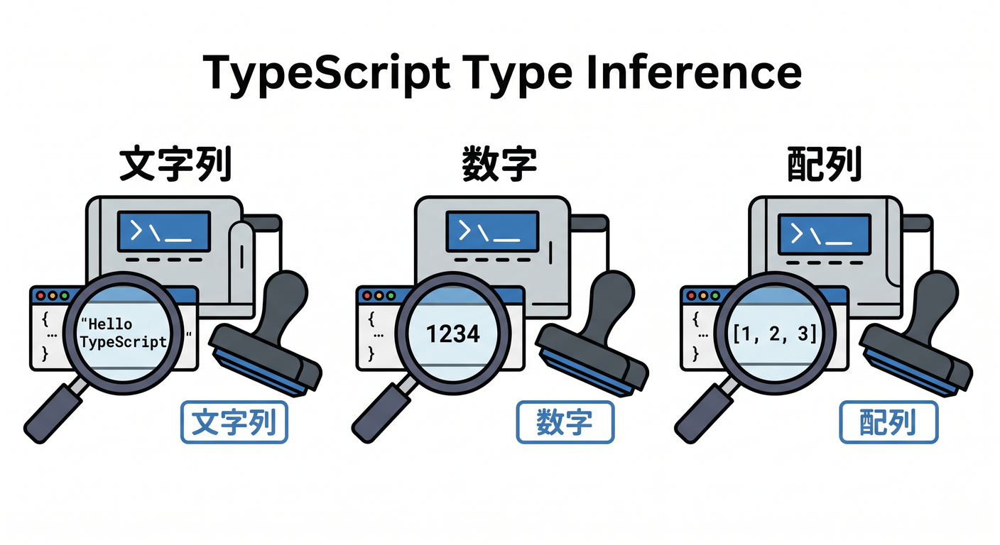
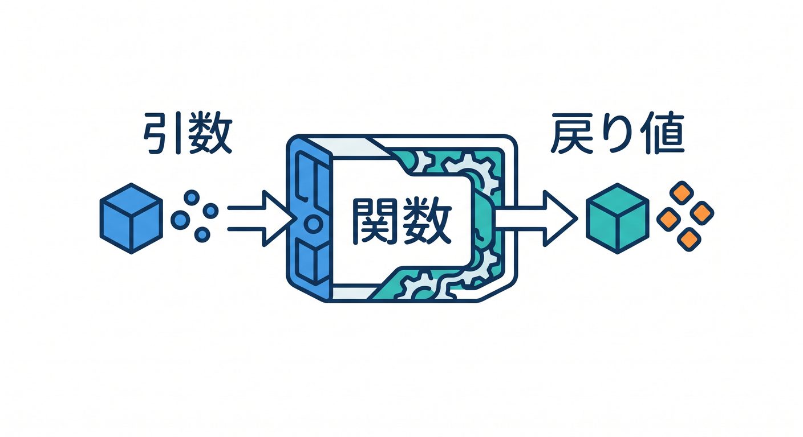
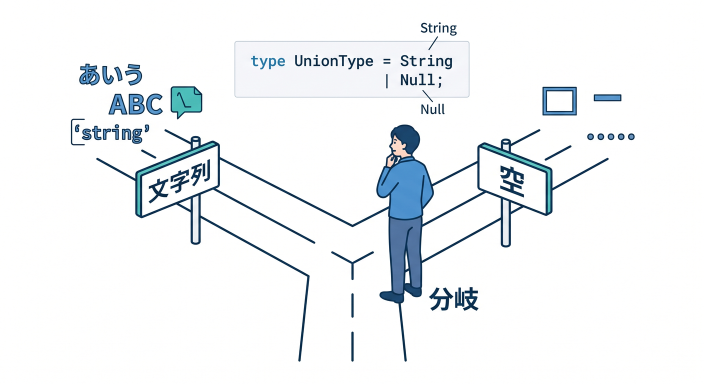
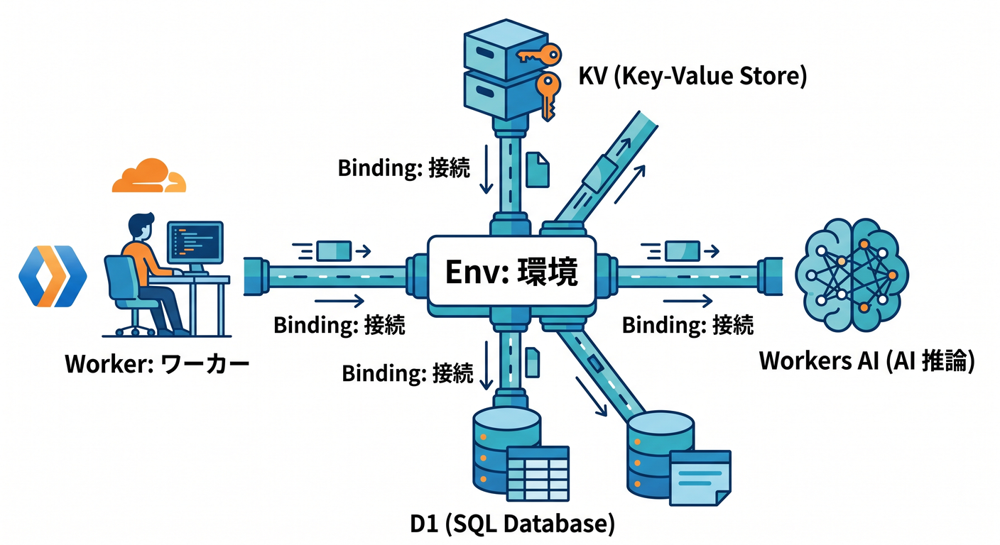

# 第03章：TypeScriptは“怖くない道具”として覚えよう ✍️

この章では、TypeScript を「難しい型パズル」ではなく、**React の画面**と**Cloudflare Workers の処理**を安全につなぐための道具として覚えていきます 😊
本日時点では、React の公式ドキュメントは最新版が **19.2**、Cloudflare 公式ガイドラインを中心に整備されていて、Workers では TypeScript が第一級サポートです。さらに TypeScript 自体も最新リリースが進んでいますが、ここで学ぶ基本はそのまま今の実務に十分通用します。([React][2])

この章が終わるころには、次のことができるようになれば十分です 🌷

* `string`、`number`、`boolean`、配列、オブジェクトを読める
* 関数の**引数**と**返り値**に型を書ける
* API の戻り値を「こういう形のデータ」として表せる
* `async` / `await` を使う関数の型の雰囲気がわかる
* React の `useState` に合わせて、状態の型を読める
* Cloudflare Workers で「型があると何がうれしいか」を実感できる

ここで大事なのは、**全部を暗記することではなく、見たときに怖がらないこと**です 😌

---

## 1. TypeScript は何者なの？🤔

TypeScript は、ざっくり言うと **JavaScript に型の情報を足したもの** です。TypeScript の公式説明でも、JavaScript の機能はそのまま使え、さらに型システムが乗ることで、実行前に不自然なコードへ気づきやすくなります。しかも TypeScript は多くの場合、値から型を自動で推測してくれるので、毎回ぜんぶ手で書かなくて大丈夫です。TypeScriptは「実験のための新しい言語」ではありません 🙌
**JavaScript のまま書きながら、VS Code の補完やエラー表示を強くしてくれる安全装置**だと思えばOKです。TypeScript 公式も、既存の JavaScript コードはそのまま TypeScript として扱える、という立場で説明しています。([TypeScript][4])

---

## 2. なぜ React と Cloudflare で TypeScript が効くの？☁️⚛️

Cloudflare の現行公式ガイドでは、React 側の `src/App.tsx` が Workers API を呼び、`worker/index.ts` 側がレスポンスを返す、という小さなフルスタック構成が基本です。ここで TypeScript があると、**「画面が期待しているデータの形」と「Worker が返すデータの形」がズレたときに早く気づける**のが大きな利点です。([Cloudflare Docs][1])

さらに Workers は TypeScript を第一級で扱っていて、Workers API 自体も型付きです。公式には `wrangler types` を使って、**自分の Worker 設定・binding・互換設定に合った型定義**を生成する流れが推奨されています。つまり Cloudflare では、TypeScript はおまけではなく、かなり本流です 🌟([Cloudflare Docs][5])

---

## 3. まずは「勝手についてくる」感覚をつかもう 🧩



最初に覚えたいのは、**TypeScript は全部を手書きしなくてもかなり推測してくれる**ことです。たとえば文字列を入れれば `string`、数字を入れれば `number`、配列なら中身を見て配列の型を考えてくれます。これは TypeScript の「型推論」の基本です。([TypeScript][6])

```ts
const title = "はじめてのCloudflare";
const count = 3;
const tags = ["react", "workers", "typescript"];
```

この例では、`title` は `string`、`count` は `number`、`tags` は `string[]` と読めるイメージです 😊  
最初のうちは、**「型を書く」より先に「VS Code が何型だと見ているか」**をホバーで確認するクセをつけるのがとてもおすすめです。

---

## 4. いちばん大事なのは「関数の入口と出口」🚪📦



React でも Workers でも、実務でまず効くのは**関数の型**です。TypeScript の公式ハンドブックでも、関数はアプリの基本部品として扱われています。特に初心者のうちは、**引数に何が入るか**、**返り値で何が出るか**の2点を押さえるだけでかなり見通しがよくなります。

```ts
function greet(name: string): string {
  return `こんにちは、${name}さん`;
}
```

これは、`name` に文字列を受け取り、返り値も文字列ですよ、という意味です 🌸
この書き方に慣れると、あとで API 関数を読んだときも「この関数は何を受け取って、何を返すのか」が一気に見やすくなります。

---

## 5. オブジェクト型は「データの設計図」🏗️


JavaScript では、データをまとめる基本はオブジェクトです。TypeScript でも、オブジェクトの形を表せるようになると一気に便利になります。公式ハンドブックでも、オブジェクト型は JavaScript でデータをまとめて受け渡しする中心的な方法として説明されています。([TypeScript][7])

```ts
type Message = {
  text: string;
  author: string;
};
```

これは、「`text` と `author` を持つデータ」という意味です。  
型名は `type` でも `interface` でも始められますが、この教材ではまず **“データの設計図を1つ作る”** くらいに理解すれば十分です 😊

この型を作ると、関数の引数もこんなふうに読めます。

```ts
type Message = {
  text: string;
  author: string;
};

function formatMessage(message: Message): string {
  return `${message.author}: ${message.text}`;
}
```

ここで大事なのは、「この関数は `Message` という形のデータを受け取る」とはっきり言えることです。
React と Workers の間で JSON をやり取りするとき、この考え方がそのまま効きます 📮

---

## 6. 配列は「同じ種類が並ぶ箱」と考えよう 📚


TypeScript の基本型では、配列は `string[]` や `number[]` のように書けます。公式ドキュメントでも、配列型は最初に覚える基本として扱われています。([TypeScript][8])

```ts
const members: string[] = ["Aki", "Mio", "Sora"];
const scores: number[] = [80, 95, 100];
```

オブジェクトの配列もよく出ます。

```ts
type Todo = {
  id: number;
  title: string;
};

const todos: Todo[] = [
  { id: 1, title: "Reactを読む" },
  { id: 2, title: "Workerを試す" }
];
```

React では `map()` で一覧表示することが多いので、**「オブジェクト1個の型」→「その配列」** の流れに慣れておくと、このあとかなりラクです ✨

---

## 7. APIの戻り値は“名前をつけて”扱おう 📡

React と Worker をつなぐとき、すごく効くのが **API レスポンスに型名をつける** ことです。Cloudflare の React + Vite ガイドでも、React 側が Worker のエンドポイントを呼んで結果を表示する流れが基本になっています。ここで戻り値の形を先に決めておくと、画面側のコードがかなり安心して書けます。([Cloudflare Docs][1])

```ts
type HelloResponse = {
  message: string;
};
```

この型を使っておけば、「この API は `message` という文字列を返す」という約束を、コードの中に残せます 👍  
初心者のうちは、**API 1本につき型1個** くらいの気持ちで十分です。

---

## 8. 非同期は「あとで返ってくる」を表している ⏳


API を呼ぶときは、すぐ値が返らず、あとで返ってきます。TypeScript では `async` 関数は `Promise` を返す形になり、`await` でその結果を待ちます。これは TypeScript のドキュメントでも基本の扱いです。

```ts
type HelloResponse = {
  message: string;
};

async function fetchHello(): Promise<HelloResponse> {
  const response = await fetch("/api/hello");
  const data = await response.json();
  return data as HelloResponse;
}
```

ここでは `Promise<HelloResponse>` が「最終的には `HelloResponse` が返ってくるよ」という意味です 🌈
最初は `Promise` という見た目が怖いかもしれませんが、**“まだ届いていない箱”** くらいに思えば大丈夫です。

---

## 9. union型は「どちらかかもしれない」を表す 🛣️



実際のアプリでは、「読み込み中はまだ `null`」「成功ならデータあり」「失敗なら文字列エラーあり」みたいな状態がよくあります。TypeScript では、こういう“複数の可能性”を union 型で表せます。公式の Narrowing の章では、`number | string` のような union を条件分岐で絞り込む考え方が説明されています。([TypeScript][9])

```ts
let result: string | null = null;

result = "取得できました";
```

`string | null` は「文字列かもしれないし、まだ空かもしれない」という意味です。  
そして `if (result !== null)` のようにチェックすると、その中では「これは文字列だ」と扱いやすくなります 😊

```ts
function printLength(value: string | number) {
  if (typeof value === "string") {
    return value.length;
  }

  return value.toString().length;
}
```

こういう分岐は、API レスポンスの状態表示やフォームのエラー表示でかなり役立ちます。

---

## 10. Reactでの型は、まず `useState` が読めれば十分 🪴

React の公式では、`useState` は「状態変数を追加する Hook」と説明されています。戻り値は `[state, setState]` の形で、状態の値と更新関数がセットで返ります。([React][10])

```tsx
import { useState } from "react";

export default function Counter() {
  const [count, setCount] = useState(0);

  return (
    <button onClick={() => setCount(count + 1)}>
      {count}
    </button>
  );
}
```

この例では、初期値が `0` なので `count` は `number` と推測されます。  
つまり最初は、**`useState(初期値)` を見て型がだいたい決まる**、と考えればかなり読みやすいです 🌱

文字列入力なら、こんな感じです。

````tsx
const [name, setName] = useState("");
`````

これなら `name` は `string` です。
そして、まだ値がない可能性を表したいなら、こうも書けます。

```tsx
const [message, setMessage] = useState<string | null>(null);
```

この1行が読めれば、フォーム・API結果・エラー表示のほとんどで困りにくくなります ✨

---

## 11. `useEffect` は“外の世界とつなぐ時だけ”意識しよう 🔌

React の公式では、`useEffect` は外部システムと同期するためのものと説明されていて、外のシステムとつながっていないなら不要なことも多い、と案内されています。これは今の React 学習ではとても大事な感覚です。([React][11])

`useEffect` を「何でも入れる箱」にしないのがコツです 🧯
型の章では、`useEffect` の細かい依存配列よりも、**“非同期処理にはデータの型が必要”** という点だけつかめれば十分です。

---

## 12. Cloudflare Workers 側では `Env` がすごく大事 🧰



Cloudflare Workers では、AI、KV、D1、R2 などの機能を binding として Worker に接続します。Workers AI を使うときも binding が必要で、dashboard か Wrangler 設定で追加します。([Cloudflare Docs][12])

この設定をすると、`env` に何が入っているかを型として扱えます。Cloudflare 公式は `wrangler types` を推奨していて、これにより Worker の `compatibility_date`、`compatibility_flags`、bindings などに合った型定義を生成できます。しかも 2026年1月以降は、複数環境の bindings をまとめて型生成する挙動や、`--check` で型ファイルの更新漏れを確認する仕組みも整っています。([Cloudflare Docs][5])

これを整理するとこうなります 😊

* `src/` 側の TypeScript … 画面で使うデータの型
* `worker/` 側の TypeScript … API や binding の型
* `Env` … Cloudflare の機能につながる入口

この整理ができると、Cloudflare のアプリ構成がかなり見通しよくなります。

---

## 13. Workers AI を使う未来のためにも、戻り値の型に慣れておこう 🤖✨

Cloudflare の Workers AI は Worker から binding 経由で使います。つまり React から直接 AI を叩くのではなく、**Worker が AI を呼び、React はその結果を JSON で受け取る**流れにするのが基本です。([Cloudflare Docs][12])

これが将来の AI 機能につながります 🌟
たとえば将来「要約する」「言い換える」「タイトル候補を返す」ミニ機能を作るときも、結局はこういう設計になります。

```ts
type AiSummaryResponse = {
  summary: string;
};
```

この“戻り値の設計図”を先に持てるだけで、AI っぽい機能も急に怖くなくなります。

---

## 14. VS Code と Copilot は“型を消す道具”ではなく“型を読む補助輪”として使おう 🚴‍♂️💬

VS Code の Copilot 公式情報では、Copilot はエージェント、チャット、インライン提案などを通じて、コード生成・理解・修正を助けてくれます。GitHub の公式ドキュメントでも、Copilot には「コードの意味を聞く」「バグ修正を相談する」「書き方を尋ねる」用途が案内されています。([Visual Studio Code][13])

Copilot に丸投げするより、“型をどう読んだか”を確認してもらう** 使い方が向いています 😊
たとえばこんな聞き方がとても相性いいです。

* 「この `type` は中学生にもわかる言葉で説明して」
* 「この関数の引数と返り値だけを教えて」
* 「この `useState<string | null>` は何を意味する？」
* 「Cloudflare Worker の `env` が何者か説明して」

Cloudflare 自身も、今は VS Code などのエディタから prompt ベースで開発する流れをドキュメント化していますし、Cloudflare 独自の MCP サーバー群も公開しています。だからこそ、**AI に書かせる前に、型を見て“それで合ってる？”と判断できる目**がますます大事です。([Cloudflare Docs][14])

---

## 15. 覚えるべき“最小ルール”を5個に絞るとこうなる 📌

ここまでを、本当に最小だけに圧縮するとこうです。

1. `:` の右に「この値の種類」を書く
2. 配列は `string[]` のように書ける
3. オブジェクトは `type` で設計図にできる
4. `async` 関数は `Promise<...>` を返す
5. API の戻り値には名前をつける

この5個だけで、React と Workers をつなぐ最初の学習にはかなり足ります 🙌

---

## 16. ミニ練習問題をやってみよう 📝✨

## 練習1：プロフィールの型を書いてみる

次のデータに型名をつけてみましょう。

```ts
{
  name: "Mio",
  age: 20,
  isMember: true
}
```

例：

```ts
type Profile = {
  name: string;
  age: number;
  isMember: boolean;
};
```

---

## 練習2：APIの返り値を表してみる

「投稿一覧を返す API」を想像して、1件ぶんの型と配列の型を書いてみましょう。

```ts
type Post = {
  id: number;
  title: string;
};

type PostsResponse = {
  posts: Post[];
};
```

---

## 練習3：`null` を混ぜてみる

「まだ読み込み前かもしれない」状態を作ってみます。

```ts
const [result, setResult] = useState<string | null>(null);
```

これが読めたらかなり順調です 🌸

---

## 17. この章のチェックポイント ✅

* `type User = { name: string }` を見て意味がわかる
* `async function getData(): Promise<Data>` を見て怖くない
* `useState<string>("")` を見て「文字列の状態だな」と思える
* Cloudflare では `wrangler types` が大事そうだとわかる
* API の戻り値に型を置く意味がわかる

ここまで来たら、この次の章で **create-cloudflare から React アプリを立ち上げたときに出てくる `.tsx` や `worker/index.ts` を、ただの暗号ではなく“読めるコード”として見始められる** はずです 😊([Cloudflare Docs][1])

TypeScript は、**賢そうに見せるための飾り**ではありません。
この教材における TypeScript は、**React の画面・Cloudflare Workers の API・AI や D1 などの bindings** を、気持ちよく安全につなぐための実用品です。Cloudflare の現在の公式導線でも React + Vite + Workers API が前面にあり、Workers では TypeScript と型生成が強く推奨されています。だからこの章では、難問を解くより先に、**「型があると安心」** という感覚をつかめれば大成功です 🎉([Cloudflare Docs][1])*「第3章の末尾に載せる確認テスト10問」** や
**「第4章へつなぐブリッジ文」** も作れます。

[1]: https://developers.cloudflare.com/workers/framework-guides/web-apps/react/?utm_source=chatgpt.com "React + Vite · Cloudflare Workers docs"
[2]: https://react.dev/versions?utm_source=chatgpt.com "React Versions"
[3]: https://www.typescriptlang.org/?utm_source=chatgpt.com "TypeScript: JavaScript With Syntax For Types."
[4]: https://www.typescriptlang.org/docs/handbook/typescript-in-5-minutes.html?utm_source=chatgpt.com "Documentation - TypeScript for JavaScript Programmers"
[5]: https://developers.cloudflare.com/workers/languages/typescript/?utm_source=chatgpt.com "Write Cloudflare Workers in TypeScript"
[6]: https://www.typescriptlang.org/docs/handbook/type-inference.html?utm_source=chatgpt.com "Documentation - Type Inference"
[7]: https://www.typescriptlang.org/docs/handbook/2/objects.html?utm_source=chatgpt.com "Documentation - Object Types"
[8]: https://www.typescriptlang.org/docs/handbook/2/everyday-types.html?utm_source=chatgpt.com "Documentation - Everyday Types"
[9]: https://www.typescriptlang.org/docs/handbook/2/narrowing.html?utm_source=chatgpt.com "Documentation - Narrowing"
[10]: https://react.dev/reference/react/useState?utm_source=chatgpt.com "useState"
[11]: https://react.dev/reference/react/useEffect?utm_source=chatgpt.com "useEffect"
[12]: https://developers.cloudflare.com/workers-ai/configuration/bindings/?utm_source=chatgpt.com "Workers Bindings · Cloudflare Workers AI docs"
[13]: https://code.visualstudio.com/docs/copilot/overview?utm_source=chatgpt.com "GitHub Copilot in VS Code"
[14]: https://developers.cloudflare.com/workers/get-started/prompting/?utm_source=chatgpt.com "Prompting - Workers"
