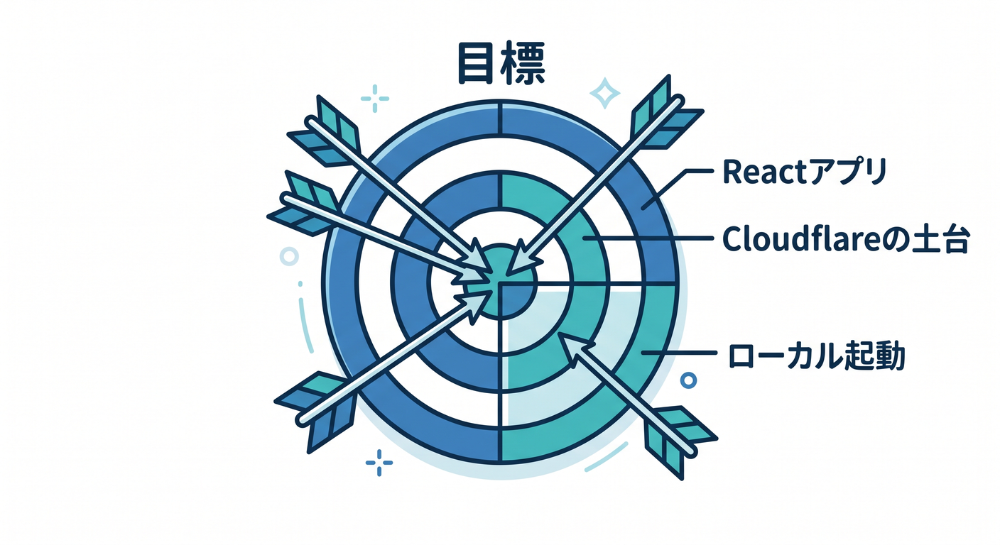
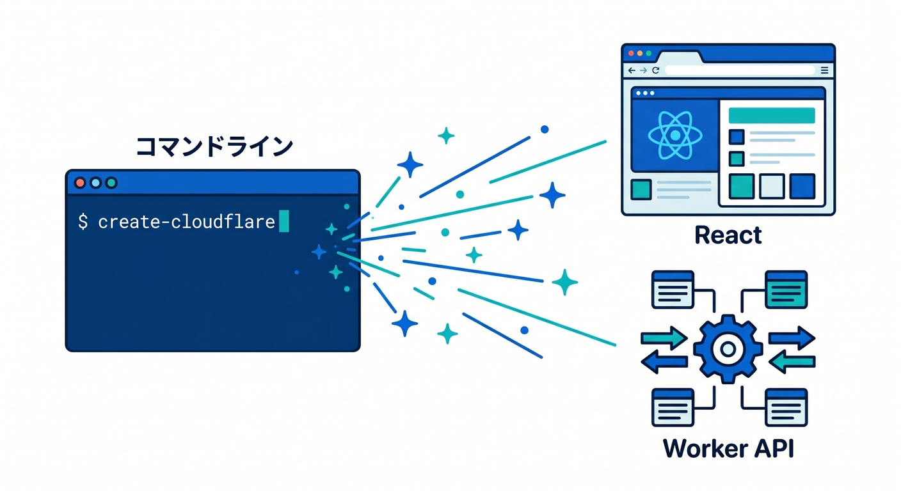
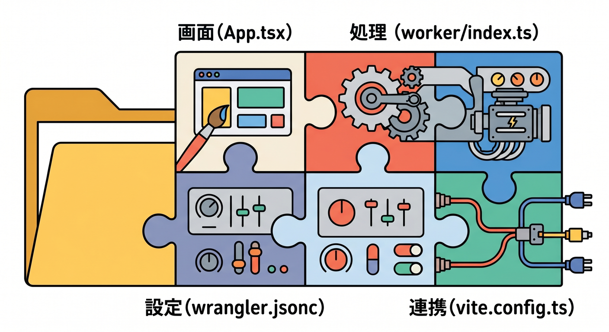
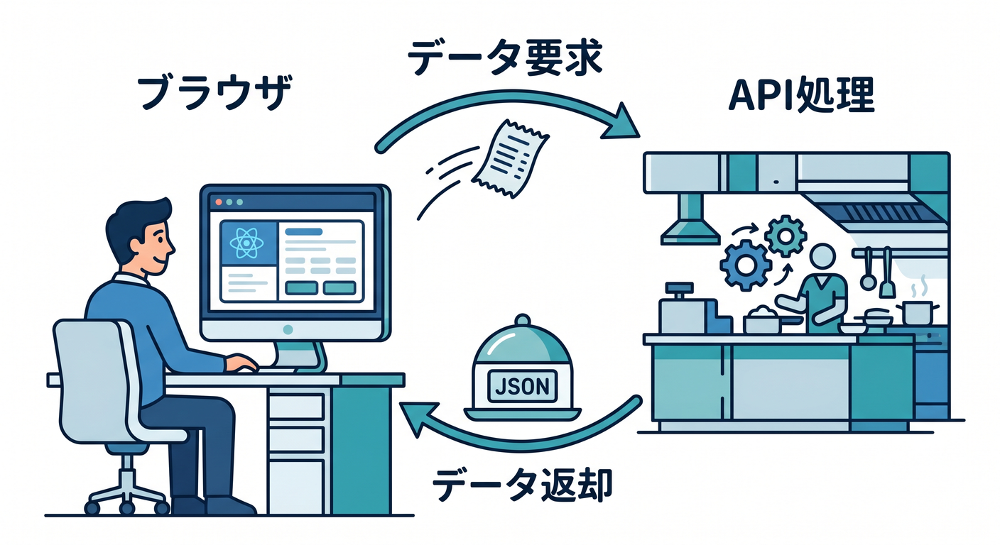
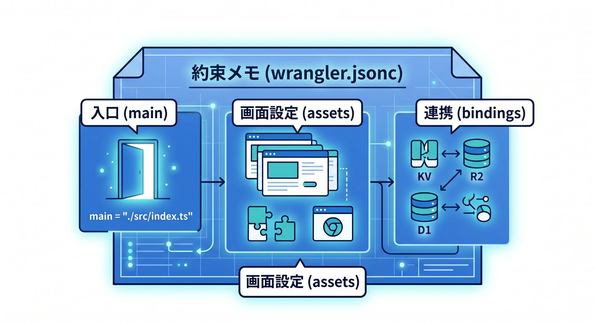
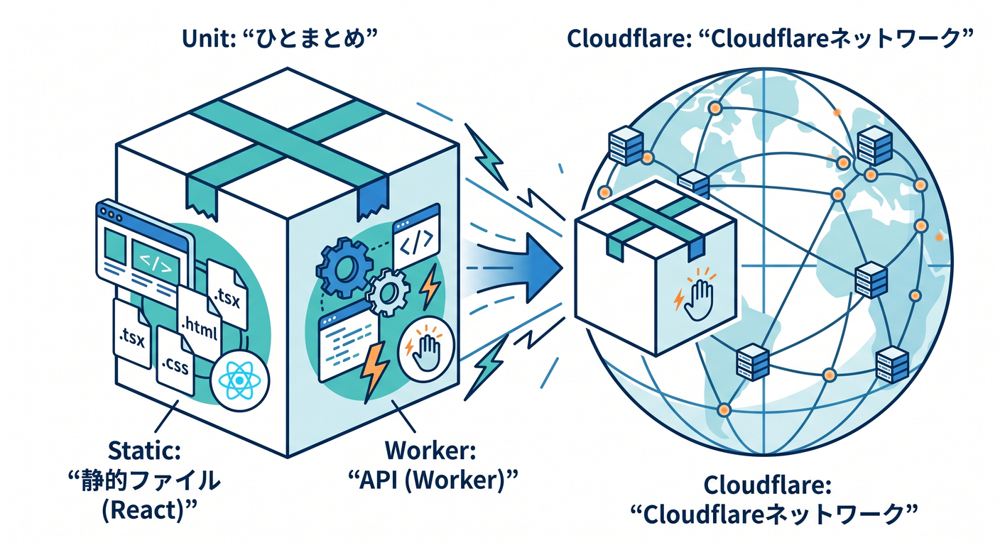
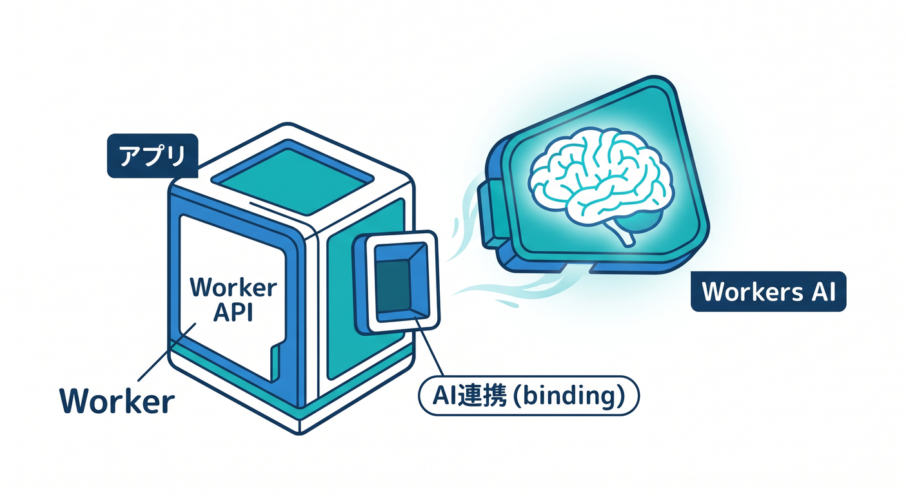

# 第04章：create-cloudflareで最初のReactアプリを作ろう 🚀

この章では、**Cloudflare公式のいちばん自然な始め方**で、Reactの画面とCloudflare Workersの土台をまとめて立ち上げます😊
本日時点の公式導線では、React向けに **C3（create-cloudflare）で React SPA + Workers API + Cloudflare Vite plugin をまとめて作る流れ** が案内されています。さらに React 公式では Create React App はメンテナンスモードで、React docs は最新メジャー版の内容を中心に更新されています。つまり今は、**古い雛形を探すより、C3で最新テンプレートから入るのがいちばん安全**です。 ([Cloudflare Docs][1])

---

## この章でできるようになること 🎯



この章のゴールは、むずかしい実装ではありません✨

1. Reactアプリを **Cloudflare土台つき** で作れる
2. **ローカルで起動**して、画面が出るところまで確認できる
3. **React側の画面** と **Worker側の処理** がどこにあるか分かる
4. 次の章につながる **wrangler.jsonc / vite.config.ts / worker/index.ts** の役割をざっくり説明できる

Cloudflare公式の React ガイドでは、生成される基本構成として **src/App.tsx**, **worker/index.ts**, **vite.config.ts**, **wrangler.jsonc** が示され、Worker は backend API、React 側はその API を呼ぶ画面として動く形になっています。 ([Cloudflare Docs][1])

---

## まず知っておきたいこと 🌱

**create-cloudflare（C3）** は、Cloudflareが新規プロジェクト作成のために用意しているCLIです。新しい Workers / Pages プロジェクトを作るための入口で、**フレームワークを使う場合は、そのフレームワーク側の公式生成コマンドも活かしながら** セットアップしてくれます。だから、雛形が古びにくいのが強みです✨ さらに、C3 実行時には **Wrangler も一緒に入る** ので、あとから個別に入れ直さなくてよい流れになっています。 ([Cloudflare Docs][2])

この教材では **React の通常テンプレート** を使います。理由はシンプルで、Cloudflare公式では **React Router v7 のフルスタック導線もある** ものの、**SPAモードは現時点では React テンプレートから始めて、React Router をライブラリとして使うほうがよい** と案内しているためです。今の章は「まず動かす」が最優先なので、この判断がいちばん素直です🌸 ([Cloudflare Docs][3])

---

## 作ってみよう 💻✨



Windows の PowerShell で、まずはこれを実行します。

```powershell
npm create cloudflare@latest -- my-react-app --framework=react
cd my-react-app
npm run dev
```

Cloudflare公式の React ガイドでも、このコマンドで **React SPA と Workers API を含むフルスタック構成** を開始する形が案内されています。ローカル開発はそのまま **npm run dev** で始められます。 ([Cloudflare Docs][1])

C3 は対話式で質問してくることがあります。ここでは **まずローカル起動が目的** なので、デプロイを聞かれたら後回しでも大丈夫です。C3 の公式説明でも、**デプロイは任意** とされています。最初の1回は「作る → 起動する → 中を見る」に集中するのがコツです😊 ([Cloudflare Docs][2])

---

## 画面が出たら、もう半分成功です 🎉

ローカルサーバーが起動したら、表示されたローカルURLをブラウザで開きましょう。
この時点で大事なのは、「見た目がReact」「でも土台はCloudflare向け」という感覚をつかむことです。

Cloudflare公式の React ガイドでは、このテンプレートは **Vite によるローカル開発** と **Cloudflare Vite plugin** の組み合わせで動き、Vite の HMR を使いながら、Cloudflare Workers runtime にかなり近い形で開発できると説明されています。 ([Cloudflare Docs][1])

---

## 生成されたフォルダを“こわがらず”読もう 📂👀

まずはこの4つだけ見ればOKです。

```text
my-react-app/
  src/
    App.tsx
  worker/
    index.ts
  index.html
  vite.config.ts
  wrangler.jsonc
```

これは Cloudflare公式の React ガイドで案内されている、代表的な最小構成です。**src/App.tsx** が画面、**worker/index.ts** がAPI側、**wrangler.jsonc** がCloudflareの設定、**vite.config.ts** がViteとCloudflare runtimeのつなぎ役です。 ([Cloudflare Docs][1])

## それぞれの役割 🧩



**src/App.tsx**
Reactの画面です。ボタン、見出し、表示エリアなど、ユーザーが見るものを置く場所です。 ([Cloudflare Docs][1])

**worker/index.ts**
Cloudflare Worker の入口です。Cloudflare公式ガイドでは、ここが **backend API** として動き、**/api/** に対してレスポンスを返す役を持ちます。 ([Cloudflare Docs][1])

**wrangler.jsonc**
Cloudflare用の設定ファイルです。公式ガイドでは、ここで **main が worker/index.ts を指す** こと、**assets.not_found_handling が single-page-application** に設定されること、そして今後 **bindings** を足す場所でもあることが説明されています。 ([Cloudflare Docs][1])

**vite.config.ts**
Vite と Cloudflare Workers runtime をつなぎます。Cloudflare Vite plugin は、**Workerコードを workerd 上で動かし、本番に近い挙動で開発できる** のが大きな特徴です。さらに HMR や preview も活かせます⚡ ([Cloudflare Docs][4])

---

## いま裏で起きていることを、やさしく図で考えるとこうです 🧠☁️



```text
ブラウザ
  ↓
React画面（src/App.tsx）
  ↓ fetch("/api/")
Worker（worker/index.ts）
  ↓
JSONや文字列を返す
  ↓
Reactが画面に表示する
```

Cloudflare公式の React ガイドでは、生成されたテンプレートは **Worker が /api/ エンドポイントを持ち、App.tsx がそこへアクセスして結果を表示する** 形として説明されています。第7章で本格的に扱いますが、この章では「もう最初からその入口があるんだ」と感じられれば十分です🙆‍♂️ ([Cloudflare Docs][1])

---

## 最初の小さな改造をしてみよう 🔧✨

ここでは「ちゃんと自分で触れた！」という成功体験がいちばん大事です。
おすすめは、**Workerが返すメッセージを変える** ことです。

たとえば教材用には、**worker/index.ts** をこんな感じにすると分かりやすいです。

```ts
export default {
  async fetch(request) {
    const url = new URL(request.url);

    if (url.pathname.startsWith("/api/")) {
      return Response.json({
        title: "はじめてのCloudflareミニアプリ",
        message: "React から Worker を呼べました！",
      });
    }

    return new Response(null, { status: 404 });
  },
} satisfies ExportedHandler;
```

この書き方そのものは教材用のシンプル例ですが、公式チュートリアルでも **pathname が /api/ で始まる時に JSON を返す Worker** を作る流れが紹介されています。 ([Cloudflare Docs][5])

次に、React側でその内容を読んで表示すると、**画面とAPIがつながっている感覚** がかなり強くなります。公式チュートリアルでも、**ボタンを押して /api/ を fetch し、JSON を state に入れて表示する** 例が案内されています。 ([Cloudflare Docs][5])

教材用のシンプルな例はこんな形です。

```tsx
import { useState } from "react";

type ApiResponse = {
  title: string;
  message: string;
};

export default function App() {
  const [data, setData] = useState<ApiResponse | null>(null);

  const loadMessage = async () => {
    const res = await fetch("/api/");
    const json = (await res.json()) as ApiResponse;
    setData(json);
  };

  return (
    <main style={{ padding: 24 }}>
      <h1>React × Cloudflare はじめの一歩 ☁️⚛️</h1>

      <button onClick={loadMessage}>
        Cloudflare Worker から受け取る
      </button>

      {data && (
        <section style={{ marginTop: 16 }}>
          <h2>{data.title}</h2>
          <p>{data.message}</p>
        </section>
      )}
    </main>
  );
}
```

ここでうれしいのが、Vite と Cloudflare Vite plugin の組み合わせでは、**クライアント側とサーバー側を行き来しながら編集しても、開発体験がかなり軽い** ことです。公式チュートリアルでは、クライアントとサーバーを一緒に調整しやすく、変更を回しやすい流れが示されています。 ([Cloudflare Docs][5])

---

## wrangler.jsonc は“Cloudflareとの約束メモ”です 📝☁️



最初はこわく見えますが、読むポイントは少ないです。

## 1. main

**どのファイルを Worker の本体として動かすか** を示します。Reactガイドや Vite plugin チュートリアルでは、**worker/index.ts** がここにつながります。 ([Cloudflare Docs][1])

## 2. assets.not_found_handling

**SPAの画面ルーティングを助ける設定** です。
Cloudflare公式では **single-page-application** を使うことで、React 側が担当する画面ルートは Worker に行かず、SPAとして扱えるようにする流れが案内されています。React向け構成ではこれがかなり大事です。 ([Cloudflare Docs][1])

## 3. bindings を足す場所

この章ではまだ本格利用しませんが、後の章で D1、KV、Workers AI などを使うとき、ここが大活躍します。Cloudflare公式でも、**Reactアプリは bindings に直接触らず、Worker を通して使う** 形が基本だと説明されています。 ([Cloudflare Docs][1])

---

## 「Cloudflareらしさ」はどこにあるの？ ☁️✨



ここ、すごく大事です。

Cloudflareの **Static Assets** では、**静的ファイルと Worker をひとまとまりでデプロイ** できます。つまり、Reactの画面だけ別サーバー、APIだけ別サーバー、と分けて考えなくても、**小さなフルスタックアプリ** としてまとめやすいんです。Cloudflare公式は、このデプロイを **一体化した unit** として説明しています。 ([Cloudflare Docs][6])

さらに Cloudflare Vite plugin は、**ローカル開発でも Worker コードを workerd で動かす** ので、「ローカルでは動いたのに本番でズレた😢」を減らしやすい設計です。これが第5章の主役になります⚡ ([Cloudflare Docs][4])

---

## AI をどう絡めるの？ 🤖🌟



この章ではまだ「AI機能そのもの」は作り込みません。
でも、**最初のアプリを Cloudflare 上で作る段階から、あとで AI を足せる形になっている** のがポイントです。

Cloudflare公式の Workers AI ドキュメントでは、Worker に **AI binding** を追加すると、**env.AI** として Workers AI を使えるようになります。つまり今作っている **React → Worker** の流れは、そのまま **React → Worker → Workers AI** に育てられます。後の章で AI を足すときも、土台は同じです✨ ([Cloudflare Docs][7])

Workers AI binding の設定イメージはこんな感じです。

```json
{
  "ai": {
    "binding": "AI"
  }
}
```

これは「いま設定しろ」という話ではなく、**この章の時点で、もうAI付きアプリへの入口が見えている** と理解できればOKです😊 ([Cloudflare Docs][7])

---

## GitHub Copilot はこの章でこう使うと気持ちいい 🤝✨

VS Code の GitHub Copilot は、現在の公式説明では **エージェント・チャット・インライン提案** などを使って、**複数ファイルの編集や説明、コマンド実行を伴う作業** を支援できます。つまりこの章のような「生成された雛形を読む」場面と相性がかなりいいです。 ([Visual Studio Code][8])

この章でおすすめの使い方は、コードを書かせるより **“説明させる”** ことです 🌸

たとえばこんなお願いが使えます。

* 「このCloudflare Reactプロジェクトのフォルダ構成を、初心者向けに説明して」
* 「worker/index.ts が何をしているか、行ごとにコメント付きで教えて」
* 「wrangler.jsonc の各項目を、難しい言葉なしで説明して」
* 「App.tsx から /api/ を呼ぶ流れを図解で説明して」

この使い方だと、AIに丸投げではなく、**自分の理解を増やす補助輪** として使えます🚲✨

---

## この章でハマりやすいポイント 🧯

## 1. いきなり全部理解しようとしない

この章の目的は、React・Worker・設定ファイルの全部を完全理解することではありません。
**まず起動した、次に1か所変えた、最後に役割が読めた**。これで十分です🌼

## 2. Dashboard と wrangler.jsonc を混ぜすぎない

Cloudflare公式は、**設定の source of truth を一つに寄せる** ことを勧めています。CLI中心で進めるなら、まずは **wrangler.jsonc 側を基準** に考えるのが分かりやすいです。 ([Cloudflare Docs][9])

## 3. ルーティングを今すぐ難しくしない

後で画面ルーティングを増やしたくなっても、この段階では **Reactテンプレートで始めて、必要になってからライブラリを足す** ほうが安全です。Cloudflare公式でも、SPA用途ではその方向が案内されています。 ([Cloudflare Docs][3])

---

## ミニ課題 ✍️🎈

この章の終わりに、次の3つをやってみてください。

1. 画面の見出しを、自分の好きなタイトルに変える
2. Worker が返す JSON の文字を、自分の言葉に変える
3. React 側でその返り値を表示して、「画面 ↔ API」の往復を確認する

できたら大成功です🎉

---

## まとめ 🌸☁️

この章で覚えてほしいのは、たったこれだけです。

* **C3 は、今のCloudflare公式な新規作成の入口**
* **Reactテンプレートで始めると、SPA + Worker API の土台をすぐ持てる**
* **Cloudflare Vite plugin によって、ローカルでも本番に近い感覚で触れる**
* **将来は bindings を足して、D1・KV・Workers AI まで広げられる**

Cloudflare公式の React ガイド、Static Assets、Vite plugin、Workers AI の各資料は、まさにこの流れでつながっています。だからこの章は、ただの「雛形作り」ではなく、**後の章ぜんぶの出発点** なんです🚀✨ ([Cloudflare Docs][1])

次の第5章では、この章で何気なく使った **Cloudflare Vite plugin** が、なぜそんなに開発しやすいのかを、もっとやさしく解きほぐしていきます⚡📘

必要ならこの続きで、同じ文体のまま **第4章の「練習問題付き完成版」** に整えて渡せます。

[1]: https://developers.cloudflare.com/workers/framework-guides/web-apps/react/ "React + Vite · Cloudflare Workers docs"
[2]: https://developers.cloudflare.com/pages/get-started/c3/ "Create projects with C3 CLI · Cloudflare Pages docs"
[3]: https://developers.cloudflare.com/workers/framework-guides/web-apps/react-router/ "React Router (formerly Remix) · Cloudflare Workers docs"
[4]: https://developers.cloudflare.com/workers/vite-plugin/ "Vite plugin · Cloudflare Workers docs"
[5]: https://developers.cloudflare.com/workers/vite-plugin/tutorial/ "Tutorial - React SPA with an API · Cloudflare Workers docs"
[6]: https://developers.cloudflare.com/workers/static-assets/ "Static Assets · Cloudflare Workers docs"
[7]: https://developers.cloudflare.com/workers-ai/configuration/bindings/ "Workers Bindings · Cloudflare Workers AI docs"
[8]: https://code.visualstudio.com/docs/copilot/overview "GitHub Copilot in VS Code"
[9]: https://developers.cloudflare.com/learning-paths/workers/get-started/c3-and-wrangler/ "C3 & Wrangler · Cloudflare Learning Paths"
