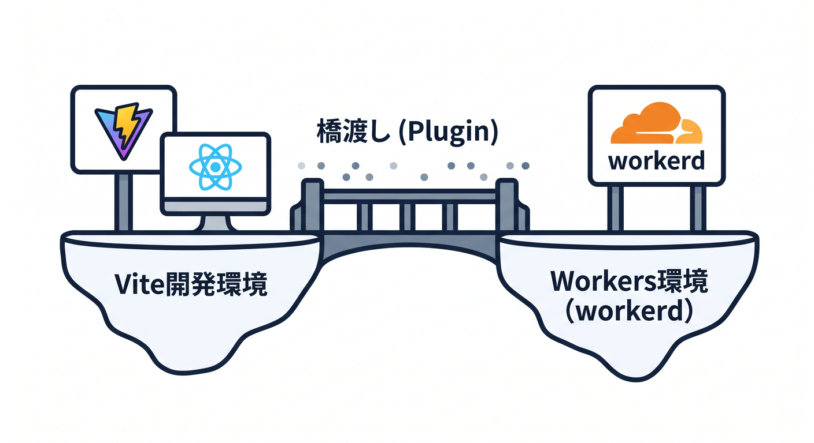
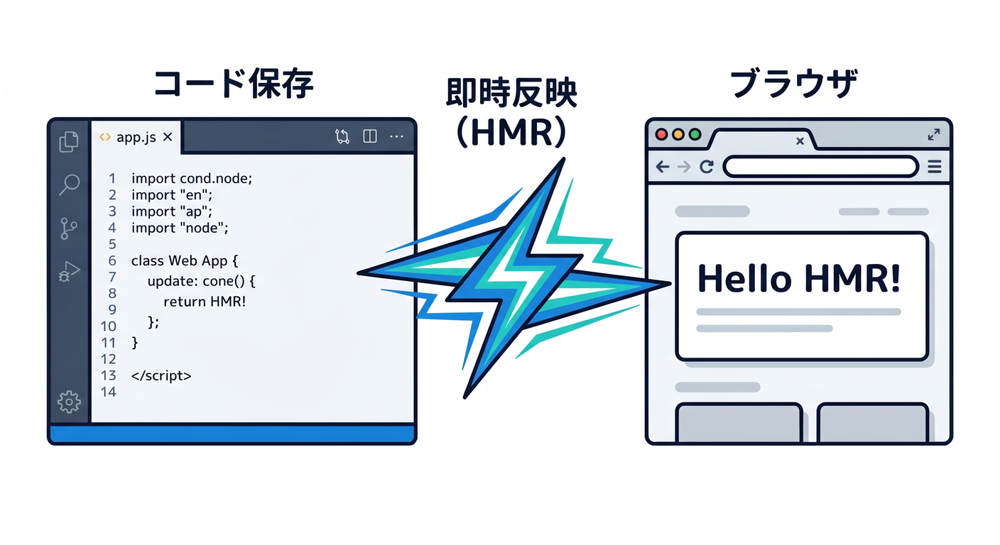
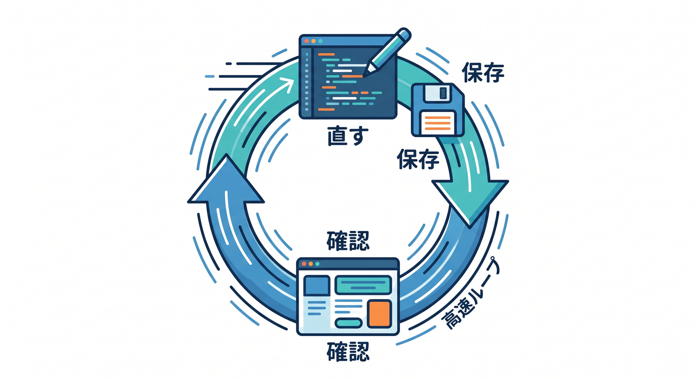
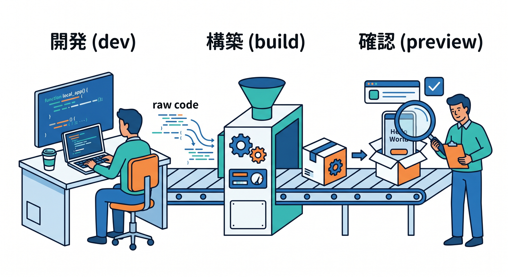
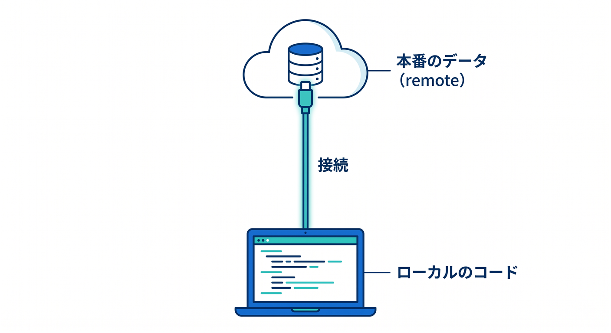

# 第05章：Cloudflare Vite pluginで“開発しやすさ”を体験しよう ⚡

この章では、前章で作った React アプリを使って、**Cloudflare Vite plugin の気持ちよさ**を実感していきます 😊
ここで大事なのは、難しい理屈を全部覚えることではありません。

**「保存したらすぐ見える」**
**「React の画面も Worker の処理も、かなり同じ流れで触れる」**
**「本番との差が小さい状態で開発しやすい」**

この3つを体で覚えることが、この章のゴールです 🚀
Cloudflare 公式では、React SPA と Workers API を C3 で始め、Cloudflare Vite plugin でローカル開発し、Vite で build・preview してから Cloudflare に deploy する流れが、かなり自然な基本導線になっています。さらに plugin は Vite と Workers runtime をつなぎ、Worker コードを workerd 上で動かすので、本番にかなり近い挙動で試しやすいのが大きな魅力です。 ([Cloudflare Docs][1])

---

## 1. この章でできるようになること 🎯

この章を終えるころには、こんなことができるようになります 🌸

* Cloudflare Vite plugin が「何を助けてくれる道具か」を説明できる
* 開発中に **npm run dev** を回す意味がわかる
* React 側の変更と Worker 側の変更を、1つの開発リズムで確認できる
* **npm run build → npm run preview** の意味がわかる
* 「Vite plugin が得意な場面」と「Wrangler が向く場面」の違いをざっくり言える

Cloudflare 公式は、Vite plugin を **Vite と Workers runtime のフル機能な統合**として案内していて、Workers runtime API や bindings へ直接アクセスでき、HMR による高速更新や、Workers runtime 上での preview に対応しています。いっぽうで、Cloudflare 自身も「フロント寄りの開発なら Vite plugin、API やバックエンド中心や remote 実行が主なら Wrangler」と整理しています。 ([Cloudflare Docs][2])

---

## 2. まず、Vite pluginって何者？ 🤔⚙️



ひとことで言うと、

**「Vite の快適な開発体験」と「Cloudflare Workers の実行環境」を、かなり自然にくっつけてくれる橋」**

です 🌉

普通の感覚だと、

* 画面はフロントエンドの開発サーバー
* API は別のサーバー
* 本番ではまた別の挙動

となりがちです。
でも Cloudflare Vite plugin を使うと、**React の開発しやすさを保ちつつ、Worker 側は workerd で動く**ので、「ローカルでは動いたのに本番で変だった」が減らしやすくなります。Cloudflare 公式でも、Worker コードは workerd で動き、本番の挙動にできるだけ近づけるための仕組みだと説明されています。さらに Vite 6 の Environment API が、この統合の土台になっています。 ([Cloudflare Docs][2])

---

## 3. 前章で作ったプロジェクトを見直そう 👀📁

C3 で React を作ると、Cloudflare 公式の簡略図ではこんな形が基本です。

* src/App.tsx … React の画面
* worker/index.ts … Worker 側の API
* index.html … エントリ
* vite.config.ts … Vite の設定
* wrangler.jsonc … Cloudflare 側の設定

Cloudflare の React + Vite ガイドでも、C3 の React テンプレートはこの考え方で組まれていて、**画面は React、処理は Worker、設定は vite.config.ts と wrangler.jsonc** という分担になっています。 ([Cloudflare Docs][1])

ここで特に見るのはこの2つです 👇

## vite.config.ts

ここに Cloudflare Vite plugin が入っています。

```ts
import { defineConfig } from "vite"
import react from "@vitejs/plugin-react"
import { cloudflare } from "@cloudflare/vite-plugin"

export default defineConfig({
  plugins: [react(), cloudflare()],
})
```

Cloudflare 公式のチュートリアルでも、React 用 plugin と一緒に cloudflare() を入れる形が基本です。plugin 側は特別な設定がなくても、プロジェクトのルートにある wrangler.jsonc / wrangler.json / wrangler.toml を見にいってくれます。 ([Cloudflare Docs][3])

## wrangler.jsonc

ここには、Cloudflare 上でどう動かすかの設定が入ります。

たとえば SPA では、こんな考え方がとても大事です。

```jsonc
{
  "$schema": "./node_modules/wrangler/config-schema.json",
  "name": "my-react-app",
  "compatibility_date": "2026-04-17",
  "assets": {
    "not_found_handling": "single-page-application"
  }
}
```

この設定を入れると、**見つからないパスは index.html を返す**ので、React Router のような SPA ルーティングが壊れにくくなります。しかも Cloudflare Vite plugin では、開発中もこの assets のルーティング設定が使われるため、**開発時と本番時でルーティングの感覚がそろいやすい**です。 ([Cloudflare Docs][3])

---

## 4. いちばん気持ちいい瞬間：保存したらすぐ反映される ⚡💨



ここがこの章の主役です 🎉

Cloudflare Vite plugin は、Vite の開発体験をそのまま活かせるので、**Hot Module Replacement（HMR）** が効きます。つまり、ファイルを保存するとブラウザ側がかなり素早く更新されます。Cloudflare 公式も、Vite plugin の特徴として HMR による高速更新をはっきり挙げています。 ([Cloudflare Docs][2])

前章で作ったプロジェクトのフォルダで、まずはこれを実行します。

**npm run dev**

Cloudflare の React + Vite ガイドでも、C3 で作ったあとは **npm run dev** でローカル開発サーバーを起動する流れです。そこでは「Vite の機能、特に HMR を使えること」と、「Cloudflare Vite plugin により Workers runtime 上で動くこと」がセットで説明されています。 ([Cloudflare Docs][1])

---

## 5. 実習① React 側だけを変えて、HMRを体感しよう 🎨✨

まずは UI の文字だけ変えてみましょう。
たとえば src/App.tsx の見出しを少し変えます。

```tsx
export default function App() {
  return (
    <main style={{ padding: "24px", fontFamily: "sans-serif" }}>
      <h1>こんにちは！ Cloudflare + React 開発中です ⚛️☁️</h1>
      <p>保存したら、すぐ画面に反映されるか見てみよう 👀</p>
    </main>
  )
}
```

保存すると、かなりすぐにブラウザへ変化が見えるはずです。
ここで覚えてほしいのは、

**「あ、Cloudflare の開発って思ったより重くない」**

という感覚です 😊
Vite plugin はフロント寄りの開発に向いていて、React・Vue・Svelte・Solid などの Vite ベース開発に自然に乗れる、と Cloudflare 公式も案内しています。 ([Cloudflare Docs][4])

---

## 6. 実習② Worker 側を変えて、“Reactだけじゃない”を体感しよう 🔌🛠️

次に、Worker 側の応答を少し変えます。
たとえば worker/index.ts をこんな雰囲気にしてみます。

```ts
export default {
  async fetch(request: Request): Promise<Response> {
    const url = new URL(request.url)

    if (url.pathname === "/api/message") {
      return Response.json({
        message: "Worker から来たメッセージです ✨",
        time: new Date().toISOString(),
      })
    }

    return new Response("Not Found", { status: 404 })
  },
}
```

そして React 側では、その API を読んで表示してみます。

```tsx
import { useEffect, useState } from "react"

type ApiResponse = {
  message: string
  time: string
}

export default function App() {
  const [data, setData] = useState<ApiResponse | null>(null)

  useEffect(() => {
    fetch("/api/message")
      .then((res) => res.json())
      .then((json) => setData(json))
  }, [])

  return (
    <main style={{ padding: "24px", fontFamily: "sans-serif" }}>
      <h1>Cloudflare Vite plugin 体験中 ⚡</h1>
      <p>React から Worker の API を呼んでいます。</p>

      {data ? (
        <section>
          <p>メッセージ: {data.message}</p>
          <p>時刻: {data.time}</p>
        </section>
      ) : (
        <p>読み込み中… ⏳</p>
      )}
    </main>
  )
}
```

Cloudflare 公式の React + Vite ガイドでも、**worker/index.ts 側に API を置き、src/App.tsx からそのエンドポイントを呼ぶ**形が基本の学習導線です。大事なのは、**画面と API を同じ流れで触れる**こと。フロントとバックが別世界に見えにくくなります。 ([Cloudflare Docs][1])

---

## 7. 「Vite pluginが便利」というより、「確認の往復が速い」が本質 🧠✨



この章で本当に感じてほしいのはここです。

Vite plugin の価値は、単に「Vite を使ってます」ではありません。
本質は、

**変更 → 保存 → 確認 → 直す → もう一度確認**

この往復がすごく軽いことです 🚴‍♀️💨

Cloudflare 公式でも、Vite plugin は **rapid iteration**、つまり高速な試行錯誤に向くと整理されています。React の見た目の調整、Worker のレスポンス修正、軽い API の追加、CSS の見直しなどを、短いテンポで繰り返しやすいのが強みです。 ([Cloudflare Docs][4])

---

## 8. build と preview の意味をここで覚えよう 📦🔍



開発中は **npm run dev** で気持ちよく進めれば OK です。
でも、そこで終わると少し危ないです 😌

実際には、

1. 開発する
2. build する
3. preview する
4. 問題なければ deploy する

という流れが大事です。

Cloudflare の Vite plugin チュートリアルでは、**npm run build** でビルドし、**npm run preview** でそのビルド結果を Workers runtime 上でローカル実行し、最後に **wrangler deploy** で本番へ出す流れが示されています。preview は、**ビルド後の出力を本番に近い形で確認する工程**です。 ([Cloudflare Docs][3])

つまり、こんなイメージです 👇

* **npm run dev**
  いちばん速く試すモード 🚀

* **npm run build**
  本番向けの成果物を作るモード 📦

* **npm run preview**
  その成果物を Workers runtime で確認するモード 🔍

この差がわかると、だいぶ実務っぽくなります ✨

---

## 9. buildすると何が起こるの？ 🏗️

Cloudflare 公式チュートリアルでは、build 後の dist フォルダに、**client 側の出力**と **Worker 側の出力 + 出力用 wrangler.json** ができると説明されています。
ここはとても重要です。

つまり Vite plugin は、単にフロントを固めるだけでなく、**Cloudflare へ出す形に合わせて Worker 側も準備してくれる**わけです。さらに、あなたが普段編集する wrangler.jsonc は「入力設定」で、build 時には別の出力用 wrangler.json が作られ、それが preview や deploy に使われます。 ([Cloudflare Docs][3])

初心者目線で言うと、

**「自分は元の設定ファイルを触る」**
**「ビルド時に配信用の整った形が別で作られる」**

と覚えれば十分です 🙆‍♂️

---

## 10. じゃあ Wrangler はもう不要？ …ではないです 🧰


ここ、すごく大事です。

Vite plugin が便利でも、**Wrangler が消えるわけではありません。**
Cloudflare 公式ははっきりと、用途によって使い分ける考え方を出しています。

* **Vite plugin が向く**

  * React などのフロント中心開発
  * HMR がほしい
  * Vite の bundling や最適化を使いたい
  * 画面と Worker を気持ちよく一緒に触りたい

* **Wrangler が向く**

  * API やバックエンド中心
  * remote で Worker 全体を Cloudflare 上で実行したい
  * フロントが軽くて HMR が重要ではない

特に Cloudflare 公式は、**Worker をまるごと remote 実行する開発は Wrangler の担当**だと整理しています。Vite plugin には Wrangler の **wrangler dev --remote** に相当するものはありません。 ([Cloudflare Docs][4])

なので、考え方はこうです 👇

**普段の快適な開発は Vite plugin**
**必要に応じて Cloudflare 寄りの確認や運用は Wrangler**

この住み分けが自然です 😊

---

## 11. でも「リソースだけ本物を使う」はできるよ 🌐🪣



ここは 2026 時点でかなり便利になっているポイントです ✨

Vite plugin には、**remote bindings** が使えます。
これは「Worker のコード自体はローカルで動かしつつ、D1 や KV や R2 などの binding 先だけ本物の Cloudflare リソースに接続する」仕組みです。Cloudflare は remote bindings を、Wrangler・Cloudflare Vite plugin・Vitest plugin でサポートしていると案内しています。 ([Cloudflare Docs][5])

たとえば R2 なら、こんな感じです。

```jsonc
{
  "r2_buckets": [
    {
      "binding": "MY_BUCKET",
      "bucket_name": "my-bucket",
      "remote": true
    }
  ]
}
```

これのうれしさは、

**コードの反復はローカルの速さで続けたい**
でも
**データは実物に近いものを見たい**

という両方を取りやすいことです 🌟

ただし、いきなり本番データに触るのは怖いので、Cloudflare 公式も **development / staging 用リソースを分ける**考え方を勧めています。 ([Cloudflare Docs][5])

---

## 12. AIサービスとの相性もここで意識しておこう 🤖☁️


この教材は後半で Workers AI も扱うので、第5章の時点で「Vite plugin と AI は相性がいい」と感じておくと流れがきれいです。

Cloudflare の開発・テスト文書では、**binding は通常ローカルシミュレーションが使われるが、AI binding は常に remote** と説明されています。つまり、Workers AI を使うときは、ローカル開発中でもモデルの実行自体は Cloudflare 側に行われます。 ([Cloudflare Docs][5])

Workers AI の binding 自体は、Wrangler 設定に **ai.binding** を追加し、Worker 側で **env.AI.run()** を使う形です。Cloudflare の公式例でもその形で説明されています。 ([Cloudflare Docs][6])

たとえば将来の章では、こんな感じのコードに進みます。

```ts
type Env = {
  AI: Ai
}

export default {
  async fetch(request: Request, env: Env): Promise<Response> {
    const result = await env.AI.run("@cf/meta/llama-3.1-8b-instruct", {
      prompt: "ReactとCloudflare Vite pluginの役割を一言で説明して",
    })

    return Response.json(result)
  },
}
```

第5章の段階では、
**「今はまだ AI を本格利用しなくても、開発の土台はこの plugin の上に乗っていく」**
くらいで OK です 🙌

---

## 13. Copilot をどう使うと、この章がラクになる？ 🤝✨

今の VS Code では、GitHub Copilot は built-in extension として入り、チャット・補完・agents も最初から使える形になっています。さらに agents には Ask / Plan / Agent などがあり、実装前の整理やコード修正の流れを支援できます。 ([Visual Studio Code][7])

この章で相性がいい使い方はこんな感じです 🌼

* **Ask 系の使い方**

  * 「vite.config.ts の cloudflare() は何をしてる？」
  * 「wrangler.jsonc の assets 設定をやさしく説明して」

* **Plan 系の使い方**

  * 「この React SPA に /api/message を追加する最小手順を整理して」
  * 「build / preview / deploy の違いを、初心者向けに箇条書きで」

* **Agent 系の使い方**

  * 「App.tsx に読み込み中表示を追加して」
  * 「worker/index.ts に JSON を返すエンドポイントを追加して」

第5章では、Copilot に丸投げするより、
**“自分で触る → わからない部分だけ相談する”**
くらいがちょうどいいです 👍✨

---

## 14. この章でハマりやすいポイント 😵‍💫🧯

## その1：画面だけ見て「動いた」と思う

React 側の表示が変わっても、Worker 側の API は別です。
**画面の変更**と**API の変更**を分けて確認しましょう。

## その2：dev と preview を同じものだと思う

dev は高速に試すため、preview はビルド結果を確かめるため。
**両方やる意味がある**と覚えるのが大事です。 ([Cloudflare Docs][3])

## その3：Vite plugin なら何でも remote 実行できると思う

Worker 全体を remote 実行するのは Wrangler 側の役目です。
Vite plugin で使えるのは、主に **ローカル実行 + 必要なら remote bindings** です。 ([Cloudflare Docs][4])

## その4：AI もローカルで全部再現されると思う

AI bindings は常に remote です。
なので、AI機能は「Cloudflare 側の実行を使うもの」と考えておくと混乱しにくいです。 ([Cloudflare Docs][5])

---

## 15. 練習課題 📝🎮

この章の終わりに、次の3つをやってみてください。

## 課題A

src/App.tsx の見た目を変えて、保存時の更新の速さを確認する。

## 課題B

worker/index.ts に **/api/hello** を追加して、React から fetch して表示する。

## 課題C

**npm run build → npm run preview** までやって、dev のときと感覚がどう違うかメモする。

この3つができれば、第5章のねらいはかなり達成です 🌟

---

## 16. ミニ確認テスト ✅✨

## Q1.

Cloudflare Vite plugin のいちばん大きな価値は何ですか？

**答えの例**
Vite の快適な開発体験を使いながら、Worker を workerd で動かし、本番にかなり近い挙動で確認しやすくすること。 ([Cloudflare Docs][2])

## Q2.

HMR がうれしいのはなぜですか？

**答えの例**
保存してすぐ反映されるので、画面調整や API まわりの試行錯誤を高速で繰り返せるから。 ([Cloudflare Docs][2])

## Q3.

Worker を Cloudflare 上で remote 実行したいとき、主に使うのは何ですか？

**答えの例**
Wrangler。Vite plugin には wrangler dev --remote 相当はありません。 ([Cloudflare Docs][4])

## Q4.

AI bindings はローカル開発でどう扱われますか？

**答えの例**
AI models は remote 実行で使われる。通常 binding のようなローカルシミュレーションとは少し違う。 ([Cloudflare Docs][5])

---

## 17. この章のまとめ 🌈

第5章で覚えてほしいことは、たったこれだけです 😊

* Cloudflare Vite plugin は、**Vite の開発しやすさ**と**Workers runtime**をうまくつなぐ
* **npm run dev** で、React も Worker もかなり軽快に触れる
* **HMR** があるので試行錯誤がとても速い
* **build と preview** を通すと、本番前の確認がしやすい
* remote 実行そのものは Wrangler が得意
* D1 / KV / R2 などは **remote bindings** で「コードはローカル、資源は Cloudflare」もできる
* Workers AI は今後の章で自然につながる土台になっている

つまりこの章は、
**「Cloudflare で React を開発するの、思ったより気持ちいいな 😆」**
をつかむ章です。

---

## 18. 次章へのつなぎ 🚪✨

次の章では、ここで整った開発環境の上に、**もっと“アプリっぽい画面”**を作っていきます 🎨
ボタン、入力欄、表示エリア、読み込み中メッセージなどを置いて、React 側の見た目を少しずつ育てていきましょう 🌷

必要ならこの続きとして、同じトーンで
**「第6章　画面を作ろう：ボタン・入力欄・表示エリア 🎨」**
もそのまま詳しく作れます。

[1]: https://developers.cloudflare.com/workers/framework-guides/web-apps/react/ "React + Vite · Cloudflare Workers docs"
[2]: https://developers.cloudflare.com/workers/vite-plugin/ "Vite plugin · Cloudflare Workers docs"
[3]: https://developers.cloudflare.com/workers/vite-plugin/tutorial/ "Tutorial - React SPA with an API · Cloudflare Workers docs"
[4]: https://developers.cloudflare.com/workers/development-testing/wrangler-vs-vite/ "Choosing between Wrangler & Vite · Cloudflare Workers docs"
[5]: https://developers.cloudflare.com/workers/development-testing/ "Development & testing · Cloudflare Workers docs"
[6]: https://developers.cloudflare.com/workers-ai/configuration/bindings/ "Workers Bindings · Cloudflare Workers AI docs"
[7]: https://code.visualstudio.com/updates/v1_116 "Visual Studio Code 1.116"
