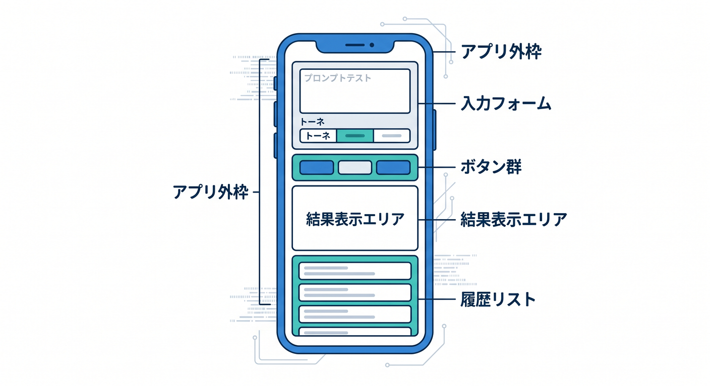
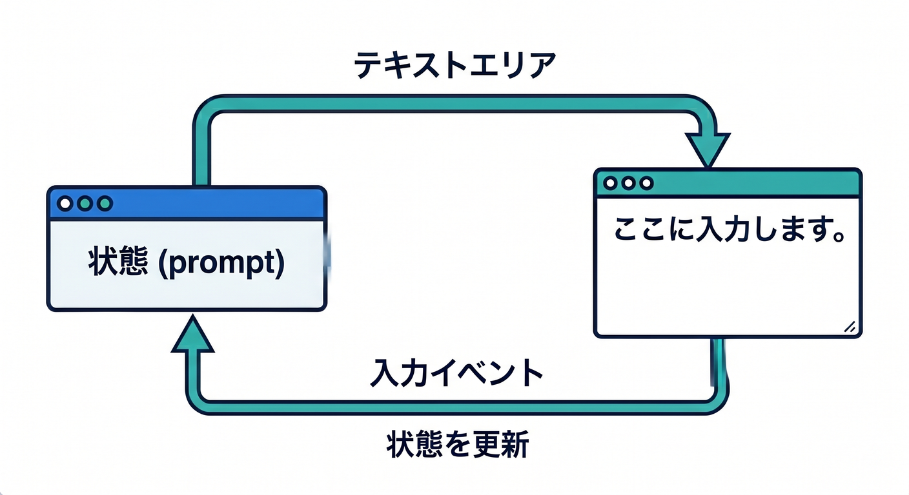
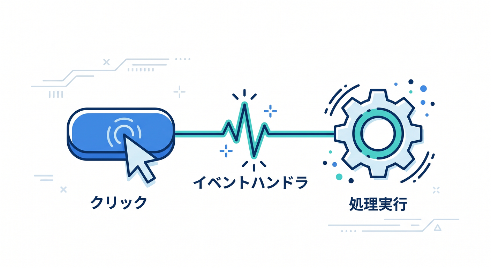
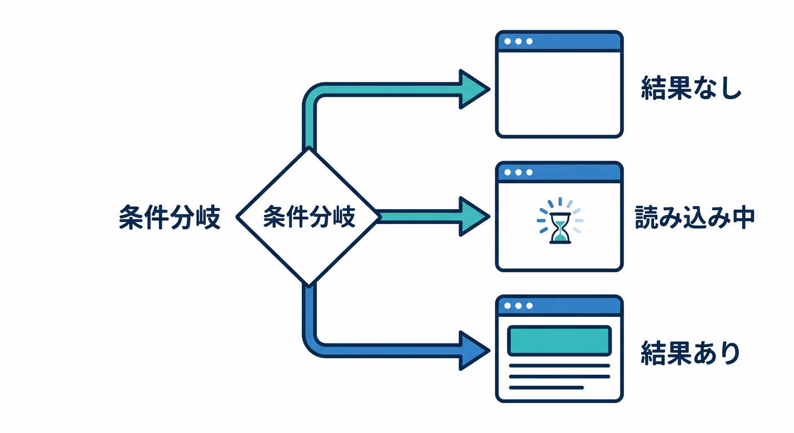
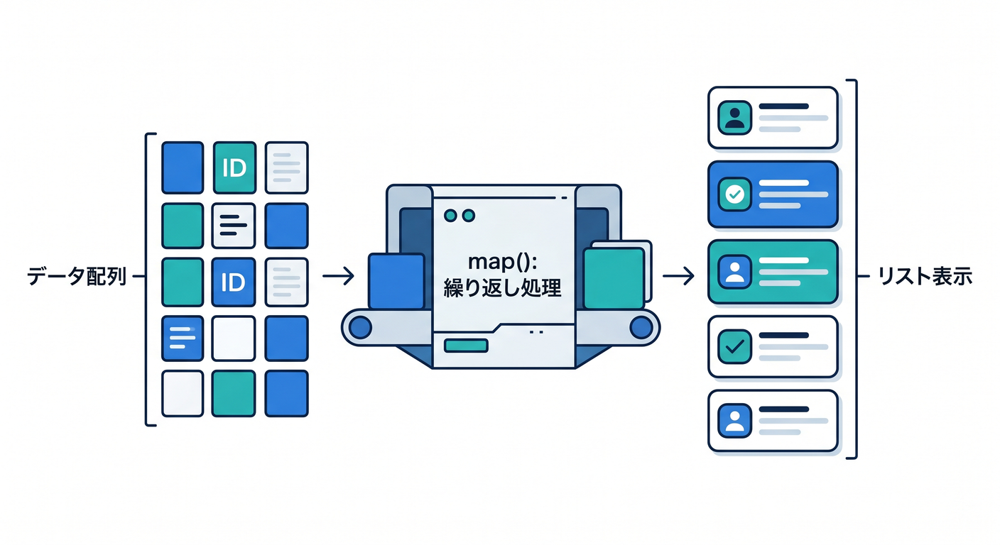
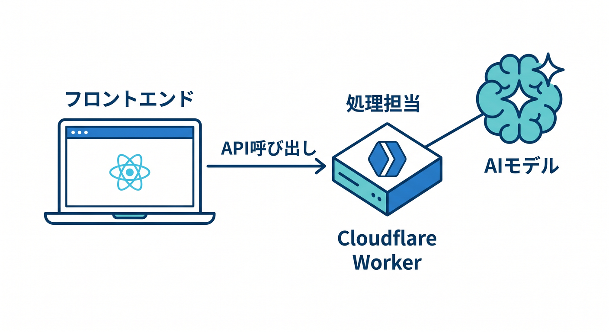

# 第06章：画面を作ろう：ボタン・入力欄・表示エリア 🎨

この章では、いったん API 接続はいったん横に置いて、React 側の見た目をしっかり作ります 😊
Cloudflare の公式導線は、React SPA と Workers API を `create-cloudflare` と Cloudflare Vite plugin でまとめて始める形になっていて、ローカル開発でも Workers runtime にかなり近い挙動を確認しやすいのが強みです。だからこそこの章では、「あとで Worker とつなぎやすい UI」を先に作るのがすごく理にかなっています。 ([Cloudflare Docs][1])

React 公式でも、イベント処理、入力欄、条件分岐、配列からの一覧表示、状態管理が UI の基本として整理されています。第6章では、その中でも特に「押せる」「入力できる」「表示が切り替わる」「履歴が並ぶ」の4つに絞って、小さなアプリの見た目を完成に近づけます。 ([React][2])

なお、React 19 はすでに安定版で、`useActionState` や `<form action>` など新しいフォーム系機能もあります。ただ、この章ではあえてそこへ飛び込まず、`useState`、`onChange`、`onClick` で「画面がどう動くか」をまず自分の手で理解する方を優先します。基礎が見えると、その後の新機能もずっと理解しやすくなります 🌱 ([React][3])

---

## この章のゴール 🎯

この章が終わるころには、こんな画面を自力で作れるようになるのが目標です。

* タイトルと説明文がある
* テキスト入力欄がある
* モードを選ぶプルダウンがある
* ボタンを押すと表示エリアが切り替わる
* 読み込み中メッセージが出る
* 結果カードが表示される
* 直前の履歴が一覧で並ぶ

ここで作る UI は、次章で Workers API とつなぎ、その先では Workers AI につなぐ前提の「土台」になります。Workers AI は Cloudflare のネットワーク上でサーバーレスに AI モデルを呼べる仕組みで、Workers から使えるので、今のうちに「入力欄」「送信ボタン」「結果カード」を整えておく意味が大きいです。 ([Cloudflare Docs][4])

---

## この章で作る題材 🪄🤖

今回は、あとで AI 要約や AI 返信につなげやすいように、**「ひとこと相談 UI」** を作ることにします。

まだ Cloudflare Worker は呼びません。
でも見た目はちゃんとアプリっぽくします ✨

画面の流れはこんな感じです。

1. ユーザーが相談文を入力する
2. 返答トーンを選ぶ
3. ボタンを押す
4. いったん「考え中…」を出す
5. 仮の結果カードを表示する
6. 履歴にも残す

この設計にしておくと、後で「仮の結果」を API の実レスポンスに差し替えるだけで、かなり自然に Cloudflare アプリへ育てられます 😊

---

## まず理解したい React の考え方 🧠✨

React では、ボタンを押した、文字を入力した、送信中になった、結果が返った、という変化を **state** で持ち、見た目はその state に応じて切り替えます。React 公式でも、UI を作るときは「どんな見た目の状態があるか」を先に考え、それを `useState` で表す流れが紹介されています。 ([React][5])

また、React の入力系コンポーネントである `<input>`、`<textarea>`、`<select>` は、`value` を渡すと「制御された入力」として扱われます。これを使うと、「今どんな文字が入っているか」「選択中のモードは何か」を React 側で安全に持てるので、学習段階ではとてもおすすめです。 ([React][6])

---

## 画面の完成イメージを先に決めよう 🖼️

先に「状態」を決めると、コードがかなり書きやすくなります。

今回の state はこの5つで十分です。

* `prompt` … 入力欄の文字
* `tone` … 返答トーン
* `isLoading` … 読み込み中かどうか
* `result` … 表示する結果文
* `history` … 過去の結果一覧

React 公式でも、state は「必要最小限」にして、重複や矛盾を避けるのが大切だと説明されています。たとえば「表示中の結果」と「履歴の先頭」に同じ情報を無理に二重管理すると、あとでズレやすくなります。 ([React][7])

---

## まずは `App.tsx` を作ろう 💻

`src/App.tsx` をこんな形にしてみましょう。

```tsx
import { useState } from "react";
import "./App.css";

type HistoryItem = {
  id: number;
  prompt: string;
  tone: string;
  preview: string;
};

export default function App() {
  const [prompt, setPrompt] = useState("");
  const [tone, setTone] = useState("やさしく");
  const [isLoading, setIsLoading] = useState(false);
  const [result, setResult] = useState("");
  const [history, setHistory] = useState<HistoryItem[]>([]);

  async function handlePreview() {
    const trimmed = prompt.trim();
    if (!trimmed) return;

    setIsLoading(true);
    setResult("");

    await new Promise((resolve) => setTimeout(resolve, 700));

    const preview = `【${tone}モード】「${trimmed}」への仮の返答です。ここは次章で Workers API の結果に置き換わります。`;

    setResult(preview);
    setHistory((prev) => [
      {
        id: Date.now(),
        prompt: trimmed,
        tone,
        preview,
      },
      ...prev,
    ].slice(0, 5));

    setIsLoading(false);
  }

  function handleClear() {
    setPrompt("");
    setTone("やさしく");
    setResult("");
    setIsLoading(false);
  }

  return (
    <main className="page">
      <section className="app-card">
        <p className="eyebrow">React × Cloudflare mini app</p>
        <h1>ひとこと相談プレビュー 🤖</h1>
        <p className="lead">
          まずは見た目だけ作ります。あとで Cloudflare Workers とつなぎます。
        </p>



        <div className="form-block">
          <label htmlFor="prompt" className="label">
            相談文 ✍️
          </label>
          <textarea
            id="prompt"
            className="textarea"
            rows={5}
            value={prompt}
            onChange={(e) => setPrompt(e.target.value)}
            placeholder="例：勉強のやる気が出ないとき、どう始めればいい？"
          />
        </div>

        <div className="form-block">
          <label htmlFor="tone" className="label">
            返答トーン 🎭
          </label>
          <select
            id="tone"
            className="select"
            value={tone}
            onChange={(e) => setTone(e.target.value)}
          >
            <option value="やさしく">やさしく</option>
            <option value="ていねいに">ていねいに</option>
            <option value="短めに">短めに</option>
            <option value="前向きに">前向きに</option>
          </select>
        </div>

        <div className="button-row">
          <button
            className="primary-button"
            onClick={handlePreview}
            disabled={isLoading || !prompt.trim()}
          >
            {isLoading ? "考え中..." : "プレビューする 🚀"}
          </button>

          <button className="secondary-button" onClick={handleClear}>
            クリア
          </button>
        </div>

        <section className="result-area" aria-busy={isLoading}>
          <h2>表示エリア 📦</h2>

          {!isLoading && !result && (
            <p className="muted">
              まだ結果はありません。入力してボタンを押してみましょう。
            </p>
          )}

          {isLoading && <p className="loading">AIが考えている雰囲気を演出中... ⏳</p>}

          {!isLoading && result && (
            <article className="result-card">
              <h3>今回の結果 ✨</h3>
              <p>{result}</p>
            </article>
          )}
        </section>

        <section className="history-area">
          <h2>履歴 📝</h2>

          {history.length === 0 ? (
            <p className="muted">履歴はまだありません。</p>
          ) : (
            <ul className="history-list">
              {history.map((item) => (
                <li key={item.id} className="history-card">
                  <p className="history-tone">トーン：{item.tone}</p>
                  <p className="history-prompt">入力：{item.prompt}</p>
                  <p className="history-preview">{item.preview}</p>
                </li>
              ))}
            </ul>
          )}
        </section>
      </section>
    </main>
  );
}
```

このコードには、第6章で覚えたい要素がかなり詰まっています。
`onChange` で入力を受け取り、`onClick` でイベントを発火し、`isLoading` や `result` によって表示エリアを条件分岐しています。こうしたイベント処理、制御された入力、条件付き表示、配列からの一覧表示は、React の基本パターンそのものです。 ([React][2])

---

## 次に `App.css` で見た目を整えよう 🎀

```css
:root {
  font-family: "Segoe UI", "Meiryo", sans-serif;
  color: #1f2937;
  background: #f7f9fc;
}

* {
  box-sizing: border-box;
}

body {
  margin: 0;
}

.page {
  min-height: 100vh;
  padding: 32px 16px;
  display: grid;
  place-items: start center;
}

.app-card {
  width: min(100%, 760px);
  background: white;
  border: 1px solid #e5e7eb;
  border-radius: 20px;
  padding: 24px;
  box-shadow: 0 10px 30px rgba(0, 0, 0, 0.06);
}

.eyebrow {
  margin: 0 0 8px;
  font-size: 12px;
  color: #6366f1;
  font-weight: 700;
  letter-spacing: 0.08em;
  text-transform: uppercase;
}

h1 {
  margin: 0 0 12px;
  font-size: 32px;
}

h2 {
  margin-top: 0;
  font-size: 20px;
}

.lead {
  margin: 0 0 24px;
  color: #4b5563;
}

.form-block {
  margin-bottom: 18px;
}

.label {
  display: block;
  margin-bottom: 8px;
  font-weight: 700;
}

.textarea,
.select {
  width: 100%;
  border: 1px solid #cbd5e1;
  border-radius: 12px;
  padding: 12px 14px;
  font-size: 16px;
  background: #fff;
}

.textarea {
  resize: vertical;
  min-height: 120px;
}

.button-row {
  display: flex;
  gap: 12px;
  flex-wrap: wrap;
  margin: 20px 0 28px;
}

.primary-button,
.secondary-button {
  border: none;
  border-radius: 999px;
  padding: 12px 18px;
  font-size: 15px;
  cursor: pointer;
}

.primary-button {
  background: #4f46e5;
  color: white;
}

.primary-button:disabled {
  opacity: 0.5;
  cursor: not-allowed;
}

.secondary-button {
  background: #e5e7eb;
  color: #111827;
}

.result-area,
.history-area {
  margin-top: 24px;
  padding: 18px;
  border: 1px solid #e5e7eb;
  border-radius: 16px;
  background: #fafafa;
}

.result-card,
.history-card {
  background: white;
  border: 1px solid #e5e7eb;
  border-radius: 14px;
  padding: 14px;
}

.loading {
  color: #7c3aed;
  font-weight: 700;
}

.muted {
  color: #6b7280;
}

.history-list {
  list-style: none;
  padding: 0;
  margin: 0;
  display: grid;
  gap: 12px;
}

.history-tone {
  margin: 0 0 6px;
  font-size: 13px;
  font-weight: 700;
  color: #2563eb;
}

.history-prompt {
  margin: 0 0 6px;
  font-weight: 600;
}

.history-preview {
  margin: 0;
  color: #374151;
}
```

React 19 では `<title>` や `<meta>` などの扱いも以前より強化されていますが、この章ではそこまで広げず、まずは普通の HTML 要素を React で組み立てる感覚をつかめば十分です。React は標準の HTML / SVG 要素をそのまま扱えるので、`<main>`、`<section>`、`<label>`、`<button>` を素直に使うだけでもかなり読みやすい UI になります。 ([React][6])

---

## このコードの「学びどころ」を分解しよう 🔍

### 1. 入力欄は `value` と `onChange` でつなぐ ✍️

`textarea` や `select` に `value` を渡し、`onChange` で state を更新しています。
これは React でよく使う **controlled component** の形です。

メリットはとても大きいです。

* 今の入力値をすぐ読める
* ボタン無効化に使える
* 送信前チェックに使える
* 後で Worker にそのまま渡せる

React の入力コンポーネントは、まさにこの「制御された形」を前提に理解するとすごく分かりやすくなります。 ([React][6])



### 2. ボタンは「押せるだけ」で終わらせない 🖱️

今回は `onClick={handlePreview}` として、押されたら state が変わるようにしています。
React ではイベントハンドラは JSX に直接結びつけられ、クリック、入力、フォーカスなどの反応を関数として整理できます。UI が「静止画」から「アプリ」になる最初の瞬間です。 ([React][2])



### 3. ローディング表示は `isLoading` で管理する ⏳

通信していなくても、今回はあえて待ち時間を作ってローディング表示を出しています。
これは本物の API につないだときの形に近づけるためです。React 19 には pending state を扱いやすくする新しい仕組みもありますが、まずは `isLoading` を自分で持つ形が一番分かりやすいです。 ([React][3])

### 4. 表示エリアは「条件分岐」で切り替える 🪄

React では、条件に応じて JSX を出し分けるのに `if`、`&&`、三項演算子 `? :` など普通の JavaScript を使います。
今回の画面でも、

* まだ結果なし
* 読み込み中
* 結果あり

の3状態を切り替えています。これができると、一気にアプリらしく見えます。 ([React][8])



### 5. 履歴一覧は `map()` で表示する 📚

履歴は配列で持ち、`history.map(...)` でカードを並べています。
React の一覧表示はこの形が基本です。あとで API から複数件のデータが返ってきても、同じ考え方でそのまま伸ばせます。 ([React][9])



### 6. state は増やしすぎない 🧺

今回 `result` と `history` は持っていますが、たとえば `hasResult` のような「`result` を見れば分かる値」は別 state にしていません。
React 公式でも、state は重複・矛盾・無駄な増殖を避ける方がバグが減ると案内されています。初心者のうちは「本当に必要なものだけ state に入れる」を強く意識するとかなり楽です。 ([React][7])

---

## Cloudflare 目線でこの画面がえらい理由 ☁️💡

Cloudflare の React + Vite 導線では、フロント側の `src/App.tsx` から Worker の API を呼ぶ流れが最初から示されています。つまり UI をこの段階できれいに分けておくと、次章では `handlePreview()` の中身だけを「仮の文字列生成」から「`fetch("/api/...")`」へ置き換えればよくなります。これは学習効率がかなり良いです。 ([Cloudflare Docs][1])



さらに Cloudflare Vite plugin は、Workers runtime とかなり近い環境で開発しつつ、Vite の HMR で更新を素早く確認できます。UI を細かく触る章と相性がとてもよく、ボタン文言やカード配置を何度も微調整しやすいのが嬉しいポイントです ⚡ ([Cloudflare Docs][10])

---

## Workers AI を見越すなら、今のうちにこう設計すると強い 🤖🌈

Cloudflare Workers AI は、Workers から呼べるサーバーレス AI 実行基盤で、現在のモデル一覧には多言語向けの `glm-4.7-flash`、大きな文脈長を持つ `kimi-k2.5`、`gemma-4-26b-a4b-it` などの新しい選択肢も並んでいます。つまり、将来 AI をつなぐ前提で UI を作るなら、日本語テキスト入力、トーン選択、結果表示、履歴カードという構成はかなり相性が良いです。 ([Cloudflare Docs][4])

この章ではまだ AI を呼ばなくて大丈夫です 🙆
でも「AI を置く場所」を先にデザインしておくことで、後の章で Cloudflare の AI サービスを自然に組み込めます。これは 2026 年の Cloudflare 学習ではかなり実践的な進め方です。 ([Cloudflare Docs][4])

---

## GitHub Copilot をどう使うといい？ 🧑‍🚀✨

VS Code では Chat ビューを Windows なら `Ctrl+Alt+I` で開けて、Agent を選ぶと、ワークスペースを見ながら変更提案や実装支援を進めやすくなっています。さらに Agent ではツールも扱え、必要に応じて web 取得やコード探索のような支援も使えます。UI 作りの章では、丸投げよりも「狙いを短く伝えて、修正候補を出してもらう」使い方がかなり相性いいです。 ([Visual Studio Code][11])

たとえばこんなお願いが使いやすいです。

```text
App.tsx の見た目は変えすぎずに、
- textarea の下に入力文字数を表示
- result-card をもう少し読みやすく
- ボタンの disabled 状態を分かりやすく
の3点だけ直してください
```

あるいは、

```text
この React コンポーネントで state が多すぎないか確認して、
初心者向けに保守しやすい形へ軽く整理してください
```

みたいな頼み方もおすすめです 🌟

---

## 初学者がハマりやすいポイント 😵‍💫➡️😌

**1. 入力しても画面に反映されない**
`value={prompt}` だけ書いて `onChange` を忘れると起きやすいです。制御された入力では `value` と `onChange` はセットと覚えると安心です。 ([React][6])

**2. 配列表示で warning が出る**
`map()` で並べるときに `key` が必要です。今回は `id` を使っています。React は一覧の差分を追うために `key` を重視します。 ([React][9])

**3. state を増やしすぎて混乱する**
`isEmpty`、`hasText`、`canSubmit`、`showResult` のように増やしすぎると、あとで矛盾しやすいです。`prompt.trim()` や `result` から計算できるものは、なるべくその場で判断するのがラクです。 ([React][7])

**4. コンポーネントを分けるタイミングが分からない**
最初は `App.tsx` にまとめて大丈夫です。
ただし UI が大きくなってきたら、次のように分けると見通しが上がります。

* `PromptForm`
* `ResultCard`
* `HistoryList`

React は再利用できる UI 部品を作るのが得意なので、画面が育ってから分ければ OK です。 ([Cloudflare Docs][1])

---

## 余裕があればやってみたい小課題 🏃‍♂️💨

1. 文字数カウンターを付ける
2. 入力が100文字を超えたら注意文を出す
3. トーンごとにカードの見出し色を変える
4. 履歴カードに「再利用」ボタンを付ける
5. Enter 送信ではなく、あえてボタン送信だけにして挙動を確認する

このあたりは全部、次章以降の API 接続や AI 接続の前にやっておくとかなり力になります ✨

---

## この章のまとめ 🌸

この章の本質は、「React で見た目を作る」ではなく、**Cloudflare アプリの前面に立つ UI を、あとでつなぎやすい形で整える**ことです。Cloudflare の公式 React 導線は、React SPA と Workers API を自然に組み合わせる構成になっているので、今ここで入力欄・ボタン・結果エリア・履歴表示を整えておくのは、とても実戦的です。 ([Cloudflare Docs][1])

次の章では、この `handlePreview()` の仮処理を本物の Worker 呼び出しへ置き換えて、いよいよ「React の見た目」と「Cloudflare の処理」がつながります 🔗☁️✨

必要なら続けて、この流れそのままで **第7章** も同じ文体・同じ粒度で作れます。

[1]: https://developers.cloudflare.com/workers/framework-guides/web-apps/react/ "React + Vite · Cloudflare Workers docs"
[2]: https://react.dev/learn/responding-to-events "Responding to Events – React"
[3]: https://react.dev/blog/2024/12/05/react-19 "React v19 – React"
[4]: https://developers.cloudflare.com/workers-ai/ "Overview · Cloudflare Workers AI docs"
[5]: https://react.dev/learn/reacting-to-input-with-state "Reacting to Input with State – React"
[6]: https://react.dev/reference/react-dom/components "React DOM Components – React"
[7]: https://react.dev/learn/choosing-the-state-structure "Choosing the State Structure – React"
[8]: https://react.dev/learn/conditional-rendering "Conditional Rendering – React"
[9]: https://react.dev/learn/rendering-lists "Rendering Lists – React"
[10]: https://developers.cloudflare.com/workers/vite-plugin/ "Vite plugin · Cloudflare Workers docs"
[11]: https://code.visualstudio.com/docs/copilot/chat/copilot-chat "Chat overview"
