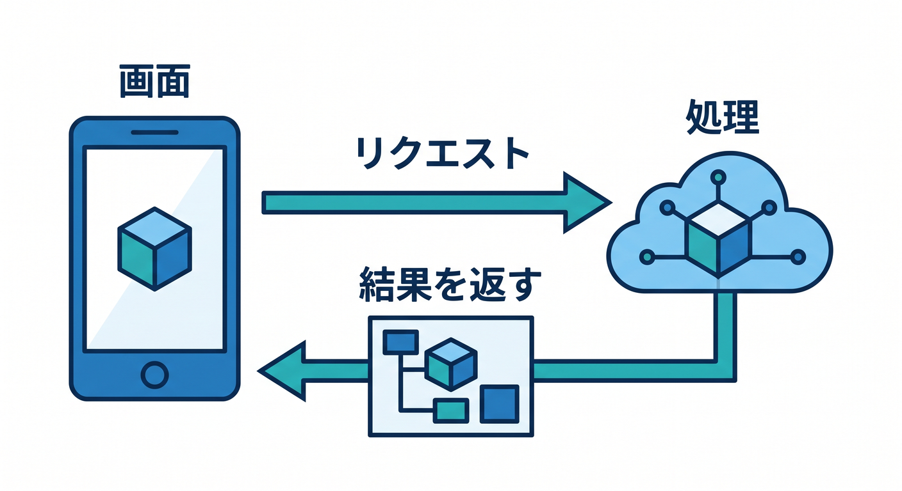
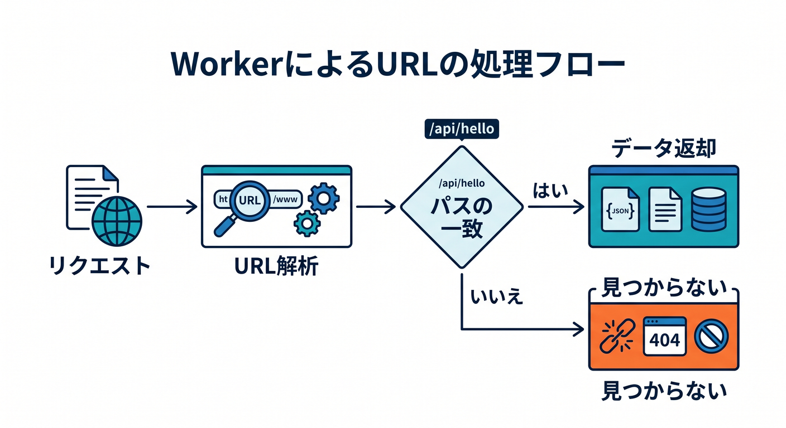
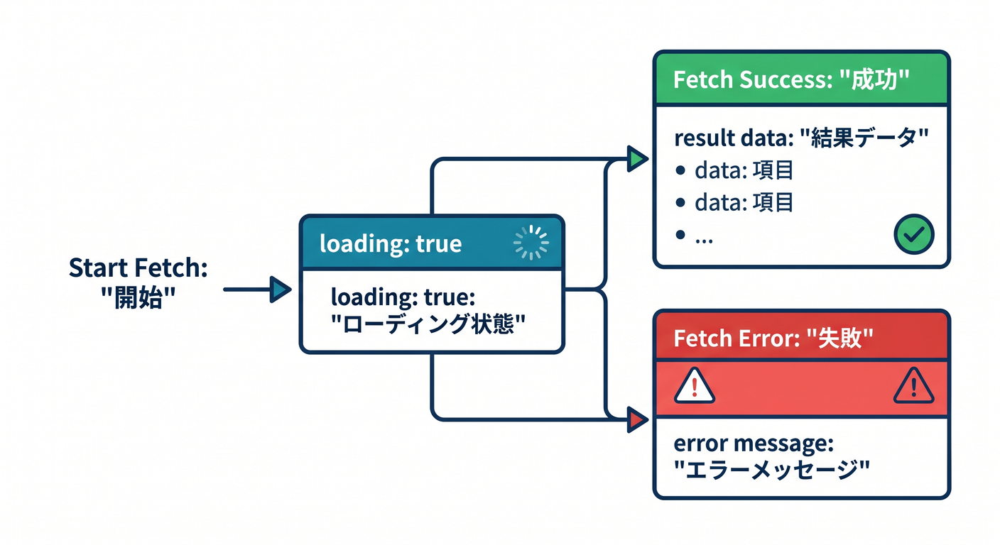
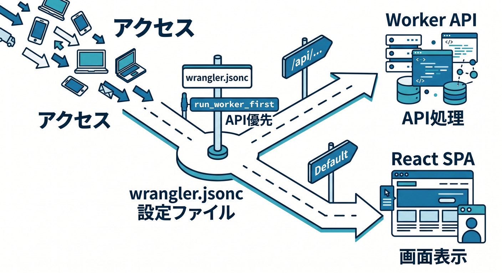
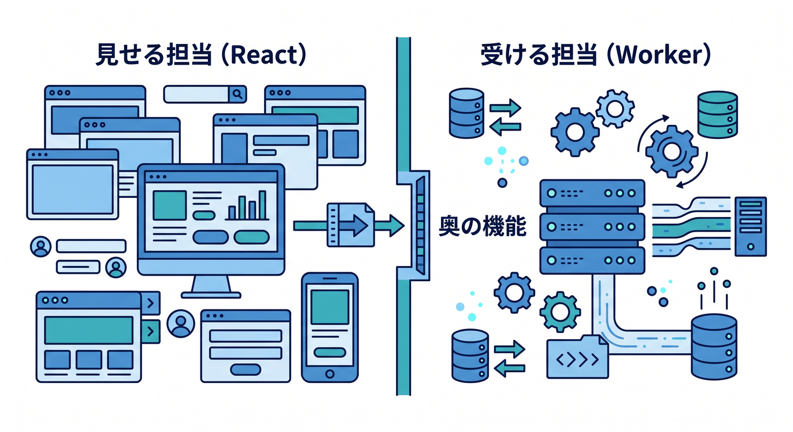

# 第07章：Workers APIとつないでみよう 🔗

この章では、React の画面と Cloudflare Workers の API を、はじめてちゃんとつなぎます 😊
Cloudflare の現在の公式導線では、**React SPA + Workers API + Cloudflare Vite plugin** をひとつの流れで扱う構成が案内されていて、React 側から Worker の `/api/` を呼ぶ形が基本です。React 公式ドキュメント側も、現行の最新系は React 19.2 を案内しています。([Cloudflare Docs][1])

---

## この章のゴール 🎯

この章が終わるころには、こんな流れが自分で書けるようになります ✨

* 画面のボタンを押す
* React から `fetch()` で `/api/hello` を呼ぶ
* Worker が JSON を返す
* その結果を画面に表示する

ここで大事なのは、**React は見た目担当、Worker は処理担当**、という役割分担を体で覚えることです 🌷
Cloudflare の React テンプレートは `src/App.tsx` と `worker/index.ts` を分けたフルスタック構成になっていて、React から Worker を呼ぶのが基本形です。([Cloudflare Docs][1])

---

## まずは全体像をつかもう 🗺️

この章の主役は、次の一本道です 😊

**React画面 → `fetch("/api/hello")` → Worker → JSON → 画面更新**

Cloudflare 公式の React + Vite ガイドでは、C3 で作ったプロジェクトに `src/App.tsx`、`worker/index.ts`、`wrangler.jsonc`、`vite.config.ts` が入り、`worker/index.ts` がバックエンド API として動きます。さらに Cloudflare Vite plugin は、Workers runtime と統合され、HMR を使ったローカル開発もしやすい設計です。([Cloudflare Docs][1])

---

## なぜこのやり方が大事なの？ 💡

React の画面から直接 Cloudflare の binding を触るのではなく、**いったん Worker を通す**のが Cloudflare らしい考え方です。公式ガイドでも、React アプリは binding に直接アクセスせず、Worker に `fetch()` して、その Worker が compute・storage・AI などの binding を使う流れが説明されています。つまり今日やる「画面 → API」の形は、あとで D1・KV・Workers AI につなぐときの土台そのものです。([Cloudflare Docs][1])

---

## この章で作るミニ完成形 🌟

今回は、難しいことをいきなり増やしません。
まずは **GET で 1 件の JSON を受け取る** だけに絞ります。これで十分です 👍

Worker 側はこんな JSON を返します。

```json
{
  "message": "Cloudflare Workers API につながりました！",
  "time": "2026-04-17T12:34:56.789Z"
}
```

React 側はそれを受け取って、画面に「つながった！」と表示します。
Cloudflare の公式チュートリアルでも、まずは `/api/` に `fetch("/api/")` して JSON を返す最小構成から始めています。([Cloudflare Docs][2])



---

## Step 1. Worker 側に最初の API を作ろう 🛠️

まずは `worker/index.ts` をこんな感じにしてみましょう。

```ts
type HelloResponse = {
  message: string;
  time: string;
};

export default {
  async fetch(request: Request) {
    const url = new URL(request.url);

    if (url.pathname === "/api/hello") {
      const data: HelloResponse = {
        message: "Cloudflare Workers API につながりました！",
        time: new Date().toISOString(),
      };

      return Response.json(data);
    }

    return new Response("Not Found", { status: 404 });
  },
} satisfies ExportedHandler;
```

ここで見てほしいのは 3 点です 😊

1. `new URL(request.url)` で URL を読み取る
2. `url.pathname` で `/api/hello` かどうか判定する
3. `Response.json()` で JSON を返す

Cloudflare の公式チュートリアルでも、`fetch(request)` の中で `new URL(request.url)` を作り、`/api/` なら JSON を返し、それ以外は `404` を返す基本形が紹介されています。([Cloudflare Docs][2])



---

## Step 2. React 側から `fetch()` してみよう 📡

次は `src/App.tsx` です。
まずは「ボタンを押したら API を呼ぶ」にします。最初の 1 本としては、これがいちばんわかりやすいです 🙌

```tsx
import { useState } from "react";

type HelloResponse = {
  message: string;
  time: string;
};

export default function App() {
  const [result, setResult] = useState<HelloResponse | null>(null);
  const [loading, setLoading] = useState(false);
  const [errorMessage, setErrorMessage] = useState("");

  const loadHello = async () => {
    try {
      setLoading(true);
      setErrorMessage("");

      const res = await fetch("/api/hello");

      if (!res.ok) {
        throw new Error(`HTTP ${res.status}`);
      }

      const data = (await res.json()) as HelloResponse;
      setResult(data);
    } catch (error) {
      console.error(error);
      setErrorMessage("APIの呼び出しに失敗しました。");
    } finally {
      setLoading(false);
    }
  };

  return (
    <main style={{ padding: "24px", fontFamily: "sans-serif" }}>
      <h1>第7章 API接続テスト 🔗</h1>

      <button onClick={loadHello} disabled={loading}>
        {loading ? "読み込み中..." : "Workers APIを呼ぶ"}
      </button>

      {errorMessage && <p style={{ color: "crimson" }}>⚠️ {errorMessage}</p>}

      {result && (
        <section style={{ marginTop: "16px" }}>
          <p>✅ {result.message}</p>
          <p>🕒 {result.time}</p>
        </section>
      )}
    </main>
  );
}
```

Cloudflare の公式チュートリアルでも、React 側は `fetch("/api/")` のように**相対パス**で Worker を呼んでいます。つまり、この章では「別サーバーへ飛ぶ」意識よりも、「同じアプリの中の API を呼ぶ」感覚で大丈夫です。([Cloudflare Docs][2])

---

## なぜ最初は `useEffect` ではなくボタンクリックなの？ 👀

React 公式では、**イベントハンドラは特定の操作が起きたときだけ動く**、一方で **Effect は依存値の変化に合わせて再同期する**、と整理されています。さらに `useEffect` でデータ取得はできるものの、手動で書くとかなり“生っぽい”実装になりやすいとも説明されています。だから第7章では、まず **押したら呼ぶ** というイベント駆動でつなぐのがいちばん理解しやすいです 😊([React][3])

---

## Step 3. 画面に「通信の3状態」を作ろう 🎛️

API 接続では、最低でも次の 3 状態を持つとかなりアプリらしくなります ✨

* まだ押していない
* 読み込み中
* 成功 または 失敗

この章では `loading`、`errorMessage`、`result` の 3 つに分けました。
React 公式の `useEffect` 例でも、読み込み中に `null` を入れたり、後から結果をセットしたりして、通信状態を UI に反映する考え方が出てきます。第9章ではここをもっと丁寧に育てますが、第7章ではまず「通信には状態がある」とわかれば十分です。([React][4])



---

## Step 4. 開発サーバーで動かしてみよう 🚀

開発時は、これまでの章で作ったプロジェクトでそのまま `npm run dev` を使えば OK です。
Cloudflare の React ガイドでは、作成後に `npm run dev` でローカル開発サーバーを起動し、Vite の HMR と Cloudflare Vite plugin によって、Workers runtime に近い形で開発できます。Cloudflare の開発テスト資料でも、Vite plugin と Wrangler はどちらも Miniflare を土台にしていて、ローカルで Worker を実行できると説明されています。([Cloudflare Docs][1])

---

## Step 5. `wrangler.jsonc` のルーティングを軽く理解しよう 🧭

React の SPA と Worker API を同じプロジェクトに置くと、
「このリクエストは画面用？ API用？」という振り分けが必要になります。

Cloudflare の React テンプレートでは、`assets.not_found_handling` を `single-page-application` にして、React 側のルートを SPA として扱えるようにしています。公式チュートリアルでは、さらに必要なら `run_worker_first: ["/api/*"]` を入れて、`/api/*` を明示的に Worker へ流す形も紹介されています。([Cloudflare Docs][1])

こんな設定イメージです 👇

```jsonc
{
  "$schema": "./node_modules/wrangler/config-schema.json",
  "name": "my-react-app",
  "compatibility_date": "2026-04-17",
  "main": "./worker/index.ts",
  "assets": {
    "not_found_handling": "single-page-application",
    "run_worker_first": ["/api/*"]
  }
}
```

ブラウザの通常ナビゲーションでは `Sec-Fetch-Mode: navigate` が送られ、SPA 側の扱いになるのがデフォルトです。API ルートをはっきり Worker 優先にしたいときに `run_worker_first` が便利です。([Cloudflare Docs][2])



---

## ここで一度、頭を整理しよう 🧠✨

今やっていることを超シンプルに言うと、こうです。

* React はボタンを押されたことを受け取る
* `fetch("/api/hello")` で Worker にお願いする
* Worker は JSON を返す
* React は JSON を state に入れて表示する

この形にしておくと、あとで Worker 側だけを差し替えて、
**ただのメッセージ API → 保存 API → AI API** に進化させやすいです 🌈

---

## よくあるつまずきポイント 😵‍💫

**1. 404 になる**
`/api/hello` と Worker 側の `url.pathname === "/api/hello"` がずれていないか確認しましょう。

**2. JSON ではなく HTML が返ってくる**
SPA 側に吸われている可能性があります。`run_worker_first: ["/api/*"]` の確認が有効です。公式チュートリアルでも、この明示設定が案内されています。([Cloudflare Docs][2])

**3. `res.json()` で型が不安**
TypeScript では、今回のように `type HelloResponse = ...` を先に作って、受け取る形を決めておくとかなり安心です 😊

**4. 開発中に binding の挙動が本番と違う気がする**
Cloudflare の開発資料では、ローカル開発時は binding が基本的にローカルシミュレーションを使い、必要なら `remote: true` でリモート資源につなげられると説明されています。([Cloudflare Docs][5])

---

## Copilot を使うなら、ここでこう使うと相性がいい 🤝✨

VS Code の GitHub Copilot は、エディタ全体を見ながら作業できる AI 支援として案内されていて、Chat は Windows なら `Ctrl+Alt+I` から開けます。さらに Chat では Agent Target から実行先を選べます。第7章のような「1ファイル追加」「fetch 関数を整える」「型を揃える」作業とかなり相性がいいです。([Visual Studio Code][6])

この章でのおすすめ依頼文は、たとえばこんな感じです 😊

```text
App.tsx に /api/hello を呼ぶ fetch 関数を追加して。
loading / error / success の3状態を useState で整理して。
初心者向けで、複雑なカスタムフックは使わないで。
```

もう少し進んだら、こんなのも便利です。

```text
worker/index.ts の /api/hello に Response.json を使った GET エンドポイントを追加して。
url.pathname で分岐し、他のパスは 404 を返して。
```

---

## Cloudflare AI につなげるときも、流れは同じ 🤖☁️

ここ、すごく大事です。
**Workers AI を使うときも、React から直接 AI をたたくのではなく、Worker を API 窓口にする**、という考え方は同じです。Cloudflare の Workers AI ドキュメントでは、Worker から AI を使うには Wrangler かダッシュボードで AI binding を作る必要があると案内されています。React ガイドでも、React は binding に直接触らず Worker を通す構成です。([Cloudflare Docs][7])

たとえば将来は、Worker 側をこんなふうに変えられます ✨

```ts
type Env = {
  AI: Ai;
};

export default {
  async fetch(request: Request, env: Env) {
    const url = new URL(request.url);

    if (url.pathname === "/api/summary") {
      const result = await env.AI.run("@cf/meta/llama-3.1-8b-instruct", {
        prompt: "Cloudflare Workers を1文でやさしく説明して",
      });

      return Response.json(result);
    }

    return new Response("Not Found", { status: 404 });
  },
} satisfies ExportedHandler<Env>;
```

Wrangler 側はこうです。

```jsonc
{
  "ai": {
    "binding": "AI"
  }
}
```

Workers AI の公式資料では、`env.AI.run(...)` を使う例が示されています。また開発資料では、**AI binding には現在ローカルシミュレーションがなく、AI は常にリモート実行**で、`remote: true` を使う構成が推奨されています。([Cloudflare Docs][8])

---

## この章で覚えてほしい「一番大事な一文」 🌈

**React は見せる、Worker は受ける、binding は Worker の奥で使う。**

この 1 本が見えたら、第7章はかなり成功です 🎉



Cloudflare の現在の公式導線も、React SPA と Worker API を組み合わせるフルスタック構成を中心にしていて、後続の binding・AI・保存機能へ自然につながるようになっています。([Cloudflare Docs][1])

---

## 章末まとめ 📝✨

この章では、React と Cloudflare Workers を**実際に通信させる最初の 1 歩**をやりました。

* Worker 側で `/api/hello` を作る
* React 側で `fetch("/api/hello")` する
* JSON を state に入れて表示する
* `loading` と `error` を最低限持つ
* `/api/*` を Worker 側へ流す考え方を知る
* 将来の D1・KV・Workers AI も同じ入り口で広げられると知る

ここまでできると、次の章の **POST とフォーム送信** がかなり入りやすくなります 📮✨

---

## 練習問題 🎓💪

1. `/api/hello` の返り値に `chapter: 7` を追加して、画面にも表示してみよう
2. ボタン名を「通信テストする」に変えて、読み込み中は押せないようにしてみよう
3. `/api/time` を新しく作って、現在時刻だけ返す API を増やしてみよう
4. `result` がまだ無いときだけ「まだ通信していません」と表示してみよう
5. Copilot に「App.tsx を初心者向けに整理して」と頼んで、差分を読んでみよう

必要なら次に、そのまま続きとして
**「第7章の完成版教材として、もっと長い本文＋図解風説明＋章末課題つきの完全版」** に整えて出します。

[1]: https://developers.cloudflare.com/workers/framework-guides/web-apps/react/ "React + Vite · Cloudflare Workers docs"
[2]: https://developers.cloudflare.com/workers/vite-plugin/tutorial/ "Tutorial - React SPA with an API · Cloudflare Workers docs"
[3]: https://react.dev/learn/separating-events-from-effects "Separating Events from Effects – React"
[4]: https://react.dev/reference/react/useEffect "useEffect – React"
[5]: https://developers.cloudflare.com/workers/development-testing/ "Development & testing · Cloudflare Workers docs"
[6]: https://code.visualstudio.com/docs/copilot/overview "GitHub Copilot in VS Code"
[7]: https://developers.cloudflare.com/workers-ai/configuration/bindings/ "Workers Bindings · Cloudflare Workers AI docs"
[8]: https://developers.cloudflare.com/workers-ai/get-started/workers-wrangler/ "Get started - Workers and Wrangler · Cloudflare Workers AI docs"
