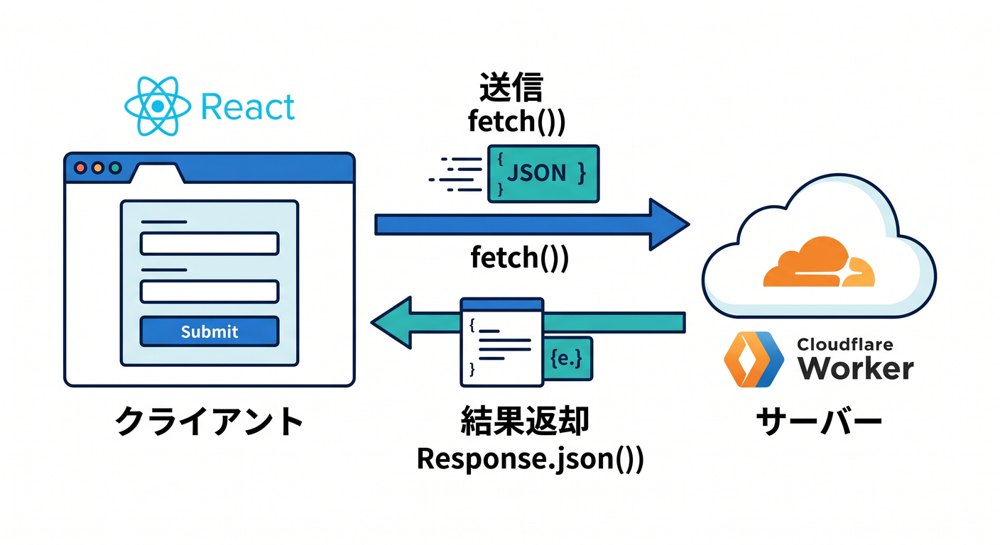
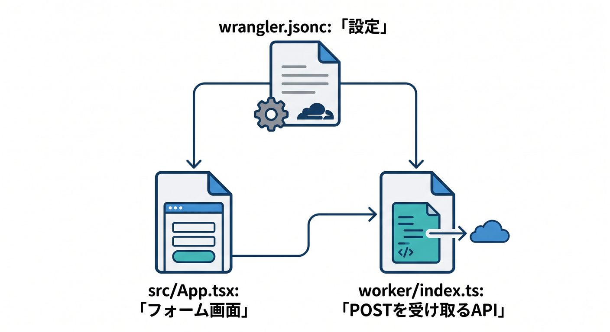
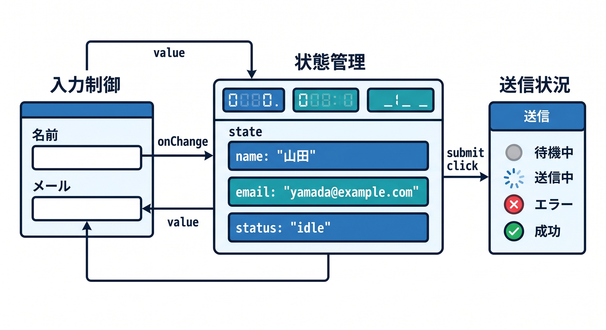
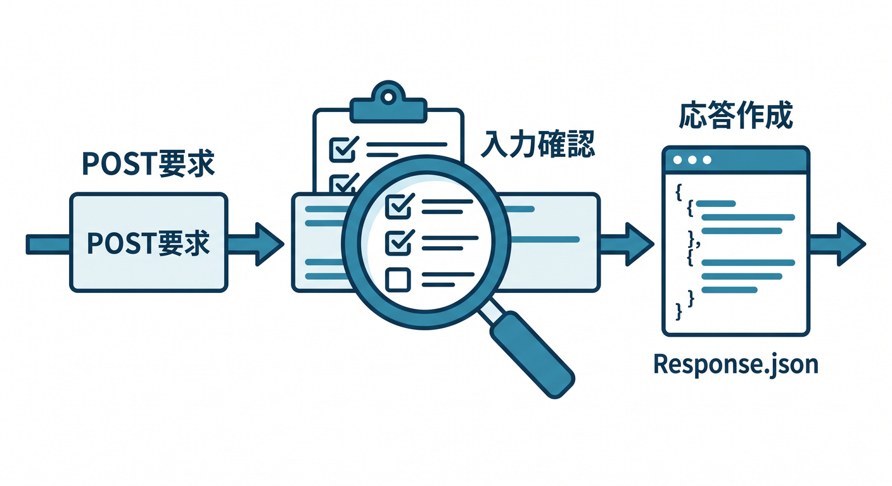
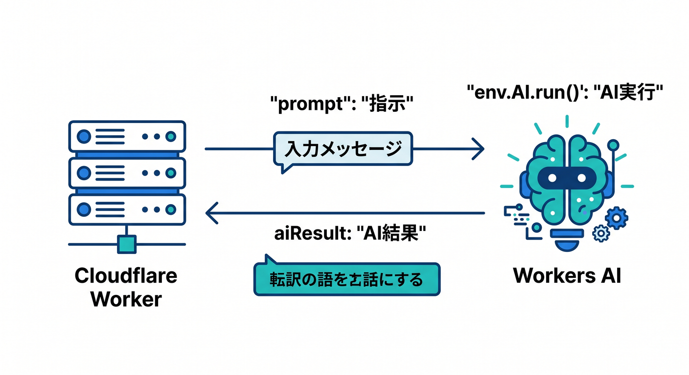

# 第08章：送信して返す：フォームとPOSTの基本を覚えよう 📮

ここは、小さなアプリが一気に“アプリらしく”なる章です 😊
前の章では React から API を呼んで「受け取る」流れを体験しました。ここではその逆で、**React 側の入力を Worker に `POST` で送り、Worker が受け取って、JSON で返し、画面に結果を出す**ところまで進みます。Cloudflare の今の公式導線でも、React SPA と Workers API をひとつの流れで扱う構成が基本になっていて、`create-cloudflare` の React 導線は `src/App.tsx`・`worker/index.ts`・`wrangler.jsonc` を持つ形で始められます。さらに Cloudflare Vite plugin により、ローカルでも Workers runtime にかなり近い感覚で開発できます。 ([Cloudflare Docs][1])

この章では、**「ひとこと投稿フォーム」**を作ります 📝
名前とメッセージを入力して送信すると、Worker が受け取り、軽くチェックして、結果を画面へ返します。さらに発展として、**Workers AI に文章を整えてもらう**ところまでつなげます 🤖✨

---

## この章のゴール 🎯

この章が終わったら、次のことができるようになればOKです。

* React で入力欄の値を `useState` で持てる
* `fetch()` で `POST` リクエストを送れる
* Worker 側で `request.json()` を使って本文を読める
* `Response.json()` で結果を返せる
* 成功・送信中・失敗を画面に出し分けられる
* 発展として、Worker 経由で Workers AI に渡せる

---

## まずは考え方を1枚の絵にしよう 🧠🌈



流れはすごくシンプルです。

1. React のフォームに入力する
2. 送信ボタンを押す
3. `fetch("/api/submit", { method: "POST", ... })` を呼ぶ
4. Worker が `request.json()` で受け取る
5. Worker が `Response.json()` で返す
6. React が返ってきた結果を画面に表示する

Cloudflare Workers の `fetch` ハンドラには `Request` オブジェクトが渡され、本文は `json()` / `formData()` / `text()` などで読めます。JSON を返すときは `Response.json()` が使えます。今回は React 側から送るので、まずは **`application/json` の POST** に寄せるのがいちばんわかりやすいです。 ([Cloudflare Docs][2])

---

## なぜこの章では JSON POST を使うの？ 📦

フォームというとブラウザ標準の送信もありますが、React で画面を気持ちよく動かしたいなら、まずは **入力値を state で持って、`onSubmit` で `fetch` を呼ぶ**形が理解しやすいです。React の公式ドキュメントでも、フォームはブラウザ標準の `<form>` を使えますし、状態は `useState` で持つのが基本です。また、入力欄を「controlled input」にすると入力のたびに state が更新されるので、**state は増やしすぎず、必要最小限にする**のがコツです。 ([React][3])

---

## 置き場所のイメージ 🗂️



この章では、こんな配置をイメージすると迷いにくいです。

* `src/App.tsx` … フォーム画面
* `worker/index.ts` … POST を受け取る API
* `wrangler.jsonc` … Worker の入口や assets の設定

Cloudflare は新規プロジェクトで `wrangler.jsonc` を推奨しています。React SPA と Worker を同居させる場合は、SPA 向けの `not_found_handling: "single-page-application"` と、API ルートを先に Worker に通す `run_worker_first: ["/api/*"]` の考え方が便利です。公式チュートリアルでもこの形が案内されています。 ([Cloudflare Docs][4])

---

## まずは完成形を作ろう 🚀

### 1) React 側：フォーム画面を作る

```tsx
// src/App.tsx
import { FormEvent, useState } from "react";

type SubmitResult = {
  ok: boolean;
  message?: string;
  preview?: string;
  receivedAt?: string;
  error?: string;
};

export default function App() {
  const [name, setName] = useState("");
  const [message, setMessage] = useState("");
  const [sending, setSending] = useState(false);
  const [error, setError] = useState("");
  const [result, setResult] = useState<SubmitResult | null>(null);

  async function handleSubmit(event: FormEvent<HTMLFormElement>) {
    event.preventDefault();

    setSending(true);
    setError("");
    setResult(null);

    try {
      const response = await fetch("/api/submit", {
        method: "POST",
        headers: {
          "content-type": "application/json",
        },
        body: JSON.stringify({
          name,
          message,
        }),
      });

      const data = (await response.json()) as SubmitResult;

      if (!response.ok) {
        throw new Error(data.error ?? "送信に失敗しました。");
      }

      setResult(data);
      setMessage("");
    } catch (err) {
      setError(err instanceof Error ? err.message : "不明なエラーです。");
    } finally {
      setSending(false);
    }
  }

  return (
    <main style={{ maxWidth: 640, margin: "40px auto", padding: 16 }}>
      <h1>ひとこと投稿フォーム 📮</h1>
      <p>React から Cloudflare Worker へ POST してみよう ✨</p>

      <form onSubmit={handleSubmit} style={{ display: "grid", gap: 12 }}>
        <label>
          お名前 👤
          <input
            value={name}
            onChange={(e) => setName(e.target.value)}
            placeholder="例: こみやんま"
            style={{ width: "100%", padding: 8, marginTop: 4 }}
          />
        </label>

        <label>
          メッセージ 💬
          <textarea
            value={message}
            onChange={(e) => setMessage(e.target.value)}
            placeholder="ここに入力"
            rows={5}
            style={{ width: "100%", padding: 8, marginTop: 4 }}
          />
        </label>

        <button type="submit" disabled={sending}>
          {sending ? "送信中です… ⏳" : "送信する 📮"}
        </button>
      </form>

      {error && (
        <p style={{ color: "crimson", marginTop: 16 }}>
          エラー: {error} 🚨
        </p>
      )}

      {result?.ok && (
        <section style={{ marginTop: 24, padding: 16, border: "1px solid #ccc" }}>
          <h2>返ってきた結果 ✅</h2>
          <p>{result.message}</p>
          <p>プレビュー: {result.preview}</p>
          <p>受信時刻: {result.receivedAt}</p>
        </section>
      )}
    </main>
  );
}
```

このコードのポイントは3つです 😊

* 入力欄の値を `useState` で持つ
* `<form onSubmit={...}>` で送信をまとめる
* 送信中・成功・失敗をそれぞれ state で見せ分ける



React 公式でも `<form>` はそのまま使えますし、state は「動くものだけ」を持つのがコツです。入力欄は controlled input なので、あれもこれも state に入れず、**必要なものだけ持つ**意識が大事です。 ([React][3])

---

### 2) Worker 側：POST を受け取って JSON を返す

```ts
// worker/index.ts
type SubmitBody = {
  name?: string;
  message?: string;
};

export default {
  async fetch(request): Promise<Response> {
    const url = new URL(request.url);

    if (url.pathname !== "/api/submit") {
      return new Response(null, { status: 404 });
    }

    if (request.method !== "POST") {
      return Response.json(
        { ok: false, error: "POST メソッドで送ってください。" },
        { status: 405 }
      );
    }

    const body = (await request.json()) as SubmitBody;

    const name = (body.name ?? "").trim();
    const message = (body.message ?? "").trim();

    if (!name || !message) {
      return Response.json(
        { ok: false, error: "名前とメッセージは必須です。" },
        { status: 400 }
      );
    }

    return Response.json({
      ok: true,
      message: `${name}さん、送信ありがとう！ 🎉`,
      preview: message.slice(0, 80),
      receivedAt: new Date().toISOString(),
    });
  },
} satisfies ExportedHandler;
```

ここで覚えてほしいのは、たったこれだけです ✨

* ルートを見る
* `request.method` が `POST` か確認する
* `await request.json()` で本文を読む
* 必要なチェックをして `Response.json()` で返す



Cloudflare Workers では、こういう **小さな API** をかなり素直に書けます。公式のチュートリアルでも、フロントから `fetch("/api/")` のように叩く流れが案内されていて、Worker 側は `fetch(request)` でルーティングする基本形になっています。 ([Cloudflare Docs][5])

---

### 3) `wrangler.jsonc` を整える

```jsonc
{
  "$schema": "./node_modules/wrangler/config-schema.json",
  "name": "react-small-post-app",
  "compatibility_date": "2026-04-17",
  "main": "./worker/index.ts",
  "assets": {
    "not_found_handling": "single-page-application",
    "run_worker_first": ["/api/*"]
  }
}
```

ここでは、**React の画面ルートは SPA として扱い、`/api/*` は Worker を先に通す**形にしています。こうしておくと、React の画面と API が同じアプリ内で自然につながりやすいです。新規では `wrangler.jsonc` を使うのが今のおすすめです。 ([Cloudflare Docs][5])

---

## ここでいったん整理しよう ☕🌼

この時点で、あなたはもう次の往復を作れています。

* 画面で入力した
* JSON にして送った
* Worker が受け取った
* JSON で返した
* React が表示した

この一往復ができると、次からは「保存する」「AI に投げる」「認証を足す」「迷惑送信を防ぐ」へ広げるだけです。
つまり、第8章は**アプリの心臓が動き出す章**です ❤️

---

## JSON ではなく FormData で受けることもできるよ 📨

今回は React から送るので JSON にしましたが、Cloudflare Workers は `request.formData()` も使えます。公式の `Read POST` 例でも、`content-type` を見ながら JSON / text / form を読み分ける形が紹介されています。なので、将来ファイル添付や昔ながらのフォーム送信に寄せたくなっても大丈夫です。 ([Cloudflare Docs][6])

たとえば Worker 側でこう書けます。

```ts
const formData = await request.formData();
const message = String(formData.get("message") ?? "");
```

ただし、この章ではまず **JSON POST をしっかり理解する**のがおすすめです。
理由は、React の state と相性がよく、送るデータの形も見えやすいからです 👍

---

## 発展① Workers AI で「文章を整えて返す」に進もう 🤖✨



ここからが Cloudflare らしい楽しいところです 🎉
Workers AI は Cloudflare のグローバルネットワーク上でサーバーレスにモデルを呼べる仕組みで、Free / Paid の両プランで利用できます。Worker から使うには AI binding を追加し、Worker 内では `env.AI.run()` で呼び出します。Cloudflare の導入例では `@cf/meta/llama-3.1-8b-instruct` を使ったサンプルも案内されています。なお、Workers AI はローカル開発中でも Cloudflare アカウントにアクセスして実行されるので、**`wrangler dev` 中でも利用分の課金対象になりうる**点は覚えておきましょう。 ([Cloudflare Docs][7])

まずは binding を追加します。

```jsonc
{
  "$schema": "./node_modules/wrangler/config-schema.json",
  "name": "react-small-post-app",
  "compatibility_date": "2026-04-17",
  "main": "./worker/index.ts",
  "assets": {
    "not_found_handling": "single-page-application",
    "run_worker_first": ["/api/*"]
  },
  "ai": {
    "binding": "AI"
  }
}
```

そして Worker を少しだけ拡張します。

```ts
// worker/index.ts
export interface Env {
  AI: Ai;
}

type SubmitBody = {
  name?: string;
  message?: string;
};

export default {
  async fetch(request, env): Promise<Response> {
    const url = new URL(request.url);

    if (url.pathname !== "/api/submit") {
      return new Response(null, { status: 404 });
    }

    if (request.method !== "POST") {
      return Response.json(
        { ok: false, error: "POST メソッドで送ってください。" },
        { status: 405 }
      );
    }

    const body = (await request.json()) as SubmitBody;
    const name = (body.name ?? "").trim();
    const message = (body.message ?? "").trim();

    if (!name || !message) {
      return Response.json(
        { ok: false, error: "名前とメッセージは必須です。" },
        { status: 400 }
      );
    }

    const aiResult = await env.AI.run("@cf/meta/llama-3.1-8b-instruct", {
      prompt:
        "次の文章を、意味を変えずにやさしい日本語へ1文で整えてください。\n" +
        `名前: ${name}\n` +
        `本文: ${message}`
    });

    return Response.json({
      ok: true,
      message: `${name}さん、送信ありがとう！ 🎉`,
      original: message,
      aiResult
    });
  },
} satisfies ExportedHandler<Env>;
```

この段階では、**AI の返り値をいったんそのまま返して中身を見る**ので十分です 👀
最初から完璧に整形しようとしなくて大丈夫です。
まずは「フォーム送信 → Worker → AI → 画面」の一本線を通すのが勝ちです 🏆

---

## 発展② GitHub Copilot を“Cloudflare寄り”に使うコツ 💡🤝

ここは最新事情としてかなり大事です。GitHub Copilot Chat は VS Code で **Agent モード**と **MCP サーバー**を使えるようになっていて、ツール一覧から MCP サーバーを利用できます。いっぽう Cloudflare 側も、**docs 用 MCP サーバー**、**observability 用 MCP サーバー**、さらに **Cloudflare API MCP server** や **Workers Bindings / Workers Builds 用の MCP サーバー**を公開しています。なので、**Copilot 側に Cloudflare の MCP をつないでおくと、Cloudflare 前提の補助を受けやすくなる**と考えてよいです。これは GitHub 側の MCP 対応と Cloudflare 側の MCP 公開を組み合わせた実践的な使い方です。 ([GitHub Docs][8])

この章で Copilot に頼むなら、こんな聞き方がかなり使いやすいです ✨

```text
この React フォームから /api/submit へ JSON POST しています。
Cloudflare Workers でのバリデーション追加、405/400 の分岐、型の改善案をください。
```

AI 拡張を始めたら、こんな聞き方もよいです。

```text
Cloudflare Workers AI を使って、投稿文をやさしい日本語に整える処理を追加したいです。
この worker/index.ts を最小差分で改善してください。
```

さらに Cloudflare の Prompting ガイドでは、Workers 用のベースプロンプトや、`docs.mcp.cloudflare.com/mcp`・`observability.mcp.cloudflare.com/mcp` を使った AI 支援の考え方も案内されています。Cloudflare 自身が「AI に Cloudflare を教えながら作る」方向へかなり寄せています。 ([Cloudflare Docs][9])

---

## 発展③ 本物のお問い合わせフォームに近づけるなら Turnstile 🛡️

フォームを公開すると、迷惑送信や自動送信の対策が気になってきます。
そのときに候補になるのが Cloudflare Turnstile です。Cloudflare の公式チュートリアルでは、条件に応じて Turnstile を有効化したり、クライアント側のウィジェットと Siteverify を組み合わせて扱う流れが案内されています。第8章ではまだ導入しなくても大丈夫ですが、**「公開フォームには将来これを足す」**と頭の片隅に置いておくと、とても実務っぽいです。 ([Cloudflare Docs][10])

---

## この章でつまずきやすいポイント 😵‍💫➡️😊

### 1. `fetch` の URL が合っていない

`/api/submit` に送っているのに、Worker 側が `/api/send` を見ている、みたいなズレです。

### 2. `content-type` を付け忘れた

JSON を送るなら、まずはこれを付けましょう。

```ts
headers: {
  "content-type": "application/json"
}
```

### 3. `await response.json()` の前にエラー画面だけ見て終わる

`response.ok` を見ながら、返ってきた JSON の `error` も読むと原因がわかりやすいです。

### 4. state を増やしすぎた

`name`、`message`、`sending`、`error`、`result` くらいなら素直ですが、似た情報を二重に持ち始めると急に混乱します。
「今、画面に必要なものだけ持つ」が正解です 🌱

---

## 練習問題 ✍️🌟

1つずつ追加していくと、かなり力がつきます。

**練習1**
文字数チェックを追加して、100文字を超えたら 400 を返す

**練習2**
カテゴリ選択を足して、`general` / `idea` / `question` を送る

**練習3**
Worker 側で受け取った時刻を日本語っぽく整えて返す

**練習4**
`useAi` チェックボックスを追加し、ON のときだけ Workers AI を呼ぶ

**練習5**
エラー時に「もう一度送る」ボタンを見せる

---

## この章のまとめ 🎓✨

第8章の本質は、**「入力を送る」体験を自分の手で作ること**です。

* React は入力を持つ
* `fetch` は Worker へ運ぶ
* Worker は受け取って判断する
* JSON で返す
* React は結果を見せる

この一往復ができるようになると、次の章の **読み込み中・エラー・再試行** がぐっと理解しやすくなります。
そして Cloudflare らしさは、その先に **Workers AI** や **Turnstile** や **Bindings** を自然に足せるところです ☁️⚛️🤖

必要なら次に、この第8章にぴったりつながる形で
**「第9章 読み込み中・エラー・再試行をやさしく扱おう 🧯」**
も同じ調子で詳しく書けます。

[1]: https://developers.cloudflare.com/workers/framework-guides/web-apps/react/ "React + Vite · Cloudflare Workers docs"
[2]: https://developers.cloudflare.com/workers/runtime-apis/request/ "Request · Cloudflare Workers docs"
[3]: https://react.dev/reference/react-dom/components/form "<form> – React"
[4]: https://developers.cloudflare.com/workers/wrangler/configuration/ "Configuration - Wrangler · Cloudflare Workers docs"
[5]: https://developers.cloudflare.com/workers/vite-plugin/tutorial/ "Tutorial - React SPA with an API · Cloudflare Workers docs"
[6]: https://developers.cloudflare.com/workers/examples/read-post/ "Read POST · Cloudflare Workers docs"
[7]: https://developers.cloudflare.com/workers-ai/ "Overview · Cloudflare Workers AI docs"
[8]: https://docs.github.com/copilot/customizing-copilot/using-model-context-protocol/extending-copilot-chat-with-mcp "Extending GitHub Copilot Chat with Model Context Protocol (MCP) servers - GitHub Docs"
[9]: https://developers.cloudflare.com/workers/get-started/prompting/ "Prompting · Cloudflare Workers docs"
[10]: https://developers.cloudflare.com/turnstile/tutorials/conditionally-enforcing-turnstile/ "Conditionally enforce Turnstile · Cloudflare Turnstile docs"
