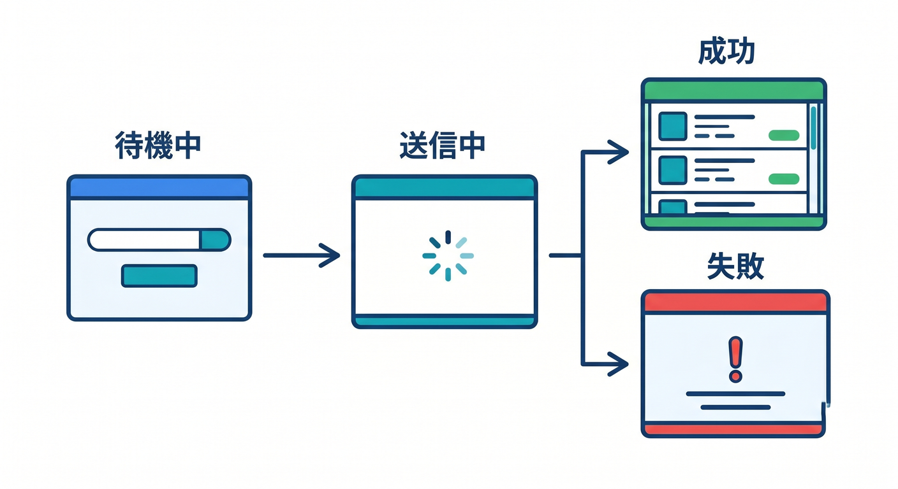
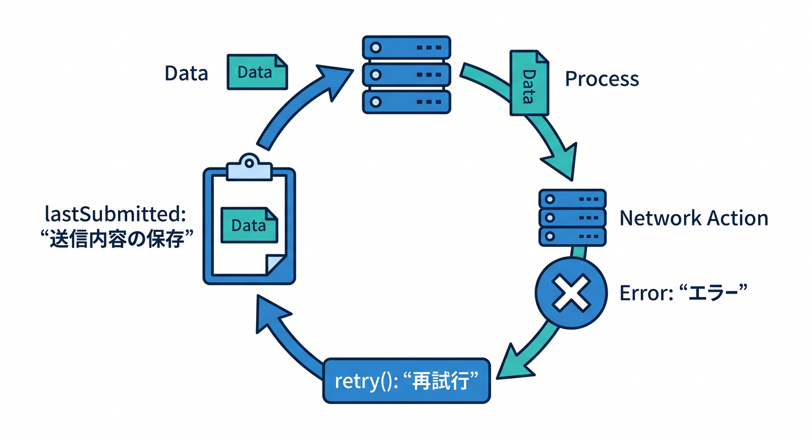
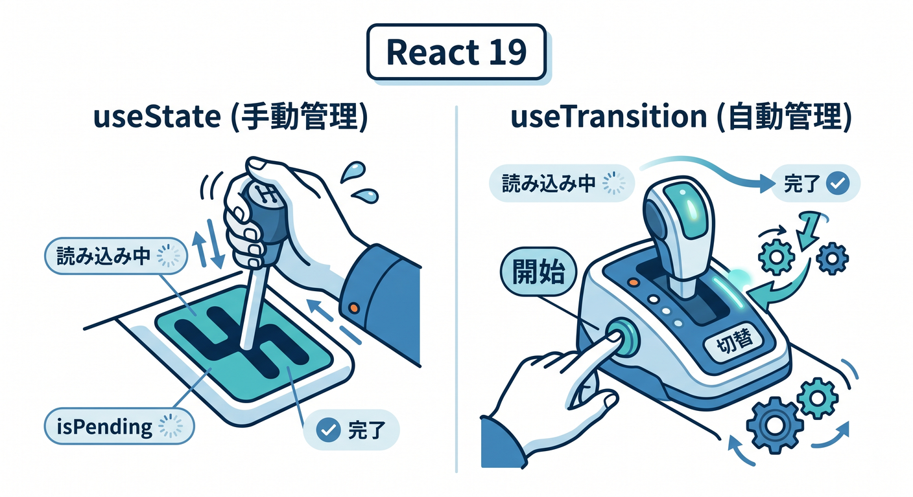
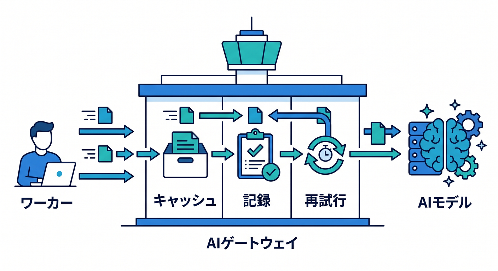
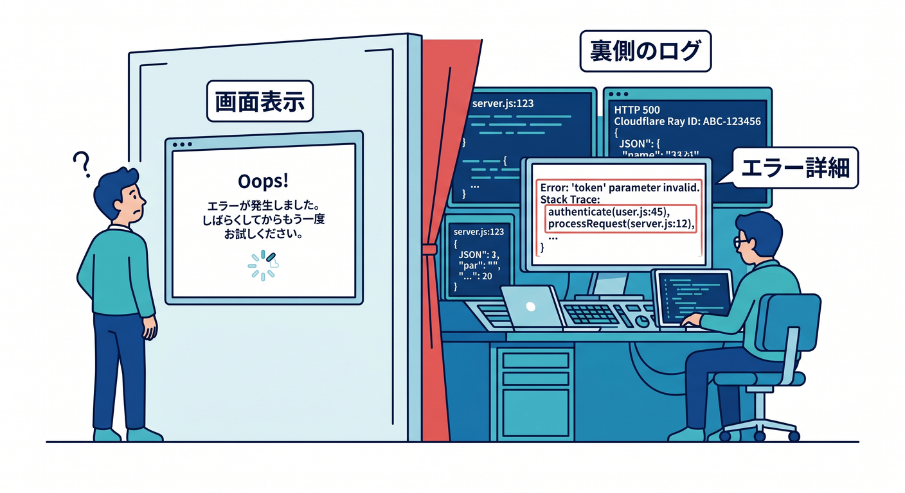

# 第09章：読み込み中・エラー・再試行をやさしく扱おう 🧯

ここまでで、React の画面から Cloudflare Workers API を呼べるようになってきましたね 😊
この章では、その通信を「ちゃんと親切にする」ところに進みます。Cloudflare の公式な React + Vite 導線は、React SPA と Workers API をひとつの流れで作る形になっていて、Cloudflare Vite plugin は `workerd` 上で動くので、本番にかなり近い感覚で開発できます。さらに React 公式では、安定版の流れは React 19 系で、非同期処理の pending / error を扱う流れも強化されています。だからこそ今の学習では、「通信が遅い」「失敗する」「もう一回試したい」をやさしく扱えることが、とても大事です ✨ ([Cloudflare Docs][1])

## この章でできるようになること 🎯

* 通信中に「読み込み中です…」を出せる
* 失敗したら、ユーザーにわかる言葉で伝えられる
* 「再試行」ボタンでやり直せる
* Worker 側でも、ただ落ちるのでなく JSON で失敗を返せる
* 次の章や AI 機能追加に向けて、壊れにくい土台を作れる

## まず大事な考え方 🌱

アプリは、成功する時だけを考えて作ると、すぐ不親切になります 😢
たとえば送信ボタンを押したのに画面が無反応だと、「押せてないのかな？」となります。失敗したのに何も出なければ、「バグ？」「ネット？」「自分が悪い？」と不安になります。だから UI には、最低でも次の4つの状態を持たせるのがおすすめです。

1. `idle` … まだ送っていない
2. `loading` … 送信中
3. `success` … 成功
4. `error` … 失敗



この4つを分けるだけで、画面の親切さが一気に上がります 🌸

---

## 1. 今日のミニアプリの完成イメージ 🧩

今回は、第8章で作った「入力して POST する小さなフォーム」を育てます。
ユーザーが文章を送ると、Worker が受け取って返事を返します。わざと失敗させる入力も作っておいて、ローディング表示、エラー表示、再試行を体験できるようにします。

流れはこんな感じです 👇

* 入力欄に文章を書く
* 送信ボタンを押す
* 送信中はボタンを無効化して「読み込み中…」を表示
* 成功したら結果を表示
* 失敗したらエラーメッセージと「もう一度試す」ボタンを表示

「派手さ」はないですが、実アプリ感はかなり上がります 😎

---

## 2. Worker 側を“落ちっぱなし”にしない 🛠️

Cloudflare Workers では、実行中に例外が起きてレスポンスを返せなかった場合、クライアントには Cloudflare のエラーページが返ることがあります。公式ドキュメントには、たとえば `1101` は JavaScript 例外、`1102` は CPU time limit 超過などが並んでいます。学習中はこれを見ることもありますが、普通のアプリの API では、できるだけ `try/catch` して JSON を返す形にしたほうが React 側で扱いやすいです。([Cloudflare Docs][2])

まずは Worker をこうしてみましょう。

## `worker/index.ts`

```ts
type ApiSuccess = {
  ok: true;
  reply: string;
  receivedAt: string;
};

type ApiError = {
  ok: false;
  error: string;
};

type ApiResponse = ApiSuccess | ApiError;

export default {
  async fetch(request: Request): Promise<Response> {
    const url = new URL(request.url);

    if (url.pathname !== "/api/feedback") {
      return new Response("Not Found", { status: 404 });
    }

    if (request.method !== "POST") {
      return Response.json(
        { ok: false, error: "POST だけ受け付けます" } satisfies ApiError,
        { status: 405 }
      );
    }

    try {
      const body = (await request.json()) as { message?: string };
      const message = body.message?.trim() ?? "";

      // ローディング表示を体験しやすくするため、少し待つ
      await new Promise((resolve) => setTimeout(resolve, 1200));

      if (!message) {
        return Response.json(
          { ok: false, error: "メッセージを入力してください" } satisfies ApiError,
          { status: 400 }
        );
      }

      // デモ用: "error" を含むと失敗させる
      if (message.toLowerCase().includes("error")) {
        return Response.json(
          { ok: false, error: "デモ用の失敗です。再試行を試してください。" } satisfies ApiError,
          { status: 500 }
        );
      }

      return Response.json(
        {
          ok: true,
          reply: `受け取りました 👍 「${message}」`,
          receivedAt: new Date().toISOString(),
        } satisfies ApiSuccess,
        { status: 200 }
      );
    } catch (error) {
      console.error("API error:", error);

      return Response.json(
        { ok: false, error: "サーバー側で処理に失敗しました。" } satisfies ApiError,
        { status: 500 }
      );
    }
  },
};
```

このコードのポイントは、とてもシンプルです 😊

* 正常時も失敗時も、なるべく JSON で返す
* `ok: true / false` をはっきり分ける
* `status` もちゃんと付ける
* `console.error()` も残す

これで React 側は「成功か失敗か」をとても素直に読めます。

---

## 3. React 側で状態を4つに分ける 🎨

次は React 側です。
ここでは難しいライブラリはまだ使わず、`useState` でまっすぐ組みます。React 19 では `useTransition` など非同期 UI を助ける機能がありますが、この章の最初の一歩では、まず「自分で状態を持つ」ほうが理解しやすいです。React 公式でも `useTransition` は pending state を扱える Hook として案内されていますが、まずは明示的な状態管理で感覚をつかむのがちょうどいいです。([React][3])

## `src/App.tsx`

```tsx
import { useState } from "react";

type ApiResponse =
  | {
      ok: true;
      reply: string;
      receivedAt: string;
    }
  | {
      ok: false;
      error: string;
    };

type UiStatus = "idle" | "loading" | "success" | "error";

export default function App() {
  const [message, setMessage] = useState("");
  const [uiStatus, setUiStatus] = useState<UiStatus>("idle");
  const [result, setResult] = useState("");
  const [errorMessage, setErrorMessage] = useState("");
  const [lastSubmitted, setLastSubmitted] = useState("");

  async function submit(nextMessage = message) {
    setUiStatus("loading");
    setErrorMessage("");
    setResult("");
    setLastSubmitted(nextMessage);

    try {
      const response = await fetch("/api/feedback", {
        method: "POST",
        headers: {
          "Content-Type": "application/json",
        },
        body: JSON.stringify({ message: nextMessage }),
      });

      const data = (await response.json()) as ApiResponse;

      if (!response.ok || !data.ok) {
        throw new Error(data.ok ? "送信に失敗しました。" : data.error);
      }

      setResult(data.reply);
      setUiStatus("success");
    } catch (error) {
      setUiStatus("error");
      setErrorMessage(
        error instanceof Error ? error.message : "不明なエラーが起きました。"
      );
    }
  }

  function retry() {
    if (!lastSubmitted) return;
    void submit(lastSubmitted);
  }

  return (
    <main
      style={{
        maxWidth: 680,
        margin: "40px auto",
        padding: 16,
        fontFamily: "sans-serif",
        lineHeight: 1.7,
      }}
    >
      <h1>やさしい送信フォーム ✉️</h1>
      <p>文章を送ると Worker が返事を返します。</p>

      <textarea
        value={message}
        onChange={(e) => setMessage(e.target.value)}
        rows={5}
        placeholder="ここに文章を書いてください。error を入れると失敗デモになります。"
        style={{
          width: "100%",
          padding: 12,
          fontSize: 16,
          boxSizing: "border-box",
        }}
      />

      <div style={{ display: "flex", gap: 12, marginTop: 12 }}>
        <button
          onClick={() => void submit()}
          disabled={uiStatus === "loading" || !message.trim()}
          style={{ padding: "10px 16px", fontSize: 16 }}
        >
          {uiStatus === "loading" ? "送信中…" : "送信する"}
        </button>

        {uiStatus === "error" && (
          <button
            onClick={retry}
            style={{ padding: "10px 16px", fontSize: 16 }}
          >
            もう一度試す
          </button>
        )}
      </div>

      {uiStatus === "loading" && (
        <p style={{ marginTop: 16 }}>通信中です…少し待ってください ⏳</p>
      )}

      {uiStatus === "success" && (
        <div
          style={{
            marginTop: 16,
            padding: 12,
            border: "1px solid #c8e6c9",
            borderRadius: 8,
          }}
        >
          <strong>成功しました 🎉</strong>
          <p style={{ marginTop: 8 }}>{result}</p>
        </div>
      )}

      {uiStatus === "error" && (
        <div
          style={{
            marginTop: 16,
            padding: 12,
            border: "1px solid #ffcdd2",
            borderRadius: 8,
          }}
        >
          <strong>失敗しました 😢</strong>
          <p style={{ marginTop: 8 }}>{errorMessage}</p>
        </div>
      )}
    </main>
  );
}
```

---

## 4. この実装のどこが大事なの？ 🪄

この `App.tsx` のいいところは、状態が見えることです。

たとえば `submit()` の最初でこうしています。

```ts
setUiStatus("loading");
setErrorMessage("");
setResult("");
```

これで「今から送ります！」が画面に伝わります。
そして成功したら `success`、失敗したら `error` に切り替えています。

つまりこの章の本質は、**fetch を書くこと**ではなく、
**通信の前・途中・後をちゃんと画面に翻訳すること**なんです 💡

ここができると、同じ考え方で次のような場面にもそのまま応用できます。

* AI 要約ボタン 🤖
* お問い合わせ送信 📮
* メモ保存 📝
* いいね送信 ❤️
* 検索フォーム 🔎

---

## 5. 再試行は“気合い”ではなく“設計”で作る 🔁



再試行というと難しそうに見えますが、最初はこれで十分です。

* 最後に送った内容を覚えておく
* 失敗した時だけ「再試行」ボタンを出す
* ボタンを押したら同じ内容でもう一回送る

今回の `lastSubmitted` がその役目です。

```ts
const [lastSubmitted, setLastSubmitted] = useState("");
```

送信前に保存しておいて、

```ts
setLastSubmitted(nextMessage);
```

失敗したら再利用します。

```ts
function retry() {
  if (!lastSubmitted) return;
  void submit(lastSubmitted);
}
```

これだけで、ユーザーは「もう一回押せばいいんだな」と分かります 😊
アプリの親切さは、こういう小さな逃げ道でかなり変わります。

---

## 6. 自動再試行は“やりすぎない”のがコツ 🧠

次の一歩として、「1回だけ自動で再試行する」もできます。
ただし、なんでも自動再試行すると逆にややこしくなります。

たとえば、

* 入力が空で `400`
* 送信形式が間違っていて `405`

みたいなときは、もう一回送っても改善しません。
一方で、一時的な失敗や重い処理では、再試行が役立つことがあります。

なので教材としては、まず **手動の再試行** を覚えるのがおすすめです。
その上で、発展としてこんな関数を足せます ✨

```ts
async function fetchWithRetry(
  url: string,
  init: RequestInit,
  retryCount = 1
): Promise<Response> {
  let lastError: unknown;

  for (let attempt = 0; attempt <= retryCount; attempt++) {
    try {
      const response = await fetch(url, init);

      // 一時的な失敗っぽい時だけ再試行候補にする
      if (
        response.ok ||
        ![502, 503, 504].includes(response.status) ||
        attempt === retryCount
      ) {
        return response;
      }
    } catch (error) {
      lastError = error;

      if (attempt === retryCount) {
        throw error;
      }
    }

    await new Promise((resolve) => setTimeout(resolve, 700 * (attempt + 1)));
  }

  throw lastError ?? new Error("リクエストに失敗しました。");
}
```

そして `fetch()` の代わりにこれを使います。

```ts
const response = await fetchWithRetry(
  "/api/feedback",
  {
    method: "POST",
    headers: {
      "Content-Type": "application/json",
    },
    body: JSON.stringify({ message: nextMessage }),
  },
  1
);
```

ここでは 1 回だけ自動再試行しています。
「まず 1 回だけ」にしておくと、動きが読みやすくて学習向きです 🌼

---

## 7. React 19 の目線ではどう考える？ ⚛️✨



React 19 の公式情報では、非同期関数を Transition の中で使って pending state や error を扱う方向が強化されています。また `useTransition` は、UI の一部をバックグラウンドで描画させるための Hook として案内されています。([React][4])

ただし、React 公式の `useTransition` リファレンスには、`await` のあとに起きる state 更新は、現時点では追加で `startTransition` で包む必要がある、という注意もあります。初学者向け教材で最初からそこへ行くと、少し混乱しやすいです。なのでこの章では、主役はあくまで `useState` ベースでいきます。([React][3])

つまり整理するとこうです 😊

* **最初の学習** → `useState` で `loading / success / error`
* **次の学習** → `useTransition` で pending をより React らしく扱う
* **さらに先** → Suspense や Error Boundary も理解する

この順番だと、かなりスムーズです。

---

## 8. Suspense と Error Boundary はこの章では脇役でOK 🎭

React 公式では、Suspense は「子コンポーネントがまだ準備できていない間、fallback を見せる」ための仕組みです。また、描画中に起きたエラーは `try/catch` ではなく Error Boundary で受け止めるべきだと案内されています。([React][5])

でも今回のような「ボタンを押して API を呼ぶ」型の小さなアプリでは、最初から Suspense や Error Boundary を前面に出さなくても大丈夫です 🙆

この章で覚えるべき優先順位はこうです。

1. 通信状態を `useState` で表す
2. 成功と失敗で表示を変える
3. 再試行できるようにする
4. そのあとで Suspense / Error Boundary に進む

背伸びせず、順番にいきましょう 🌷

---

## 9. Cloudflare AI を入れると、この章の価値が一気に上がる 🤖☁️



Cloudflare Workers AI は、Worker から binding 経由で `env.AI.run()` を使ってモデルを呼べます。Cloudflare の binding は、REST API より Worker から使いやすく、性能面や制約面でも有利だと公式に案内されています。だから AI 要約や言い換えのような小機能を載せるときも、React から直接 AI を叩くのではなく、Worker を通して呼ぶ形がきれいです。([Cloudflare Docs][6])

たとえば将来、Worker の中身をこう差し替えるとします。

```ts
// イメージだけの発展例
const answer = await env.AI.run("モデル名", {
  prompt: `次の文章を一言でやさしく要約してください: ${message}`,
});
```

すると当然、

* 少し待つことがある
* 失敗することがある
* もう一回送りたくなる

が起きやすくなります。
つまりこの第9章は、**AI 機能を足す前の下準備**としてもとても大事なんです 💎

さらに Cloudflare AI Gateway には、解析・ログ・キャッシュ・レート制御に加えて、リクエスト再試行の機能があります。公式ドキュメントでは、最大 5 回までの retry、待ち時間、constant / linear / exponential の backoff を設定できます。AI を本格運用する時は、フロントの再試行ボタンに加えて、ゲートウェイ側での retry 設計も視野に入ります。([Cloudflare Docs][7])

---

## 10. デバッグは Cloudflare の Logs を見るクセをつけよう 🔍



Cloudflare の Workers Logs は、ログ、エラー、uncaught exceptions を集めて確認できます。しかも公式では、新しく作られた Worker では observability がデフォルトで有効になっている流れです。なので「画面では失敗したけど、Worker では何が起きたの？」を見る時にとても便利です。([Cloudflare Docs][8])

たとえば今回のコードのこれです。

```ts
console.error("API error:", error);
```

これを入れておくと、ダッシュボード側で失敗の中身を追いやすくなります。
画面にはやさしい文言、裏側には詳しいログ。
この分け方は、実務っぽい考え方としてとても大事です 👍

Cloudflare Vite plugin には `vite preview` で Workers runtime 上の build 結果を確認する流れもあり、本番前の確認にも向いています。ローカルだけで満足せず、「build 後にどう見えるか」も少しずつ意識すると、エラーの見つけ方がうまくなります。([Cloudflare Docs][9])

---

## 11. Copilot を使うなら、こういう頼み方が便利 💬✨

VS Code の公式ドキュメントでは、GitHub Copilot はエージェント、チャット、インライン提案などを使って、複数ファイルにまたがる変更やコード修正を助けてくれます。さらに Cloudflare 側も、docs 用 MCP と observability 用 MCP を案内していて、エージェントが Workers の知識やログ確認をしやすくする流れが出てきています。([Visual Studio Code][10])

この章で Copilot に頼むなら、こんな聞き方が実用的です 👇

* 「この `App.tsx` に loading / success / error の3状態を追加して」
* 「失敗時だけ retry ボタンを出すようにして」
* 「Worker の 500 エラーを JSON で返すように直して」
* 「この fetch 処理を `fetchWithRetry` 関数に分けて」
* 「エラーメッセージをユーザー向けにやさしく書き換えて」

ポイントは、**“全部作って” より “この1点を直して” のほうが精度が高い**ことです 🌟
特にこの章は状態がはっきりしているので、Copilot にも指示しやすいです。

---

## 12. この章の学習チェック ✅

ここまで終わったら、次を自分で言えるようになればかなり良い感じです 😄

* なぜ `loading` を表示するのか説明できる
* 失敗時に何も出さない UI が不親切だと分かる
* `success` と `error` を state で分けられる
* Worker 側で `try/catch` して JSON を返せる
* React 側で `response.ok` と `data.ok` の両方を見られる
* 手動の retry ボタンを作れる

---

## 13. 練習問題 ✍️🌼

## 練習1

`error` を含むと失敗する今の仕様を、自分で好きな条件に変えてみましょう。
たとえば「10文字未満なら 400 にする」などでもOKです。

## 練習2

ローディング中は textarea も `disabled` にしてみましょう。
「送信中に内容を書き換えない」UI になります。

## 練習3

成功時に `receivedAt` も表示してみましょう。
「いつ返ってきたか」が見えると、通信の実感が出ます ⏰

## 練習4

`fetchWithRetry()` を導入して、`503` のときだけ 1 回自動再試行するようにしてみましょう。

## 練習5

発展として、Worker の返事を Workers AI に置き換える想像をしてみましょう。
その時、なぜ loading / error / retry がさらに大事になるのか、言葉で説明してみてください 🤖

---

## 14. この章のまとめ 🏁✨

この章の主役は、実は `fetch` ではありません。
主役は **「通信の状態を、ユーザーにちゃんと見せること」** です。

覚えてほしいのはこの3つです。

* 読み込み中は、待っていることを伝える ⏳
* 失敗したら、黙らずやさしく伝える 😌
* 失敗しても、もう一回試せるようにする 🔁

ここまでできると、小さなアプリがぐっと“ちゃんとしたアプリ”に見えてきます。
そして次の章で公開や構成整理に進んだ時にも、「中身が壊れにくい UI」がすでにできている状態になります 🌈

次の章では、React の SPA と Cloudflare 側のルーティングの関係を整理して、「ちゃんと載せる」感覚へ進んでいきましょう ☁️🏠✨

[1]: https://developers.cloudflare.com/workers/framework-guides/web-apps/react/ "React + Vite · Cloudflare Workers docs"
[2]: https://developers.cloudflare.com/workers/observability/errors/ "Errors and exceptions · Cloudflare Workers docs"
[3]: https://react.dev/reference/react/useTransition "useTransition – React"
[4]: https://react.dev/blog/2024/12/05/react-19 "React v19 – React"
[5]: https://react.dev/reference/react/Suspense "<Suspense> – React"
[6]: https://developers.cloudflare.com/workers-ai/configuration/bindings/?utm_source=chatgpt.com "Workers Bindings · Cloudflare Workers AI docs"
[7]: https://developers.cloudflare.com/ai-gateway/?utm_source=chatgpt.com "Overview · Cloudflare AI Gateway docs"
[8]: https://developers.cloudflare.com/workers/observability/logs/workers-logs/ "Workers Logs · Cloudflare Workers docs"
[9]: https://developers.cloudflare.com/workers/vite-plugin/ "Vite plugin · Cloudflare Workers docs"
[10]: https://code.visualstudio.com/docs/copilot/overview?utm_source=chatgpt.com "GitHub Copilot in VS Code"
