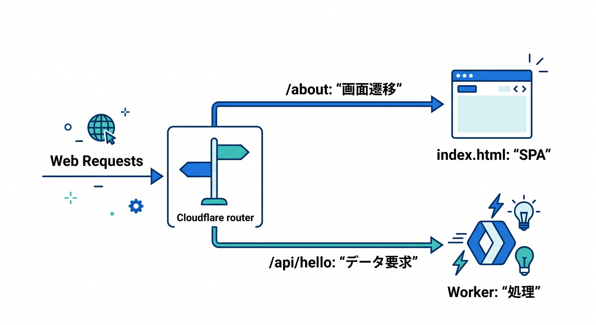
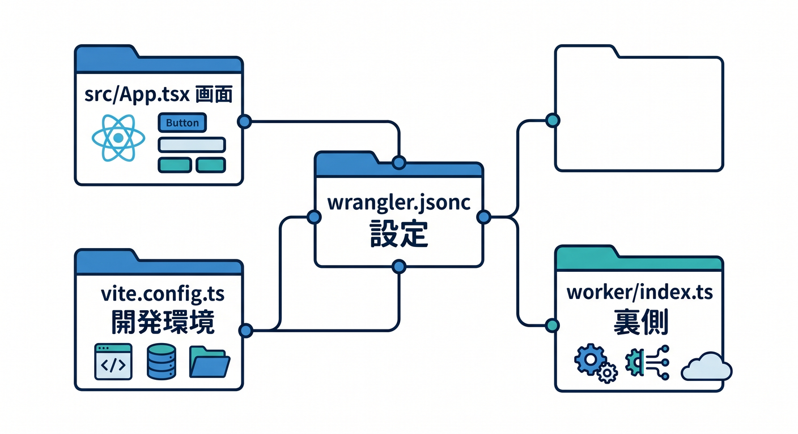
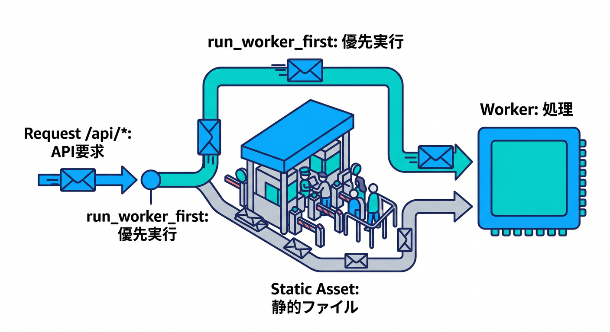
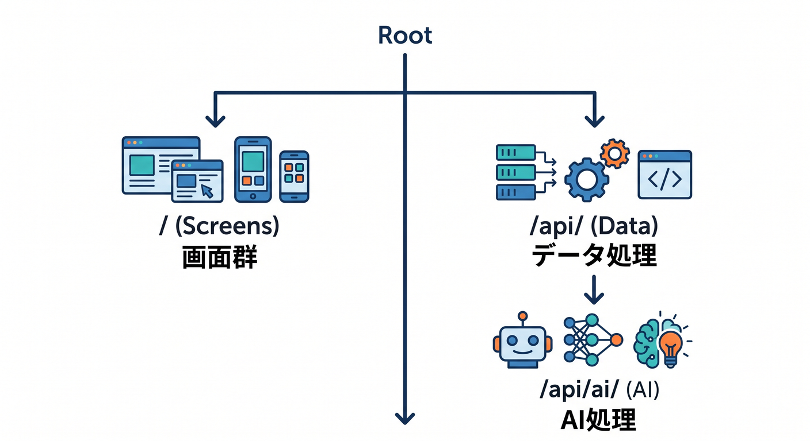
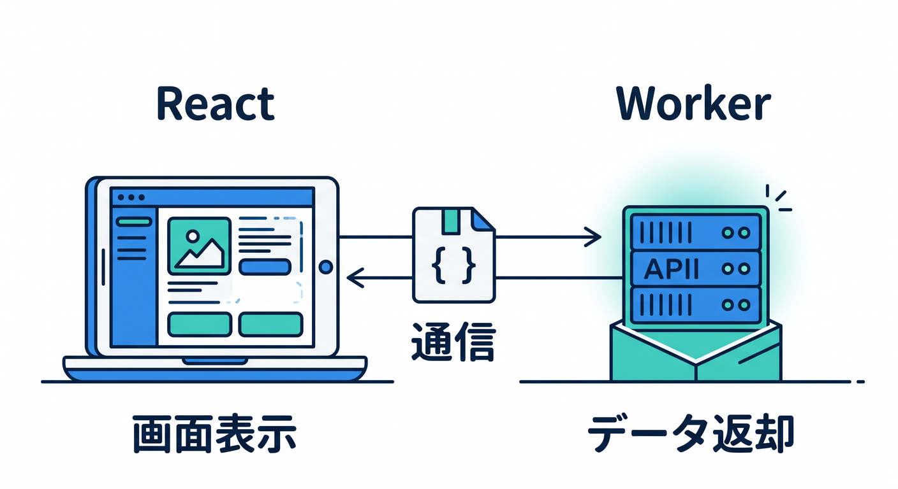
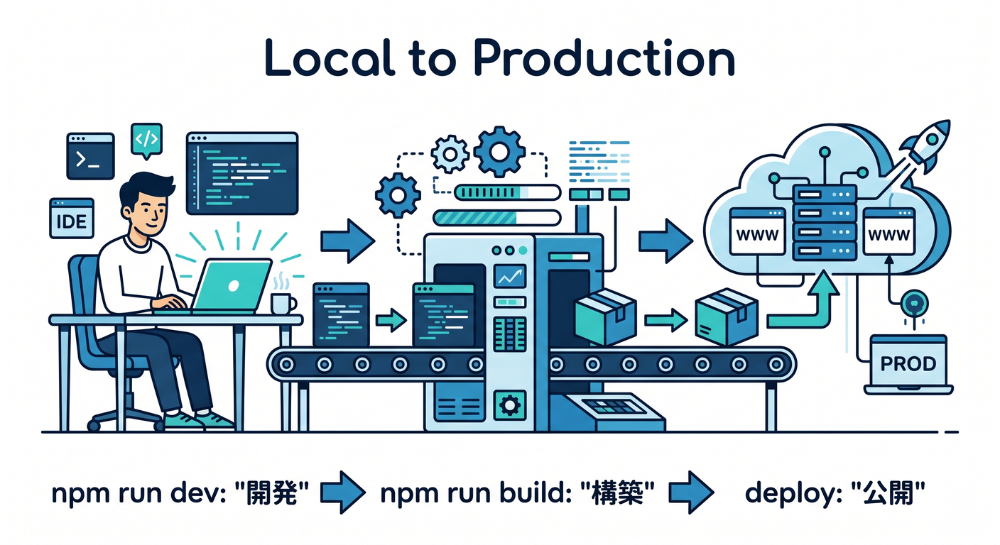

# 第10章：SPAとしてCloudflareにちゃんと載せよう 🏠

ここまでで、React 側の画面づくりと、Workers 側の API 呼び出しはかなり見えてきましたね 😊
この章のテーマは **「作れたアプリを、SPAとしてCloudflare上で迷子にならずに動かす」** です。Cloudflare の今の公式導線では、React + Vite + Workers API の構成がかなり整っていて、`create-cloudflare` で作るプロジェクトも **React SPA・Workers API・Cloudflare Vite plugin** を前提にした形になっています。さらに React の公式ドキュメントは現在 **React 19.2** を最新として案内しています。 ([Cloudflare Docs][1])

---

## この章でできるようになりたいこと 🎯

この章のゴールは、次の3つです。

* **React の画面ルート** と **Workers の API ルート** を頭の中で分けて考えられる
* SPA の「直接URLを開くと 404 になる問題」を、Cloudflare 側の設定で防げる
* 今後追加する **AI機能の API** も、ぶつからずに載せられる形を先に作っておける

Cloudflare の Static Assets では、基本的に **まず静的アセットを探し、見つからなければ Worker を動かす** という順番です。SPA ではそこに `not_found_handling = "single-page-application"` を組み合わせて、**存在しないファイル扱いのURLでも `index.html` を返す** ようにします。Cloudflare 公式も、React を SPA として使うならこの設定を入れるよう案内しています。 ([Cloudflare Docs][2])

---

## 1. まず「なぜSPA公開でつまずくのか？」をやさしく理解しよう 🧭

React の SPA では、たとえば `/about` や `/notes/123` のような画面URLを **ブラウザ側のルーター** が処理します。
でもサーバー側から見ると、そのURLに対応する実ファイルがあるとは限りません。すると普通は「そんなファイルありません」となって 404 になりがちです。

Cloudflare では、`assets.not_found_handling = "single-page-application"` を設定すると、**アセットに一致しないリクエストへ `index.html` を `200 OK` で返す** ようになります。これが SPA 公開のいちばん大事な土台です。 ([Cloudflare Docs][3])

つまり、イメージはこんな感じです ✨

* `/` → `index.html`
* `/about` → 実ファイルがなくても `index.html`
* `/notes/123` → 実ファイルがなくても `index.html`
* `/assets/logo.svg` → 実ファイルがあればそのまま配信
* `/api/*` → Worker に処理させたい



この最後の `/api/*` をちゃんと分けないと、**画面URLとAPI URLがごっちゃになる** のがこの章の最大の落とし穴です。Cloudflare 公式も、SPA モードでは `run_worker_first` を組み合わせた **選択的ルーティング** を推しています。 ([Cloudflare Docs][4])

---

## 2. 今のCloudflare公式導線では、React SPA はかなりやりやすい 🌟

Cloudflare の React + Vite ガイドでは、`create-cloudflare` で作った構成に `src/App.tsx`、`worker/index.ts`、`vite.config.ts`、`wrangler.jsonc` が並び、`worker/index.ts` がバックエンドAPI、React 側がそれを呼ぶ形で説明されています。しかも `wrangler.jsonc` では **SPA 向けの `assets.not_found_handling = "single-page-application"`** が最初から重要設定として扱われています。 ([Cloudflare Docs][1])

さらに Cloudflare Vite plugin を使う場合、公式チュートリアルでは **`assets.directory` を明示しなくてもよく**、`assets.not_found_handling` を設定しておけば、**Vite の通常挙動ではなく Cloudflare 側の assets ルーティングで開発と本番の挙動を揃えられる** と案内されています。
つまりこの章では、単なる「本番公開の設定」ではなく、**ローカル開発の時点から本番に近いルーティング感覚を身につける** のが大切です。 ([Cloudflare Docs][5])



---

## 3. まずは結論：SPA公開の設定はこの形で覚えよう 🧱

Cloudflare Vite plugin を使った React SPA + Worker 構成なら、まず覚えるべき `wrangler.jsonc` の形はこんな感じです。

```jsonc
{
  "$schema": "./node_modules/wrangler/config-schema.json",
  "name": "my-small-app",
  "compatibility_date": "2026-04-17",
  "main": "./worker/index.ts",
  "assets": {
    "not_found_handling": "single-page-application",
    "run_worker_first": ["/api/*"]
  }
}
```

この設定の意味はシンプルです 😊

* `main`
  Worker の入口です。React 側ではなく、API 側の処理がここに入ります。 ([Cloudflare Docs][1])

* `assets.not_found_handling = "single-page-application"`
  存在しないファイルURLでも `index.html` を返してくれます。SPA の画面ルートを支える設定です。 ([Cloudflare Docs][3])

* `assets.run_worker_first = ["/api/*"]`
  `/api/*` のときだけ、静的アセットより先に Worker を動かします。Cloudflare 公式チュートリアルでもこの形が出てきます。 ([Cloudflare Docs][5])

---

## 4. `run_worker_first` がなぜ必要なの？ 🤔

ここ、かなり大事です。

Cloudflare の default では、**アセットがあれば先にアセット、なければ Worker** です。さらに SPA モードと、対象の compatibility date / flag 条件がそろっていると、**ブラウザの画面遷移リクエストは Worker ではなく `index.html` 側に寄る** 挙動になります。Cloudflare はこれにより **不要な Worker invocation を減らせる** と説明しています。 ([Cloudflare Docs][3])

でもこの挙動は、初心者にとって少しびっくりです 😳
たとえば Worker に `/api/date` を作っていて、React から `fetch("/api/date")` すると JSON が返るのに、ブラウザのアドレスバーへ直接 `/api/date` と打つと **HTML が返る** ことがあります。Cloudflare 公式もこれを「意図された挙動」として明記しています。 ([Cloudflare Docs][3])

そこで `run_worker_first = ["/api/*"]` を入れると、

* `/api/*` は Worker を先に動かす
* それ以外の画面ルートは SPA として `index.html` に戻す

という、すごく分かりやすい構成になります 🙌



---

## 5. この章のおすすめ設計ルールは「画面は `/` 側、処理は `/api/` 側」📦

教材としては、ここでルールを固定してしまうのがおすすめです。

## ルール

* **画面のURL** は `/` 側に置く
  例: `/`, `/about`, `/notes/123`
* **Worker のAPI** は `/api/` 側にまとめる
  例: `/api/hello`, `/api/notes`, `/api/health`
* **AI機能のAPI** も `/api/ai/` に寄せる
  例: `/api/ai/summarize`, `/api/ai/rewrite`

この分け方にしておくと、Cloudflare の `run_worker_first = ["/api/*"]` だけでかなりきれいに整理できます。
しかも後の章で Workers AI や AI Gateway を足すときも、「React から直接AIを叩く」のではなく **React → Worker → AI binding** という安全な流れに乗せやすいです。Cloudflare 公式も、**React からは bindings を直接使えず、Worker 経由で使う** 形を案内しています。また Workers AI は Wrangler に **`ai` binding** を追加して `env.AI` から使います。 ([Cloudflare Docs][1])



---

## 6. Worker 側は「APIだけ返す」気持ちで書くとラク ✍️

この章では、Worker を「何でも屋」にしすぎないのがコツです。
`run_worker_first` を `/api/*` だけにしているなら、Worker 側では **APIのことだけ考える** ほうがわかりやすいです。

たとえばこうです。

```ts
export default {
  async fetch(request: Request): Promise<Response> {
    const url = new URL(request.url);

    if (url.pathname === "/api/health") {
      return Response.json({
        ok: true,
        message: "Cloudflare API is alive!"
      });
    }

    if (url.pathname === "/api/message") {
      return Response.json({
        message: "こんにちは！React から読めています 👋"
      });
    }

    return new Response("Not Found", { status: 404 });
  }
} satisfies ExportedHandler;
```

Cloudflare の公式チュートリアルでも、`worker/index.ts` で `/api/` を判定し、JSON を返す最小構成が紹介されています。 ([Cloudflare Docs][5])

この章では、
**「画面表示は React」**
**「データ返却は Worker」**
と、役割をくっきり分けるのがポイントです 💡



---

## 7. もしWorkerから静的アセットも触りたいなら `ASSETS` binding もある 🧰

少し先の話ですが、Cloudflare では `assets` に `binding` を付けると、Worker から `env.ASSETS.fetch(request)` のように **静的アセットを動的に取りに行く** こともできます。公式では、これを **認証チェック、A/B テスト、SPA shell への bootstrap data 注入** などに使う例が示されています。 ([Cloudflare Docs][6])

たとえば、こんな発想ですね。

* まず Worker でログを取る
* ログイン判定をする
* 必要なら HTML を少し変える
* そのあと `env.ASSETS.fetch(request)` でアセットを返す

ただし、第10章の段階では **そこまでやらなくてOK** です。
今は **「画面ルートをSPAとして返す」+「APIだけWorkerへ逃がす」** の2本柱ができれば十分です 😊

---

## 8. 「ローカルでは動いたのに本番で変」になりにくい理由 ⚡

Cloudflare Vite plugin のいいところは、ローカル開発でも Workers runtime に近い形で動かしやすいことです。React + Vite ガイドでは、Vite plugin によって **ローカル開発環境が本番にかなり近くなる** と説明されていますし、チュートリアルでも assets routing 設定が **開発と本番で同じように動くように使われる** と書かれています。 ([Cloudflare Docs][1])

なので、この章では次の流れを習慣にするととても良いです 🌼

1. `npm run dev` でローカル確認
2. `npm run build` でビルド
3. `npm run preview` で本番に近い確認
4. デプロイ

Cloudflare の公式チュートリアルでは、`npm run build`、`npm run preview`、`npm exec wrangler deploy` の流れが示されています。React + Vite ガイド側では C3 プロジェクトのデプロイコマンドとして `npm run deploy` も案内されています。つまり、**テンプレート側の npm script を使うか、実体の Wrangler deploy を使うか** の違いはあっても、公開の中心は Workers 側です。 ([Cloudflare Docs][5])



---

## 9. この章で一番ありがちなミス 4つ 🚨

## ミス1：`single-page-application` を入れていない

これを忘れると、SPA の深いURLで 404 になりやすいです。 ([Cloudflare Docs][3])

## ミス2：API を `/api/` に寄せていない

`/hello` や `/message` のように画面URLと同じ階層へ API を置くと、あとで混乱しやすいです。Cloudflare 公式チュートリアルも `/api/*` を Worker 側へ寄せる例を使っています。 ([Cloudflare Docs][5])

## ミス3：ブラウザ直打ちと `fetch()` の違いを知らない

SPA モードでは、**画面遷移** と **クライアントからのAPI呼び出し** の扱いが同じではありません。直接URLを開いたときに HTML が返ることがあるのは、仕様どおりです。 ([Cloudflare Docs][3])

## ミス4：AI機能を後付けで散らかす

将来 Workers AI を使うなら、最初から `/api/ai/*` という置き場所を決めておくと、かなり楽です。Workers AI は Worker に binding を付けて `env.AI` から使うので、React 側から直接触る構成にはなりません。 ([Cloudflare Docs][7])

---

## 10. Copilot を使うときの使い方も、この章ではかなり相性がいい 🤝✨

今の VS Code では GitHub Copilot Chat が **built-in extension** として組み込まれていて、チャット・inline suggestions・agents がすぐ使えるようになっています。Copilot の公式説明では、agent は **目標を受けて段取りを分解し、複数ファイルを編集し、コマンド実行や自己修正も行える** 形です。Windows では Chat view を **Ctrl+Alt+I** で開く案内もあります。 ([Visual Studio Code][8])

この章で相性がいい頼み方は、たとえばこんな感じです 😊

* 「`wrangler.jsonc` を見て、SPA公開で足りない設定があるか確認して」
* 「`/api/*` だけ Worker first にしたい。最小差分で修正して」
* 「この React アプリのURL設計を、画面ルートとAPIルートに分けて提案して」
* 「`single-page-application` と `run_worker_first` の違いを、このプロジェクト前提でコメント付きで説明して」

特に **Plan agent** 的な使い方で、まず「ルーティング設計の見取り図」を出させるのはかなりおすすめです。コードを書かせる前に、**URLの交通整理** を AI と一緒にやる感じですね 🚦 ([Visual Studio Code][9])

---

## 11. この章のミニ実践課題 🧪

## 課題A：深いURLで画面が開くか試そう

React Router などで `/about` や `/memo/1` を作って、
**リンクから移動した時** と **アドレスバー直打ちした時** の両方を試してみましょう。
`single-page-application` が効いていれば、どちらでも画面が開きやすくなります。 ([Cloudflare Docs][3])

## 課題B：`/api/health` を作ろう

Worker に `/api/health` を作って、React のボタンから `fetch("/api/health")` で JSON を表示してみましょう。公式チュートリアルでも、React から Worker API を呼ぶ流れが基本導線になっています。 ([Cloudflare Docs][5])

## 課題C：将来のAI用に `/api/ai/*` を予約しよう

まだ中身を書かなくても大丈夫です。
`/api/ai/summarize` みたいなルート名だけ先に決めておくと、第13章以降で Workers AI を足すときにスムーズです。Workers AI は `ai` binding を通して Worker 側で使います。 ([Cloudflare Docs][7])

---

## 12. この章のまとめ 🌈

第10章で覚えてほしいのは、たったこれだけです。

**React の画面URLは SPA として `index.html` に戻す。
API は `/api/*` に集めて Worker に通す。**

Cloudflare 公式の今の流れでも、React SPA + Workers API + Cloudflare Vite plugin の構成が基本になっていて、`not_found_handling = "single-page-application"` と `run_worker_first` の組み合わせが、SPA公開の中心です。Vite plugin によって開発時と本番時のルーティング感覚も揃えやすいので、初心者でもかなり筋の良い形で進められます。 ([Cloudflare Docs][1])

そしてこの設計は、次の章の bindings、保存機能、Workers AI、AI Gateway にもそのままつながります。
つまり第10章は、ただの「公開設定」ではなく、**小さなReactアプリを Cloudflare 上でちゃんと“住める形”にする章** なんです 🏠☁️✨

次の章では、この土台の上で **Bindingsって何？** をアプリ目線でやさしく見ていくと、とてもきれいにつながります。

[1]: https://developers.cloudflare.com/workers/framework-guides/web-apps/react/ "React + Vite · Cloudflare Workers docs"
[2]: https://developers.cloudflare.com/workers/static-assets/routing/worker-script/ "Worker script · Cloudflare Workers docs"
[3]: https://developers.cloudflare.com/workers/static-assets/routing/single-page-application/ "Single Page Application (SPA) · Cloudflare Workers docs"
[4]: https://developers.cloudflare.com/workers/static-assets/ "Static Assets · Cloudflare Workers docs"
[5]: https://developers.cloudflare.com/workers/vite-plugin/tutorial/ "Tutorial - React SPA with an API · Cloudflare Workers docs"
[6]: https://developers.cloudflare.com/workers/static-assets/binding/ "Configuration and Bindings · Cloudflare Workers docs"
[7]: https://developers.cloudflare.com/workers-ai/configuration/bindings/ "Workers Bindings · Cloudflare Workers AI docs"
[8]: https://code.visualstudio.com/updates/v1_116 "Visual Studio Code 1.116"
[9]: https://code.visualstudio.com/docs/copilot/overview "GitHub Copilot in VS Code"
