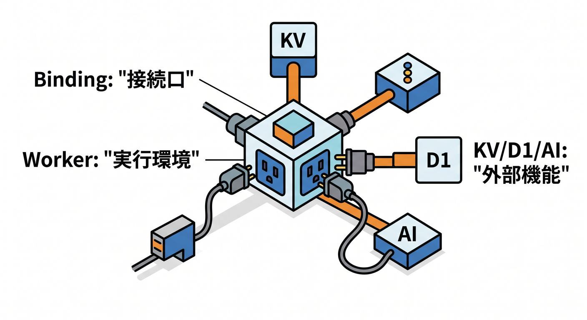
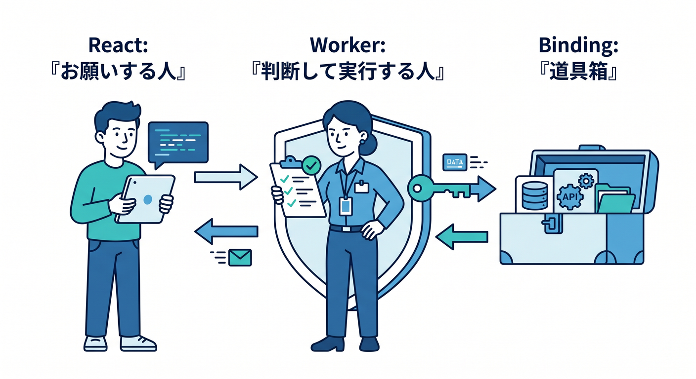
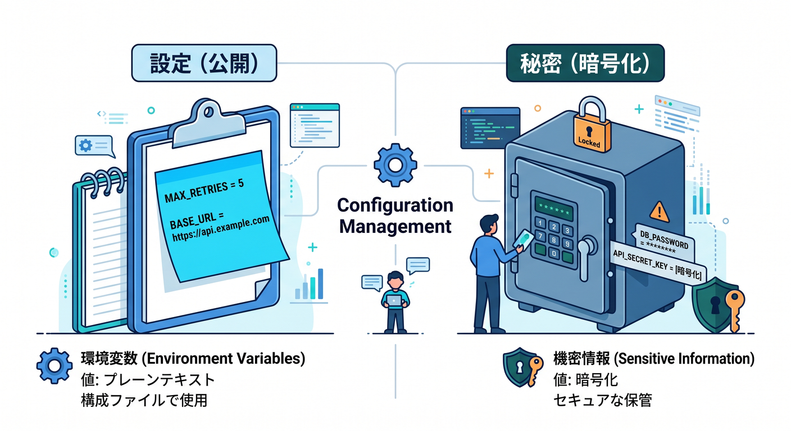
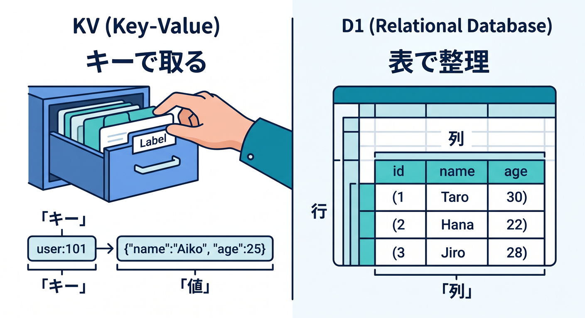
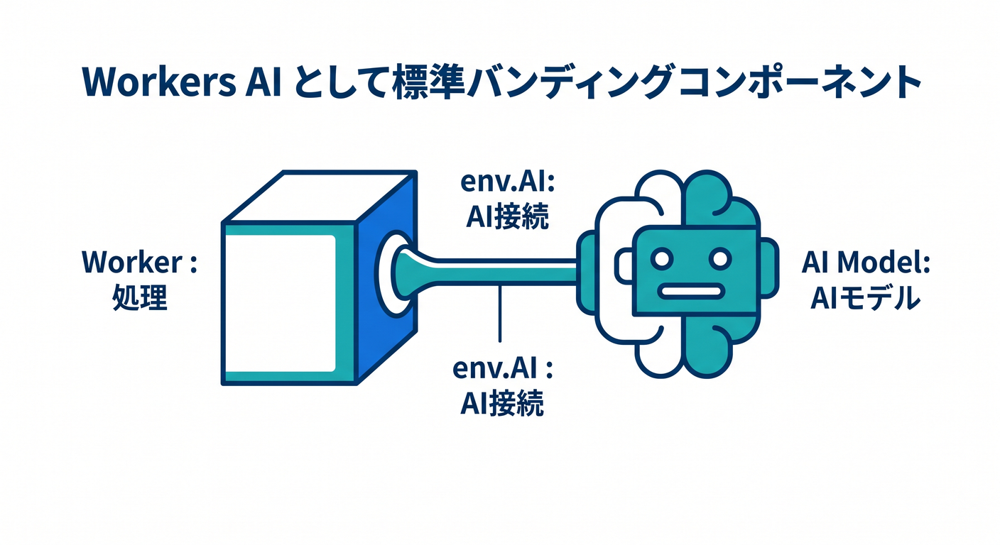

# 第11章：Bindingsって何？をアプリ目線で理解しよう 🧰

この章では、Cloudflare の **binding** を「設定ファイルの難しい話」ではなく、**React の小さなアプリを育てるための接続口** としてやさしく理解していきます 😊
Cloudflare の公式では、binding は Worker から Cloudflare Developer Platform の各種リソースへつながる仕組みとして説明されていて、REST API を外向きにたたくよりも高性能で制約も少ない形が用意されています。しかも 2026 年時点では、AI・D1・KV・AI Search・Service binding まで、かなり広く binding ベースで扱えるようになっています。 ([Cloudflare Docs][1])

---

## この章でつかみたいこと 🎯📘

この章のゴールは 4 つです 🌱

* **binding は Worker の中で使う“専用コンセント”みたいなもの**だと分かること
* **React から直接 binding を触らず、Worker を通す理由**が分かること
* **`vars`・`secrets`・KV・D1・Workers AI** を小さなアプリ目線で区別できること
* **`wrangler types` で型を自動生成するのが今のおすすめ**だと分かること ([Cloudflare Docs][1])

---

## 11-1. そもそも binding って何？ 🔌✨

React の画面は、あくまでブラウザで動く「見える側」です 👀
一方で Cloudflare Worker は、「保存する」「AI を呼ぶ」「秘密の値を読む」みたいな **裏方の仕事** を持てます。そこで Worker に対して、「この KV を使っていいよ」「この D1 を使っていいよ」「この AI を使っていいよ」と**接続を渡す**のが binding です。Cloudflare の docs でも、binding は Worker が Cloudflare の各種リソースとやり取りするための仕組みとして整理されています。 ([Cloudflare Docs][1])

イメージはこんな感じです ☕🔌

**React**
→ 画面を出す
→ ボタンや入力欄を持つ
→ `fetch()` で Worker を呼ぶ

**Worker**
→ binding を通して KV / D1 / AI / AI Search などを使う
→ 安全に処理して JSON を返す

つまり、**binding は React の機能ではなく、Worker 側の能力**です 🌟
ここを混同しないだけで、Cloudflare アプリの見通しがかなり良くなります。



---

## 11-2. なぜ React から直接使わないの？ 🛡️🚪

Cloudflare の environment variables や secrets は、Worker の `fetch(request, env)` で受け取る `env` 上に載ります。つまり binding は **Worker の実行環境にいるもの** であって、ブラウザで動く React コンポーネントからそのまま触る設計ではありません。`vars` は平文の設定値、`secrets` は暗号化された秘密値として扱われます。 ([Cloudflare Docs][2])

この分離にはちゃんと意味があります 😊

* ブラウザへ秘密情報を出さなくていい 🔐
* D1 や KV や AI を安全にまとめて制御できる 🧱
* ルールチェックや入力チェックを Worker 側で一元化できる ✅
* React は「画面」に集中できる 🎨

なので考え方はとてもシンプルです。

**React はお願いする人 🙋**
**Worker は判断して実行する人 🧠**
**binding は Worker が使う道具箱 🧰**



---

## 11-3. 小さな React アプリで覚えたい binding たち 🪄📦

## 1) `vars`：ふつうの設定値 📝

Cloudflare docs では environment variables は binding の一種で、**文字列や JSON 値を Worker に渡す**用途として説明されています。しかも **暗号化されません**。なので、アプリ名、表示モード、使うモデル名、最大件数のような「公開されても困りにくい設定」に向いています。 ([Cloudflare Docs][3])

たとえばこんなものです 🌼

* アプリ名
* 1ページの表示件数
* 使用する AI モデル名
* ステージングか本番かのフラグ

---

## 2) `secrets`：見せたくない値 🔐

Secrets は Cloudflare docs 上でも **暗号化されたテキスト値** として説明されています。API キーや認証トークンのような、見えたら困るものはここに入れます。Worker では `env` 経由で読めますし、Node.js compatibility を使う Worker では `process.env` 経由でも扱えます。 ([Cloudflare Docs][2])

小さなアプリでも、こんなときに出番です ✨

* 外部 API のキー
* Webhook 用の秘密値
* 管理者だけが使うトークン

**覚え方**：
`vars` は「設定」📝
`secrets` は「秘密」🔐



---

## 3) KV：軽い保存やキャッシュに向く 🗂️⚡

KV binding は Worker と KV namespace を結ぶためのものです。Cloudflare は KV を **グローバルな key-value ストア**として説明していて、Worker からは `env.<BINDING_NAME>.get()` や `put()` の形で扱えます。ローカル開発では Wrangler がローカル版 KV を使うのが標準で、必要なら `remote: true` でリモート側に寄せる構成も案内されています。 ([Cloudflare Docs][4])

React とつなぐ小アプリだと、KV はこんな使い方が気持ちいいです 🍀

* AI の要約結果を一時キャッシュ
* ユーザー設定を軽く保存
* 最近の検索語を保存
* ちょっとしたフラグ管理

「表っぽく管理したい」より、**キーでサッと取れれば十分**なときに向いています。

---

## 4) D1：表形式で持ちたいときの本命 🗃️🧠

D1 は Cloudflare のサーバーレス SQL データベースで、Worker からは **D1 Worker Binding API** で使います。公式の流れはとても分かりやすくて、**bind する → statement を prepare する → 実行する → 結果を見る**です。 ([Cloudflare Docs][5])

小アプリで D1 が向く場面はこんな感じです 🌟

* 投稿一覧
* お問い合わせ履歴
* メモ帳アプリ
* AI で生成した結果の履歴
* ユーザーごとのデータ管理

つまり、**1件ずつキーで取るなら KV、行と列で整理したいなら D1** と覚えるとかなり楽です 😊



---

## 5) Workers AI：AI 機能を Worker の部品として使う 🤖✨

Workers AI も binding でつなげます。公式 docs では `ai` セクションに binding を追加し、Worker 内では `env.AI` として使えます。モデル実行は `env.AI.run()` で行います。 ([Cloudflare Docs][6])

これが小アプリだと本当に相性ばつぐんです 💡

* 入力文の要約
* やさしい言い換え
* タイトル自動生成
* FAQ っぽい応答
* 入力文の雰囲気分類

React 側は「入力して送る」だけ、AI 実行は Worker 側で完結、という形にしやすいです。
**“AI はフロントの特別機能”ではなく、“Worker が持つ1つの binding”** と見ると、一気に扱いやすくなります。



---

## 6) AI Search：検索まで binding 化できる 🔎🧠

2026 年の Cloudflare docs では、AI Search は Worker に対して **namespace binding (`ai_search_namespaces`)** と **instance binding (`ai_search`)** の 2 方式でつなげられます。さらに docs では、以前の `env.AI.autorag()` ベースは **もはや推奨されない** と明記されています。 ([Cloudflare Docs][7])

これ、かなり大事です 📌
今から教材を作るなら、AI Search は **専用 binding でつなぐ設計** を前提にしておくほうが新しい流れに合っています。

---

## 7) Service bindings：Worker どうしを内側でつなぐ 🧵🏗️

Service binding は、**別の Worker を公開 URL 経由ではなく内部的に呼ぶ**ための仕組みです。Cloudflare docs では、インターネットを経由せずに呼べるのでレイテンシ面でも有利と説明されています。RPC 形式の例も案内されています。 ([Cloudflare Docs][8])

最初の 1 本目の小アプリでは必須ではありません。
でも将来こういう分け方をしたくなったら出番です 😊

* `frontend-worker`：画面と API の入口
* `ai-worker`：AI 専用処理
* `admin-worker`：管理機能

---

## 11-4. `wrangler.jsonc` ではこう考える 🧾⚙️

binding は「コードの中で突然生えるもの」ではありません。
**Wrangler 設定で宣言したものが、Worker の `env` に入ってくる**、という流れです。Cloudflare docs でも、KV・D1・AI・AI Search・Service bindings などは Wrangler 設定に追加して使う形になっています。 ([Cloudflare Docs][4])

たとえば、第11章の学習用ならこんなイメージで十分です ✨

```json
{
  "$schema": "./node_modules/wrangler/config-schema.json",
  "name": "mini-ai-notes",
  "main": "src/index.ts",
  "compatibility_date": "2026-04-17",

  "vars": {
    "APP_NAME": "Mini AI Notes",
    "AI_MODEL": "@cf/meta/llama-3.1-8b-instruct"
  },

  "kv_namespaces": [
    {
      "binding": "NOTE_CACHE",
      "id": "YOUR_KV_NAMESPACE_ID"
    }
  ],

  "d1_databases": [
    {
      "binding": "DB",
      "database_name": "mini_ai_notes",
      "database_id": "YOUR_D1_DATABASE_ID"
    }
  ],

  "ai": {
    "binding": "AI"
  }

  // 発展:
  // "ai_search": [
  //   {
  //     "binding": "DOC_SEARCH",
  //     "instance_name": "help-center"
  //   }
  // ],
  // "services": [
  //   {
  //     "binding": "INTERNAL_API",
  //     "service": "another-worker"
  //   }
  // ]
}
```

この設定の読み方はシンプルです 😊

* `vars.APP_NAME` → `env.APP_NAME`
* `vars.AI_MODEL` → `env.AI_MODEL`
* `kv_namespaces.binding = "NOTE_CACHE"` → `env.NOTE_CACHE`
* `d1_databases.binding = "DB"` → `env.DB`
* `ai.binding = "AI"` → `env.AI`

**binding 名は、そのまま Worker で使う名前になる**、ここが超大事です 🔥
名前がズレると、React の不具合というより **Worker の設定ミス** になります。

---

## 11-5. 今どきの型付けは `wrangler types` が本命 🧠💙

2026 年の Cloudflare Best Practices では、binding 用の `Env` を**手書きしない**ことがはっきり推奨されています。代わりに **`wrangler types` を実行して、実際の Wrangler 設定に一致した型定義を生成する**のがベストプラクティスです。binding を追加したり名前を変えたら、型も再生成する流れです。 ([Cloudflare Docs][9])

つまり、この章でのおすすめはこれです ✨

```bash
npx wrangler types
```

これがうれしい理由はすごく実用的です 😊


* 設定とコードの名前ズレを早めに見つけやすい
* `env.DB` や `env.AI` の補完が効きやすい
* 「KV だと思っていたのに名前が違った😇」を減らせる

初学者ほど、**手書き型より自動生成**のほうが安心です 🛟

---

## 11-6. Worker 側の最小コード例を見てみよう 🧪☁️

ここでは「入力文を AI で要約し、KV に少しキャッシュし、必要なら D1 に保存する」ミニ例で見てみます。
Workers AI は `env.AI.run()`、D1 は Worker Binding API、KV は `env.<binding>.get()` / `put()` で扱うのが公式の流れです。 ([Cloudflare Docs][6])

```ts
export default {
  async fetch(request: Request, env: Env): Promise<Response> {
    const url = new URL(request.url);

    if (url.pathname === "/api/summary" && request.method === "POST") {
      const body = await request.json() as { text?: string };
      const text = body.text?.trim() ?? "";

      if (!text) {
        return Response.json(
          { ok: false, error: "text が空です" },
          { status: 400 }
        );
      }

      const cacheKey = `summary:${text.slice(0, 80)}`;
      const cached = await env.NOTE_CACHE.get(cacheKey);

      if (cached) {
        return Response.json({
          ok: true,
          summary: cached,
          cached: true
        });
      }

      const aiResult = await env.AI.run(env.AI_MODEL, {
        prompt: `次の文章を日本語で短くやさしく要約してください。\n\n${text}`
      });

      const summary =
        typeof aiResult === "string"
          ? aiResult
          : JSON.stringify(aiResult);

      await env.NOTE_CACHE.put(cacheKey, summary);

      await env.DB
        .prepare("INSERT INTO notes (text, summary) VALUES (?1, ?2)")
        .bind(text, summary)
        .run();

      return Response.json({
        ok: true,
        summary,
        cached: false
      });
    }

    if (url.pathname === "/api/notes" && request.method === "GET") {
      const result = await env.DB
        .prepare("SELECT id, text, summary FROM notes ORDER BY id DESC LIMIT 20")
        .all();

      return Response.json({
        ok: true,
        items: result.results ?? []
      });
    }

    return new Response("Not Found", { status: 404 });
  }
};
```

このコードで見てほしいのは、たったこれだけです 🌸

* **React からは `/api/summary` を呼ぶだけ**
* **AI は `env.AI`**
* **KV は `env.NOTE_CACHE`**
* **D1 は `env.DB`**

つまり binding を覚えるとは、**Cloudflare の各機能を env の道具として読めるようになること**です。

---

## 11-7. React 側はむしろシンプルになる ⚛️🍰

binding を Worker 側へ寄せると、React はかなりスッキリします。
React 側は Cloudflare の内部事情を知らなくてよく、ふつうに `fetch()` して結果を表示すれば十分です。これは「フロントは UI、Worker は binding を使う処理」という分担がきれいに成立している状態です。 ([Cloudflare Docs][1])

```tsx
import { useState } from "react";

export function SummaryForm() {
  const [text, setText] = useState("");
  const [summary, setSummary] = useState("");
  const [loading, setLoading] = useState(false);

  async function handleSubmit() {
    setLoading(true);
    try {
      const res = await fetch("/api/summary", {
        method: "POST",
        headers: { "content-type": "application/json" },
        body: JSON.stringify({ text })
      });

      const data = await res.json();
      if (!res.ok) throw new Error(data.error ?? "エラーが発生しました");

      setSummary(data.summary);
    } catch (error) {
      setSummary(error instanceof Error ? error.message : "通信エラー");
    } finally {
      setLoading(false);
    }
  }

  return (
    <div>
      <textarea
        value={text}
        onChange={(e) => setText(e.target.value)}
        rows={8}
      />
      <button onClick={handleSubmit} disabled={loading}>
        {loading ? "要約中..." : "要約する"}
      </button>
      <p>{summary}</p>
    </div>
  );
}
```

ここで React は `env` をまったく知らないですよね 😊
それで正解です。
**binding を知るのは Worker の役目**、React は API を気持ちよく使えれば OK です 💖

---

## 11-8. AI を絡めると binding 理解が一気に深まる 🤖🌈

この章では、AI を入れると binding の意味がむしろ分かりやすくなります。
Workers AI は binding で `env.AI` として入ってきますし、AI Search も 2026 年時点では専用 binding 方式が整理されています。AI Gateway と組み合わせたガイドも公式に出ています。つまり Cloudflare の AI 機能群は、かなり「Worker に binding して使う」流れへ寄っています。 ([Cloudflare Docs][6])

この教材の流れだと、binding 理解のあとにこんな発展が自然です ✨

* 第12章：D1 や KV で保存してアプリらしくする 🗂️
* 第13章：Workers AI で AI ミニ機能を足す 🤖
* 第14章：AI Search で質問検索っぽく進化させる 🔎

つまり第11章は、後半章の**配線図を理解する回**なんです 🔌💫

---

## 11-9. GitHub Copilot をここでどう使うと気持ちいい？ 🤝💻

GitHub 公式 docs では、Copilot Chat は VS Code などの IDE で使えますし、Inline suggestions、Copilot Edits、Agent mode、MCP 連携なども案内されています。複数ファイルをまたぐ修正や、タスク単位での編集支援とも相性があります。 ([GitHub Docs][10])

この章で Copilot を使うなら、こんなお願いが特に相性いいです 😊

* 「`wrangler.jsonc` の binding 名と `env` の使い方をそろえて」
* 「KV・D1・AI を使う Worker ルートの雛形を作って」
* 「React 側から `/api/summary` をたたくフォームを作って」
* 「`wrangler types` 前提で型のズレを減らす方向に直して」

ただし 1 点だけ超大事です 📌
Copilot がコードを出してくれても、**実際の binding 名は自分の Wrangler 設定と一致しているか**を必ず見ましょう。Cloudflare 側は `wrangler types` の利用を推しているので、**型生成でズレを早く見つける**のがかなりおすすめです。 ([Cloudflare Docs][9])

---

## 11-10. 初学者がハマりやすいポイント 😵‍💫🧯

## ありがちミス 1：React から `env.DB` を触ろうとする

それはできません。`env` は Worker 側のものです。React は API を呼びましょう。 ([Cloudflare Docs][2])

## ありがちミス 2：`vars` に秘密を入れてしまう

`vars` は暗号化されません。秘密値は `secrets` に入れます。 ([Cloudflare Docs][2])

## ありがちミス 3：binding 名を変えたのにコードを直していない

`wrangler.jsonc` で `binding: "DB"` と書いたら、コードでは `env.DB` です。違う名前を書くと壊れます。Cloudflare は `wrangler types` での型生成を推奨しています。 ([Cloudflare Docs][9])

## ありがちミス 4：KV と D1 の役割を逆に考える

軽いキャッシュや設定は KV、表として扱いたい履歴や一覧は D1、という切り分けが最初は分かりやすいです。 ([Cloudflare Docs][4])

## ありがちミス 5：AI Search を古い感覚で覚える

今は専用の AI Search binding があり、以前の `env.AI.autorag()` ベースは推奨されません。新しい教材ではこちら基準で覚えるのが安心です。 ([Cloudflare Docs][7])

---

## 11-11. この章のミニ演習 ✍️🌟

## 演習1：`vars` と `secrets` を言い分けてみよう

次の値を、`vars` と `secrets` のどちらへ入れるか考えてみましょう 😊

* アプリ名
* 1回に表示する件数
* 外部 API キー
* 管理者トークン
* 使う AI モデル名

---

## 演習2：どの binding を使う？

次の機能に合いそうな binding を選んでみましょう 🎯

* AI 要約結果のキャッシュ
* 投稿一覧の保存
* 社内FAQの自然言語検索
* 別 Worker の管理 API 呼び出し

---

## 演習3：React と Worker の役割分担を書き出す

「メモを入力 → 要約 → 保存 → 一覧表示」の流れを、
**React の仕事** と **Worker + binding の仕事** に分けてみましょう ✨

この演習ができれば、binding の理解はかなり進んでいます。

---

## まとめ 🌸☁️

この章のいちばん大事な一言はこれです。

**binding は、Worker が Cloudflare の機能を使うための接続口**です 🔌

React の小さなアプリ目線で言い直すと、こうなります 😊

* React は画面を作る ⚛️
* Worker はリクエストを受ける ☁️
* binding で KV・D1・AI・AI Search などを使う 🧰
* 秘密は `secrets`、ふつうの設定は `vars` 📝🔐
* 型は手書きせず `wrangler types` に任せる 🧠

この感覚が入ると、次の章で保存機能を足したり、その次で Workers AI を入れたりするときに、「あ、これは binding でつなぐ部品なんだな」と自然に読めるようになります。Cloudflare の後半章がぐっと楽になりますよ 🚀✨ ([Cloudflare Docs][1])

次はこのまま、第12章向けに **「D1 と KV をどう使い分けて“小さなアプリ感”を出すか」** までつなげて書けます。

[1]: https://developers.cloudflare.com/workers/runtime-apis/bindings/ "Bindings (env) · Cloudflare Workers docs"
[2]: https://developers.cloudflare.com/workers/configuration/secrets/ "Secrets · Cloudflare Workers docs"
[3]: https://developers.cloudflare.com/workers/configuration/environment-variables/ "Environment variables · Cloudflare Workers docs"
[4]: https://developers.cloudflare.com/kv/concepts/kv-bindings/ "KV bindings · Cloudflare Workers KV docs"
[5]: https://developers.cloudflare.com/d1/worker-api/ "Workers Binding API · Cloudflare D1 docs"
[6]: https://developers.cloudflare.com/workers-ai/configuration/bindings/ "Workers Bindings · Cloudflare Workers AI docs"
[7]: https://developers.cloudflare.com/ai-search/usage/workers-binding/ "Workers binding · Cloudflare AI Search docs"
[8]: https://developers.cloudflare.com/workers/runtime-apis/bindings/service-bindings/ "Service bindings - Runtime APIs · Cloudflare Workers docs"
[9]: https://developers.cloudflare.com/workers/best-practices/workers-best-practices/ "Workers Best Practices · Cloudflare Workers docs"
[10]: https://docs.github.com/en/copilot/get-started/features "GitHub Copilot features - GitHub Docs"
