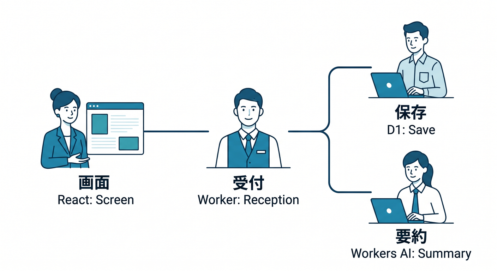
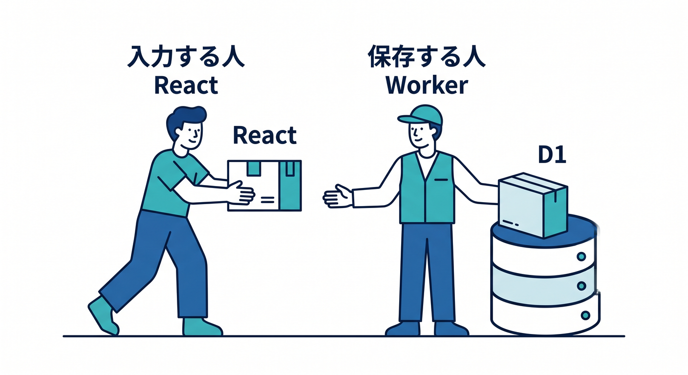
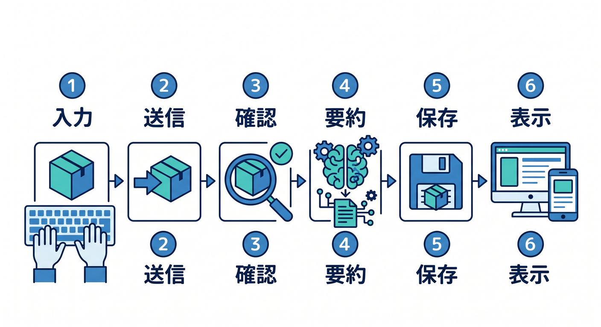
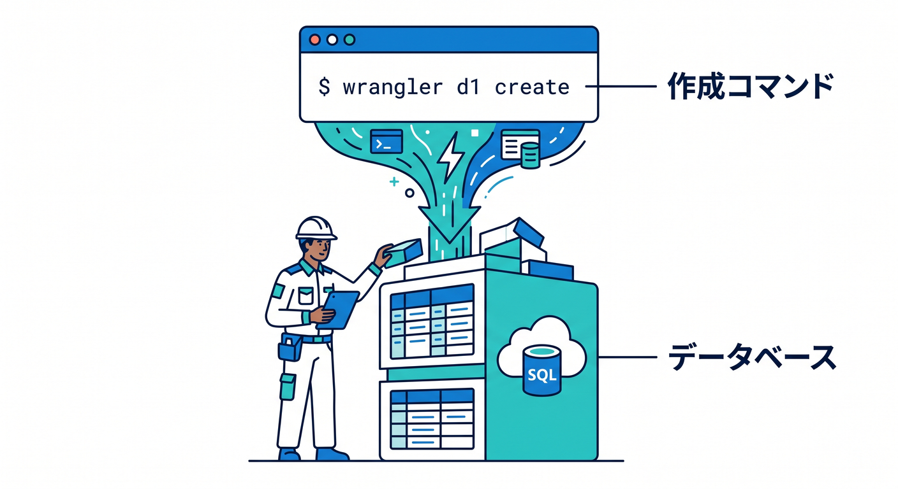
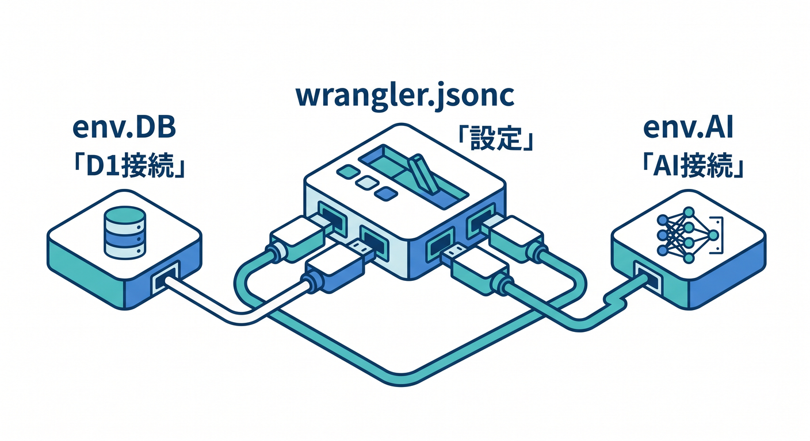
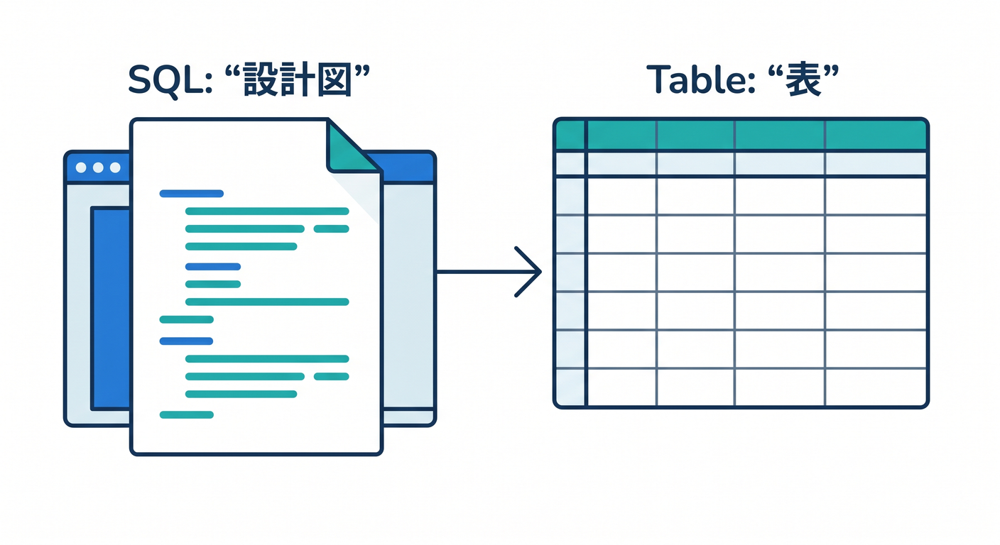
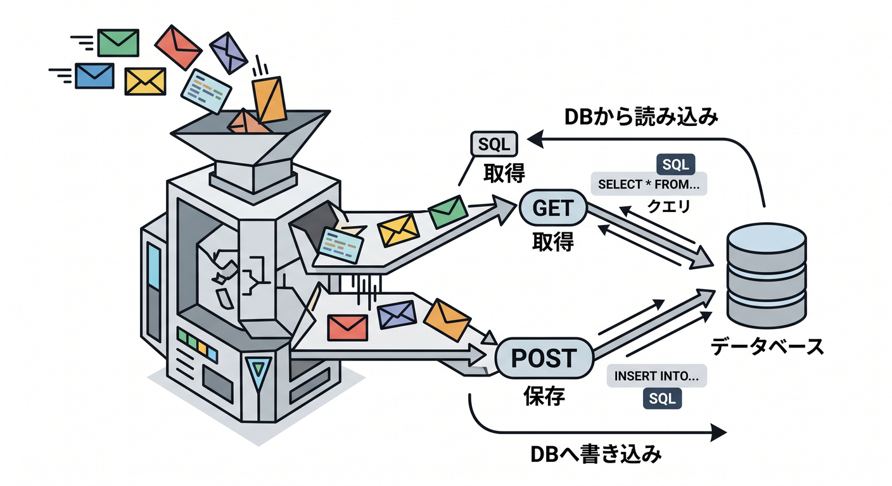

# 第12章：データを少し保存して“小さなアプリ感”を出そう 🗂️

ここから一気に「ただの画面」から「ちゃんと使える小さなアプリ」へ進みます 😊
本日時点の Cloudflare 公式導線では、React SPA と Workers API を C3 で始め、Cloudflare Vite plugin でローカル開発し、必要な保存先や AI は binding として Worker に足していく流れがかなり素直です。新規プロジェクトでは `wrangler.jsonc` が推奨され、React 側は binding を直接触らず Worker を経由して使う形が基本です。([Cloudflare Docs][1])

この章では、フォームから送った内容を保存して、あとで一覧表示できる「ひとことメモアプリ」を作ります 📝
保存先は D1 を使います。Cloudflare の公式ガイドでも、D1 は軽量な SQL データベースとして、ユーザーデータや構造化データの保存、読み出し、一覧表示のような用途に向いています。逆に KV は設定やセッション系、Durable Objects はリアルタイム協調や強い調停が必要な場面向きなので、今回の「入力 → 保存 → 一覧表示」には D1 がいちばん自然です。([Cloudflare Docs][2])

さらに今回は、Cloudflare の AI も少し混ぜます 🤖✨
保存するときに、Workers AI で「このメモのひとこと要約」を自動で付けるおまけも入れます。Workers AI は Free/Paid の両方で使え、binding を付けると Worker から `env.AI.run()` で呼べます。しかも text generation の呼び方は、モデルを変えても基本インターフェースが揃っています。([Cloudflare Docs][3])

---

## この章で作るもの 🎯



作るのは、こんな小さなメモアプリです 🌷

- React で入力フォームを出す
- 入力したタイトルと本文を Workers API に送る
- Worker が D1 に保存する
- 保存済みメモを新しい順に一覧表示する
- おまけで Workers AI が短い要約を付ける

この章が終わるころには、頭の中でこう分かれて見えるようになれば大成功です ✨

- React = 画面担当 🎨
- Worker = 受付と処理担当 🧠
- D1 = 保存担当 🗃️
- Workers AI = ちょい賢い補助担当 🤖

---

## この章のゴール 📌

この章の到達点は次の4つです。

1. 「保存先は React の中ではなく、Worker の奥に置く」がわかる
2. D1 binding を `wrangler.jsonc` に追加できる
3. `POST` で保存、`GET` で一覧取得、という基本 API を作れる
4. ちょい足し AI で“アプリ感”を上げられる

---

## まずは考え方から：React は保存しない、Worker が保存する 🔐



Cloudflare の React + Vite 構成では、`src/App.tsx` のような React 側が UI を持ち、`worker/index.ts` がバックエンド API を持つのが基本です。公式の簡略ファイル構成でも、その役割分担がはっきり示されています。さらに、React アプリは binding を直接触れず、Worker に `fetch()` して、Worker 側が D1 や AI などの binding を使うのが公式の考え方です。([Cloudflare Docs][1])

つまり、保存したいからといって React 側で D1 を直接たたくのではありません。
React は「入力して送る人」、Worker は「受け取って保存する人」です 😊

この分離はかなり大事です。

- 秘密の設定をブラウザへ出さずに済む 🔒
- 保存ロジックを Worker にまとめられる 🧰
- 将来、認証や検証や AI 追加をしても整理しやすい 🌱

Bindings は Worker から Cloudflare の各種リソースへつながる仕組みで、REST API を外から叩くより、性能面でも制約面でも有利です。([Cloudflare Docs][4])

---

## 今回の完成イメージ 🖼️



流れはとてもシンプルです。

1. React でタイトルと本文を入力
2. 「保存」ボタンを押す
3. Worker が内容をチェック
4. 必要なら Workers AI で短い要約を作る
5. D1 に保存
6. React が一覧を再取得して表示

この“保存して戻ってくる”感覚が入るだけで、アプリは急にそれっぽく見えます 😆✨

---

## D1 を使う準備をしよう 🧱



D1 は Cloudflare のネイティブな serverless SQL データベースです。Worker からは binding 経由で使い、`prepare()` して `bind()` で値を渡して実行する流れが基本です。Cloudflare の D1 docs でも、Worker から SQL を実行する手順は「bind する → statement を準備する → 実行する」という形で整理されています。([Cloudflare Docs][5])

まずは D1 データベースを作ります。

```bash
npx wrangler d1 create memo-app-db
```

このコマンドで D1 データベースが作成され、binding 名や database_id を `wrangler` 設定へ入れるための情報が表示されます。Cloudflare のコマンド docs でも `wrangler d1 create [NAME]` が正式な作成コマンドです。([Cloudflare Docs][6])

---

## `wrangler.jsonc` に binding を足そう ⚙️



Cloudflare は新規プロジェクトで `wrangler.jsonc` を推奨しています。`wrangler.toml` もまだ使えますが、新しめの機能は JSON config 前提のものもあります。([Cloudflare Docs][7])

既存の `wrangler.jsonc` に、D1 と AI の binding をこんな感じで追加します。
ここでは「追加する部分だけ」を載せます。

```jsonc
{
  "d1_databases": [
    {
      "binding": "DB",
      "database_name": "memo-app-db",
      "database_id": "ここに作成時の database_id",
      "preview_database_id": "ここに preview_database_id",
    },
  ],
  "ai": {
    "binding": "AI",
  },
}
```

D1 は `env.DB`、Workers AI は `env.AI` として Worker から使えるようになります。Cloudflare docs でも、D1 は binding 名が `DB` なら `env.DB`、AI binding は `binding: "AI"` とすると `env.AI` で使える形です。([Cloudflare Docs][8])

設定を変えたら、型も更新しておくと安心です ✨

```bash
npx wrangler types
```

`wrangler types` は binding を含む `env` 型を生成してくれるので、TypeScript の補完がかなり効きやすくなります。([Cloudflare Docs][9])

---

## migration を作ろう 🛠️



今どきは「その場で SQL を直接流す」より、migration にして残すほうがずっと安全です。Cloudflare の D1 docs でも、migration は SQL ファイルで履歴管理する方式で、作成・一覧・適用ができます。適用時にはバックアップが取られ、失敗時はその migration がロールバックされます。([Cloudflare Docs][10])

まず migration ファイルを作ります。

```bash
npx wrangler d1 migrations create memo-app-db create_memos_table
```

このコマンドは `migrations` フォルダの中に、バージョン付きの SQL ファイルを作ります。Cloudflare のコマンド docs でも `wrangler d1 migrations create [DATABASE] [MESSAGE]` が正式形です。([Cloudflare Docs][6])

作られた SQL ファイルに、次を書きます。

```sql
CREATE TABLE IF NOT EXISTS memos (
  id INTEGER PRIMARY KEY AUTOINCREMENT,
  title TEXT NOT NULL,
  body TEXT NOT NULL,
  ai_summary TEXT,
  created_at TEXT NOT NULL DEFAULT CURRENT_TIMESTAMP
);
```

かなりシンプルですね 😊
今回は「小さなアプリ感」が目的なので、テーブルは 1 個で十分です。

---

## migration をローカルへ適用しよう 🧪

ローカルでまず試すのがおすすめです。D1 はローカル開発をしっかりサポートしていて、Cloudflare がグローバルで動かしているのと同じバージョンの D1 をローカルで扱えます。([Cloudflare Docs][11])

```bash
npx wrangler d1 migrations apply memo-app-db --local
```

本番へ反映するときは `--remote` を使います。

```bash
npx wrangler d1 migrations apply memo-app-db --remote
```

`apply` は未適用 migration を流し、進行状況を表示し、適用前の確認も入ります。CI/CD のような非対話環境では確認はスキップされます。([Cloudflare Docs][6])

---

## Worker 側の API を作ろう 🧠



ここからが楽しいところです ✨
`worker/index.ts` をこんなふうにしてみましょう。

```ts
type AiBinding = {
  run: (model: string, input: unknown) => Promise<unknown>;
};

type AppEnv = {
  DB: D1Database;
  AI?: AiBinding;
};

type CreateMemoBody = {
  title?: string;
  body?: string;
  useAiSummary?: boolean;
};

type MemoRow = {
  id: number;
  title: string;
  body: string;
  ai_summary: string | null;
  created_at: string;
};

function json(data: unknown, init?: ResponseInit) {
  return new Response(JSON.stringify(data), {
    headers: {
      "content-type": "application/json; charset=utf-8",
    },
    ...init,
  });
}

async function createAiSummary(env: AppEnv, title: string, body: string) {
  if (!env.AI) return null;

  try {
    const result = (await env.AI.run("@cf/meta/llama-3.1-8b-instruct", {
      messages: [
        {
          role: "system",
          content:
            "あなたはメモ整理アシスタントです。30文字以内の自然な日本語で短く要約してください。",
        },
        {
          role: "user",
          content: `タイトル: ${title}\n本文: ${body}`,
        },
      ],
    })) as { response?: string };

    return result.response?.trim() || null;
  } catch {
    return null;
  }
}

export default {
  async fetch(request: Request, env: AppEnv): Promise<Response> {
    const url = new URL(request.url);

    if (url.pathname === "/api/memos" && request.method === "GET") {
      const result = await env.DB.prepare(
        `
        SELECT id, title, body, ai_summary, created_at
        FROM memos
        ORDER BY id DESC
        LIMIT 20
        `,
      ).run();

      return json({
        ok: true,
        memos: (result.results ?? []) as MemoRow[],
      });
    }

    if (url.pathname === "/api/memos" && request.method === "POST") {
      const body = (await request.json()) as CreateMemoBody;

      const title = body.title?.trim() ?? "";
      const memoBody = body.body?.trim() ?? "";
      const useAiSummary = body.useAiSummary ?? true;

      if (!title || !memoBody) {
        return json(
          {
            ok: false,
            message: "タイトルと本文は必須です。",
          },
          { status: 400 },
        );
      }

      const aiSummary = useAiSummary
        ? await createAiSummary(env, title, memoBody)
        : null;

      const insertResult = await env.DB.prepare(
        `
        INSERT INTO memos (title, body, ai_summary)
        VALUES (?, ?, ?)
        `,
      )
        .bind(title, memoBody, aiSummary)
        .run();

      return json({
        ok: true,
        id: insertResult.meta.last_row_id,
        aiSummary,
      });
    }

    return new Response("Not Found", { status: 404 });
  },
};
```

ここで見てほしいポイントは 3 つです 🌟

### 1. SQL は `prepare()` + `bind()` で扱う

D1 docs でも、Worker からは prepared statement を使い、値は `bind()` で渡す流れが基本です。文字列連結で SQL を組み立てるより安全で、教材としてもこの癖を最初からつけるのがおすすめです。([Cloudflare Docs][12])

### 2. React から見えるのは `/api/memos` だけ

React は「保存したいです」「一覧ください」と頼むだけです。D1 や AI の details は Worker 側に閉じ込めます。これが binding を安全に使う基本姿勢です。([Cloudflare Docs][1])

### 3. AI は“主役”ではなく“味付け”

今回は AI が壊れても保存は止めず、要約だけ `null` で進めています。こうしておくと、AI が入っていてもアプリ全体は安定しやすいです 😊

---

## React 側の画面を作ろう ⚛️🎨

次は `src/App.tsx` です。

```tsx
import { FormEvent, useEffect, useState } from "react";

type Memo = {
  id: number;
  title: string;
  body: string;
  ai_summary: string | null;
  created_at: string;
};

export default function App() {
  const [title, setTitle] = useState("");
  const [body, setBody] = useState("");
  const [useAiSummary, setUseAiSummary] = useState(true);

  const [memos, setMemos] = useState<Memo[]>([]);
  const [loading, setLoading] = useState(false);
  const [saving, setSaving] = useState(false);
  const [message, setMessage] = useState("");

  async function loadMemos() {
    setLoading(true);
    setMessage("");

    try {
      const res = await fetch("/api/memos");
      const data = (await res.json()) as { ok: boolean; memos: Memo[] };

      if (!data.ok) {
        throw new Error("一覧の取得に失敗しました。");
      }

      setMemos(data.memos);
    } catch {
      setMessage("一覧の読み込みに失敗しました 😢");
    } finally {
      setLoading(false);
    }
  }

  useEffect(() => {
    void loadMemos();
  }, []);

  async function handleSubmit(e: FormEvent<HTMLFormElement>) {
    e.preventDefault();
    setSaving(true);
    setMessage("");

    try {
      const res = await fetch("/api/memos", {
        method: "POST",
        headers: {
          "content-type": "application/json",
        },
        body: JSON.stringify({
          title,
          body,
          useAiSummary,
        }),
      });

      const data = (await res.json()) as {
        ok: boolean;
        message?: string;
        aiSummary?: string | null;
      };

      if (!res.ok || !data.ok) {
        throw new Error(data.message ?? "保存に失敗しました。");
      }

      setTitle("");
      setBody("");
      setMessage(
        data.aiSummary
          ? `保存できました 🎉 AI要約: ${data.aiSummary}`
          : "保存できました 🎉",
      );

      await loadMemos();
    } catch (error) {
      const text =
        error instanceof Error ? error.message : "保存に失敗しました。";
      setMessage(text);
    } finally {
      setSaving(false);
    }
  }

  return (
    <main style={{ maxWidth: 880, margin: "40px auto", padding: 16 }}>
      <h1>ひとことメモ帳 📝</h1>
      <p>入力した内容を Cloudflare D1 に保存して一覧表示します ✨</p>

      <form
        onSubmit={handleSubmit}
        style={{
          display: "grid",
          gap: 12,
          padding: 16,
          border: "1px solid #ddd",
          borderRadius: 12,
          marginBottom: 24,
        }}
      >
        <input
          value={title}
          onChange={(e) => setTitle(e.target.value)}
          placeholder="タイトル"
          style={{ padding: 12, fontSize: 16 }}
        />

        <textarea
          value={body}
          onChange={(e) => setBody(e.target.value)}
          placeholder="本文"
          rows={5}
          style={{ padding: 12, fontSize: 16 }}
        />

        <label style={{ display: "flex", gap: 8, alignItems: "center" }}>
          <input
            type="checkbox"
            checked={useAiSummary}
            onChange={(e) => setUseAiSummary(e.target.checked)}
          />
          AIで短い要約も付ける 🤖
        </label>

        <button
          type="submit"
          disabled={saving}
          style={{ padding: 12, fontSize: 16 }}
        >
          {saving ? "保存中..." : "保存する"}
        </button>
      </form>

      {message && (
        <p style={{ marginBottom: 20, fontWeight: "bold" }}>{message}</p>
      )}

      <section>
        <h2>保存済みメモ 📚</h2>

        {loading ? (
          <p>読み込み中です...</p>
        ) : memos.length === 0 ? (
          <p>まだメモはありません 🌱</p>
        ) : (
          <div style={{ display: "grid", gap: 12 }}>
            {memos.map((memo) => (
              <article
                key={memo.id}
                style={{
                  border: "1px solid #ddd",
                  borderRadius: 12,
                  padding: 16,
                }}
              >
                <h3 style={{ marginTop: 0 }}>{memo.title}</h3>
                <p style={{ whiteSpace: "pre-wrap" }}>{memo.body}</p>

                {memo.ai_summary && (
                  <p>
                    <strong>AI要約:</strong> {memo.ai_summary}
                  </p>
                )}

                <small>
                  {new Date(memo.created_at).toLocaleString("ja-JP")}
                </small>
              </article>
            ))}
          </div>
        )}
      </section>
    </main>
  );
}
```

ここで大事なのは、React 側はとても素直だということです 😊
入力欄の state を持って、送信時に `/api/memos` へ `POST`、表示時に `/api/memos` へ `GET`。保存の仕組みそのものは全部 Worker の向こう側です。

---

## ローカルで動かしてみよう 🚀

React + Vite の Cloudflare 公式構成では、`npm run dev` でローカル開発サーバーを起動できます。Vite plugin により Worker は Workers runtime に近い形で動き、binding のローカル emulation も使えます。([Cloudflare Docs][1])

```bash
npm run dev
```

確認ポイントはこんな感じです 👀

1. 画面が出る
2. タイトルと本文を入れる
3. 保存すると一覧に増える
4. リロードしても残る
5. AI要約チェックを入れていれば、短い要約が付くことがある

D1 のローカル状態は local DB に保存されます。Cloudflare docs でも、`wrangler d1 execute ... --local` はローカル DB に対して実行し、`--remote` を付けるとリモート DB に対して実行されると案内されています。([Cloudflare Docs][5])

試しにローカル DB の中を見たければ、こんなコマンドも便利です。

```bash
npx wrangler d1 execute memo-app-db --local --command="SELECT * FROM memos ORDER BY id DESC"
```

---

## この章で本当に覚えてほしいこと 💡

### 保存先は “state の延長” ではない

React の state は、画面を更新するための一時置き場です。
ページを閉じても残したいなら、D1 のような保存先が必要です。

### API をはさむと、急に設計がきれいになる

React から直接保存先へ行かず、Worker をはさむと、入力チェック・認証・ロギング・AI 補助などをあとから足しやすいです。

### SQL は怖くない

今回使った SQL は、実質これだけです。

- `CREATE TABLE`
- `INSERT INTO`
- `SELECT ... ORDER BY ... LIMIT ...`

これだけでも十分アプリらしくなります 🌸

---

## よくあるつまずき 😵‍💫

### 1. `env.DB` が見つからない

たいていは `wrangler.jsonc` の binding 追加忘れか、`wrangler types` の実行忘れです。
binding は Worker 側の `env` へ載るので、設定ミスがあるとここで詰まりやすいです。([Cloudflare Docs][4])

### 2. テーブルがないと言われる

migration を作っただけで満足しがちです 😂
`migrations apply` までやって初めて DB に反映されます。([Cloudflare Docs][6])

### 3. ローカルでは見えるのに本番で見えない

`--local` と `--remote` は別物です。
ローカル DB に入れたデータは、リモート DB には自動で入りません。([Cloudflare Docs][5])

### 4. React から binding を直接使おうとしてしまう

それはできません。
React は Worker に `fetch()` し、Worker が binding を使います。ここは Cloudflare の React 導線でかなり大切な前提です。([Cloudflare Docs][1])

---

## Copilot を使うなら、ここが気持ちいい 🤝✨

GitHub Docs によると、Copilot の agent mode は、タスクに応じて変更すべきファイルを判断し、コード変更やターミナルコマンドを提案しながら進められます。今回みたいに「React 側・Worker 側・migration」の 3 か所をまたぐ章では、かなり相性がいいです。([GitHub Docs][13])

この章で相性が良い依頼はこんな感じです。

```text
worker/index.ts に D1 を使った /api/memos の GET と POST を追加して。
prepared statement と bind を使って、title と body を保存したい。
```

```text
migrations に memos テーブルを作る SQL を追加して。
id, title, body, ai_summary, created_at を持たせたい。
```

```text
src/App.tsx を、メモの保存フォームと一覧表示UIに書き換えて。
保存後に一覧を再読み込みするようにして。
```

ただし、Copilot に任せたあとでも、次の3点は必ず自分で見るのがおすすめです 👀

- SQL の列名が合っているか
- `/api/memos` のパスが front/back で一致しているか
- `wrangler.jsonc` の binding 名と `env.DB` / `env.AI` が一致しているか

---

## AI をもう少し Cloudflare らしく育てるなら 🌈

この章では Workers AI を「要約のおまけ」として使いました。
でも今後は、こんな進化ができます。

- 投稿文からタグを自動生成する 🏷️
- 感情分類を付ける 😊😐😢
- 長文メモを短く圧縮して一覧を見やすくする ✂️
- AI Gateway を通してログやキャッシュを見やすくする 📊

Cloudflare の AI binding は `env.AI.run()` で Workers AI モデルを呼べますし、AI Gateway を組み合わせるとログ収集やキャッシュ設定も足せます。([Cloudflare Docs][14])

---

## 発展課題 🧪

余裕があれば、次をやると一気に実力がつきます 💪

- 削除ボタンを付ける
- 1件編集できるようにする
- キーワード検索を付ける
- `created_at` を見やすく整形する
- AI要約を再生成するボタンを付ける
- バリデーションをもう少し丁寧にする

---

## まとめ 🌸

この章の本質は、ただ D1 を触ることではありません。

**React の画面から、Worker を通して、保存先へ安全に届く。**
この一本の流れを体で覚えることがいちばん大事です ✨

ここまで来ると、もう「小さなアプリ」が作れる状態に入っています。

- 入力できる ✍️
- 保存できる 🗃️
- 一覧できる 📚
- ちょっと AI で賢くできる 🤖

この4つが揃うと、もう立派に“作品”です 🎉
次の章では、この保存したデータや AI をもっと実用寄りに育てていくのが楽しくなってきます 😊

[1]: https://developers.cloudflare.com/workers/framework-guides/web-apps/react/ "React + Vite · Cloudflare Workers docs"
[2]: https://developers.cloudflare.com/workers/platform/storage-options/ "Choosing a data or storage product. · Cloudflare Workers docs"
[3]: https://developers.cloudflare.com/workers-ai/ "Overview · Cloudflare Workers AI docs"
[4]: https://developers.cloudflare.com/workers/runtime-apis/bindings/ "Bindings (env) · Cloudflare Workers docs"
[5]: https://developers.cloudflare.com/d1/get-started/ "Getting started · Cloudflare D1 docs"
[6]: https://developers.cloudflare.com/workers/wrangler/commands/d1/ "D1 · Cloudflare Workers docs"
[7]: https://developers.cloudflare.com/workers/wrangler/configuration/ "Configuration - Wrangler · Cloudflare Workers docs"
[8]: https://developers.cloudflare.com/d1/worker-api/d1-database/ "D1 Database · Cloudflare D1 docs"
[9]: https://developers.cloudflare.com/workers/wrangler/commands/workers/ "Workers · Cloudflare Workers docs"
[10]: https://developers.cloudflare.com/d1/reference/migrations/ "Migrations · Cloudflare D1 docs"
[11]: https://developers.cloudflare.com/d1/best-practices/local-development/ "Local development · Cloudflare D1 docs"
[12]: https://developers.cloudflare.com/d1/worker-api/ "Workers Binding API · Cloudflare D1 docs"
[13]: https://docs.github.com/en/copilot/get-started/features "GitHub Copilot features - GitHub Docs"
[14]: https://developers.cloudflare.com/workers-ai/configuration/bindings/ "Workers Bindings · Cloudflare Workers AI docs"
